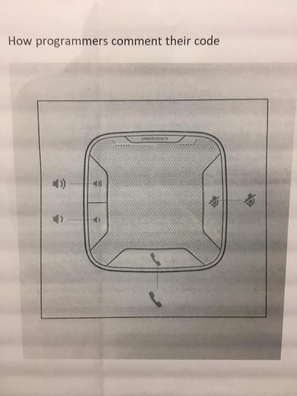
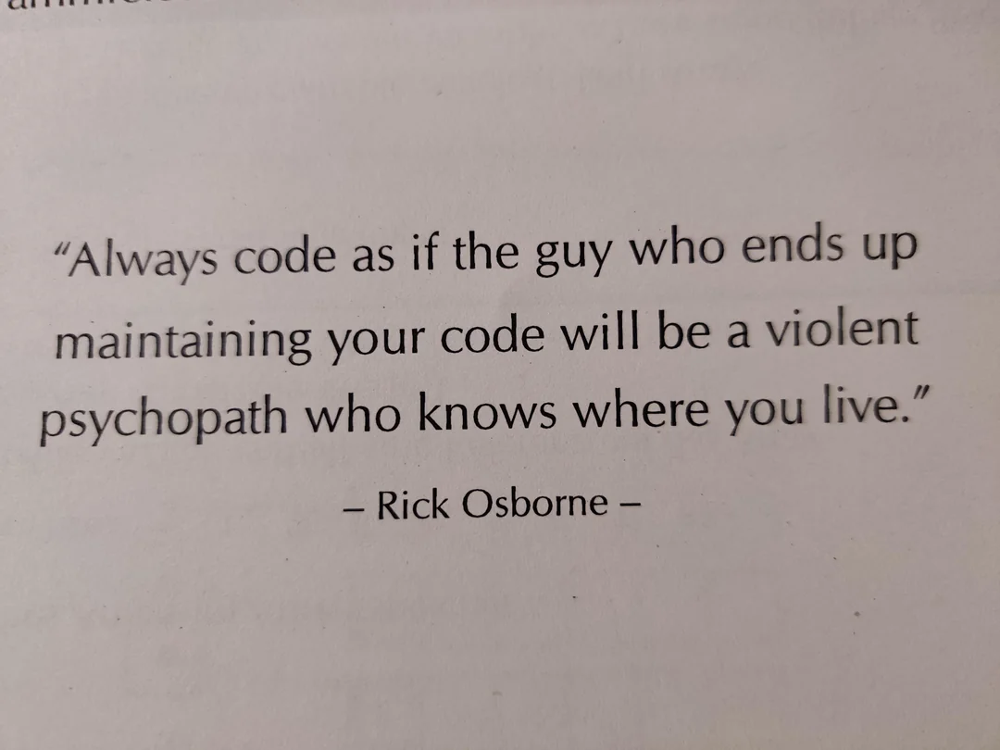

# ???

- [Comment](#comment)
- [Talk](#talk)
- [Writing Code](#writing-code)
- [How to solve problem](#how-to-solve-problem)
- [Indent Size](#indent-size)
- [Indent Type](#indent-type)

## Comment



## Talk


## Writing Code



## How to solve problem


## Indent Size

```cpp
  int a; // 2 space
```

vs 

```cpp
    int a; // 4 space
```

## Indent Type

```cpp
	int a; // tab
```

vs 

```cpp
    int a; // space
```
