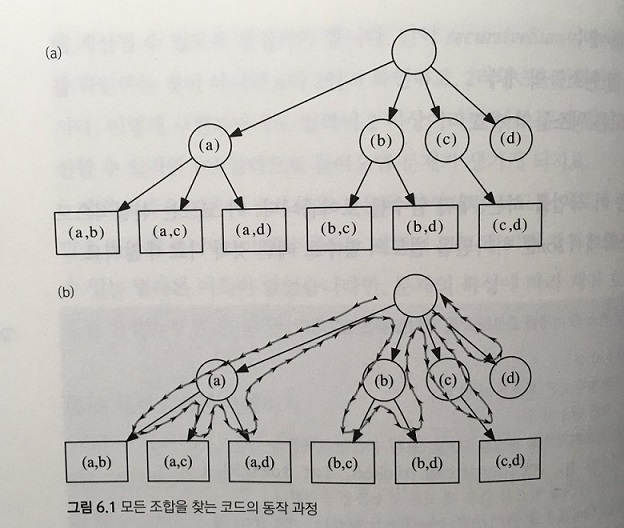

# Algorithm Design

- [Rule](#rule)
- [Modeling](#modeling)
  - [Data Structure](#data-structure)
    - [Canonicalization](#canonicalization)
    - [Separate data with an algorithm](#separate-data-with-an-algorithm)
  - [Explicit Formula (점화식)](#explicit-formula-점화식)
- [Proving](#proving)
  - [Loop dominates Time Complexity](#loop-dominates-time-complexity)
  - [Mathematical Induction (수학적귀납법)](#mathematical-induction-수학적귀납법)
  - [귀류법](#귀류법)
  - [Loop Invariant](#loop-invariant)
  - [Test with corner case](#test-with-corner-case)
- [Implemenation](#implemenation)
  - [Use half-open interval in a range](#use-half-open-interval-in-a-range)
  - [Always init on declaration](#always-init-on-declaration)
  - [No floating point operation if possible](#no-floating-point-operation-if-possible)
  - [Validate function precondition](#validate-function-precondition)
- [Brute Force](#brute-force)
- [Debugging](#debugging)
  - [Logging middle result](#logging-middle-result)
  - [Use assert on precondition](#use-assert-on-precondition)
- [Java Apis](#java-apis)
  - [Console I/O](#console-io)
  - [Array](#array)
  - [List](#list)
  - [Queue](#queue)
  - [Stack](#stack)
  - [Map](#map)
  - [Set](#set)
  - [Heap](#heap)
  - [Sorting](#sorting)
- [C++ Apis](#c-apis)
  - [Console I/O](#console-io-1)
  - [Array](#array-1)
  - [Vector](#vector)
  - [List](#list-1)
  - [Queue](#queue-1)
  - [Stack](#stack-1)
  - [Map](#map-1)
  - [Set](#set-1)
  - [Heap](#heap-1)
  - [Sorting](#sorting-1)

## Rule

What is algorithm? What is goal of computer science?\
Programming, as an enginner, is solving complexity (time, space, human).
Algorithm is to solving time, space complexity. Especialy, time completixy.

FOCUS on intention, how it's organized. It reveals computational thinking.

There are some well-known algorithm for solving problem.\
Programing is writing code. Code has some great patterns.\
Write those well-known algorithms into patterns.

Use java only. Use primitive type and array only if possible.

DO NOT make it complex. Design a simple algorithm.

## Modeling

- Write it down with pseudo code.
- List all the cases.

### Data Structure

#### Canonicalization

A process for converting data that has more than one possible representation into a standard form.\
It reduces complexity by abstraction (or modeling) for computational world.

eg. 2/4, 3/6 -> 1/2

#### Separate data with an algorithm

```java
// from
String getMonthName(int month) {
  if (mount == 1) return "January";
  if (mount == 2) return "February";
  return "March";
}

// to
String[] monthName = { "January", "February", "March" };
String getMonthName(int month) {
  return monthName[month - 1];
}
```

```java
// from
void move(int direction) {
  if (direction == 1) moveLeft();
  if (direction == 2) moveRight();
}

// to
int[] movement = { -1, 1 };
void move(int direction) {
  moveTo(movement[direction - 1]);
}
```

### Explicit Formula (점화식)

- D(n) : divide
- C(n) : combine
- T(n) = D(n) + sigma[i_to_k](T(i)) + C(n)
- Time Complexity : find basic operation & compute with it

```java
// Sum until n
f(n) = f(n - 1) + n   2 <= n
f(n) = 1              1 == n

// Time complexity (basic operation : +)
T(n) = T(n - 1) + 1
     = T(n - 2) + 2
     = T(n - 3) + 3
     =    ...
     = T(1) + n - 1
     = n - 1 since T(1) = 0
```

## Proving

### Loop dominates Time Complexity

- O(n), Big-O Notation : 가장 빨리 증가하는 항만 제외하고 다 버림
- Approximately, 100_000_000 loop ~ 1 second. Not sure.

```java
// O(1) : Constant
System.out.println("Hello world");

// O(N * log(N))
Collections.sort(collection);
Arrays.sort(arr);

// O(N) : Linear
for (int i = 0; i < N; ++i) {
  // do something
}

// O(N^2)
for (int i = 0; i < N; ++i) {
  for (int j = 0; j < N; ++j) {
    // do something
  }
}
```

### Mathematical Induction (수학적귀납법)

1. Clarify the step
2. Prove an algorithm on n == 1
3. Prove that if an algorithm satisfies on n, then also n + 1

```java
// model
f(n) = 1               1 == n
f(n) = f(n - 1) + n    2 <= n

// proof
For n == 1, f(1) = 1
Assume f(n) = f(n - 1) + n for 2 <= n
Then
f(n + 1) = (f(n - 1) + n) + n + 1
         = f(n) + n + 1
```

### 귀류법

- 어떤 명제가 참이라고 가정한 후, 모순을 이끌어내 그 가정이 거짓임을, 즉 처음의 명제가 참임을 증명하는 방법이다.
  > 그래 니 말이 맞다고 치자, 그러면 ~~ 해서 이상하잖아?

### Loop Invariant

- A property of a program loop that is true before (and after) each iteration.

### Test with corner case

- like -1, 0, 1 in `if (n <= 0) ...`.

## Implemenation

### Use half-open interval in a range

`[a, b)` (a <= value && value < b)

- Easy to represent empty range with `[a, a)`
- Easy to evaluate length of range by `b - a`

### Always init on declaration

```java
// from
int[] invalid;

// to
int[] valid = new int[] { 1, 2, 3 };
```

### No floating point operation if possible

Floating point operation is slow, inaccurate

```java
// from
if (sqrt((a - b) * (a - b)) == r) {
  return true;
}

// to
if ((a - b) * (a - b) == (r * r)) {
  return true;
}
```

### Validate function precondition

- Check function parameters preconditions
- Check function preconditions before invoking other function

```java
/* precondition : node != null */
void dfs(TreeNode curr) {
  // check parameter
  if (null == curr) {
    return;
  }

  System.out.println(curr.val);

  // check precondition before invoking other function
  if (null != node.left) {
    dfs(node.left);
  }
  if (null != node.right) {
    dfs(node.leftright);
  }
}
```

## Brute Force



## Debugging

### Logging middle result

```java
int sum = 0;
for (int i = 0; i < 3; ++i) {
  sum += i;
  System.out.format("i: %d, sum: %d%n", i, sum);
}
```

### Use assert on precondition

```java
void f(int next, int sum) {
  assert next < 3
}
```

## Java Apis

### Console I/O

```java
// console output
System.out.println("hello");

// array to String
System.ot.println(Objects.toString(Arrays.asList(1, 2)));

// nested array toString
System.ot.println(Arrays.deepToString(new int[][] { {1,2,3}, {1, 2} }));

// console input
Scanner scanner = new Scanner(System.in);

// check next
scanner.hasNext();

// get next int
scanner.nextInt();

// get next long
scanner.nextLong();

// get next string
scanner.next();
```

### Array

### List

### Queue

### Stack

### Map

### Set

### Heap

### Sorting

## C++ Apis

### Console I/O

```cpp
cout << "hello" << endl;

// print vector
copy(adjacent.begin(), adjacent.end(), ostream_iterator<int>(cout, ", "))
```

### Array

### Vector

```cpp
// init
vector<int> test;

// init with size 3 and fill with 1
vector<int> test(3, 1);

// using initializer list
vector<int> test = { 1, 2, 3 };
vector<vector<int>> test2 = {
  { 1, 2, 3 },
  { 4, 5, 6 },
};

// add value to next
test.push_back(3);

// access value by index
cout << test[0] << endl;
```

### List

```cpp
// init
list<int> test;

// add new item to end of list
test.push_back(3);
test.push_back(4);

// add new item to start of list
test.push_back(2);
test.push_back(1);

// remove last element from list
test.pop_back();

// remove first element from list
test.pop_front();

// iteating
for (auto& item : test) {
  cout << item << endl;
}
```

### Queue

### Stack

### Map

unordered_map

- 진짜 map으로 practical하게 O(1)을 보장하려고 함.

```cpp
// init
unordered_map<string, int> m;

// insert
m.insert({"test", 3});
m.insert({"test2", 2});
m["test3"] = 4;

// find 값이 있으면 해당 위치의 iterator 반환, 아니면 s.end()반환
m.find("test");
m.find("test") == m.end(); // false
m.find("aaa") == m.end(); // true
m["test3"] == m.end(); // false

// remove
m.erase("test2");

// iterating
for(auto& entry : m) {
  cout << entry.first << ":" << entry.second << endl;
}

// clear entry
m.clear();
```

map

- 내부적으로 r/b tree를 사용해서 insert/delete가 O(log(n))임

```cpp
// init
map<string, int> m;

// insert
m.insert({"test", 3});
m.insert({"test2", 2});

// find 값이 있으면 해당 위치의 iterator 반환, 아니면 s.end()반환
m.find("test");
m.find("test") == m.end(); // false
m.find("aaa") == m.end(); // true

// remove
m.erase("test2");

// clear entry
m.clear();
```

### Set

```cpp
// init
set<int> s;

// init with containser
vector<int> datas = { 1, 2, 1, 3 }
set<int> s(datas.begin(), datas.end());

// add
s.insert(2);
s.insert(3);

// find 값이 있으면 해당 위치의 iterator 반환, 아니면 s.end()반환
s.find(3);
s.find(3) == s.end() // false
s.find(99) == s.end() // true

// get
s[3];

// remove
s.erase(3);

// clear elements
s.clear();

// check size
s.empty();
s.size();
```

### Heap

### Sorting

```cpp
vector<int> items { 2, 3, 1, 10 };

// ascending order
sort(items.begin(), items.end());

// with comparator (ascending order)
sort(items.begin(), items.end(), [](int& a, int& b) { return a < b; });

// with comparator (decending order)
sort(items.begin(), items.end(), [](int& a, int& b) { return a > b; });
```
