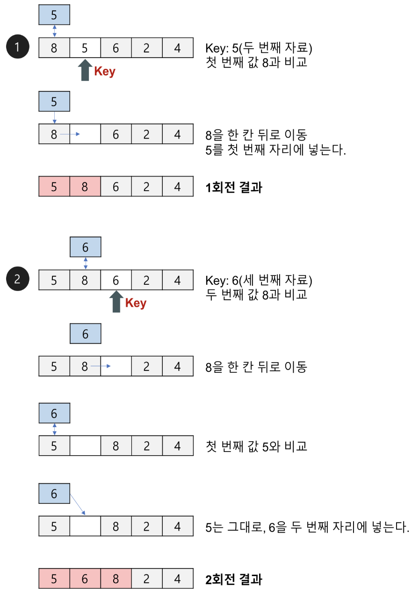
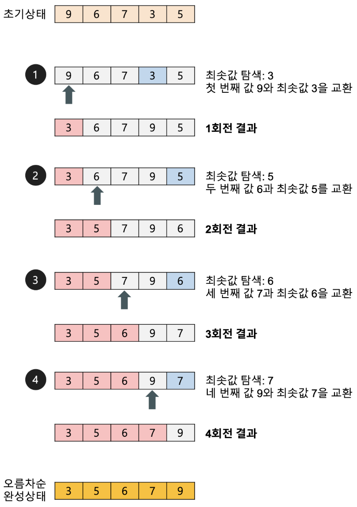
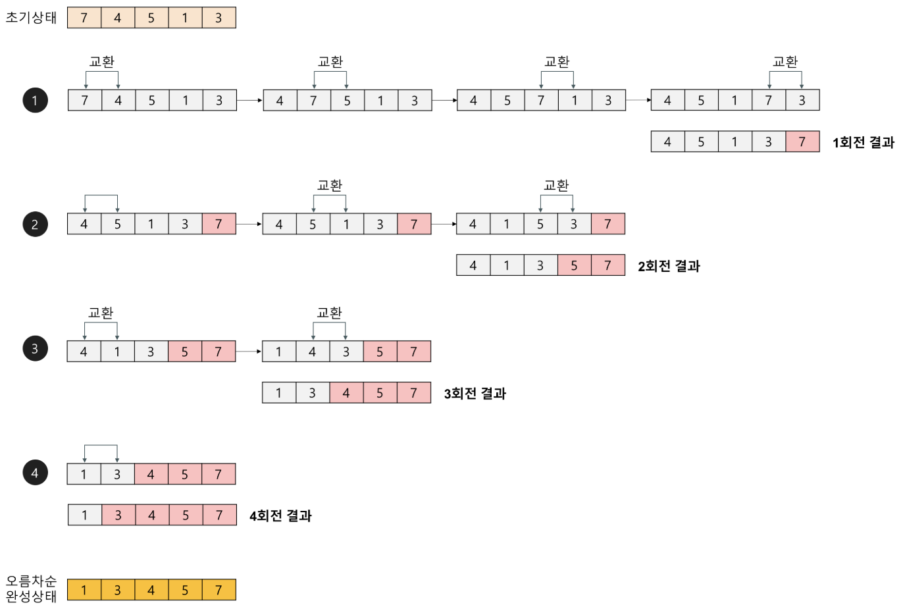
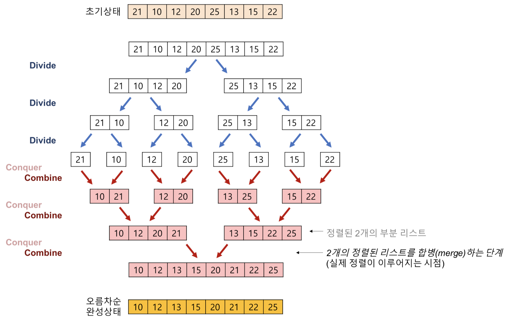
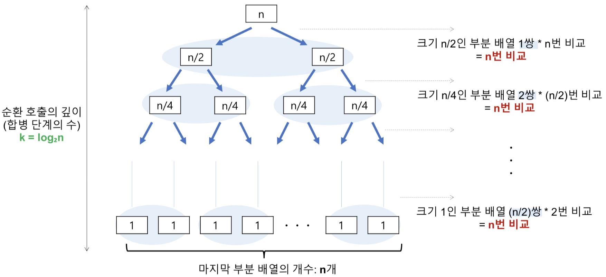
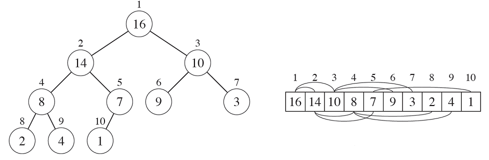
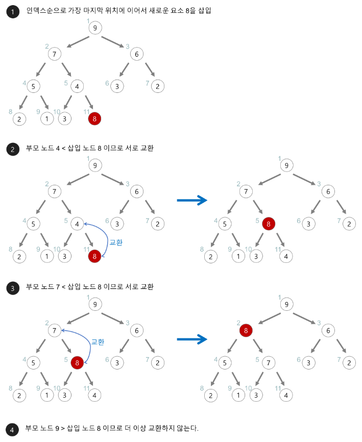
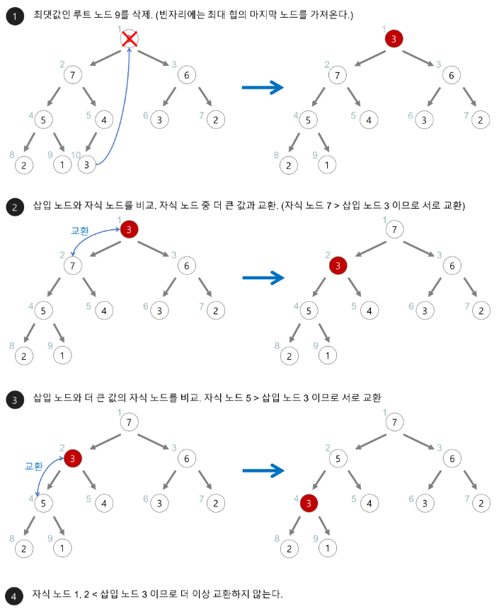

# Sorting Algorithm

Concept, Best, Worst time Complexity, Space complexity

- [Sorting Algorithm](#sorting-algorithm)
  - [Insertion Sort](#insertion-sort)
  - [Selection Sort](#selection-sort)
  - [Bubble Sort](#bubble-sort)
  - [Shell Sort](#shell-sort)
  - [Merge Sort](#merge-sort)
  - [Quick Sort](#quick-sort)
  - [Heap Sort](#heap-sort)
    - [Heap Structrue](#heap-structrue)
      - [Insertion](#insertion)
      - [Deletion](#deletion)
    - [Heap Sort Strategy](#heap-sort-strategy)
  - [References](#references)

## Insertion Sort

두 번째 자료부터 시작하여 그 앞(왼쪽)의 자료들과 비교하여 삽입할 위치를 지정한 후 자료를 뒤로 옮기고 지정한 자리에 자료를 삽입하여 정렬하는 알고리즘이다.

- Best : O(n)
- Worst
  - Keys are in reverse order. Have to complare all of keys before current target.
  - W(n) = 1 + 2 + 3 + ... + (n - 1) = n*(n - 1) / 2 ~ O(n^2)
- Space : In place

## Selection Sort

첫 번째 자료를 두 번째 자료부터 마지막 자료까지 차례대로 비교하여 가장 작은 값을 찾아 첫 번째에 놓고, 두 번째 자료를 세 번째 자료부터 마지막 자료까지와 차례대로 비교하여 그 중 가장 작은 값을 찾아 두 번째 위치에 놓는 과정을 반복. 1회전을 수행하고 나면 가장 작은 값의 자료가 맨 앞에 오게 되므로 그 다음 회전에서는 두 번째 자료에서 비교를 시작.

- Best, Worst : O(n^2)
- Space : In place

## Bubble Sort

첫 번째 자료와 두 번째 자료를, 두 번째 자료와 세 번째 자료를, 세 번째와 네 번째를, … 이런 식으로 (마지막-1)번째 자료와 마지막 자료를 비교하여 교환하면서 자료를 정렬. 1회전을 수행하고 나면 가장 큰 자료가 맨 뒤로 이동하므로 2회전에서는 맨 끝에 있는 자료는 정렬에서 제외.

- Best, Worst : O(n^2)
- Space : In place

## Shell Sort

삽입 정렬이 어느 정도 정렬된 배열에 대해서는 대단히 빠른 것에 착안. 삽입 정렬의 최대 문제점: 요소들이 삽입될 때, 이웃한 위치로만 이동. 즉, 만약 삽입되어야 할 위치가 현재 위치에서 상당히 멀리 떨어진 곳이라면 많은 이동을 해야만 제자리로 갈 수 있다.

정렬해야 할 리스트의 각 k번째 요소를 추출해서 부분 리스트를 만든다. 이때, k를 ‘간격(gap)’ 이라고 한다. 간격의 초기값: (정렬할 값의 수)/2. 각 회전마다 간격 k를 절반으로 줄이면서 간격이 1이 될 때 까지 삽입정렬을 수행. 간격은 짝수일 경우 +1을 해서 홀수로 만듬

- Best
  - Already sorted. n operations for all gap * log(n) gap count until 1
  - O(nlog(n))
- Worst : O(n^2)
- Space : In place

## Merge Sort

하나의 리스트를 두 개의 균등한 크기로 분할하고 분할된 부분 리스트를 정렬한 다음, 두 개의 정렬된 부분 리스트를 합하여 전체가 정렬된 리스트가 되게 하는 방법이다.

- Best, Worst
  - Comparision : 순환 호출의 깊이 만큼의 합병 단계 * 각 합병 단계의 비교 연산 = nlog(n)
  - Movement : 부분 배열에 들어 있는 요소의 개수가 n인 경우, 레코드의 이동이 2n번 발생. 순환 호출의 깊이 만큼의 합병 단계 * 각 합병 단계의 이동 연산 = 2nlog(n)
  - nlog(n) + 2nlog(n) ~ O(nlog(n))
- Space : 길의 n의 temp array가 필요

## Quick Sort

pivot (보통 첫번째 element로 설정)을 기준으로 왼쪽, 오른쪽으로 분할 (partition)하고 이를 나눈 partition에도 재귀적으로 반복하는 구조

- Best
  - 딱 절반씩 나눠지는 경우 재귀 호출은 log(n)이고 각 단계에서의 비교횟수는 n임 (각 depth에 총 n개의 element가 있음)
  - O(nlog(n))
- Worst
  - Partition이 계속 불균등하게 나누어지는 경우. 특히 정렬된 list에 대해 정렬을 수행하는 경우 순환 호출의 깊이가 n임. 각 단계에서의 비교 횟수는 n임.
  - O(n^2)
- Space : In place
- Average : O(nlog(n)), 시간복잡도가 O(nlog(n))인 다른 정렬들에 비해서도 빠름! 먼 거리의 데이터를 교환할 뿐만 아니라 pivot이 다음 정렬에서 제외되는 특성 때문임.

## Heap Sort

### Heap Structrue

Heap (Left-Complete Binary Tree)

1. h - 1 depth까지 complete
2. leaf는 h나 h - 1의 depth에 있음
2. h depth의 leaf는 왼쪽에 몰려 있음

- Partial Order Tree : 각 node가 가지의 children보다 크거나 같은 (또는 작거나 같은) Tree. Heap은 이것임
- 구현 : array로 할 수 있음. `i*2 + 1` 가 left child, `i*2 + 2` 가 right child, `(i - 1) / 2`가 parent가 됨

#### Insertion

1. 힙에 새로운 요소가 들어오면, 일단 새로운 노드를 힙의 마지막 노드에 이어서 삽입한다.
2. Heapfiy

#### Deletion

1. 최대 힙에서 최댓값은 루트 노드이므로 루트 노드가 삭제된다.
2. 삭제된 루트 노드에는 힙의 마지막 노드를 가져온다.
3. Heapfiy

### Heap Sort Strategy

Heap구조를 만든 후 제일 앞 숫자(최댓값)와 heap의 제일 뒤의 숫자를 swap하고 제일 뒤의 숫자를 제외하고 heapify함

- Best, Worst : Heapfiy time is log(n). Repeat n times ~ O(nlog(n))
- Space : In-place. Depth of recursion ~ O(log(n))

## References

- https://gmlwjd9405.github.io/2018/05/06/algorithm-insertion-sort.html
- https://gmlwjd9405.github.io/2018/05/06/algorithm-selection-sort.html
- https://gmlwjd9405.github.io/2018/05/06/algorithm-bubble-sort.html
- https://gmlwjd9405.github.io/2018/05/08/algorithm-shell-sort.html
- https://gmlwjd9405.github.io/2018/05/08/algorithm-merge-sort.html
- https://gmlwjd9405.github.io/2018/05/10/algorithm-quick-sort.html
- https://www.geeksforgeeks.org/quick-sort/
- https://gmlwjd9405.github.io/2018/05/10/algorithm-heap-sort.html
- https://www.geeksforgeeks.org/heap-sort/
