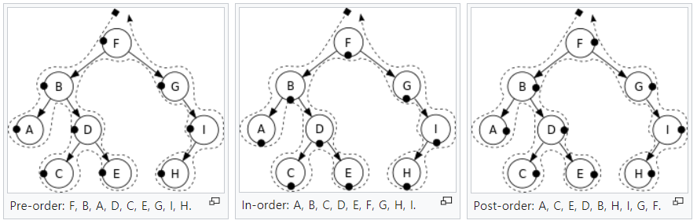
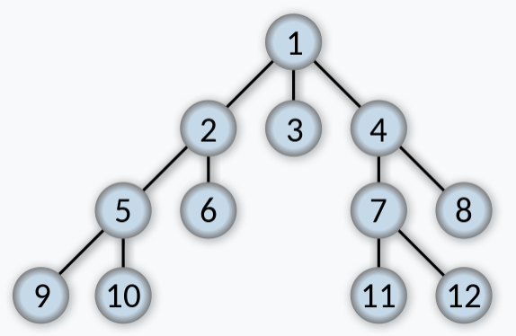

# Tree

- [Tree Traversal](#tree-traversal)
- [Recursive](#recursive)
  - [Top-down](#top-down)
  - [Bottom-up](#bottom-up)
- [Iterative](#iterative)
- [Binary Search Tree](#binary-search-tree)
- [Breadth-First Search](#breadth-first-search)
- [Problems](#problems)
- [See also](#see-also)

## Tree Traversal



pre, in, post means when to visit node.

- Pre-order: node -> left child -> right child
- In-order: left child -> node -> right child
- Post-order: left child -> right child -> node

All traversal is DFS (depth first search).

## Recursive

### Top-down

- In each recursive call, we will visit the node first to come up with some values, and pass these values to its children when calling the function recursively.
- Pre-order traversal.

```text
1. return specific value for null node
2. update the answer if needed                      // answer <-- params
3. left_ans = top_down(root.left, left_params)      // left_params <-- root.val, params
4. right_ans = top_down(root.right, right_params)   // right_params <-- root.val, params
5. return the answer if needed 
```

```java
/* finding max depth of tree */
void traverse(TreeNode node, int depth) {
  // return value for null
  if (root == null) {
    return 0;
  }
  
  int max = 0;

  // update answer if need
  if (root.left == null && root.right == null) {
    max = Math.max(depth + 1, max);
  }
  
  // traverse left, right
  max = Math.max(traverse(root.left, depth + 1), max);
  max = Math.max(traverse(root.right, depth + 1), max);
  
  return max;
}
```

### Bottom-up

- In each recursive call, we will firstly call the function recursively for all the children nodes and then come up with the answer according to the returned values and the value of the current node itself.
- Post-order traversal

```text
1. return specific value for null node
2. left_ans = bottom_up(root.left)      // call function recursively for left child
3. right_ans = bottom_up(root.right)    // call function recursively for right child
4. return answers                       // answer <-- left_ans, right_ans, root.val
```

```java
/* finding max depth of tree */
void traverse(TreeNode node) {
  // return value for null
  if (root == null) {
    return 0;
  }
  
  // traverse left, right
  int left = traverse(root.left);
  int right = traverse(root.right);

  // combine left.ans, right.ans, root.val
  return 1 + Math.max(left, right);
}
```
 
## Iterative

todo

## Binary Search Tree

- Binary tree (2 child), all nodes of left-child < root.val && root.val < all nodes of right-child.
- In-order traversal always visits nodes in a sorted order.

## Breadth-First Search



- Tree is type of graph. Bfs can be applied.

## Problems

- [BinaryTreeRightSideView](./leetcode/BinaryTreeRightSideView.cpp)
- [BinaryTreeInorderTraversal](./leetcode/BinaryTreeInorderTraversal.java)
- [BinaryTreeLevelOrderTraversal](./leetcode/BinaryTreeLevelOrderTraversal.java)
- [BinaryTreeZigzagLevelOrderTraversal](./leetcode/BinaryTreeZigzagLevelOrderTraversal.java)
- [MaximumDepthOfBinaryTree](./leetcode/MaximumDepthOfBinaryTree.java)
- [SumOfDistancesInTree](./leetcode/SumOfDistancesInTree.java)
- [SymmetricTree](./leetcode/SymmetricTree.java)
- [ValidateBinarySearchTree](./leetcode/ValidateBinarySearchTree.cpp)
- [AverageofLevelsinBinaryTree](./leetcode/AverageofLevelsinBinaryTree.cpp)

## See also