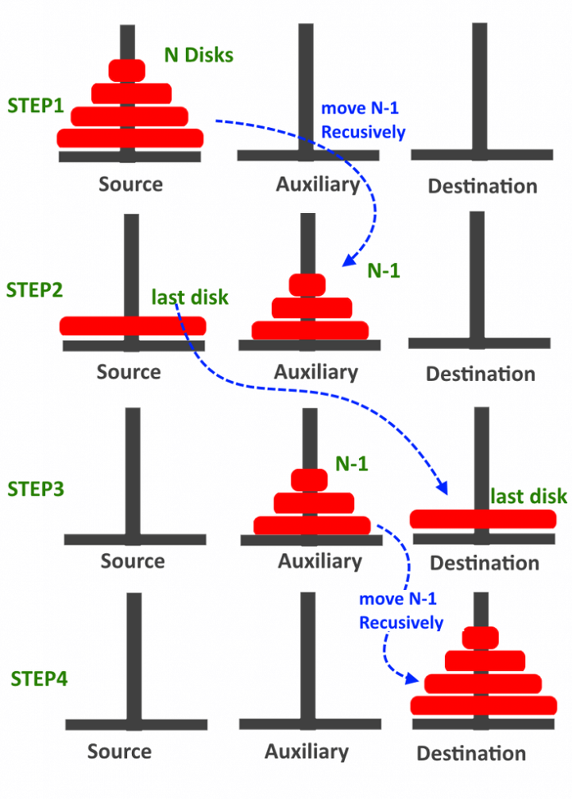

# Base Patterns

- [Base Patterns](#base-patterns)
  - [Solving](#solving)
  - [Data Structure](#data-structure)
    - [Canonicalization](#canonicalization)
    - [Separate data with an algorithm](#separate-data-with-an-algorithm)
  - [Modeling](#modeling)
    - [Explicit Formula (점화식)](#explicit-formula-%ec%a0%90%ed%99%94%ec%8b%9d)
      - [Sum until n](#sum-until-n)
      - [Tower of Hanoi](#tower-of-hanoi)
  - [Proving](#proving)
    - [Loop dominates Time Complexity](#loop-dominates-time-complexity)
    - [Mathematical Induction (수학적귀납법)](#mathematical-induction-%ec%88%98%ed%95%99%ec%a0%81%ea%b7%80%eb%82%a9%eb%b2%95)
    - [Loop Invariant](#loop-invariant)
  - [Writing](#writing)
    - [Use half-open interval in a range](#use-half-open-interval-in-a-range)
    - [Always init on declaration](#always-init-on-declaration)
    - [No floating point operation if possible](#no-floating-point-operation-if-possible)
  - [Debugging](#debugging)
    - [Logging middle result](#logging-middle-result)
    - [Use assert on precondition](#use-assert-on-precondition)

## Solving

1. Understand carefully
2. Modeling (including data structure, solving strategy)
3. Validate it
4. Test with corner case (like -1, 0, 1)

## Data Structure

### Canonicalization

A process for converting data that has more than one possible representation into a standard form.\
It reduces complexity by abstraction (or modeling) for computational world.

eg. 2/4, 3/6 -> 1/2

### Separate data with an algorithm

```java
// from
String getMonthName(int month) {
  if (mount == 1) return "January";
  if (mount == 2) return "February";
  if (mount == 3) return "March";
  return "December";
}

// to
String[] monthName = { "January", "February", "March", "December" };
String getMonthName(int month) {
  return monthName[month - 1];
}

// from
void move(int direction) {
  if (direction == 1) moveLeft();
  if (direction == 2) moveRight();
}

// to
int[] movement = { -1, 1 };
void move(int direction) {
  moveTo(movement[direction - 1]);
}
```

## Modeling

### Explicit Formula (점화식)

- D(n) : divide
- C(n) : combine
- T(n) = D(n) + sigma[i_to_k](T(i)) + C(n)
- Time Complexity : find basic operation & compute with it

#### Sum until n

- For n >= 2, f(n) = f(n - 1) + n
- For n == 1, f(n) = 1
- Time complexity (basic operation : +)
  ```text
  T(n) = T(n - 1) + 1
       = T(n - 2) + 2
       = T(n - 3) + 3
       =    ...
       = T(1) + n - 1
       = n - 1 since T(1) = 0
  ```

#### Tower of Hanoi



- For n >= 2
  - f(n - 1) for source -> temp and temp -> destination, 1 for bottom movement
  - f(n) = 2 * f(n - 1) + 1
- For n == 1, f(n) = 1
- Time complexity (basic operation : move)
  ```text
  T(n) = 2 * T(n - 1) + 1
       = 2 * (2 * T(n - 2) + 1) + 1
       = 2^2 * T(n - 2)) + 2
       =      ...
       = 2^(n-1) * T(1) + 2^(n-1) - 1
       = 2^n - 1
  ```

## Proving

### Loop dominates Time Complexity

Big-O Notation : 가장 빨리 증가하는 항만 제외하고 다 버림

Approximately, 100_000_000 loop ~ 1 second. Not sure.

```java
// O(1) : Constant
System.out.println("Hello world");

// O(N * log(N))
Collections.sort()

// O(N) : Linear
for (int i = 0; i < N; ++i) {
  // do something
}

// O(N^2)
for (int i = 0; i < N; ++i) {
  for (int j = 0; j < N; ++j) {
    // do something
  }
}
```

### Mathematical Induction (수학적귀납법)

1. Clarify the step
2. Prove an algorithm on n == 1
3. Prove that if an algorithm satisfies on n, then also n + 1

eg. 100개의 도미노

1. step : 도미노 하나
2. 도미노 하나를 쓰터트린다
3. 도미노 하나가 쓰러지면, 다음 도미노도 쓰러진다

### Loop Invariant

## Writing

### Use half-open interval in a range

`[a, b)` (a <= value && value < b)

- Easy to represent empty range with `[a, a)`
- Easy to evaluate length of range by `b - a`

### Always init on declaration

```java
// from
int[] arr;

// to
int[] arr = { 1, 2, 3 };
```

### No floating point operation if possible

Floating point operation is slow, inaccurate

```java
// from
sqrt((a - b) * (a - b)) == r

// to
(a - b) * (a - b) == (r * r)
```

## Debugging

### Logging middle result

```java
int sum = 0;
for (int i = 0; i < 3; ++i) {
  sum += i;
  System.out.format("i: %d, sum: %d\n", i, sum);
}
```

### Use assert on precondition

```cpp
void f(int next, int sum) {
  assert next < 3
}
```
