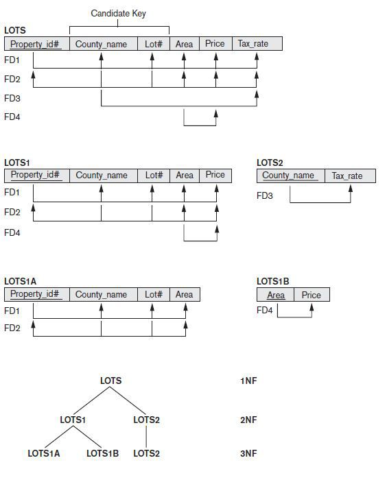
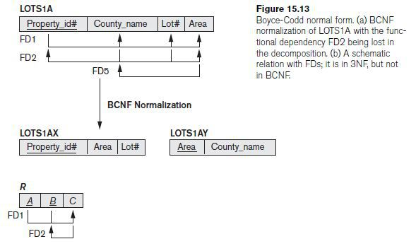
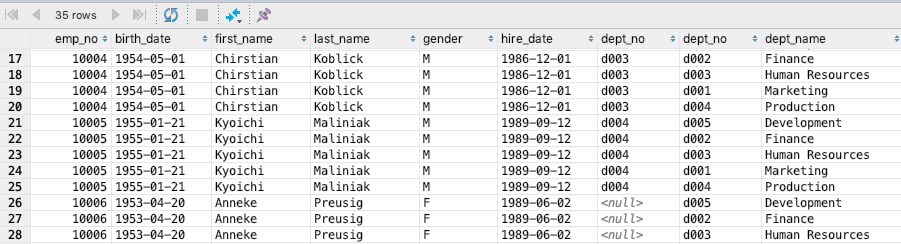
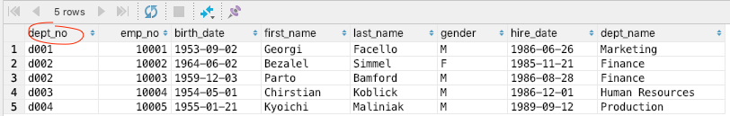
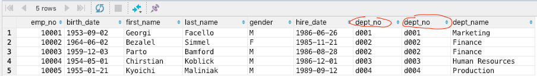
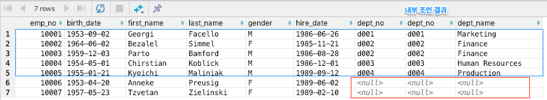

# Database

- [Database](#database)
  - [Why](#why)
  - [CAP](#cap)
  - [DB Performance](#db-performance)
  - [Logical Design](#logical-design)
    - [Normalization](#normalization)
    - [Entity-Relational Model](#entity-relational-model)
  - [Physical Design](#physical-design)
    - [Index](#index)
      - [Indexing Algorithm](#indexing-algorithm)
        - [B+ Tree](#b-tree)
        - [Hash](#hash)
      - [Primary Index vs Secondary Index](#primary-index-vs-secondary-index)
      - [Composite Index](#composite-index)
      - [Indexing Considerations](#indexing-considerations)
  - [Join](#join)
    - [Cross Join](#cross-join)
    - [Natural Join](#natural-join)
    - [Inner Join](#inner-join)
    - [Outer Join](#outer-join)
      - [Left Outer Join](#left-outer-join)
      - [Right Outer Join](#right-outer-join)
    - [Inner Join vs Outer Join](#inner-join-vs-outer-join)
  - [Transaction](#transaction)
    - [Transaction Deadlock](#transaction-deadlock)
    - [Lock vs Transaction](#lock-vs-transaction)
  - [Statement vs PreparedStatement](#statement-vs-preparedstatement)
  - [Replication vs Clustering](#replication-vs-clustering)
  - [NoSQL](#nosql)
    - [CAP Theorm & NoSQL](#cap-theorm--nosql)
    - [저장 방식에 따른 NoSQL 분류](#%ec%a0%80%ec%9e%a5-%eb%b0%a9%ec%8b%9d%ec%97%90-%eb%94%b0%eb%a5%b8-nosql-%eb%b6%84%eb%a5%98)
      - [Key-Value Model](#key-value-model)
      - [Document Model](#document-model)
      - [Column Model](#column-model)
  - [Ideas](#ideas)
    - [NoSQL](#nosql-1)
  - [References](#references)

## Why

컴퓨터는 계산기임. 데이터를 가지고 연산하는 기계. 그렇다면 이러한 데이터를 관리를 해야 함. 근데 그냥 파일로 관리하면 불편. 파일로 관리하면 일관성이 깨지기 쉬움 (여러 PC에서 분산해서 저장하기라도 하면 다 업뎃해야함. 또 이런거 해주는 프로그램 짜야함). 이것을 해결하기 위해 데이터를 개념적으로 한곳에 모으고 (database) 를 관리하는 프로그램을 만듬 (DBMS, DataBase Management System)

## CAP

데이터베이스를 분산해서 관리하면 다음의 3개 중 2개 초과를 보장할 수 없음
  
- Consistency : 분산된 데이터 간 동일한 시간에 조회하면 동일한 데이터를 얻는 것
- Availability : 항상 이용가능한 것
- Partition Tolerance  : 네트워크 장애가 발생해도 시스템이 정상적으로 운영되어야 함

이게 왜 안되냐면 네트워크 장애가 발생하더라도 Partition tolerance를 보장한다고 해보자. Consistency를 보장하려면 다른 노드간 동기화를 하는 것을 기다려야함 (Availability 불만족). Avaliablity를 보장한다면 다른 노드간 동기화를 나중에 해야 함 (Consistency error). 그렇다고 Partition tolerance를 보장하지 않는다고 하면 분산해서 할 이유가 없음.

## DB Performance

데이터를 읽으려면 결국 디스크를 뒤져야 함. 여기서 디스크 원판을 돌려서 디스크 헤더가 읽게 해야 하는데 원판 돌리는 시간이 좀 걸림. 그래서 순차 Access가 빠름. 근데 현실에서는 다 Random I/O. Random I/O를 순차 I/O를 바꿀 수 없을까? 이게 쿼리 튜닝의 시작.

[위로](#Database)

## Logical Design

데이터의 중복을 제거해서 저장하기 논리적으로 설계하는 과정.

### Normalization




중복을 최소화하게 데이터를 구조화하는 프로세스. 주로 함수적 종속으로 정의.

함수적 종속 : X 와 Y가 속성집합일 때, X 값이 Y 값을 유일하게 결정하는 경우

- 1NF : 릴레이션에 속한 모든 속성의 도메인이 원자 값으로만 구성
  - 해결방안 : 그냥 속성에 ,같은거 안넣음
- 2NF : 1NF이면서 기본키의 일부에 종족적인 속성이 없는 경우 (eg. (X,Y)->Z일 때 X->Z가 없는 경우)
  - 해결방안 : 기본키의 일부에 종속적인 속성들을 다른 테이블로 분리
- 3NF
  - 2NF이면서 이행적 함수 종속이 없는 경우를 말하는데 이행적 함수 종속(Transitive Functional Dependency)이란 X가 primary key일 때 X->Y이고, Y->Z라서 X->Z가 되는 경우를 의미. 3NF는 여기서 Y가 Primary attribute인 경우는 제외
  - 해결방안 : Y->Z를 다른 테이블로 분리
- BCNF : 3NF에서 Y가 primary attribute일 경우를 제외한다는 조건을 뺌

정규화를 하게 되면 중복 제거의 장점이 있으나 query를 해야 할 때 join을 해야 하는 단점이 있다. 그래서 query시 성능 저하가 심하게 발생하면 비정규화(De-normalization)을 수행하기도 한다.

### Entity-Relational Model


[위로](#Database)

## Physical Design

스키마를 물리적으로 구현하는 과정

### Index

Column의 값과 해당 레코드가 저장된 주소를 키와 값의 쌍으로 인덱스를 만들어 두어 검색 속도를 높이는 것. 해당 값으로 검색 하는 경우 속도가 더 빨라지는 장점이 있으나 데이터를 Create/Update/Delete 하는 경우 Index도 같이 업데이트 시켜야 하기 때문에 느리다. 그렇기 때문에 필요한 경우에만 index를 잘 만들어서 써야 함.

#### Indexing Algorithm

##### B+ Tree

일반적으로 사용되는 인덱스 알고리즘은 B+ Tree 알고리즘이다. B+ Tree 인덱스는 칼럼의 값을 변형하지 않고(사실 값의 앞부분만 잘라서 관리한다.), 원래의 값을 이용해 인덱싱하는 알고리즘이다.

그렇다면 왜 B+ Tree를 사용할까? 데이터에 접근하는 시간복잡도가 O(1)인 hash table 이 더 효율적일 것 같은데? SELECT 질의의 조건에는 부등호(<>) 연산도 포함이 된다. hash table 을 사용하게 된다면 등호(=) 연산이 아닌 부등호 연산의 경우에 문제가 발생한다. 동등 연산(=)에 특화된 `hashtable`은 데이터베이스의 자료구조로 적합하지 않다.

##### Hash

칼럼의 값으로 해시 값을 계산해서 인덱싱하는 알고리즘으로 매우 빠른 검색을 지원한다. 하지만 값을 변형해서 인덱싱하므로, 특정 문자로 시작하는 값으로 검색을 하는 등 전방 일치와 같이 값의 일부만으로 검색하고자 할 때는 해시 인덱스를 사용할 수 없다. 주로 메모리 기반의 데이터베이스에서 많이 사용한다.

#### Primary Index vs Secondary Index

클러스터(Cluster)란 여러 개를 하나로 묶는다는 의미로 주로 사용되는데, 클러스터드 인덱스도 크게 다르지 않다. 인덱스에서 클러스터드는 비슷한 것들을 묶어서 저장하는 형태로 구현되는데, 이는 주로 비슷한 값들을 동시에 조회하는 경우가 많다는 점에서 착안된 것이다. 여기서 비슷한 값들은 물리적으로 인접한 장소에 저장되어 있는 데이터들을 말한다.

클러스터드 인덱스는 테이블의 프라이머리 키에 대해서만 적용되는 내용이다. 즉 프라이머리 키 값이 비슷한 레코드끼리 묶어서 저장하는 것을 클러스터드 인덱스라고 표현한다. 클러스터드 인덱스에서는 프라이머리 키 값에 의해 레코드의 저장 위치가 결정되며 프라이머리 키 값이 변경되면 그 레코드의 물리적인 저장 위치 또한 변경되어야 한다. 그렇기 때문에 프라이머리 키를 신중하게 결정하고 클러스터드 인덱스를 사용해야 한다.

클러스터드 인덱스는 테이블 당 한 개만 생성할 수 있다. 프라이머리 키에 대해서만 적용되기 때문이다, 이에 반해 non 클러스터드 인덱스는 테이블 당 여러 개를 생성할 수 있다.

#### Composite Index

인덱스로 설정하는 필드의 속성이 중요하다. title, author 이 순서로 인덱스를 설정한다면 title 을 search 하는 경우, index 를 생성한 효과를 볼 수 있지만, author 만으로 search 하는 경우, index 를 생성한 것이 소용이 없어진다. 따라서 SELECT 질의를 어떻게 할 것인가가 인덱스를 어떻게 생성할 것인가에 대해 많은 영향을 끼치게 된다.

#### Indexing Considerations

SELECT 쿼리의 성능을 월등히 향상시키는 INDEX 항상 좋은 것일까? 쿼리문의 성능을 향상시킨다는데, 모든 컬럼에 INDEX 를 생성해두면 빨라지지 않을까?  
_결론부터 말하자면 그렇지 않다._  
우선, 첫번째 이유는 INDEX 를 생성하게 되면 INSERT, DELETE, UPDATE 쿼리문을 실행할 때 별도의 과정이 추가적으로 발생한다. INSERT 의 경우 INDEX 에 대한 데이터도 추가해야 하므로 그만큼 성능에 손실이 따른다. DELETE 의 경우 INDEX 에 존재하는 값은 삭제하지 않고 사용 안한다는 표시로 남게 된다. 즉 row 의 수는 그대로인 것이다. 이 작업이 반복되면 어떻게 될까?

실제 데이터는 10 만건인데 데이터가 100 만건 있는 결과를 낳을 수도 있는 것이다. 이렇게 되면 인덱스는 더 이상 제 역할을 못하게 되는 것이다. UPDATE 의 경우는 INSERT 의 경우, DELETE 의 경우의 문제점을 동시에 수반한다. 이전 데이터가 삭제되고 그 자리에 새 데이터가 들어오는 개념이기 때문이다. 즉 변경 전 데이터는 삭제되지 않고 insert 로 인한 split 도 발생하게 된다.

하지만 더 중요한 것은 컬럼을 이루고 있는 데이터의 형식에 따라서 인덱스의 성능이 악영향을 미칠 수 있다는 것이다. 즉, 데이터의 형식에 따라 인덱스를 만들면 효율적이고 만들면 비효율적은 데이터의 형식이 존재한다는 것이다. 어떤 경우에 그럴까?

`이름`, `나이`, `성별` 세 가지의 필드를 갖고 있는 테이블을 생각해보자.
이름은 온갖 경우의 수가 존재할 것이며 나이는 INT 타입을 갖을 것이고, 성별은 남, 녀 두 가지 경우에 대해서만 데이터가 존재할 것임을 쉽게 예측할 수 있다. 이 경우 어떤 컬럼에 대해서 인덱스를 생성하는 것이 효율적일까? 결론부터 말하자면 이름에 대해서만 인덱스를 생성하면 효율적이다.

왜 성별이나 나이는 인덱스를 생성하면 비효율적일까?
10000 레코드에 해당하는 테이블에 대해서 2000 단위로 성별에 인덱스를 생성했다고 가정하자. 값의 range 가 적은 성별은 인덱스를 읽고 다시 한 번 디스크 I/O 가 발생하기 때문에 그 만큼 비효율적인 것이다.

[위로](#Database)

## Join

### Cross Join

Cartesin Product

```sql
-- explicit notation
SELECT *
FROM employees
  CROSS JOIN dept_emp;

-- implicit notation
SELECT *
FROM employees, dept_emp;
```



### Natural Join

같은 이름을 가진 컬럼은 한 번만 추출

```sql
-- 명시적 표현법 (explicit notation)
SELECT *
FROM employees NATURAL JOIN dept_emp;
```



### Inner Join

조건문을 만족시키는 행만 표시

```sql
-- explicit notation
SELECT *
FROM employees
  INNER JOIN dept_emp
    ON employees.emp_no = dept_emp.emp_no;

-- implicit notation
SELECT *
FROM employees, dept_emp
WHERE employees.emp_no = dept_emp.emp_no;
```



### Outer Join

조건문에 만족시키지 않는 행도 표시

#### Left Outer Join

```sql
SELECT *
FROM table1
  LEFT OUTER JOIN table2
    ON table1.n = table2.n;
```



#### Right Outer Join

```sql
SELECT *
FROM table1
  RIGHT OUTER JOIN table2
    ON table1.n = table2.n;
```


### Inner Join vs Outer Join

Innter Join은 조건문에 만족시키는 것만 보여주는 반면에 Outer Join은 만족시키지 않는 부분도 보여줌 (기준에 따라, left, right)

[위로](#database)

## Transaction

All or nothing. 작업의 완전성을 보장해주는 것. 모두 완벽하게 처리하거나 처리하지 못할 경우에는 원 상태로 복구해서 일부만 적용되는 현상이 발생하지 않게 방지. 성질 (ACID)가 있다.

- Atomicity(원자성) : 만약 트랜잭션 중간에 어떠한 문제가 발생한다면 트랜잭션에 해당하는 어떠한 작업 내용도 수행되어서는 안된다.
- Consistency(일관성) : 트랜잭션이 완료된 다음의 상태에서도 트랜잭션이 일어나기 전의 상황과 동일하게 데이터의 일관성을 보장해야 한다.
- Isolation(고립성) : 각각의 트랜잭션은 서로 간섭없이 독립적으로 수행되어야 한다.
- Durability(지속성) : 트랜잭션이 정상적으로 종료된 다음에는 영구적으로 데이터베이스에 작업의 결과가 저장되어야 한다.


- Active : 활동 상태
- Failed : 실패 상태
- Partial Committed
  - 트랜잭션의 `Commit` 명령이 도착한 상태. `commit`이전 `sql`문이 수행되고 `commit`만 남은 상태
  - `Commit`을 문제없이 수행할 수 있으면 `Committed` 상태로 전이, 오류가 발생하면 `Failed` 상태가 됨
- Committed : 완료 상태
- Aborted : 취소 상태. 트랜잭션이 취소되고 Rollback된 상태

All or nothing이라는 좋은 점이 있으나 db collection의 수는 한정되어 있기때문에 전부 tx를 해버리면 collection풀이 남아나질 않아서 성능이 느려지게 될 수 있음. transaction 과정간 lock을 거는데 서로가 서로가 소유하고 있는 lock을 획득하려고 하면 deadlock도 발행할 수 있음

### Transaction Deadlock

Transaction 1이 B table에 insert하고 Transaction 2가 A table에 insert를 침. 이 때 Tx1은 B에 대한 lock을 소유, Tx2는 A에 대한 Lock을 소유함. 그 후 Transaction 1이 A table에 insert하고 Transaction 2가 B table에 insert하면 lock을 얻지 못해서 deadlock걸림

```SQL
Transaction 1> start transaction; insert into B values(1);
Transaction 2> start transaction; insert into A values(1);

Transaction 1> insert into A values(1);
Transaction 2> insert into B values(1);

ERROR 1213 (40001): Deadlock found when trying to get lock; try restarting transaction
```

### Lock vs Transaction

Lock은 동시성을 제어하기 위한 기술, Transaction은 데이터의 정합성을 보장하기 위한 기술임. Lock같은 경우 여러 connection이 들어왔을 때 한개의 connection만 일을 하는 것을 일컷는데, transaction은 어떠한 논리적인 행위가 전부 수행되거나 아니면 하나도 수행되지 않아야 하는 것에 집중한 기술임. Transaction을 수행할 때 lock을 걸기도 함.

## Statement vs PreparedStatement

Statement는 매번 컴파일을 하는 반면에 PreparedStatement는 한번만 컴파일을 한 후 값만 변경해서 재사용 하는 식임. 그래서 PreparsedStatement가 더 빠르고 `SQL Injection`도 방지해줘서 쓰는 것이 권장됨.

[위로](#database)

## Replication vs Clustering

둘다 이중화이긴 한데 Replication은 Master-slave model로 비동기식으로 단순 복제를 하는 반면에 Clustering은 동기식으로 서로의 데이터를 복제. Replication은 Clustering에 비해 복제 속도는 빠르지만 master가 죽었을 때 자동 failover기능이 없어서 직접 failover를 해서 서비스가 멈춰있는 시간이 있다. Clustering은 자동 failover기능이 있지만 replication에 비해 데이터를 동기화 하는데 시간이 더 걸린다.

[위로](#database)

## NoSQL

RDB는 현대의 3V (high-volume, high-velocity, and high-variety)의 데이터 시대에는 맞지 않음. RDB를 사용하면서 성능을 올리려면 Scale-up을 해야함. But 이는 비용이 많이 듬. 그래서 Scala-out을 해야 함. 또 요즘 시대에는 요구사항이 계속 바뀌어서 rdb의 엄격한 스키마 구조가 좋지 않음. 이런걸 해결하고자 분산 데이터베이스 기반으로 하는 느슨한 스키마를 갖는 데이터 저장소가 NoSQL.

종류마다 쓰기/읽기 성능 특화, 2 차 인덱스 지원, 오토 샤딩 지원 같은 고유한 특징을 가진다. 대량의 데이터를 빠르게 처리하기 위해 메모리에 임시 저장하고 응답하는 등의 방법을 사용한다. 동적인 스케일 아웃을 지원하기도 하며, 가용성을 위하여 데이터 복제 등의 방법으로 관계형 데이터베이스가 제공하지 못하는 성능과 특징을 제공한다.

### CAP Theorm & NoSQL

1. Consistency

일관성은 동시성 또는 동일성이라고도 하며 다중 클라이언트에서 같은 시간에 조회하는 데이터는 항상 동일한 데이터임을 보증하는 것을 의미한다. 이것은 관계형 데이터베이스가 지원하는 가장 기본적인 기능이지만 일관성을 지원하지 않는 NoSQL 을 사용한다면 데이터의 일관성이 느슨하게 처리되어 동일한 데이터가 나타나지 않을 수 있다. 느슨하게 처리된다는 것은 데이터의 변경을 시간의 흐름에 따라 여러 노드에 전파하는 것을 말한다. 이러한 방법을 최종적으로 일관성이 유지된다고 하여 최종 일관성 또는 궁극적 일관성을 지원한다고 한다.

각 NoSQL 들은 분산 노드 간의 데이터 동기화를 위해서 두 가지 방법을 사용한다.

- 첫번째로 데이터의 저장 결과를 클라이언트로 응답하기 전에 모든 노드에 데이터를 저장하는 동기식 방법이 있다. 그만큼 느린 응답시간을 보이지만 데이터의 정합성을 보장한다.
- 두번째로 메모리나 임시 파일에 기록하고 클라이언트에 먼저 응답한 다음, 특정 이벤트 또는 프로세스를 사용하여 노드로 데이터를 동기화하는 비동기식 방법이 있다. 빠른 응답시간을 보인다는 장점이 있지만, 쓰기 노드에 장애가 발생하였을 경우 데이터가 손실될 수 있다.

2. Availability

모든 클라이언트의 읽기와 쓰기 요청에 대하여 항상 응답이 가능해야 함을 보증하는 것. NoSQL 은 가용성을 보장하기 위해 데이터 복제(Replication)을 사용한다. 동일한 데이터를 다중 노드에 중복 저장하여 그 중 몇 대의 노드가 고장나도 데이터가 유실되지 않도록 하는 방법이다. 데이터 중복 저장 방법에는 동일한 데이터를 가진 저장소를 하나 더 생성하는 Master-Slave 복제 방법과 데이터 단위로 중복 저장하는 Peer-to-Peer 복제 방법이 있다.

3. Partition Tolerance

네트워크 분할 허용성이란 지역적으로 분할된 네트워크 환경에서 동작하는 시스템에서 두 지역 간의 네트워크가 단절되거나 네트워크 데이터의 유실이 일어나더라도 각 지역 내의 시스템은 정상적으로 동작해야 함을 의미한다.

### 저장 방식에 따른 NoSQL 분류

#### Key-Value Model

가장 기본적인 형태의 NoSQL 이며 키 하나로 데이터 하나를 저장하고 조회할 수 있는 단일 키-값 구조를 갖는다. 단순한 저장구조로 인하여 복잡한 조회 연산을 지원하지 않는다. 또한 고속 읽기와 쓰기에 최적화된 경우가 많다. 사용자의 프로필 정보, 웹 서버 클러스터를 위한 세션 정보, 장바구니 정보, URL 단축 정보 저장 등에 사용한다. 하나의 서비스 요청에 다수의 데이터 조회 및 수정 연산이 발생하면 트랜잭션 처리가 불가능하여 데이터 정합성을 보장할 수 없다.

eg. Redis

#### Document Model

키-값 모델을 개념적으로 확장한 구조로 하나의 키에 하나의 구조화된 문서를 저장하고 조회한다. 논리적인 데이터 저장과 조회 방법이 관계형 데이터베이스와 유사하다. 키는 문서에 대한 ID 로 표현된다. 또한 저장된 문서를 컬렉션으로 관리하며 문서 저장과 동시에 문서 ID 에 대한 인덱스를 생성한다. 문서 ID 에 대한 인덱스를 사용하여 O(1) 시간 안에 문서를 조회할 수 있다.

대부분의 문서 모델 NoSQL 은 B Tree 인덱스를 사용하여 2 차 인덱스를 생성한다. B Tree는 크기가 커지면 커질수록 새로운 데이터를 입력하거나 삭제할 때 성능이 떨어지게 된다. 그렇기 때문에 읽기와 쓰기의 비율이 7:3 정도일 때 가장 좋은 성능을 보인다. 중앙 집중식 로그 저장, 타임라인 저장, 통계 정보 저장 등에 사용된다.  

eg. MongoDB

#### Column Model

하나의 키에 여러 개의 컬럼 이름과 컬럼 값의 쌍으로 이루어진 데이터를 저장하고 조회한다. 모든 컬럼은 항상 타임 스탬프 값과 함께 저장된다.

구글의 빅테이블이 대표적인 예로 차후 컬럼형 NoSQL 은 빅테이블의 영향을 받았다. 이러한 이유로 Row key, Column Key, Column Family 같은 빅테이블 개념이 공통적으로 사용된다. 저장의 기본 단위는 컬럼으로 컬럼은 컬럼 이름과 컬럼 값, 타임스탬프로 구성된다. 이러한 컬럼들의 집합이 로우(Row)이며, 로우키(Row key)는 각 로우를 유일하게 식별하는 값이다. 이러한 로우들의 집합은 키 스페이스(Key Space)가 된다.

대부분의 컬럼 모델 NoSQL 은 쓰기와 읽기 중에 쓰기에 더 특화되어 있다. 데이터를 먼저 커밋로그와 메모리에 저장한 후 응답하기 때문에 빠른 응답속도를 제공한다. 그렇기 때문에 읽기 연산 대비 쓰기 연산이 많은 서비스나 빠른 시간 안에 대량의 데이터를 입력하고 조회하는 서비스를 구현할 때 가장 좋은 성능을 보인다. 채팅 내용 저장, 실시간 분석을 위한 데이터 저장소 등의 서비스 구현에 적합하다.

[위로](#database)

## Ideas

### NoSQL


## References

Common

https://github.com/JaeYeopHan/Interview_Question_for_Beginner/blob/master/Database

CAP Theorm

https://en.wikipedia.org/wiki/CAP_theorem

Index

https://chartworld.tistory.com/18

Normalization

https://yaboong.github.io/database/2018/03/09/database-normalization-1/

https://magok-leaders-coding.tistory.com/4

Join

https://advenoh.tistory.com/23

NoSQL

https://www.alachisoft.com/nosdb/why-nosql.html

https://www.techrepublic.com/blog/the-enterprise-cloud/migrating-from-a-relational-to-a-nosql-cloud-database/

https://nosql.mypopescu.com/post/540412780/from-mysql-to-mongodb-migration-steps