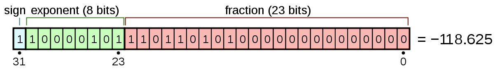

# Number

- [Number](#number)
  - [Floating Point Number](#floating-point-number)
  - [References](#references)

## Floating Point Number

IEEE 754표준으로 정의. 32 bit의 경우 1 bit 의 부호 비트, 8 bit의 지수, 나머지 23 bit의 가수부로 구성됨.

118.625를 표현한다면

1. 음수이므로, 부호부는 1
2. 이진법으로 나타내면 1110110.101
3. 소수점을 왼쪽으로 이동시켜, 왼쪽에는 1만 남게 만듬. 예를 들면 1110110.101(2)=1.110110101(2)×2⁶
4. 가수부는 소수점의 오른쪽 부분으로, 부족한 비트 수 부분만큼 0으로 채워 23비트로 만든다. 결과는 11011010100000000000000
5. 지수는 6이므로, Bias를 더해야 한다. 32비트 IEEE 754 형식에서는 Bias는 127이므로 6+127 = 133이 된다. 이진법으로 변환하면 10000101(2)이 된다

적은 메모리공간으로 보다 많은 실수를 표현할 수 있으나 이진수로 표현하므로 소수점을 제대로 표현하지 못하는 정밀도의 문제가 있음. 예를 들면 0.1같은거는 사실 0.1000000000xxxx 뭐 이런 식임

## References

Floating Point Number
https://ko.wikipedia.org/wiki/IEEE_754
