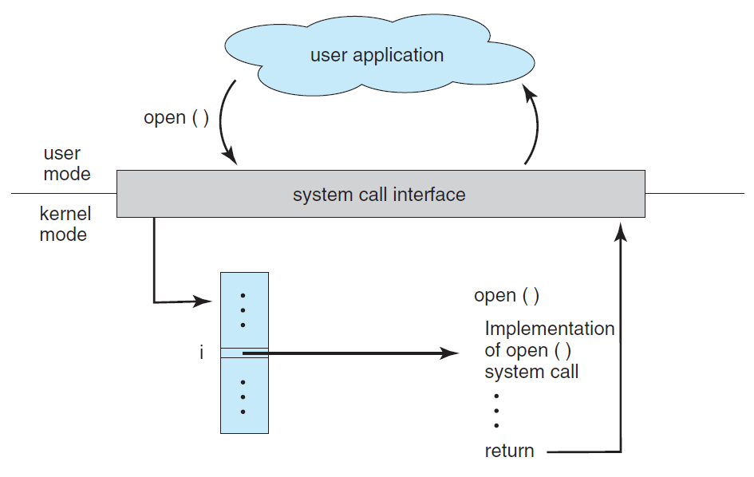
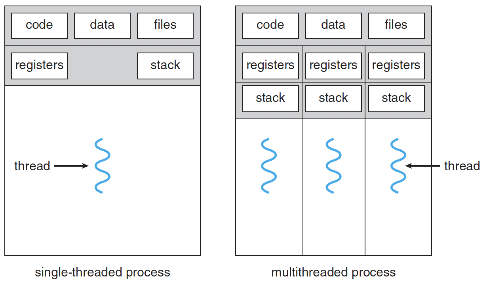
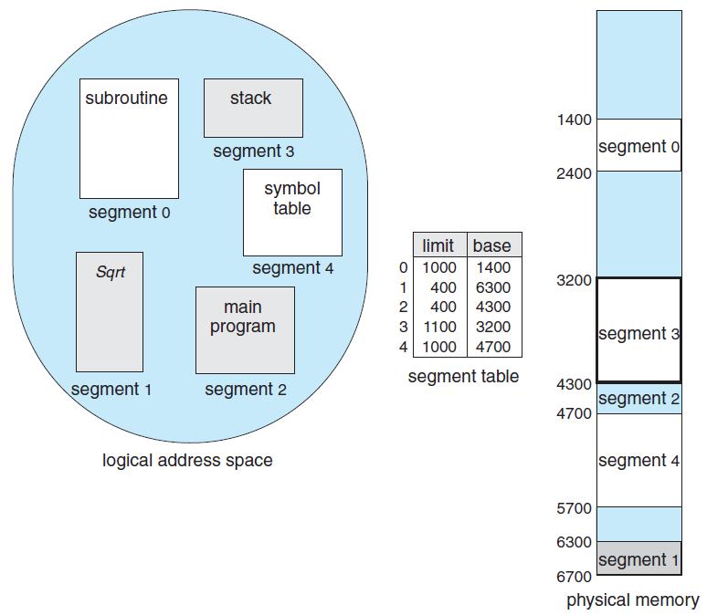
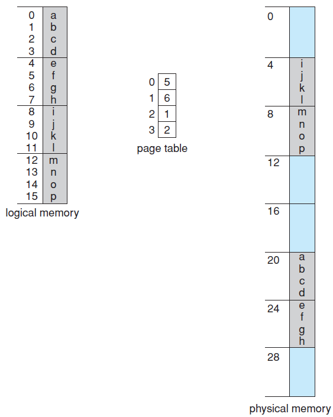
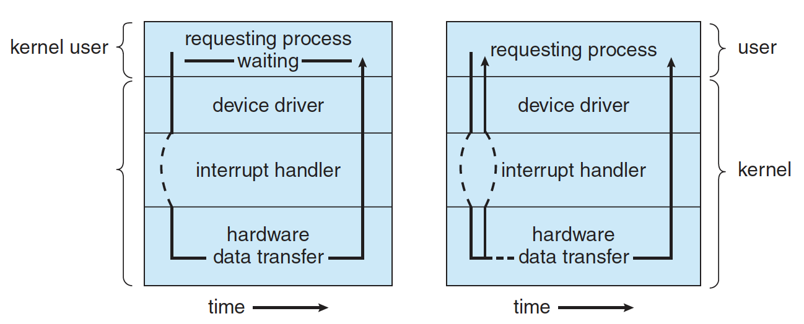

# Operating System

- [Operating System](#operating-system)
  - [User Mode vs Kernal Mode](#user-mode-vs-kernal-mode)
  - [Process Management](#process-management)
    - [Process](#process)
      - [Process Control Block](#process-control-block)
      - [Interprocess Communication](#interprocess-communication)
    - [Thread](#thread)
    - [Multi Process vs Multi Thread](#multi-process-vs-multi-thread)
    - [Process Synchronization](#process-synchronization)
      - [Critical Section](#critical-section)
      - [Critical Section Problem](#critical-section-problem)
      - [Lock](#lock)
      - [Semaphores](#semaphores)
      - [Monitors](#monitors)
    - [Process Scheduling](#process-scheduling)
      - [Long Term Scheduler](#long-term-scheduler)
      - [Medium Term Scheduler](#medium-term-scheduler)
      - [Short Term Scheduler](#short-term-scheduler)
    - [Schedulering Algorithm](#schedulering-algorithm)
      - [First Come, First Served (FCFS)](#first-come-first-served-fcfs)
      - [Shortest Job First (SJF)](#shortest-job-first-sjf)
      - [Shortest Remaining Time First (SRT)](#shortest-remaining-time-first-srt)
      - [Priority Scheduling](#priority-scheduling)
      - [Round Robin](#round-robin)
    - [Deadlocks](#deadlocks)
  - [Memory Management](#memory-management)
    - [Swapping](#swapping)
    - [Fragmentation](#fragmentation)
      - [Compation](#compation)
    - [Segmentation](#segmentation)
    - [Paging](#paging)
    - [Virtual Memory](#virtual-memory)
      - [Virtual Address Space](#virtual-address-space)
      - [Page Sharing among processes](#page-sharing-among-processes)
    - [Demand Paging](#demand-paging)
    - [Page Replacement](#page-replacement)
      - [First-In First-Out (FIFO)](#first-in-first-out-fifo)
      - [Optimal](#optimal)
      - [Least Recently Used (LRU)](#least-recently-used-lru)
      - [Least Frequently Used (LFU)](#least-frequently-used-lfu)
      - [Most Frequently Used (MFU)](#most-frequently-used-mfu)
  - [Storage Management](#storage-management)
    - [Cache Locality](#cache-locality)
      - [Caching line](#caching-line)
    - [Sync vs Async](#sync-vs-async)

---

## User Mode vs Kernal Mode



프로그램이 동작 하다가 I/O등 시스템 콜이 필요할 때가 있다. 이 때 프로세스는 system call interface를 통해 system call을 한다. 시스템 콜을 하게 되면 kernal mode로 진입하게 된다. 시스템 콜이 처리가 끝나면 다시 user mode로 돌아간다.

---

## Process Management

### Process

프로세스는 실행 중인 프로그램으로 디스크로부터 메모리에 적재되어 CPU 의 할당을 받을 수 있는 것을 말한다. 운영체제로부터 주소 공간, 파일, 메모리 등을 할당받을 수 있다. 구체적으로 살펴보면 프로세스는 함수의 매개변수, 복귀 주소와 로컬 변수와 같은 임시 자료를 갖는 프로세스 stack과 전역 변수들을 수록하는 data section을 포함한다. 또한 프로세스는 프로세스 실행 중에 동적으로 할당되는 메모리인 heap을 포함한다.

Process state


Process in memory


#### Process Control Block


PCB 는 특정 프로세스에 대한 중요한 정보를 저장하고 있는 운영체제의 자료구조이다. 운영체제는 프로세스를 관리하기 위해 프로세스의 생성과 동시에 고유한 PCB 를 생성한다. 프로세스는 CPU 를 할당받아 작업을 처리하다가도 프로세스 전환이 발생하면 진행하던 작업을 저장하고 CPU 를 반환해야 하는데, 이때 작업의 진행 상황을 모두 PCB 에 저장하게 된다. 그리고 다시 CPU 를 할당받게 되면 PCB 에 저장되어있던 내용을 불러와 이전에 종료됐던 시점부터 다시 작업을 수행한다.

#### Interprocess Communication

TODO

### Thread

스레드는 프로세스의 실행 단위라고 할 수 있다. 한 프로세스 내에서 동작되는 여러 실행 흐름으로 프로세스 내의 주소 공간이나 자원을 공유할 수 있다.  
스레드는 스레드 ID, 프로그램 카운터, 레지스터 집합, 그리고 스택으로 구성된다. 같은 프로세스에 속한 다른 스레드와 코드, 데이터 섹션, 그리고 열린 파일이나 신호와 같은 운영체제 자원들을 공유한다.

하나의 프로세스를 다수의 실행 단위로 구분하여 자원을 공유하고 자원의 생성과 관리의 중복성을 최소화하여 수행 능력을 향상시키는 것을 멀티스레딩이라고 한다. 이 경우 각각의 스레드는 독립적인 작업을 수행해야 하기 때문에 각자의 스택과 PC 레지스터 값을 갖고 있다.

Thread in process



### Multi Process vs Multi Thread

멀티 프로세스 방식은 하나의 프로세스가 죽더라도 다른 프로세스에는 영향을 끼치지 않고 정상적으로 수행된다는 장점이 있지만, 멀티 스레드보다 많은 메모리 공간과 CPU 시간을 차지한다는 단점이 존재한다.

멀티 스레드는 멀티 프로세스보다 적은 메모리 공간을 차지하고 시스템 자원 소모가 적고 context switch가 빠르다. 스레드 간의 통신이 필요한 경우에도 별도의 자원을 이용하는 것이 아니라 전역 변수의 공간 또는 동적으로 할당된 공간인 Heap 영역을 이용하여 데이터를 주고받을 수 있다. 심지어 스레드의 context switch 는 프로세스 context switch 와는 달리 캐시 메모리를 비울 필요가 없기 때문에 더 빠르다.

하지만 오류로 인해 하나의 스레드가 종료되면 전체 스레드가 종료될 수 있다. 또한 멀티 프로세스 기반으로 프로그래밍할 때는 프로세스 간 공유하는 자원이 없기 때문에 동일한 자원에 동시에 접근하는 일이 없었지만 멀티 스레딩을 기반으로 프로그래밍할 때는 이 부분을 신경써줘야 한다. 그렇기 때문에 멀티스레딩 환경에서는 동기화 작업이 필요하다. 하지만 이로 인해 병목현상이 발생하여 성능이 저하될 가능성이 높다. 그러므로 과도한 락으로 인한 병목현상을 줄여야 한다.

[위로](#Operating-System)

---

### Process Synchronization

#### Critical Section

멀티 스레딩에 문제점에서 나오듯, 동일한 자원을 동시에 접근하는 작업(e.g. 공유하는 변수 사용, 동일 파일을 사용하는 등)을 실행하는 코드 영역을 Critical Section 이라 칭한다.

#### Critical Section Problem

Critical Section 을 함께 사용할 수 있는 프로토콜을 설계하는 것.

Requirements

- Mutual Exclusion (상호 배제)  
  프로세스 P1 이 Critical Section 에서 실행중이라면, 다른 프로세스들은 그들이 가진 Critical Section 에서 실행될 수 없다.
- Progress (진행)  
  Critical Section 에서 실행중인 프로세스가 없고, 별도의 동작이 없는 프로세스들만 Critical Section 진입 후보로서 참여될 수 있다.
- Bounded Waiting (한정된 대기)  
  P1 가 Critical Section 에 진입 신청 후 부터 받아들여질 때가지, 다른 프로세스들이 Critical Section 에 진입하는 횟수는 제한이 있어야 한다.

#### Lock

하드웨어 기반 해결책으로써, 동시에 공유 자원에 접근하는 것을 막기 위해 Critical Section 에 진입하는 프로세스는 Lock 을 획득하고 Critical Section 을 빠져나올 때, Lock 을 방출함으로써 동시에 접근이 되지 않도록 한다.

- Prevent interrupts while a shared variable was being modified
  - 단점 : 모든 프로세서에 인터럽트 중지를 요구하기 때문에 시간적인 효율성 측면에서 안좋을 수 있다.
- Atomic instruction
  - test_and_set() instruction

    ```cpp
    boolean test_and_set(boolean *target) {
      boolean rv = *target;
      *target = true;
      return rv;
    }

    do {
      while (test_and_set(&lock))
      ; /* do nothing */
      /* critical section */
      lock = false;
      /* remainder section */
    } while (true);
    ```

  - compare_and_swap() instruction

    ```cpp
    int compare_and_swap(int *value, int expected, int new_value) {
      int temp = *value;
      if (*value == expected)
        *value = new_value;
      return temp;
    }
    do {
    while (compare_and_swap(&lock, 0, 1) != 0)
      ; /* do nothing */
      /* critical section */
      lock = 0;
      /* remainder section */
    } while (true);
    ```

#### Semaphores

소프트웨어상에서 Critical Section 문제를 해결하기 위한 동기화 도구. 프로세스가 lock을 획득 할 때 까지 spin한다는 Spinlock을 한다.

- Counting Semaphores
  가용한 개수를 가진 자원에 대한 접근 제어용으로 사용되며, 세마포는 그 가용한 자원의 개수로 초기화 된다.
  자원을 사용하면 세마포가 감소, 방출하면 세마포가 증가 한다.

- Binary Semaphores
  MUTEX 라고도 부르며, 상호배제의 (Mutual Exclusion)의 머릿글자를 따서 만들어졌다.
  이름 그대로 0 과 1 사이의 값만 가능하며, 다중 프로세스들 사이의 Critical Section 문제를 해결하기 위해 사용한다.

Spinlock은 context switch가 필요 없다는 장점이 있으나 cpu시간이 낭비될 수 있다는 단점이 있다.

단점으로는 Critical Section 에 진입해야하는 프로세스는 진입 코드를 계속 반복 실행해야 해서 CPU 시간을 낭비한다는 것이 있다(Busy Waiting).

#### Monitors

ADT(Abstract Data Type)의 일종으로 shared data와 그것에 대해 mutual exclusion을 보장하는 operation들을 포함한다.  
공유자원에 접근하기 위한 키 획득과 자원 사용 후 해제를 모두 처리한다 (세마포어는 직접 키 해제와 공유자원 접근 처리가 필요하다).

eg. Every Java Object has a monitor

[위로](#Operating-System)

---

### Process Scheduling

프로세스를 스케줄링하기 위한 Queue 에는 세 가지 종류가 존재한다.

- Job Queue : 현재 시스템 내에 있는 모든 프로세스의 집합
- Ready Queue : 현재 메모리 내에 있으면서 CPU 를 잡아서 실행되기를 기다리는 프로세스의 집합
- Device Queue : Device I/O 작업을 대기하고 있는 프로세스의 집합

각각의 Queue 에 프로세스들을 넣고 빼주는 스케줄러에도 크게 세 가지 종류가 존재한다.

#### Long Term Scheduler

- Job scheduler
- 메모리와 디스크 사이의 스케줄링을 담당
- 프로세스에 memory를 할당 (admit)
- degree of Multiprogramming (메모리 상의 프로세스 갯수) 제어
- 프로세스의 상태 : New -> Ready (in memory)

#### Medium Term Scheduler

- Swapper
- 여유 공간 마련을 위해 프로세스를 통째로 메모리에서 디스크로 쫓아냄 (swapping)
- 프로세스에게서 memory 를 deallocate
- degree of Multiprogramming (메모리 상의 프로세스 갯수) 제어
- 프로세스의 상태 : Ready -> Suspended
- Suspended(stopped) : 외부적인 이유로 프로세스의 수행이 정지된 상태로 메모리에서 내려간 상태를 의미한다. 프로세스 전부 디스크로 swap out 된다. blocked 상태는 다른 I/O 작업을 기다리는 상태이기 때문에 스스로 ready state 로 돌아갈 수 있지만 이 상태는 외부적인 이유로 suspending 되었기 때문에 스스로 돌아갈 수 없다.

#### Short Term Scheduler

- CPU scheduler
- CPU 와 메모리 사이의 스케줄링을 담당
- Ready Queue 에 존재하는 프로세스 중 어떤 프로세스를 running 시킬지 결정
- 프로세스의 상태 : Ready -> Running -> Waiting (for I/O) -> Ready

### Schedulering Algorithm

Ready Queue에 있는 것을 대상으로 CPU를 어떻게 할당할 것인가.

#### First Come, First Served (FCFS)

특징

- 먼저 온 고객을 먼저 서비스해주는 방식, 즉 먼저 온 순서대로 처리.
- 비선점형(Non-Preemptive) 스케줄링 : 일단 CPU 를 잡으면 CPU burst 가 완료될 때까지 CPU 를 반환하지 않는다.

문제점

- Convoy Effect : 소요시간이 긴 프로세스가 먼저 도달하여 효율성을 낮추는 현상이 발생한다.

#### Shortest Job First (SJF)

특징

- CPU burst time 이 짧은 프로세스에게 선 할당
- 비선점형(Non-Preemptive) 스케줄링

문제점

- Starvation : 이 스케줄링은 극단적으로 CPU 사용이 짧은 job 을 선호한다. 그래서 사용 시간이 긴 프로세스는 거의 영원히 CPU 를 할당받을 수 없다.

#### Shortest Remaining Time First (SRT)

특징

- 남은 burst time이 더 짧은 프로세스에 cpu를 할당.
- 선점형 (Preemptive) 스케줄링  
  현재 수행중인 프로세스의 남은 burst time 보다 더 짧은 CPU burst time 을 가지는 새로운 프로세스가 도착하면 CPU 를 뺏긴다.

문제점

- Starvation

#### Priority Scheduling

특징

- 우선순위가 가장 높은 프로세스에게 CPU 를 할당. 작은 숫자가 우선순위가 높다.
- 선점형 스케줄링(Preemptive) 방식  
  더 높은 우선순위의 프로세스가 도착하면 실행중인 프로세스를 멈추고 CPU 를 선점한다.
- 비선점형 스케줄링(Non-Preemptive) 방식  
  더 높은 우선순위의 프로세스가 도착하면 Ready Queue 의 Head 에 넣는다.

문제점

- Starvation
- Indefinite Blocking  
  우선순위가 낮은 프로세스가 무기한 대기할 수 있다.

해결책

- Aging  
  아무리 우선순위가 낮은 프로세스라도 오래 기다리면 우선순위를 높여주자.

#### Round Robin

특징

- 각 프로세스는 동일한 크기의 할당 시간(time quantum)을 갖게 된다.
- 할당 시간이 지나면 프로세스는 선점당하고 ready queue 의 제일 뒤에 가서 다시 줄을 선다.

장점

- `Response time`이 빨라진다.  
  n 개의 프로세스가 ready queue 에 있고 할당시간이 q(time quantum)인 경우 각 프로세스는 q 단위로 CPU 시간의 1/n 을 얻는다. 즉, 어떤 프로세스도 (n-1)*q 이상 기다리지 않는다.
- 프로세스가 기다리는 시간이 CPU 를 사용할 만큼 증가한다. 
  공정한 스케줄링이라고 할 수 있다.

주의할 점

- 설정한 `time quantum`이 너무 커지면 `FCFS`와 같아진다.
또 너무 작아지면 스케줄링 알고리즘의 목적에는 이상적이지만 잦은 context switch 로 overhead 가 발생한다.

### Deadlocks

세마포가 Ready Queue 를 가지고 있고, 둘 이상의 프로세스가 Critical Section 진입을 무한정 기다리고 있고, Critical Section 에서 실행되는 프로세스는 진입 대기 중인 프로세스가 실행되야만 빠져나올 수 있는 상황을 지칭한다.

[위로](#Operating-System)

---

## Memory Management

각각의 프로세스는 독립된 메모리 공간을 갖고, 운영체제 혹은 다른 프로세스의 메모리 공간에 접근할 수 없는 제한이 걸려있다. 운영체제만이 운영체제 메모리 영역과 사용자 메모리 영역의 접근에 제약을 받지 않는다.

### Swapping


메모리의 관리를 위해 사용되는 기법. 표준 Swapping 방식으로는 round-robin 과 같은 스케줄링의 다중 프로그래밍 환경에서 CPU 할당 시간이 끝난 프로세스의 메모리를 보조 기억장치(e.g. 하드디스크)로 내보내고 다른 프로세스의 메모리를 불러 들일 수 있다.

- Swap in : Disk -> Memory
- Swap out : Memory -> Disk

### Fragmentation

프로세스들이 메모리에 적재되고 제거되는 일이 반복되다보면, 프로세스들이 차지하는 메모리 틈 사이에 사용 하지 못할 만큼의 작은 자유공간들이 늘어나게 되는데, 이것이 단편화이다. 단편화는 2 가지 종류로 나뉜다.

- External Fragmentation: 메모리 공간 중 사용하지 못하게 되는 일부분. 물리 메모리(RAM)에서 사이사이 남는 공간들을 모두 합치면 충분한 공간이 되는 부분들이 분산되어 있을때 발생한다고 볼 수 있다.
- Internal Fragmentation: 메모리를 할당할 때 partition단위로 할당한다. 예를 들면 partition 단위가 18,464 바이트이고 프로세스가 실제로 사용하는 메모리 공간이 18,462 바이트이면 2 바이트의 공간이 남는다. 이를 내부단편화라고 부른다.

#### Compation

외부 단편화를 해소하기 위해 프로세스가 사용하는 공간들을 한쪽으로 몰아, 자유공간을 확보하는 방법론 이지만, 작업효율이 좋지 않다.

| `Process A` | free | `Process B` | free | `Process C` | &nbsp; &nbsp; &nbsp; &nbsp; &nbsp; free &nbsp; &nbsp; &nbsp; &nbsp; &nbsp; &nbsp; | `Process D` |
| ----------- | ---- | ----------- | ---- | ----------- | :--------------------------------------------------------------------------------------: | ----------- |

| `Process A` | `Process B` | `Process C` | `Process D` | &nbsp; &nbsp; &nbsp; &nbsp; &nbsp; &nbsp;&nbsp; &nbsp; free &nbsp; &nbsp; &nbsp; &nbsp; &nbsp; &nbsp;&nbsp; &nbsp; |
| ----------- | ----------- | ----------- | :---------: | ------------------------------------------------------------------------------------------------------------------ |

### Segmentation

Segmentation



프로그래머들은 memory를 segment의 단위로 구분한다. 하지만 Logical memory와 physical memory는 실제로 다르게 되어 있다. 이를 일치시켜보자. Segmenet는 이름과 길이로 구분된다. 이를 (segment number + offset)으로 구현해보자. Segment table에는 각 segment의 starting address(base) 와 length (limit)을 저장하자.

- 단점 : 서로 다른 크기의 세그먼트들이 메모리에 적재되고 제거되는 일이 반복되다 보면, 자유 공간들이 많은 수의 작은 조각들로 나누어져 못 쓰게 될 수도 있다.(외부 단편화)

### Paging



하나의 프로세스가 사용하는 메모리 공간이 연속적이어야 한다는 제약을 없애는 메모리 관리 방법이다.
외부 단편화와 압축 작업을 해소 하기 위해 생긴 방법론으로, 물리 메모리는 Frame 이라는 고정 크기로 분리되어 있고, 논리 메모리(프로세스가 점유하는)는 페이지라 불리는 고정 크기의 블록으로 분리된다.(페이지 교체 알고리즘에 들어가는 페이지)

페이징 기법을 사용함으로써 논리 메모리는 물리 메모리에 저장될 때, 연속되어 저장될 필요가 없고 물리 메모리의 남는 프레임에 적절히 배치됨으로 외부 단편화를 해결할 수 있는 큰 장점이 있다.

- 단점 : 내부 단편화 문제의 비중이 늘어나게 된다. 예를들어 페이지 크기가 1,024B 이고 --프로세스 A-- 가 3,172B 의 메모리를 요구한다면 3 개의 페이지 프레임(1,024 \- 3 = 3,072) 하고도 100B 가 남기때문에 총 4 개의 페이지 프레임이 필요한 것이다. 결론적으로 4 번째 페이지 프레임에는 924B(1,024 - 100)의 여유 공간이 남게 되는 내부 단편화 문제가 발생하는 것이다.

[위로](#Operating-System)

---

### Virtual Memory

실행되는코드의 전부를 물리 메모리에 존재시켜야 했고, 메모리 용량보다 큰 프로그램은 실행시킬 수 없었다. 또한, 여러 프로그램을 동시에 메모리에 올리기에는 용량의 한계와, 페이지 교체등의 성능 이슈가 발생하게 된다. 또한, 가끔만 사용되는 코드가 차지하는 메모리들을 확인할 수 있다는 점에서, 불필요하게 전체의 프로그램 전체가 메모리에 올라와 있어야 하는게 아니라는 것을 알 수 있다.

다중 프로그래밍을 실현하기 위해서는 많은 프로세스들을 동시에 메모리에 올려두어야 한다. 가상메모리는 프로세스 전체가 메모리 내에 올라오지 않더라도 실행이 가능하도록 하는 기법이다. 가상 메모리는 실제의 물리 메모리 개념과 사용자의 논리 메모리 개념을 분리한 것으로 정리할 수 있다. 이로써 작은 메모리를 가지고도 얼마든지 큰 `가상 주소 공간`을 프로그래머에게 제공할 수 있다.

장점

- 물리 메모리 크기에 제약받지 않게 된다.
- 더 많은 프로그램을 동시에 실행할 수 있게 된다. 이에 따라 `응답시간`은 유지되고, `CPU 이용률`과 `처리율`은 높아진다.
- page swapping에 필요한 입출력이 줄어들기 때문에 프로그램들이 빠르게 실행된다.

#### Virtual Address Space

- 한 프로세스가 메모리에 저장되는 논리적인 모습을 가상메모리에 구현한 공간이다.
  프로세스가 요구하는 메모리 공간을 가상메모리에서 제공함으로서 현재 직접적으로 필요치 않은 메모리 공간은 실제 물리 메모리에 올리지 않는 것으로 물리 메모리를 절약할 수 있다.
- 예를 들어, 한 프로그램이 실행되며 논리 메모리로 100KB 가 요구되었다고 하자.
  하지만 실행까지에 필요한 메모리 공간`(Heap영역, Stack 영역, 코드, 데이터)`의 합이 40KB 라면, 실제 물리 메모리에는 40KB 만 올라가 있고, 나머지 60KB 만큼은 필요시에 물리메모리에 요구한다고 이해할 수 있겠다.

| `Stack` | &nbsp;&nbsp;&nbsp; free (60KB) &nbsp;&nbsp;&nbsp;&nbsp; | `Heap` | `Data` | `Code` |
| ------- | ------------------------------------------------------- | :----: | ------ | ------ |

#### Page Sharing among processes

가상 메모리는...

- `시스템 라이브러리`가 여러 프로세스들 사이에 공유될 수 있도록 한다.
  각 프로세스들은 `공유 라이브러리`를 자신의 가상 주소 공간에 두고 사용하는 것처럼 인식하지만, 라이브러리가 올라가있는 `물리 메모리 페이지`들은 모든 프로세스에 공유되고 있다.
- 프로세스들이 메모리를 공유하는 것을 가능하게 하고, 프로세스들은 공유 메모리를 통해 통신할 수 있다.
  이 또한, 각 프로세스들은 각자 자신의 주소 공간처럼 인식하지만, 실제 물리 메모리는 공유되고 있다.
- `fork()`를 통한 프로세스 생성 과정에서 페이지들이 공유되는 것을 가능하게 한다.

### Demand Paging

프로그램 실행 시작 시에 프로그램 전체를 디스크에서 물리 메모리에 적재하는 대신, 필요한 것들만 적재하는 전략을 `요구 페이징`이라 하며, 가상 메모리 시스템에서 많이 사용된다.

### Page Replacement

`요구 페이징` 에서 언급된대로 프로그램 실행시에 모든 항목이 물리 메모리에 올라오지 않기 때문에, 프로세스의 동작에 필요한 페이지를 요청하는 과정에서 `page fault(페이지 부재)`가 발생하게 되면, 원하는 페이지를 보조저장장치에서 가져오게 된다. 하지만, 만약 물리 메모리가 모두 사용중인 상황이라면, 페이지 교체가 이뤄져야 한다.

1. 디스크에서 필요한 페이지의 위치를 찾는다
2. 빈 페이지 프레임을 찾는다.
   1. `페이지 교체 알고리즘`을 통해 희생될(victim) 페이지를 고른다.
   2. 희생될 페이지를 디스크에 기록하고, 관련 페이지 테이블을 수정한다.
3. 새롭게 비워진 페이지 테이블 내 프레임에 새 페이지를 읽어오고, 프레임 테이블을 수정한다.
4. 사용자 프로세스 재시작

#### First-In First-Out (FIFO)

먼저 물리 메모리에 들어온 페이지 순서대로 페이지 교체 시점에 먼저 나가게 된다.

- Pros
  - 이해하기도 쉽고, 프로그램하기도 쉽다.
- Cons
  - 오래된 페이지가 항상 불필요하지 않은 정보를 포함하지 않을 수 있다(초기 변수 등)
  - 처음부터 활발하게 사용되는 페이지를 교체해서 페이지 부재율을 높이는 부작용을 초래할 수 있다.
  - `Belady의 모순`: 페이지를 저장할 수 있는 페이지 프레임의 갯수를 늘려도 되려 페이지 부재가 더 많이 발생하는 모순이 존재한다.

#### Optimal

앞으로 가장 오랫동안 사용되지 않을 페이지를 찾아 교체한다.

- Pros
  - 알고리즘 중 가장 낮은 페이지 부재율을 보장한다.
- Cons
  - 구현의 어려움이 있다. 모든 프로세스의 메모리 참조의 계획을 미리 파악할 방법이 없기 때문이다.

#### Least Recently Used (LRU)

가장 오랫동안 사용되지 않은 페이지를 선택하여 교체한다.

- 특징
  - 대체적으로 `FIFO 알고리즘`보다 우수하고, `OPT알고리즘`보다는 그렇지 못한 모습을 보인다.

#### Least Frequently Used (LFU)

참조 횟수가 가장 적은 페이지를 교체한다. 활발하게 사용되는 페이지는 참조 횟수가 많아질 거라는 가정에서 만들어진 알고리즘이다.

- 특징
  - 어떤 프로세스가 특정 페이지를 집중적으로 사용하다, 다른 기능을 사용하게되면 더 이상 사용하지 않아도 계속 메모리에 머물게 되어 초기 가정에 어긋나는 시점이 발생할 수 있다
  - 최적(OPT) 페이지 교체를 제대로 근사하지 못하기 때문에, 잘 쓰이지 않는다.

#### Most Frequently Used (MFU)

참조 회수가 가장 작은 페이지가 최근에 메모리에 올라왔고, 앞으로 계속 사용될 것이라는 가정에 기반한다.

- 특징
  - 최적(OPT) 페이지 교체를 제대로 근사하지 못하기 때문에, 잘 쓰이지 않는다.

[위로](#Operating-System)

---

## Storage Management

### Cache Locality

캐시 메모리는 속도가 빠른 장치와 느린 장치간의 속도차에 따른 병목 현상을 줄이기 위한 범용 메모리이다. 이러한 역할을 수행하기 위해서는 CPU 가 어떤 데이터를 원할 것인가를 어느 정도 예측할 수 있어야 한다. 캐시의 성능은 작은 용량의 캐시 메모리에 CPU 가 이후에 참조할, 쓸모 있는 정보가 어느 정도 들어있느냐에 따라 좌우되기 때문이다.

이 때 `적중율(Hit rate)`을 극대화 시키기 위해 데이터 `지역성(Locality)의 원리`를 사용한다. 지역성의 전제조건으로 프로그램은 모든 코드나 데이터를 균등하게 Access 하지 않는다는 특성을 기본으로 한다. 즉, `Locality`란 기억 장치 내의 정보를 균일하게 Access 하는 것이 아닌 어느 한 순간에 특정 부분을 집중적으로 참조하는 특성인 것이다.

- Temporal Locality (시간 지역성) : 최근에 참조된 주소의 내용은 곧 다음에 다시 참조되는 특성
- Spatical Locality (공간 지역성) : 대부분의 실제 프로그램이 참조된 주소와 인접한 주소의 내용이 다시 참조되는 특성

#### Caching line

언급했듯이 캐시(cache)는 프로세서 가까이에 위치하면서 빈번하게 사용되는 데이터를 놔두는 장소이다. 하지만 캐시가 아무리 가까이 있더라도 찾고자 하는 데이터가 어느 곳에 저장되어 있는지 몰라 모든 데이터를 순회해야 한다면 시간이 오래 걸리게 된다. 즉, 캐시에 목적 데이터가 저장되어 있다면 바로 접근하여 출력할 수 있어야 캐시가 의미 있어진다는 것이다.

그렇기 때문에 캐시에 데이터를 저장할 때 특정 자료구조를 사용하여 `묶음`으로 저장하게 되는데 이를 --캐싱 라인-- 이라고 한다. 다양한 주소에 있는 데이터를 사용하므로 빈번하게 사용하는 데이터의 주소는 흩어져 있다. 따라서 캐시에 저장하는 데이터에는 데이터의 메모리 주소 등을 기록해 둔 태그를 달아놓을 필요가 있다. 이러한 태그들의 묶음을 캐싱 라인이라고 하고 메모리로부터 가져올 때도 캐싱 라인을 기준으로 가져온다.

종류로는 대표적으로 세 가지 방식이 존재한다.

- Full Associative
- Set Associative
- Direct Map

### Sync vs Async



메소드를 실행시킴과 `동시에` 반환 값이 기대되는 경우를 동기라고 표현하고 그렇지 않은 경우에 대해서 비동기라고 표현한다. 동시에라는 말은 실행되었을 때 값이 반환되기 전까지는 `blocking`되어 있다는 것을 의미한다. 비동기의 경우, `blocking`되지 않고 event queue에 넣거나 백그라운드 스레드에게 해당 task 를 위임하고 바로 다음 코드를 실행하기 때문에 기대되는 값이 바로 반환되지 않는다.

[위로](#Operating-System)