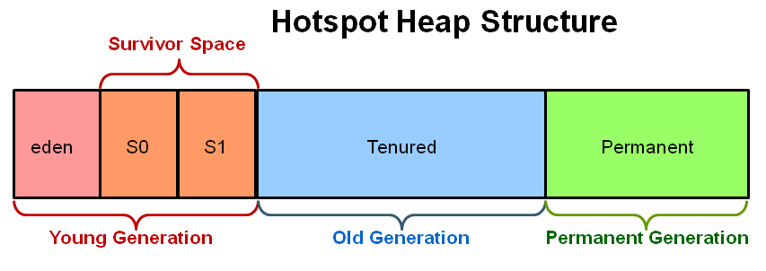
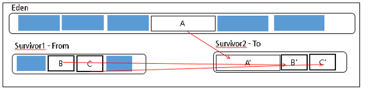
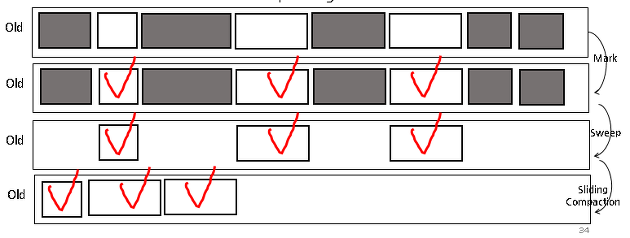

# JVM

- [JVM](#jvm)
  - [Architecture](#architecture)
  - [Heap Structure](#heap-structure)
    - [Constant Pool](#constant-pool)
  - [Garbage Collector](#garbage-collector)
    - [Minor GC, Major GC](#minor-gc-major-gc)
    - [Card Table](#card-table)
    - [Thread-Local Allocation Buffers](#thread-local-allocation-buffers)
    - [Stop the world](#stop-the-world)
  - [Garbage Collectors](#garbage-collectors)
    - [Serial Collector](#serial-collector)
    - [Parallel Collector](#parallel-collector)
    - [Parallel Compacting Collector](#parallel-compacting-collector)
    - [CMS (Concurrent Mark Sweep) Collector](#cms-concurrent-mark-sweep-collector)
    - [G1 Collector](#g1-collector)
  - [GC Tuning](#gc-tuning)
    - [Out Of Memory (OOM) Error](#out-of-memory-oom-error)
    - [JVM Crash](#jvm-crash)
  - [Reference](#reference)

## Architecture

- ClassLoader : class 파일을 로딩
- Execution Engine : class 파일을 실행
- Runtime Data Area : JVM process가 OS로부터 할당받은 memory 영역
  - Method Area : class, method, static 변수 등이 저장
  - Heap Area : 객체 instance 저장
  - Stack Area : method stack의 지역변수들을 저장, Thread별로 생성
  - PC Registers : Program Counter Registers, Thread별로 다음에 실행될 명령어의 주소를 저장
  - Native Method Stack : c/c++ 등의 native method에 대한 stack

## Heap Structure

- Young Generation
  - Minor GC Target
  - Eden : 최초로 할당되는 영역
  - Survivor : GC 몇번 해도 살아남으면 eden에서 promotion
- Old Generation
  - Major GC Target
  - Survivor에서 GC 몇번 살아남으면 promotion
- Perm
  - Class metadata, method metadata, static 변수 상수 저장
  - 1.8부터 Metaspace로 변경되어서 더 커짐, static 변수 상수를 heap으로 이동

### Constant Pool

- 똑같은 값의 경우 같은 인스턴스를 가리키는 식으로 Constant pool을 만듬
- String 같은 경우 이럼

## Garbage Collector

- 사용되지 않는 Object를 제거하는 과정. 메모리가 부족할 때 일어남
- RootSet에서 reference를 통해 도달할 수 없는 객체들을 (Unreachable Object) 제거
- Root Set 조건
  - JVM 스택 내의 Local variable, Operend Stack가 참조하는 Object
  - Constant Pool이 참조하는 Object
  - JNI애 의해 생성된 객체가 참조하는 Object

### Minor GC, Major GC

- Minor GC : Young Generation에 대해서 GC를 수행하는 것
- Major GC : Old Generation에 대해 GC를 수행하는 것

### Card Table

- Minor GC를 할 때 Old Generation이 참조하면 GC의 대상이 되서는 안된다
- 그런데 그렇다고 Old Generation을 전부 파보기에는 너무 많다
- 그래서 이를 Mark해두자! 한게 Card Table로 Old Generation 내에 존재하는 메모리 구조임
- Minor GC를 수행할 때 Card Table만 보면 Young Generation에서 제거해야 할 대상을 빠르게 할 수 있음

### Thread-Local Allocation Buffers

- Multi Thread가 동시에 메모리를 요청하면 Lock을 걸어야 해서 병목이 발생할 수 있음
- 스레드별로 각자 영역을 할당받으면 동시에 할당받는게 가능. 이것이 TLAB
- Young Generation의 Fast Allocation을 위한 것.

### Stop the world

GC를 하기 위해 JVM이 멈추는 것. 이 시간을 Suspend time이라고 부름.

## Garbage Collectors

### Serial Collector

- Young Generation : Serial Copy Algorithm
- Old Generation : Serial Mark-Sweep-Compaction

### Parallel Collector

- Young Generation : **Parallel Copy Algolrithm**
  - Multi Thread가 Old Generation 으로의 Promition과정에서 동시에 접근하는 것을 막기 위해서 Thread별로 영역을 할당
  - 이를 PLAB (Parallel Local Allocation Buffer)라고 부름
- Old Generation : Serial Mark-Sweep-Compaction

### Parallel Compacting Collector

- Young Generation : Parallel Copy Algoritim
- Old Generation : **Parallel Mark-Summary-Compaction**
  - Mark : Multi Thread, Region별로 Live Object를 Marking
  - Summary : Single Thread, Region별로 Live Object의 Density에 따라 Dense Prefix를 설정
  - Compaction : Multi Thread, Dense Prefix이후의 주소에 있는 객체를 대상으로 Sweep & Compaction한 후 대상의 객체들을 왼편으로 몰아넣음
    - 계속 이러다 보면 주소의 왼쪽으로 갈수록 오래 살아남은 녀석이 있을 확률이 높게됨!

### CMS (Concurrent Mark Sweep) Collector

- Young Generation : Parallel Copy Algorithm
- Old Generation : **Concurrent-Mark-Sweep**
  - Initial Mark : Single Thread, Stop-the-world, ClassLoader에서 가장 가까운 객체만 찾음
  - Concurrent Mark : Single Thread, Initial Mark에서 찾은 객체가 Reference하는 것을 찾음. 다른 Thread와 같이 실행.
  - Remark : Multi Thread, Stop-the-world, Concurrent Mark에서 추가되거나 참조가 끊긴 객체를 확인
  - Concurrent Sweep : Single Thread, Unreachable Object를 sweep, No compaction. 다른 Thread와 같이 실행.
    - Compaction이 없기 때문에 Old Area의 빈 공간에 대한 Free List를 관리. Young Generation에서 승격된 것에 대해 Free List를 기반으로 할당.
- Pros
  - Low suspend time
- Cons
  - Memory와 Cpu를 많이 사용함
  - Free List를 기반으로 Young Generation에서 승격된 객체의 할당 위치를 찾는 것이 부하가 있음 (Compaction이 있다면 그냥 Old Generation에 바로 할당하면 됨)
  - Compaction이 기본적으로는 없기 때문에 Compaction 수행 시 stop-the-world가 더 길어질 수 있음

### G1 Collector

- Garbage First -> Heap을 Region단위로 나누어서 Garbage로 가득 차 있는 Region부터 GC를 수행
- CMS에 비해 GC의 단위가 작기 때문에 stop-the-world시간이 짧고 stop-the-world도 그 region을 사용하는 곳에서만 일어남

## GC Tuning

Old area로 넘어가는 Object를 최소화

### Out Of Memory (OOM) Error

heap dump떠서 뭐가 많이 차지하는지 확인

### JVM Crash

JVM이 그냥 죽어버리는 것...

## Reference

GC들

https://blog.embian.com/68

https://d2.naver.com/helloworld/1329

https://www.slideshare.net/ssuserb77a05/garbage-collection-20150213-44717452

Java Reference와 GC

https://d2.naver.com/helloworld/329631