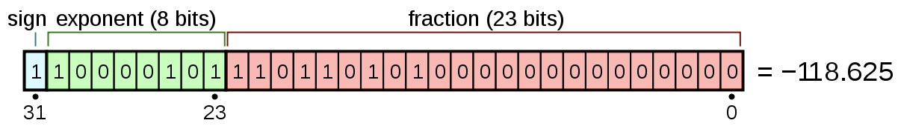

# Number Representation

- [Representation](#representation)
  - [Binary Representation](#binary-representation)
  - [Sign and Magnitude](#sign-and-magnitude)
  - [One's complement (1의 보수)](#ones-complement-1의-보수)
  - [Two's complement (2의 보수)](#twos-complement-2의-보수)
  - [Fixed-point Number](#fixed-point-number)
  - [Floating-point Number](#floating-point-number)
- [Number Display](#number-display)
  - [Binary](#binary)
  - [Base-8 (Octal)](#base-8-octal)
  - [Base-16 (hex)](#base-16-hex)
- [Reference](#reference)

## Representation

### Binary Representation

- 컴퓨터는 bit로 이루어져 있음. bit는 on과 off의 상태를 가짐. 이를 활용하여 1 (on)과 0 (off)를 사용하여 2진법으로 수를 표현.
- n bit로는 0 ~ 2^n 까지 표현 가능.
  - eg. 32 bit (int) -> 0 ~ 2^32 까지 표현.

### Sign and Magnitude

- 2진법으로 수를 표현했어, 그러면 음수를 어떻게 표현할까? 단순하게 제일 왼쪽 bit를 부호 비트로 사용하고 나머지를 수 자체를 표현하는데 사용해보자.
  - eg. 1010 -> -2, 1101 -> -5
- 그러면 n bit 의 경우 -(2^(n-1) - 1) ~ 2^(n-1) - 1 만큼 표현이 가능.
- 그런데 이건 문제점이 있음. 양수랑 음수를 더할 때 직관적으로 그냥 더하면 안됨. 특정한 로직이 필요함.
  - eg. 0010 (2) + 1001 (-1) -> 1011 ????  (1이 되어야 하는데 -3이 나옴)

### One's complement (1의 보수)

- Sign and Magnitude를 사용하면 양수랑 음수를 더할 때 쉽지 않음. 이걸 덧셈만 해서 할 수 있게 못할까?
- 음수를 표현할 때 bitwise NOT 연산을 해서 표현해보자.
  - eg. 0001 (1) -> 1110 (-1)
- 여전히 범위는 n bit 의 경우 -(2^(n-1) - 1) ~ 2^(n-1) - 1 만큼 표현이 가능.
- 그러면 양수랑 음수를 더할 때 비교적 간단해진다.
  - eg. 0010 (2) + 1110 (-1) -> 1 0000 (1 carry, carry를 더해) -> 0001 (1)

### Two's complement (2의 보수)

- 1의 보수도 좋음. 그런데 0을 0000, 1111의 두개로 표현할 수 있고 더할 때 carry bit을 더해줘야 한다는 문제점이 있음.
- 에초에 1의 보수에 1을 더한거로 음수를 표현해보는건 어떨까?
  - eg. 0001 (1) -> 1110 (1의 보수로 -1) -> 1111 (2의 보수로 -1)
- 덧셈이 매우 직관적이고 간단해짐.
  - eg. 0010 (2) + 1111 (-1) -> 1 0001 (1 carry, carry는 버림) -> 0001 (1)
- 이러면 Sign and Magnitude와는 다르게 0도 두개가 아니게 됨 (Sign & Magnitude는 0000 1000의 두개의 0, 1의 보수는 0000, 1111의 2개의 0)
- 그러면 범위는 음수를 표현할 수 있는게 한개 더 추가 되어서 n bit 의 경우 -(2^(n-1)) ~ 2^(n-1) - 1 만큼 표현이 가능.  
  (1000이 -8을 표현 가능 1000 -> 0111 -> 1111)
- 참고로 2의 보수에서 음수 표현은 해당 표현수의 최대 범위까지의 거리를 의미
  - eg. 1010 (-6) : 부호 bit 1 제외하고 0010 (2)는 -8에서 2만큼 떨어져 있음.

### Fixed-point Number

- 자 정수는 표현 했으니 이제 실수를 표현해봐야지?

todo

### Floating-point Number

- 컴퓨터에서 고정소수점보다 많은 실수를 표현하려고 창안됨
- 32 bit : 1 bit 의 부호 + 8 bit의 지수 + 23 bit의 가수
- 장점 : 적은 메모리 공간으로 많을 실수를 표현 가능
- 단점 : 정밀도의 문제. 0.1은 사실 0.100000000xxxx 임

## Number Display

### Binary

- 0과 1의 두개로만 표현.

### Base-8 (Octal)

- 0~7의 7개의 숫자로 표현.
- eg. 10 -> 12 (1*8^1 + 2*8^0)

### Base-16 (hex)

- 0~9, A~F의 16개의 문자로 숫자를 표현.
- eg. 14 -> 0x0E, 22 -> 0x16 (1*16^1 + 2*16^0)

## Reference

- [Computer number format (wiki)](https://en.wikipedia.org/wiki/Computer_number_format)
- [Signed number representations (wiki)](https://en.wikipedia.org/wiki/Signed_number_representations)
- [Ones' complement (wiki)](https://en.wikipedia.org/wiki/Ones%27_complement)
- [Two's complement (wiki)](https://en.wikipedia.org/wiki/Two%27s_complement#Why_it_works)
- [Representing Numbers in Computers (technologyuk)](https://www.technologyuk.net/mathematics/about-numbers/representing-numbers-in-computers.shtml)
- [Why prefer two's complement over sign-and-magnitude for signed numbers? (stackoverflow)](https://stackoverflow.com/questions/1125304/why-prefer-twos-complement-over-sign-and-magnitude-for-signed-numbers)
- [Advantage of 2's complement over 1's complement? (stackoverflow)](https://stackoverflow.com/questions/11054213/advantage-of-2s-complement-over-1s-complement)
- [Fixed-point arithmetic (wiki)](https://en.wikipedia.org/wiki/Fixed-point_arithmetic)
- [Single-precision floating-point format (wiki)](https://en.wikipedia.org/wiki/Single-precision_floating-point_format)
- [Double-precision floating-point format (wiki)](https://en.wikipedia.org/wiki/Double-precision_floating-point_format)
- [Why are floating point numbers used often in Science/Engineering? (softwareenginnering)](https://softwareengineering.stackexchange.com/questions/260566/why-are-floating-point-numbers-used-often-in-science-engineering)

