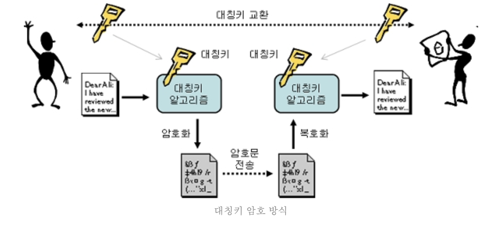
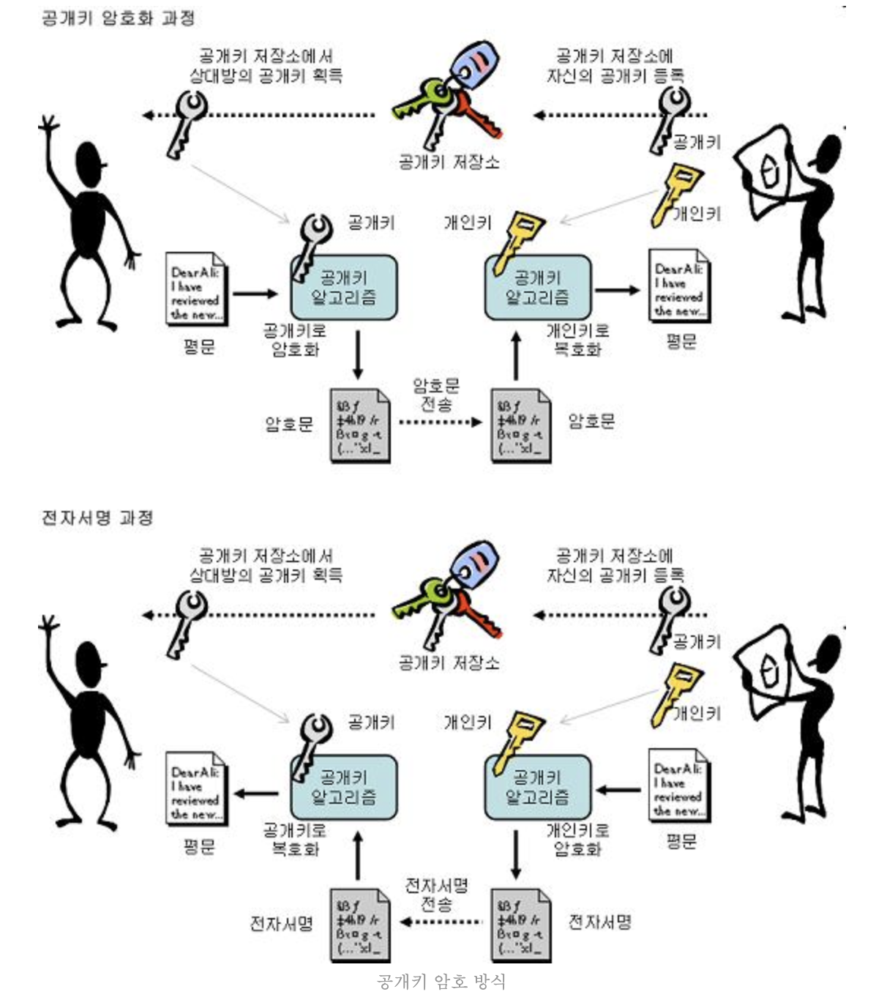

# Cryptography

- [Symmetric Key Cryptography](#symmetric-key-cryptography)
- [Public Key Cryptography](#public-key-cryptography)
  - [ECDSA](#ecdsa)
- [MAC](#mac)
  - [HMAC](#hmac)
- [References](#references)

## Symmetric Key Cryptography

- 동일한 키로 암호화/복호화를 하는 방식
- 장점 : 계산속도가 비대칭키보다 빠름
- 단점 : 비밀키 하나만 알아내면 해독 가능
- AES, DES등이 있음

## Public Key Cryptography

- 비대칭 키 암호화 방식. 한개의 키로 암호화를 하면 다른 키로 복호화를 함
- 보내는 쪽이 공개키를 통해 암호화를 하면 받는 쪽은 개인키를 통해 복호화를 해서 사용하는 식
- 개인키로 암호화를 할 때도 공개키로 풀 수 있음. But 공개키는 공개되어 있기 때문에 암호로써의 효용성이 없음. 하지만 특정 공개키로만 풀 수 있기 때문에 누가 암호화를 했는지는 알 수 있고 그래서 그래서 서명 (signature)으로 쓰임. 블록체인의 서명도 이런 원리임
- RSA, DSA, ECDSA 등이 있음

### ECDSA

- Elliptic Curve (타원곡선, y^2 = x^3 + ax + b)에 기반한 공개키 암호화 방식
- 장점 : 짧은 키로 RSA와 동일한 수준의 암호화를 가능
- 단점 : PrivateKey가 짧아서 품질이 떨어지는 난수 생성기를 사용하면 예측가능할 수 있음

## MAC

- Message Authentication Code.
- message 자체의 인증을 위해 사용되는 작은 data.
- 송신자는 수신자와 공유하고 있는 key와 message를 혼합해서 mac 값을 만들고 이를 message와 함께 전송. 수신자는 공유하고 있는 key와 message를 통해 mac 값을 계산해서 message위 위/변조를 확인하는 것.

### HMAC

- Hash-based Message Authentication Code
- MAC의 일종으로 MAC 계산을 Hash로 하면 HMAC임.

## References

- [대칭키, 공개키](https://cryptocat.tistory.com/2)
- [Message authentication code (wiki)](https://en.wikipedia.org/wiki/Message_authentication_code)
- [What is the difference between MAC and HMAC? (stackexchange)](https://crypto.stackexchange.com/questions/6523/what-is-the-difference-between-mac-and-hmac)
