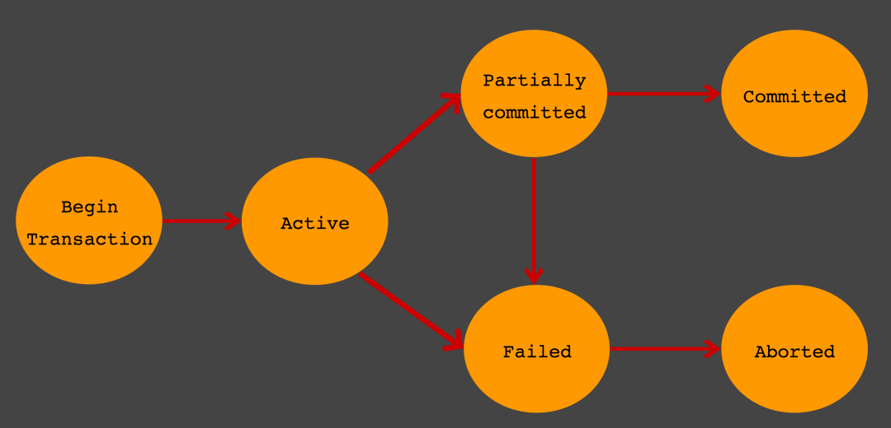

# Sql Advanced
- [Transaction](#transaction)
  - [Pattern](#pattern)
  - [ACID](#acid)
  - [Transaction Status](#transaction-status)
- [Record Lock](#record-lock)
  - [Exclusive Lock](#exclusive-lock)
  - [Shared Lock](#shared-lock)
  - [Deadlock](#deadlock)
    - [Transaction Deadlock](#transaction-deadlock)
  - [Two-phase Locking (2PL)](#two-phase-locking-2pl)
- [Read Phenomena](#read-phenomena)
  - [Dirty Reads](#dirty-reads)
  - [Non-repeatable reads](#non-repeatable-reads)
  - [Phantom reads](#phantom-reads)
- [Isolation Levels](#isolation-levels)
  - [READ UNCOMMITTED](#read-uncommitted)
  - [READ COMMITTED](#read-committed)
  - [REPEATABLE READS](#repeatable-reads)
  - [SERIALIZABLE](#serializable)
- [Lock vs Transaction](#lock-vs-transaction)
- [Optimistic Lock (낙관적 락) vs Pessimistic Lock (비관적 락)](#optimistic-lock-낙관적-락-vs-pessimistic-lock-비관적-락)
- [Reference](#reference)

## Transaction

- A unit of work performed within a database management system.
- Purpose
  - To provide reliable units of work that allow correct recovery from failures and **keep a database consistency**.
  - To provide isolation between programs accessing a database concurrently.
- Pros
  - All or nothing이라서 한개가 에러가 발생하면 rollback함
- Cons
- transaction 하는 동안 connection을 계속 점유하기 때문에 과도하게 사용하면 connection pool이 남아나지 않음.

eg. Dobule-entry accounting.

```text
Debit $100 to Groceries Expense Account
Credit $100 to Checking Account

-> both entries should pass or fail.
```

### Pattern

1. Begin the transaction.
2. Execute a set of data manipulations and/or queries.
3. If no error occurs, then commit the transaction.
4. If an error occurs, then roll back the transaction.

### ACID

Transaction이 가지는 속성

- Atomicity (원자성)
  - 여러 개의 statement가 전부 성공하거나 전부 실패해야 함.
- Consistency (일관성)
  - Transaction 전후 한 db의 상태가 invariant를 지키는 선에서 바뀌어야 함.
  - eg. primary key - foreign key 참조무결성을 지켜야 함.
- Isolation (고립성)
  - 여러 개의 transaction가 동시에 수행되어도 격리가 되어서 순차적으로 수행되는거랑 결과가 같아야 함.
  - Isolation level에 따라 서로 어느정도 격리를 할건지가 결정.
- Durability (지속성)
  - Tx가 종료된 후 system failure와 상관 없이 결과가 저장되어야 함.
  - 즉, non-volatile memory에 결과가 저장되어야 함.

### Transaction Status



- Active : 활동 상태
- Partial Committed
  - 트랜잭션의 `Commit` 명령이 도착한 상태. `commit`이전 `sql`문이 수행되고 `commit`만 남은 상태
  - `Commit`을 문제없이 수행할 수 있으면 `Committed` 상태로 전이, 오류가 발생하면 `Failed` 상태가 됨
- Committed : Commit 완료
- Failed : Commit 실패
- Aborted : 트랜잭션이 취소되고 Rollback된 상태

## Record Lock

- The technique of preventing simultaneous access to data in a database, to prevent inconsistent results.
- ACID의 Isolation을 구현하기 위해 사용.

### Exclusive Lock

- 보통 record writing을 위해 한번에 한개의 lock holder만 lock을 잡을 수 있게 하는 것.
- Write lock

### Shared Lock

- 여러 개의 lock holder가 동시에 같은 데이터를 읽는 것을 보증하기 위해 record가 변경되지 않게하는 lock.
- Exclusive locks cannot be obtained when a record is already locked (exclusively or shared).
- Read lock.

### Deadlock

Deaclock 조건.

- Mutual exclusion : only one process at a time can use the resources.
- Hold and wait or resource holding : A process is currently holding at least one resource and requesting additional resources which are being held by other processes.
- No preemption : 선점 불가.
- Circular wait : Wait하는거 사이에 cycle이 있어야 함.

#### Transaction Deadlock

- Transaction 1이 table B에 insert하고 Transaction 2가 table A에 insert. 이 때 Transaction1은 B에 대한 lock을 소유, Transaction2는 A에 대한 Lock을 소유
- 그러고 Transaction 1이 table A에 insert하고 Transaction 2가 table B에 insert하면 lock을 얻지 못해서 deadlock 발생

```SQL
Transaction 1> start transaction; insert into B values(1);
Transaction 2> start transaction; insert into A values(1);

Transaction 1> insert into A values(1);
Transaction 2> insert into B values(1);

ERROR 1213 (40001): Deadlock found when trying to get lock; try restarting transaction
```

### Two-phase Locking (2PL)

- In transaction processing, 2PL is a concurrency control method that guarantees serializability.
- Locks are applied and removed in two phases
  1. Expanding phase: locks are acquired and no locks are released.
  2. Shrinking phase: locks are released and no locks are acquired.
- Deadlock을 일으킬 수 있음.

## Read Phenomena

- The ANSI/ISO standard SQL 92 refers to three different read phenomena when Transaction 1 reads data that Transaction 2 might have changed.

### Dirty Reads

- 다른 transaction에서 commit 되지 않는 data를 읽어서 나타나는 현상.

### Non-repeatable reads

- 한 transaction에서 두번 데이터를 읽었는데 두개의 데이터가 다른 현상.
- read lock이 select를 할 때 일어나지 않거나 select를 하고 read lock을 release 해서 다른 trasaction이 commit을 하는 경우 두번 읽었을 때 다르게 데이터가 나옴.

### Phantom reads

- tx가 진행되는 동안 다른 tx에서 new row가 added되거나 removed되어서 두번 읽는 경우 다르게 읽게 되는 현상.

## Isolation Levels

- Determines how transaction integrity is visible to other users and systems.
- 격리 수준이 낮을 수록 concurrency로인해 이상하게 읽는 상황이 많아짐. 반대로 높아질 수록 concurrency로 인해 이상하게 읽는 상황은 적어지지만 자원을 많이 소모하고 한 transaction이 다른 transaction을 block할 확률이 높아짐.
- Isolation Level은 ANSI/ISO 에 정의되어 있음.

### READ UNCOMMITTED

- commit되지 않은 데이터도 읽는 격리 수준.
- Read Phenomena
  - Dirty read : o
  - Non-repeatable reads : o
  - phantom read : o

### READ COMMITTED

- select된 데이터에 대해서 write lock은 유지하지만 read lock은 select를 하고 나서 release함.
- transaction이 진행되는 동안 다른 tx가 commit을 하는 경우 Non-repeatable reads는 발생 가능.
- Read Phenomena
  - Dirty read : x
  - Non-repeatable reads : o
  - phantom read : o

### REPEATABLE READS

- transaction이 진행되는 동안 read, write lock을 유지해서 동일한 data를 계속 읽는 것을 보장하는 것.
- range lock은 여전히 미사용해서 phantom read는 발생 가능.
- Read Phenomena
  - Dirty read : x
  - Non-repeatable reads : x
  - phantom read : o

### SERIALIZABLE

- tx가 진행되는 동안 read, write lock을 유지해서 동일한 data를 계속 읽는 것을 보장하는 것.
- `SELECT ... WHERE`을 사용하는 range lock도 걸어서 phantom read도 방지.
- Read Phenomena
  - Dirty read : x
  - Non-repeatable reads : x
  - phantom read : x

## Lock vs Transaction

- Lock
  - 동시성을 제어하는 기술.
- Transaction
  - 데이터의 정합성을 보장하는 기술.
  - transaction을 수행할 때 lock을 걸기도 함.

## Optimistic Lock (낙관적 락) vs Pessimistic Lock (비관적 락)

- Optimistic Lock
  - tx가 시작될때는 안걸고 data가 변경될 때만 lock을 거는 방법.
  - Application level에서 잡아주는 lock으로 version column을 where 조건에 사용해서 updated rows가 0건이면 다른 녀석이 수정했다고 보고 에러를 발생시키는 것.
  - [eg. spring-batch JdbcStepExecutionDao](https://github.com/spring-projects/spring-batch/blob/main/spring-batch-core/src/main/java/org/springframework/batch/core/repository/dao/JdbcStepExecutionDao.java#L248-L291)
- Pessimistic Lock
  - tx가 시작될 때 lock을 걸어서 동시에 수정 자체를 막아버리는 것.

## Reference

- [Database transaction (wiki)](https://en.wikipedia.org/wiki/Database_transaction)
- [ACID (wiki)](https://en.wikipedia.org/wiki/ACID)
- [Record locking (wiki)](https://en.wikipedia.org/wiki/Record_locking)
- [Two-phase locking (wiki)](https://en.wikipedia.org/wiki/Two-phase_locking)
- [Isolation (wiki)](https://en.wikipedia.org/wiki/Isolation_(database_systems))
- [Optimistic Lock과 Pessimistic Lock (코딩하는 오징어)](https://effectivesquid.tistory.com/entry/Optimistic-Lock%EA%B3%BC-Pessimistic-Lock)
- [A Critique of ANSI SQL Isolation Levels, (Microsoft Corp Research)](https://www.microsoft.com/en-us/research/wp-content/uploads/2016/02/tr-95-51.pdf)
