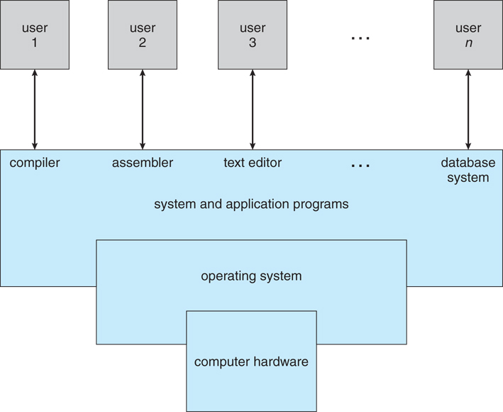
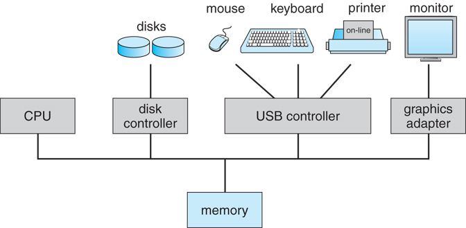
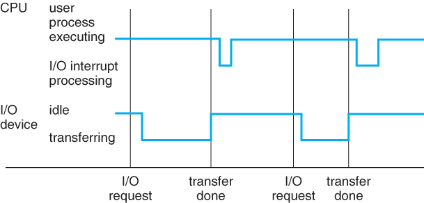
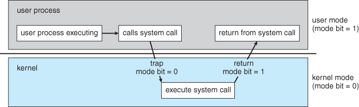
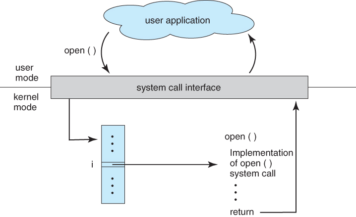
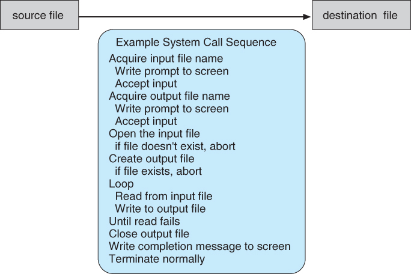

# Overview

- [Role of Operating System](#role-of-operating-system)
- [Computer-System Operation](#computer-system-operation)
- [User Mode, Kernel Mode](#user-mode-kernel-mode)
- [System Call](#system-call)
- [System Call when copying file.](#system-call-when-copying-file)
- [Type of System Call](#type-of-system-call)
- [Practice](#practice)
- [Reference](#reference)

## Role of Operating System

- Operating System은 hardware와 사람 사이에서 사람이 hardware resource를 잘 쓸 수 있게 해주는 역할을 함.
- 보통 항상 떠있는 Kernel을 운영체제 프로그램이라고 하긴 하는데 vender사가 제공해주는 것들도 운영체제에 포함시켜야 하는지에 대한 논쟁이 있음.

## Computer-System Operation

- CPU와 여러 Device와 Device Controller들이 공통된 bus로 메모리와 연결된 형태.
- 컴퓨터가 커지면 bootstrap program이 load되고 init process 같은 것을 띄우고 나서 event를 기다림.
- event는 interrupt의 형태로 다른 hardware에 의해서나 system call을 통해 발생함.

## User Mode, Kernel Mode

- process가 오동작 했을 경우 다른 곳에 영향을 끼치는걸 방지하기 위해 hardware에 dual mode를 추가해서 사용.
- Hardware가 User Mode에서 user process를 실행. User process가 System call을 하면 Kernel Mode로 가서 system call을 처리.

## System Call

- os의 커널이 제공하는 서비스에 대해 application program의 요청에 따라 커널에 접근하기 위한 interface. 
- System Call Interface는 API를 해석해서 적절한 system call을 해줌. 보통 system call에는 number가 있는데 system call interfaces는 이걸 테이블의 형태로 관리.

## System Call when copying file.

- 파일 복사를 한번 하려고해도 엄청난 system call이 일어남.

## Type of System Call

- Process control
  - end, abort
  - load, execute
  - create process, terminate process
  - get process attributes, set process attributes
  - wait for time
  - wait event, signal event
  - allocate and free memory
- File management
  - create file, delete file
  - open, close
  - read, write, reposition
  - get file attributes, set file attributes
- Device management
  - request device, release device
  - read, write, reposition
  - get device attributes, set device attributes
  - logically attach or detach devices
- Information maintenance
  - get time or date, set time or date
  - get system data, set system data
  - get process, file, or device attributes
  - set process, file, or device attributes
- Communications
  - create, delete communication connection
  - send, receive messages
  - transfer status information
  - attach or detach remote devices

> programming language의 api도 이런 형식으로 정리해볼까?

## Practice

- System Call
  - [file-copy](./os-practice/file-copy.c)

## Reference

- Operating System Concepts (Operating System Concepts, Ninth Edition)
  - [Introduction](https://www.cs.uic.edu/~jbell/CourseNotes/OperatingSystems/1_Introduction.html)
  - [Structures](https://www.cs.uic.edu/~jbell/CourseNotes/OperatingSystems/2_Structures.html)