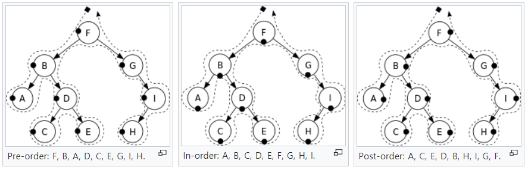

# Tree and Graph

## Depth First Search
 
### Tree

```java
protected void dfs(final TreeNode node, final List<List<Integer>> ret, final int depth) {
  // check arguments
  if (null == node) {
    return;
  }
  
  // do something
  if (ret.size() <= depth) {
    ret.add(new LinkedList<>());
  }
  ret.get(depth).add(node.val);
  
  // visit next
  dfs(node.left, ret, depth + 1);
  dfs(node.right, ret, depth + 1);
}
```
 
## Breath First Search

## Tree Traversal



pre, in, post means when to visit node.

- Pre-order: node -> left child -> right child
- In-order: left child -> node -> right child
- Post-order: left child -> right child -> node
