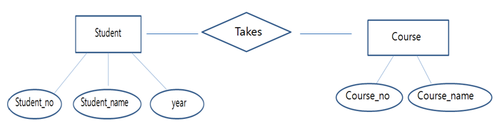
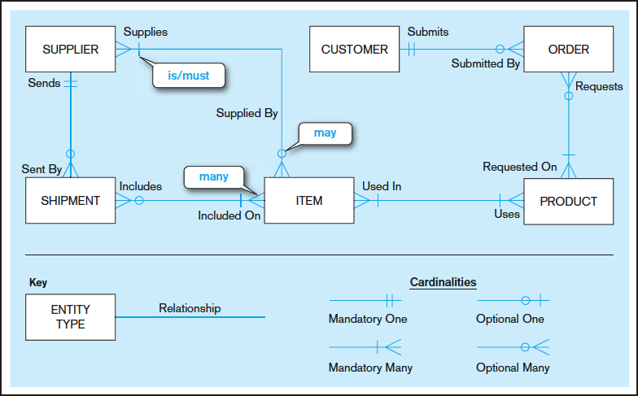
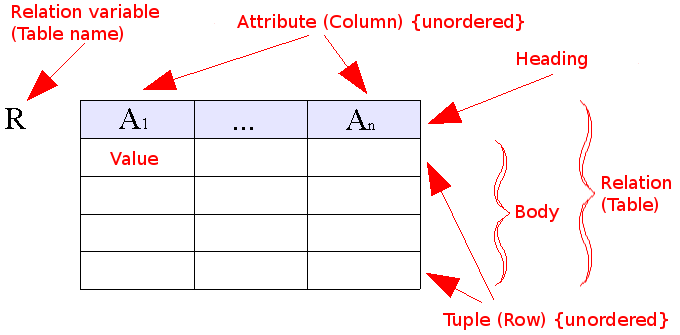
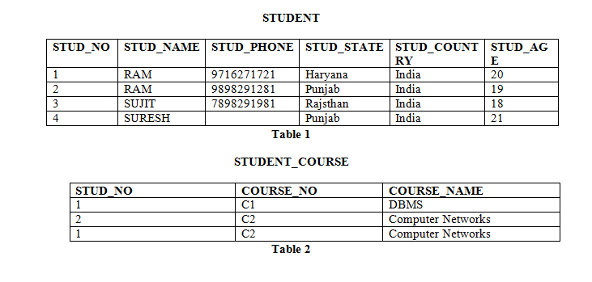
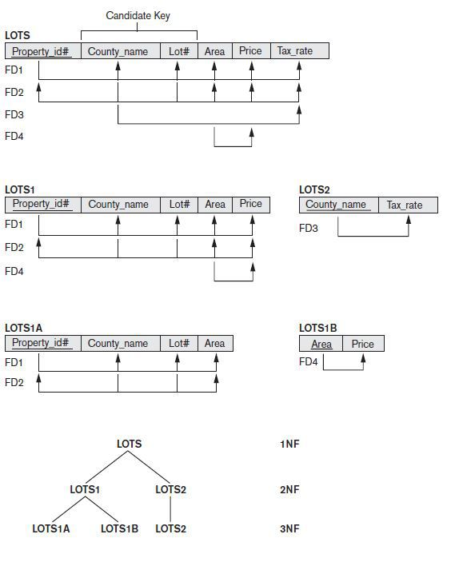
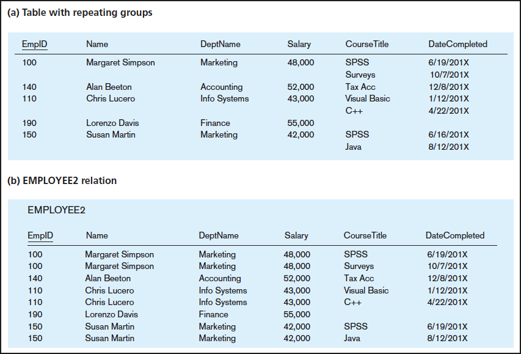
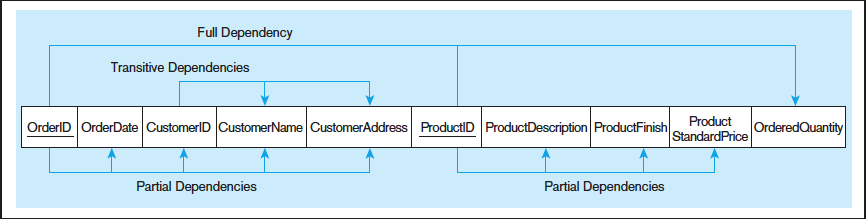
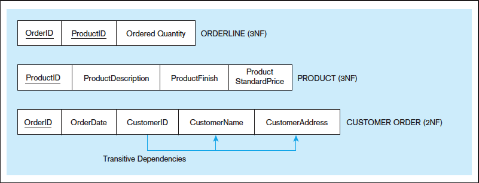
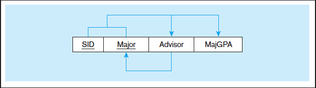
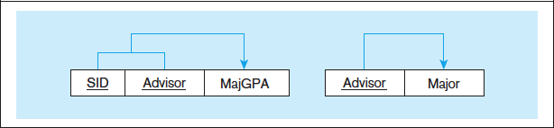

# Database Concept

- [Database](#database)
- [Advantages over File system](#advantages-over-file-system)
- [Model](#model)
  - [Entity-Relational Model](#entity-relational-model)
  - [Entity-Relational Diagram](#entity-relational-diagram)
  - [Relation Model](#relation-model)
    - [Type of Keys](#type-of-keys)
- [Normalization](#normalization)
  - [Functional Dependency](#functional-dependency)
  - [Anomaly (이상현상)](#anomaly-이상현상)
  - [1NF](#1nf)
  - [2NF](#2nf)
  - [3NF](#3nf)
  - [BCNF](#bcnf)
- [CAP](#cap)
- [Replication](#replication)
- [Clustering](#clustering)
- [Partitioning](#partitioning)
- [Sharding](#sharding)
- [Partitioning vs Sharding](#partitioning-vs-sharding)
- [Etc](#etc)
  - [ORM](#orm)
    - [N+1 Problem](#n1-problem)
  - [Connection Pool](#connection-pool)
  - [Statement vs PreparedStatement](#statement-vs-preparedstatement)
- [References](#references)

## Database

- 데이터를 효율적으로 관리할 수 있게 테이블, 스키마 등을 사용해서 관계를 맺은 데이터들의 집함.
- 이러한 database를 관리하는 프로그램을 DBMS (DataBase Management System)이라고 함.

## Advantages over File system

- Data redundancy and inconsistency.
- Data sharing.
- Data concurrency.
- Data searching.
- ...

## Model

### Entity-Relational Model

- data를 논리적 관계를 표현하는 model.
- **Conceptual model**.
- Terms
  - Entity : 단독으로 존재하는 개체
  - Entity Type : Entity들의 집합. 네모로 표현.
  - Attribute : Entity가 갖는 속성. 원으로 표현.
  - Relation : Entity Type간의 관계. 마름모로 표현.

### Entity-Relational Diagram

- 보통 Entity-Relation Model을 표현하는 방법.

### Relation Model

- The purpose of the relational model is to provide a declarative method for specifying data and queries.
- **Implementation model**.

#### Type of Keys

- Candidate Key (후보키)
  - Tuple을 유일하게 식별할 수 있는 최소한의 속성들의 집합
  - eg. STUD_NO
- Super Key (슈퍼키)
  - Tuple을 유일하게 식별할 수 있는 속성들의 집합.
  - 모든 Candidate key는 Super key이지만 모든 Super key가 Candiate Key는 아님.
  - eg. STUD_NO, (STUD_NO, STUD_NAME), ...
- Primary Key (기본키)
  - Candiate key 중에서 선택한 키.
- Alternative Key (대체키)
  - Candiate가 2개 이상일 때 Primary key를 제외한 나머지 Candiate key들.
- Foreign Key (외래키)
  - attribute가 다른 relation의 attribute에 있는 값들로만 이루어질 수 있는 경우.
  - eg. STUDENT_COURSE의 STUD_NO

## Normalization

- 데이터의 중복을 최소화하게 데이터를 구조화하는 프로세스. 주로 함수적 종속으로 정의.
- Pros
  - 데이터의 중복 저장을 제거해서 데이터를 효율적으로 저장.
- Cons
  - query를 할 때 join을 해야 함. 그래서 query리 성능 저하가 심하게 발생하면 비정규화(De-normalization)를 해서 일부 중복을 허용하기도 함.

### Functional Dependency

- X 와 Y가 attribute 일 때, X 값이 Y 값을 유일하게 결정하는 경우 X -> Y로 함수적 종속이 있다고 함.

### Anomaly (이상현상)

- 정규화를 수행하지 않으면 데이터의 중복이 발생하고 데이터 이상현상이 발생할 수 있음.
  - Insert anomaly : 원하는 정보만 테이블에 넣고 싶은데 필요하지 않는 속성들 때문에 원치 않는 속성값에 대해서도 삽입해야 하는 경우.
  - Deletion anomaly : 원하는 정보만 삭제하고 싶은데 하나의 tuple이 삭제를 원하지 않는 속성값도 가지고 있어서 같이 지워지는 현상.
  - Modification anomaly : 데이터를 업데이트 했는데 정상적으로 변경되지 않거나 너무 많은 데이터가 변경되는 경우.

### 1NF

- 모든 값이 atomic value 구성. 즉, 속성에 ',' 같은거 넣으면 안됨.
- Repeating group을 다 분리해서 해결.

### 2NF

- 1NF 이면서 **No Partial Dependency**.
- Partial Dependency란 기본키의 일부에 종족적인 속성이 있는 경우를 의미 (eg. (X,Y)->Z일 때 X->Z가 있는 경우)
- 기본키의 일부에 종속적인 속성들을 다른 테이블로 분리해서 해결.

### 3NF

- 2NF 이면서 **No Transitive Functional Dependency**.
- Transitive Functional Dependency란 X가 primary key이고 Y가 primary key가 아닐 때 X->Y이고, Y->Z라서 X->Z가 되는 경우를 의미. 
- Y->Z를 다른 테이블로 분리해서 해결.

### BCNF

- 3NF 이면서 모든 X -> Y 의 모든 X가 candidate key인 경우.

## CAP

- 데이터베이스를 분산해서 관리하면 다음의 3개 중 2개 초과를 보장할 수 없음
  - Consistency : 분산된 데이터 간 동일한 시간에 조회하면 동일한 데이터를 얻는 것
  - Availability : 항상 이용가능한 것
  - Partition Tolerance  : 네트워크 장애가 발생해도 시스템이 정상적으로 운영되어야 함
- Partition Tolerance를 보장하면서
  - Concsistency를 보장하려면 네트워크 장애가 발생하면 기다려야함 (Availability 불만족)
  - Availability를 보장하려면 네트워크 장애가 발생해도 동작해야함. 그 서버에는 값이 다를 수 있음 (Consistency 불만족)
- 그렇다고 Partition Tolerance를 버리면 분산 하는 의미가 없음

## Replication

- 여러 개의 db를 master-slave 구조로 나눠서 master에는 write만, slave는 read만 처리하는 방식.
- Pros
  - 대부분의 db operation이 read이기 때문에 성능이 향상됨.
  - 비동기 방식으로 운영되어 지연 시간이 거의 없음.
- Cons
  - Node들 간의 데이터 동기화가 보장되지 않아서 일관성이 떨어질 수 있음.
  - Master node가 다운되면 복구가 번거로워짐.

## Clustering

- 여러 개의 db를 수평적인 구조로 구죽하여 동기 방식으로 데이터를 동기화 하는 방식.
- Active-Active, Active-Standby 등의 구조가 있음.
- Pros
  - Node들간 동기화를 해서 일관성 있는 데이터를 얻을 수 있음.
  - 1개의 node가 죽어도 손쉽게 failover 가능.
- Cons
  - 데이터를 동기화하는데 시간이 필요하므로 replication에 비해 성능이 떨어짐.
  - 장애가 일어난 경우 처리가 번거롭다.

## Partitioning

- data를 관리하기 쉬운 단위로 분리해서 저장하는 것.
- Pros
  - 데이터를 분산해서 저장해서 index 크기를 줄이는 등 성능 향상을 꾀할 수 있음.
- Cons
  - join 등을 할 때 비용이 증가.
  - node간 통신 비용도 증가.
- Horizontal partitioning
  - 비슷한 row들을 다른 테이블에 나누어서 저장하는 것 (eg. < 500까지는 여기, 500 이후부터는 저기)
  - 같은 형식의 스키마지만 엄밀히는 서로 다른 table에 저장.
  - 분리해서 저장함으로서 index 크기를 줄이는 등 성능 향상을 꾀할 수 있음.
- Vertical partitioning
  - column을 기준으로 데이터를 나누어서 다른 테이블에 저장하는 것.
  - 자주 사용하는 column을 분리하고 해서 성능 향상을 할 수 있음.

## Sharding

- Horizontal sharding
  - Horizontal partitioning의 일부로 같은 스키마를 사용해서 shard key 같은거에 따라 분산해서 저장하는 것.
  - Pros
    - 데이터를 분산해서 저장해서 성능 향상을 꾀할 수 있음.
  - Cons
    - 서로 다른 shard간 join이 어려움.
- Vertical sharding??
  - Vertical partitioning이랑 거의 동일하다고 볼 수 있는듯.

## Partitioning vs Sharding

- Partitioning은 보통 하나의 instnace에서 하고 Shading은 보통 여러 instance에서 함.

> Partitioning가 더 상위 개념이고 Sharding은 조금 구체적인 개념 아닐까?

## Etc

### ORM

- Object Relational Modeling
- db 패러다임과 oop 패러다임의 불일치를 해결해서 자동으로 mapping해주는 것.

#### N+1 Problem

- 쿼리 한번으로 N건의 데이터를 가져왔는데 원하는 데이터를 얻기 위해 N건의 데이터에 대해서 다시 반복해서 쿼리를 날리는 문제.

### Connection Pool

- db를 사용하는 client에서 Db와 미리 연결해 놓은 connection들을 pool에 저장해두고 client 요청이 오면 이를 빌려주었다가 사용 후 반납하는 방식.
- Pros
  - 불필요한 connection 연결과 해제를 자주 할 필요가 없어짐.
- Cons
  - pool size를 잘 관리해야 함.

### Statement vs PreparedStatement

- Statement
  - 매번 컴파일을 해서 실행
- PreparedStatement
  - 한번만 컴파일을 한 후 값을 변경해서 재사용
  - SQL Injection도 방지해 주고 더 빨라서 쓰는 것을 권장

## References

- Common
  - [dbms (geeksforgeeks)](https://www.geeksforgeeks.org/dbms)
- Model
  - [[DB이론] ER 모델( Entity Relation Model ) - 개념적 설계🐵 (victolee)](https://victorydntmd.tistory.com/126)
  - [Difference between ER Model and Relational Model (javapoint)](https://www.javatpoint.com/er-model-vs-relational-model)
  - [Difference Between E-R Model and Relational Model in DBMS (techdifference)](https://techdifferences.com/difference-between-e-r-and-relational-model-in-dbms.html)
  - [Relation Model (wiki)](https://en.wikipedia.org/wiki/Relational_model)
  - [ER Diagrams vs. ER Models vs. Relational Schemas (arctype)](https://arctype.com/blog/er-diagram/)
- Normalization
  - [wiki](https://en.wikipedia.org/wiki/Database_normalization)
  - [마곡 리더스 코딩](https://magok-leaders-coding.tistory.com/4)
- Replication, Clustering
  - [https://mangkyu.tistory.com/97 (망나니개발자)](https://mangkyu.tistory.com/97)
- Partitioning, Sharding
  - [Partition_(database) (wiki)](https://en.wikipedia.org/wiki/Partition_(database))
  - [Shard (database architecture) (wiki)](https://en.wikipedia.org/wiki/Shard_(database_architecture))
