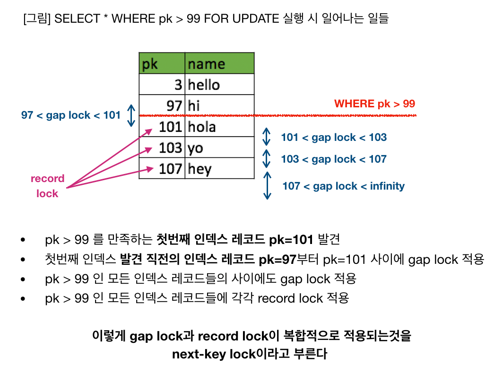

# MySQL InnoDB Transaction & Lock

- [InnoDB Locking](#innodb-locking)
  - [Shared and Exclusive Locks](#shared-and-exclusive-locks)
  - [Intention Locks](#intention-locks)
  - [Record Locks](#record-locks)
  - [Gap Locks](#gap-locks)
  - [Next-Key Locks](#next-key-locks)
  - [Insert Intention Locks](#insert-intention-locks)
  - [AUTO-INC Locks](#auto-inc-locks)
  - [Predicate Locks for Spatial Indexes](#predicate-locks-for-spatial-indexes)
- [MySQL Isolation Levels](#mysql-isolation-levels)
  - [READ UNCOMMITED](#read-uncommited)
  - [READ COMMITED](#read-commited)
  - [REPEATABLE READS](#repeatable-reads)
  - [SERIALIZABLE](#serializable)
- [Reference](#reference)

## InnoDB Locking

### Shared and Exclusive Locks

InnoDB는 Shared and Exclusive Locks 표준을 구현.

- If transaction T1 holds a shared (S) lock on row r, then requests from some distinct transaction T2 for a lock on row r are handled as follows:
  - A request by T2 for an S lock can be granted immediately. As a result, both T1 and T2 hold an S lock on r.
  - A request by T2 for an X lock cannot be granted immediately.
- If a transaction T1 holds an exclusive (X) lock on row r, a request from some distinct transaction T2 for a lock of either type on r cannot be granted immediately. Instead, transaction T2 has to wait for transaction T1 to release its lock on row r.

### Intention Locks

- InnoDB는 multiple granularity locking을 해서 table lock과 row lock이 공존할 수 있게 함. 이를 위해 intention lock을 함.
- Intention lock : the transaction **intends to** acquire on rows in the table.
  - An intention shared lock (IS) : a transaction intends to set a shared lock on individual rows in a table.
    - eg. `SELECT ... FOR SHARE`
  - An intention exclusive lock (IX) : a transaction intends to set an exclusive lock on individual rows in a table.
    - eg. `SELECT ... FOR UPDATE`
- Intention locks do not block anything except full table requests (eg. `LOCK TABLES ... WRITE`). The main purpose of intention locks is to show that someone is locking a row, or going to lock a row in the table.

### Record Locks

- A lock on an index record.
- eg. `SELECT c1 FROM t WHERE c1 = 10 FOR UPDATE` prevents any other transaction from inserting, updating, or deleting rows where the value of t.c1 is 10.
- Record locks always lock index records, even if a table is defined with no indexes. For such cases, InnoDB creates a hidden clustered index and uses this index for record locking.

### Gap Locks

- A lock on a gap between index records.
- eg. `SELECT c1 FROM t WHERE c1 BETWEEN 10 and 20 FOR UPDATE` prevents other transactions from inserting a value of 15 into column t.c1, whether or not there was already any such value in the column.
- 항상 gap lock을 거는건 아니고 해당 index가 unique row를 가리키면 index-record lock만 걸음. (multi column index에서 unique column만 사용하는 경우는 제외).
  - eg. `SELECT * FROM child WHERE id = 100`
    - id가 unique index인 경우 index-record lock
    - id가 index나 unique index가 아닌 경우 gap lock
- There is no difference between shared and exclusive gap locks. They do not conflict with each other, and they perform the same function.

### Next-Key Locks

- A combination of a record lock on the index record and a gap lock on the gap before the index record.
- 범위를 지정한 query를 수행하게 되면 조회된 record에 뿐만 아니라 index 사이 사이 gap lock도 잡힘. 이를 next-key lock이라고 부름.

### Insert Intention Locks

- INSERT 구문이 실행될 때 InnoDB 엔진 내부적으로 implicit하게 획득하는 특수한 형태의 gap lock. (gap lock은 일반적으로 explicit하게 locking read를 위한 SELECT 구문이 실행될때 발생하지만 이 lock은 INSERT 시점에 implicit하게 자동으로 발생)
- 여러개의 트랜잭션들이 gap 안의 다른 위치에 INSERT를 동시 수행할 때 기다릴 필요가 없도록 하는것이 목적 (Insert intention lock들 간에는 충돌이 일어나지 않는다)
- INSERT 될 row에 대해서 exclusive lock을 걸기 전에 먼저 insert intention lock을 건다.
- eg. index record 4, 7 존재, T1: 5 `INSERT`, T2: 6 `INSERT`
  - T1, T2 모두 `INSERT` 전에 4~7 사이에 implicit하게 Insert Intention Lock을 걸고 서로 다른 row에 insert하는 것을 확인하고 서로 대기시간 없이 `INSERT`

### AUTO-INC Locks

- table level lock으로 `AUTO_INCREMENT`를 사용하는 경우 transaction t1에서 insert를 하고 있는 경우 transaction t2에서 insert를 하고 싶을 경우 t1을 기다려야 함.

### Predicate Locks for Spatial Indexes

- Spatial index를 사용하는 경우 multidimensional data 상에서 어디가 next-key인지 알기 어려워서 next-key locking이 제대로 동작하지 않음. 
- 그래서 이를 해결하기 위해 minimum bounding rectangle (MBR)에 대한 predicate lock을 걸음.

## MySQL Isolation Levels

### READ UNCOMMITED

### READ COMMITED

### REPEATABLE READS

### SERIALIZABLE

## Reference

- [MySQL 8.0 reference, innodb-locking-transaction-model](https://dev.mysql.com/doc/refman/8.0/en/innodb-locking-transaction-model.html)
  - [MySQL reference, innodb-locking](https://dev.mysql.com/doc/refman/8.0/en/innodb-locking.html)
  - [MySQL reference, innodb-transaction-isolation-levels](https://dev.mysql.com/doc/refman/8.0/en/innodb-transaction-isolation-levels.html)
- [MySQL InnoDB lock & deadlock 이해하기](https://www.letmecompile.com/mysql-innodb-lock-deadlock/)