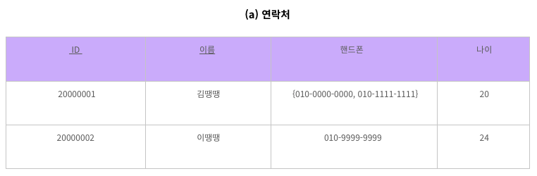
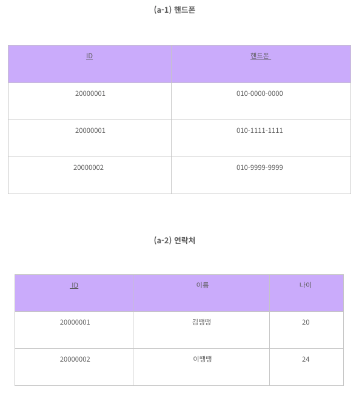
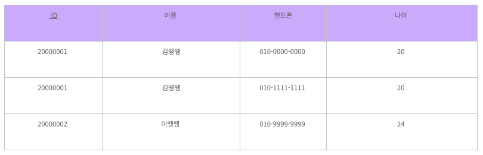
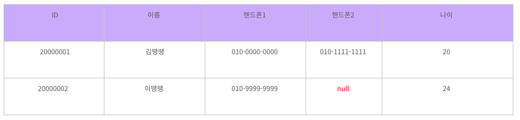
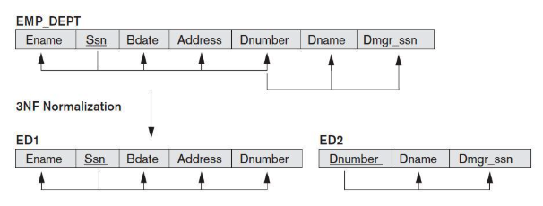
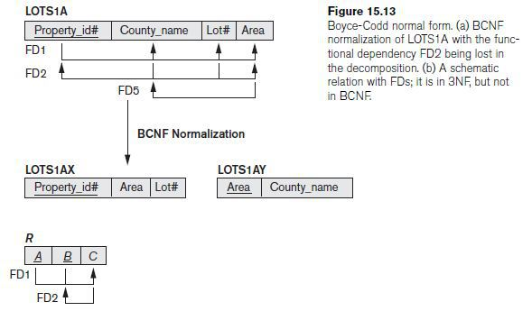
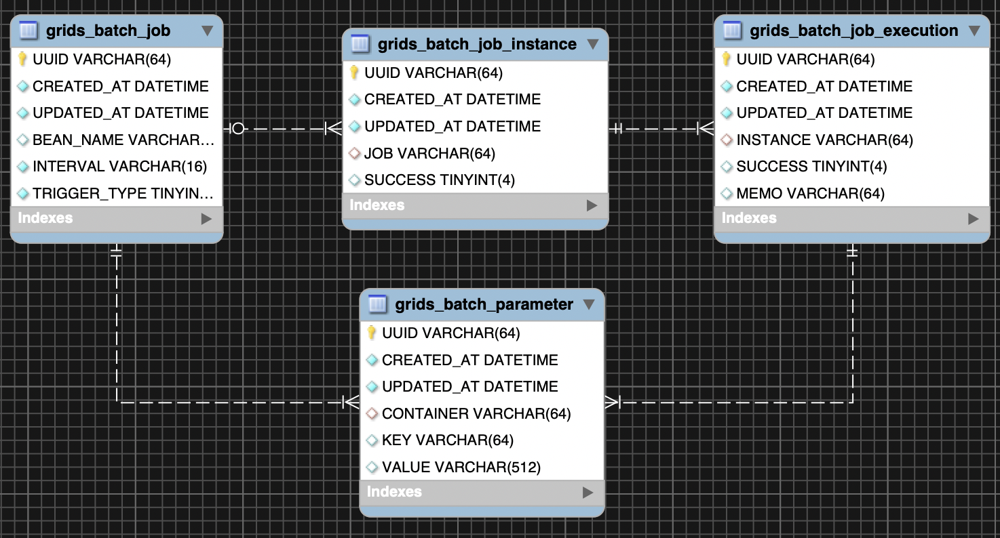

# Normalization

- [Functional Dependency](#functional-dependency)
- [Key](#key)
  - [Candidate Key (후보키)](#candidate-key-후보키)
  - [Primary Key (기본키](#primary-key-기본키)
  - [Alternative Key (대체키)](#alternative-key-대체키)
  - [Super Key (슈퍼키)](#super-key-슈퍼키)
  - [Foreign Key (외래키)](#foreign-key-외래키)
- [Normalization](#normalization)
- [1NF](#1nf)
  - [분리해서 새로운 테이블을 만듬 (good)](#분리해서-새로운-테이블을-만듬-good)
  - [중복해서 tuple을 생성 (bad)](#중복해서-tuple을-생성-bad)
  - [여러개의 attribute로 분리 (bad)](#여러개의-attribute로-분리-bad)
- [2NF](#2nf)
  - [기본키의 일부에 종속적인 속성들을 다른 테이블로 분리](#기본키의-일부에-종속적인-속성들을-다른-테이블로-분리)
- [3NF](#3nf)
  - [Y->Z를 다른 테이블로 분리](#y-z를-다른-테이블로-분리)
- [BCNF](#bcnf)
  - [Entity-Relational Model](#entity-relational-model)
- [References](#references)

## Functional Dependency

- 함수적 종속.
- X 와 Y가 속성집합일 때, X 값이 Y 값을 유일하게 결정하는 경우.

## Key

### Candidate Key (후보키)

### Primary Key (기본키

### Alternative Key (대체키)

### Super Key (슈퍼키)

### Foreign Key (외래키)

## Normalization

- 중복을 최소화하게 데이터를 구조화하는 프로세스. 주로 함수적 종속으로 정의.
- Pros
  - 중복 제거
- Cons
  - query를 할 때 join을 해야 함. 그래서 query리 성능 저하가 심하게 발생하면 비정규화(De-normalization)를 해서 일부 중복을 허용하기도 함.

## 1NF

- 모든 값이 atomic value 구성.
- 속성에 ',' 같은거 넣으면 안됨.

### 분리해서 새로운 테이블을 만듬 (good)

- 좋은 해결방안.

### 중복해서 tuple을 생성 (bad)

- 데이터의 중복이 발생.

### 여러개의 attribute로 분리 (bad)

- 많은 null과 버려지는 공간을 발생시킴.

## 2NF

- 1NF 이면서 기본키의 일부에 종족적인 속성이 없는 경우 (eg. (X,Y)->Z일 때 X->Z가 없는 경우)

### 기본키의 일부에 종속적인 속성들을 다른 테이블로 분리

- 좋은 해결방안.

## 3NF

- 2NF 이면서 이행적 함수 종속이 없는 경우를 말함.
- 이행적 함수 종속(Transitive Functional Dependency)이란 X가 primary key이고 Y가 primary key가 아닐 때 X->Y이고, Y->Z라서 X->Z가 되는 경우를 의미. 

### Y->Z를 다른 테이블로 분리

## BCNF

- 3NF 이면서 

### Entity-Relational Model

## References

- Normalization
  - [wiki](https://en.wikipedia.org/wiki/Database_normalization)
  - [마곡 리더스 코딩](https://magok-leaders-coding.tistory.com/4)
