# Sql Query

- [DQL](#dql)
  - [Select](#select)
  - [Sorting](#sorting)
    - [Order By](#order-by)
  - [Filtering](#filtering)
    - [Distinct](#distinct)
    - [Limit & Offset](#limit--offset)
    - [Fetch](#fetch)
    - [Where](#where)
    - [Comparison Operators](#comparison-operators)
    - [Logical Operators](#logical-operators)
  - [Conditional Expression](#conditional-expression)
    - [Case](#case)
  - [Aggregation](#aggregation)
    - [Avg](#avg)
    - [Count](#count)
    - [MAX](#max)
    - [MIN](#min)
    - [SUM](#sum)
  - [Grouping](#grouping)
    - [Group By](#group-by)
    - [Having](#having)
    - [Groupoing Sets](#groupoing-sets)
    - [Rollup](#rollup)
    - [Cube](#cube)
  - [Set](#set)
    - [Union](#union)
    - [Union All](#union-all)
    - [Intersect](#intersect)
    - [Minus](#minus)
  - [SubQuery](#subquery)
    - [SubQuery](#subquery-1)
    - [Correlated SubQuery](#correlated-subquery)
    - [Exists](#exists)
    - [All](#all)
    - [Any](#any)
- [References](#references)

## DQL

- Data Query Language.

### Select

- 골라골라~ `SELECT`

To select all the rows and columns in the employees table, use `SELECT`.

```sql
SELECT * FROM employees;
```

```text
+-------------+-------------+-------------+-----------------------------------+--------------+------------+--------+----------+------------+---------------+
| employee_id | first_name  | last_name   | email                             | phone_number | hire_date  | job_id | salary   | manager_id | department_id |
+-------------+-------------+-------------+-----------------------------------+--------------+------------+--------+----------+------------+---------------+
|         100 | Steven      | King        | steven.king@sqltutorial.org       | 515.123.4567 | 1987-06-17 |      4 | 24000.00 |       NULL |             9 |
|         101 | Neena       | Kochhar     | neena.kochhar@sqltutorial.org     | 515.123.4568 | 1989-09-21 |      5 | 17000.00 |        100 |             9 |
|         102 | Lex         | De Haan     | lex.de haan@sqltutorial.org       | 515.123.4569 | 1993-01-13 |      5 | 17000.00 |        100 |             9 |
|         103 | Alexander   | Hunold      | alexander.hunold@sqltutorial.org  | 590.423.4567 | 1990-01-03 |      9 |  9000.00 |        102 |             6 |
...
```

To select employee id, first name, last name, and hire date of all rows in the employees table, use column name.

```sql
SELECT
    employee_id,
    first_name,
    last_name,
    hire_date
FROM
    employees;
```

```sql
+-------------+-------------+-------------+------------+
| employee_id | first_name  | last_name   | hire_date  |
+-------------+-------------+-------------+------------+
|         100 | Steven      | King        | 1987-06-17 |
|         101 | Neena       | Kochhar     | 1989-09-21 |
|         102 | Lex         | De Haan     | 1993-01-13 |
|         103 | Alexander   | Hunold      | 1990-01-03 |
...
```

To select first name, last name, salary, and new salary using simple calculation.

```sql
SELECT
    first_name,
    last_name,
    salary,
    salary * 1.05
FROM
    employees;
```

```text
+-------------+-------------+----------+---------------+
| first_name  | last_name   | salary   | salary * 1.05 |
+-------------+-------------+----------+---------------+
| Steven      | King        | 24000.00 |    25200.0000 |
| Neena       | Kochhar     | 17000.00 |    17850.0000 |
| Lex         | De Haan     | 17000.00 |    17850.0000 |
| Alexander   | Hunold      |  9000.00 |     9450.0000 |
| Nancy       | Greenberg   | 12000.00 |    12600.0000 |
...
```

To assign new salary a new column, use `AS`.
Select & simple calculation and set alias.

```sql
SELECT
    first_name,
    last_name,
    salary,
    salary * 1.05 AS new_salary
FROM
    employees;
```

```text
+-------------+-------------+----------+------------+
| first_name  | last_name   | salary   | new_salary |
+-------------+-------------+----------+------------+
| Steven      | King        | 24000.00 | 25200.0000 |
| Neena       | Kochhar     | 17000.00 | 17850.0000 |
| Lex         | De Haan     | 17000.00 | 17850.0000 |
| Nancy       | Greenberg   | 12000.00 | 12600.0000 |
...
```

[Go to top](#sql-query)

### Sorting

#### Order By

- `FROM` -> `SELECT` -> `ORDER BY` 순으로 수행됨.
- `ASC` 또는 `DESC`인데 지정 안하면 `ASC`.

To sort employees by first names in alphabetical order, use `ORDER BY`.

```sql
SELECT
    employee_id,
    first_name,
    last_name,
    hire_date,
    salary
FROM
    employees
ORDER BY
    first_name;
```

```text
+-------------+-------------+-------------+------------+----------+
| employee_id | first_name  | last_name   | hire_date  | salary   |
+-------------+-------------+-------------+------------+----------+
|         121 | Adam        | Fripp       | 1997-04-10 |  8200.00 |
|         115 | Alexander   | Khoo        | 1995-05-18 |  3100.00 |
|         103 | Alexander   | Hunold      | 1990-01-03 |  9000.00 |
|         193 | Britney     | Everett     | 1997-03-03 |  3900.00 |
|         104 | Bruce       | Ernst       | 1991-05-21 |  6000.00 |
|         179 | Charles     | Johnson     | 2000-01-04 |  6200.00 |
...
```

To sort the employees by the first name in ascending order and the last name in descending order, use and `DESC`

```sql
SELECT
    employee_id,
    first_name,
    last_name,
    hire_date,
    salary
FROM
    employees
ORDER BY
    first_name, -- ASC
    last_name DESC;
```

```text
+-------------+-------------+-------------+------------+----------+
| employee_id | first_name  | last_name   | hire_date  | salary   |
+-------------+-------------+-------------+------------+----------+
|         121 | Adam        | Fripp       | 1997-04-10 |  8200.00 |
|         115 | Alexander   | Khoo        | 1995-05-18 |  3100.00 |
|         103 | Alexander   | Hunold      | 1990-01-03 |  9000.00 |
|         193 | Britney     | Everett     | 1997-03-03 |  3900.00 |
|         104 | Bruce       | Ernst       | 1991-05-21 |  6000.00 |
|         179 | Charles     | Johnson     | 2000-01-04 |  6200.00 |
...
```

To sort employees by salary from high to low, use `DESC`.

```sql
SELECT
    employee_id,
    first_name,
    last_name,
    hire_date,
    salary
FROM
    employees
ORDER BY
    salary DESC;
```

```text
+-------------+-------------+-------------+------------+----------+
| employee_id | first_name  | last_name   | hire_date  | salary   |
+-------------+-------------+-------------+------------+----------+
|         100 | Steven      | King        | 1987-06-17 | 24000.00 |
|         101 | Neena       | Kochhar     | 1989-09-21 | 17000.00 |
|         102 | Lex         | De Haan     | 1993-01-13 | 17000.00 |
|         145 | John        | Russell     | 1996-10-01 | 14000.00 |
|         108 | Nancy       | Greenberg   | 1994-08-17 | 12000.00 |
...
```

[Go to top](#sql-query)

### Filtering

todo: 쿼리 정리해야 함

#### Distinct

- `DISTINCT` 다음에 오는 colunm들을 기준으로 중복 제거해서 보여줌.
- `NULL`은 동일하게 취급해서 `NULL` 여러개 오는 경우 한개만 출력함.

To select salary value from the salary.

```sql
SELECT 
    salary
FROM
    employees
ORDER BY salary DESC;
```

```text
+----------+
| salary   |
+----------+
| 24000.00 |
| 17000.00 |
| 17000.00 |
| 14000.00 |
| 13500.00 |
| 13000.00 |
...
```

To select unique values from the salary, use `DISTINCT`.

```sql
SELECT
    DISTINCT salary
FROM
    employees
ORDER BY salary DESC;
```

```text
+----------+
| salary   |
+----------+
| 24000.00 |
| 17000.00 |
| 14000.00 |
| 13500.00 |
| 13000.00 |
...
```

To selects the job id and salary.

```sql
SELECT
	job_id,
	salary
FROM
	employees
ORDER BY
	job_id,
	salary DESC;
```

```text
+--------+----------+
| job_id | salary   |
+--------+----------+
|      1 |  8300.00 |
|      2 | 12000.00 |
|      3 |  4400.00 |
|      4 | 24000.00 |
|      5 | 17000.00 |
|      5 | 17000.00 |
|      6 |  9000.00 |
...
```

To selects the job id and salary without duplication, use `DISTINCT`.

```sql
SELECT DISTINCT
    job_id,
    salary
FROM
    employees
ORDER BY
    job_id,
    salary DESC;
```

```text
+--------+----------+
| job_id | salary   |
+--------+----------+
|      1 |  8300.00 |
|      2 | 12000.00 |
|      3 |  4400.00 |
|      4 | 24000.00 |
|      5 | 17000.00 |
|      6 |  9000.00 |
...
```

#### Limit & Offset

- `LIMIT` the number of rows returned by a select statement.
- `OFFSET` 지정하면 해당 row만큼 skip하고 시작함.
- `LIMIT` & `OFFSET` 은 sql 표준은 아님. (eg. oracle에서 미지원)

Select first 5 rows.

```sql
SELECT
    employee_id,
    first_name,
    last_name
FROM
    employees
ORDER BY
    first_name
LIMIT 5;
```

Select 5 rows starting from 4th row.

```sql
SELECT
    employee_id, first_name, last_name
FROM
    employees
ORDER BY first_name
LIMIT 5 OFFSET 3;
```

Select top 5 employees by salary.

```sql
SELECT
    employee_id,
    first_name,
    last_name,
    salary
FROM
    employees
ORDER BY
    salary DESC
LIMIT 5;
```

MySql short form.

```sql
SELECT
    employee_id,
    first_name,
    last_name
FROM
    employees
ORDER BY
    first_name
LIMIT 3 , 5; -- LIMIT 5 OFFSET 3
```

Select 2nd highest salary in the company.

```sql
SELECT DISTINCT
    salary
FROM
    employees
ORDER BY salary DESC
LIMIT 1 , 1;
```

Select 2nd highest slave in the company.

```sql
SELECT
    employee_id, first_name, last_name, salary
FROM
    employees
WHERE
    salary = (
        SELECT DISTINCT
            salary
        FROM
            employees
        ORDER BY salary DESC
        LIMIT 1 , 1
    );
```

[Go to top](#sql-query)

#### Fetch

- `OFFSET FETCH`는 `LIMIT`에 비해 많은 db에서 지원됨.
- 주로 pagination할 때 사용.

Select the first employee who has the highest salary.

```sql
SELECT
    employee_id,
    first_name,
    last_name,
    salary
FROM employees
ORDER BY
    salary DESC
OFFSET 0 ROWS -- skips 0 row
FETCH NEXT 1 ROWS ONLY; -- return 1 row only
```

Sorts the employees by salary, skips the first five employees with the highest salary, and fetches the next five ones.

```sql
SELECT
    employee_id,
    first_name,
    last_name,
    salary
FROM employees
ORDER BY
    salary DESC
OFFSET 5 ROWS
FETCH NEXT 5 ROWS ONLY;
```

#### Where

- row에 대한 조건을 지정. 조건에 대해서 `TRUE` 인 row만 result에 포함.

#### Comparison Operators

- `=` :    Equal
- `<>` : Not equal to
    - `!=` 도 가능.
- `>`    : Greater than
- `>=` : Greater than or equal to
- `<`    : Less than
- `<=` : Less than or equal to

Equal

```sql
SELECT
    employee_id,
    first_name,
    last_name
FROM
    employees
WHERE
    last_name = 'Himuro';
```

Equal (is null)

```sql
SELECT
    employee_id,
    first_name,
    last_name,
    phone_number
FROM
    employees
WHERE
    phone_number IS NULL;

```

Not equal to

```sql
SELECT
    employee_id,
    first_name,
    last_name,
    department_id
FROM
    employees
WHERE
    department_id <> 8
    AND department_id <> 10
ORDER BY first_name , last_name;

```

Greater then

```sql
SELECT
    employee_id,
    first_name,
    last_name,
    salary
FROM
    employees
WHERE
    salary > 10000
ORDER BY salary DESC;
```

Greater then and equals to

```sql
SELECT
    employee_id,
    first_name,
    last_name,
    salary
FROM
    employees
WHERE
    salary > 10000 AND department_id = 8
ORDER BY salary DESC;
```

Greater then of equal to

```sql
SELECT
    employee_id,
    first_name,
    last_name,
    salary
FROM
    employees
WHERE
    salary >= 9000
ORDER BY salary;
```

Less then

```sql
SELECT
    employee_id,
    first_name,
    last_name,
    salary
FROM
    employees
WHERE
    salary < 10000
ORDER BY salary DESC;
```

Less than or equal to

```sql
SELECT
    employee_id,
    first_name,
    last_name,
    salary
FROM
    employees
WHERE
    salary <= 10000
ORDER BY salary DESC;
```

[Go to top](#sql-query)

#### Logical Operators

- `AND` : Return true if both expressions are true.
- `OR` : Return true if either expression is true.
- `IS NULL` : Return true if it's null.
- `BETWEEN` : Return true if the operand is within a range.
- `IN` : Return true if the operand is equal to one of the value in a list.
- `LIKE` : Return true if the operand matches a pattern.
  - The percent sign (`%`) represents zero, one, or multiple characters.
  - The underscore sign (`_`) represents a single character.
- `ALL` :    Return true if all comparisons are true.
  - Must be preceded by a comparison operator and followed by a subquery.
- `ANY` : Return true if any one of the comparisons is true.
  -  Must be preceded by a comparison operator and followed by a subquery.
- `EXISTS` : Return true if a subquery contains any rows.
- `NOT` : Reverse the result of any other Boolean operator.
- `SOME` : Return true if some of the expressions are true.

AND

```sql
SELECT
    first_name,
    last_name,
    salary
FROM
    employees
WHERE
    salary > 5000 AND salary < 7000
ORDER BY salary;
```

OR

```sql
SELECT
    first_name,
    last_name,
    salary
FROM
    employees
WHERE
    salary = 7000 OR salary = 8000
ORDER BY salary;
```

IS NULL

```sql
SELECT
    first_name,
    last_name,
    salary
FROM
    employees
WHERE
    phone_number IS NULL
ORDER BY first_name , last_name;
```

BETWEEN

```sql
SELECT
    first_name,
    last_name,
    salary
FROM
    employees
WHERE
    salary BETWEEN 9000 AND 12000
ORDER BY salary;
```

IN

```sql
SELECT
    first_name,
    last_name,
    salary
FROM
    employees
WHERE
    department_id IN (8, 9)
ORDER BY department_id;
```

LIKE

```sql
SELECT
    first_name,
    last_name,
    salary
FROM
    employees
WHERE
    first_name LIKE 'jo%' -- % : zero, one, or multiple characters
ORDER BY first_name;
```

ALL

```sql
SELECT
    first_name,
    last_name,
    salary
FROM
    employees
WHERE
    salary >= ALL (
        SELECT
            salary
        FROM
            employees
        WHERE
            department_id = 8
    )
ORDER BY salary DESC;
```

ANY

```sql
SELECT
    first_name,
    last_name,
    salary
FROM
    employees
WHERE
    salary > ANY (
        SELECT
            AVG(salary)
        FROM
            employees
        GROUP BY department_id
    )
ORDER BY first_name , last_name;
```

EXISTS

```sql
SELECT
    first_name, last_name
FROM
    employees e
WHERE
    EXISTS (
        SELECT
            1
        FROM
            dependents d
        WHERE
            d.employee_id = e.employee_id
    );
```

NOT

```sql
SELECT
    employee_id,
    first_name,
    last_name,
    salary
FROM
    employees
WHERE
    department_id = 5
    AND NOT salary > 5000
ORDER BY salary;
```

NOT IN

```sql
SELECT
    employee_id,
    first_name,
    last_name,
    department_id
FROM
    employees
WHERE
    department_id NOT IN (1, 2, 3)
ORDER BY
    first_name;
```

NOT LIKE

```sql
SELECT
    first_name,
    last_name
FROM
    employees
WHERE
    first_name NOT LIKE 'D%'
ORDER BY
    first_name;
```

NOT BETWEEN

```sql
SELECT
    employee_id,
    first_name,
    last_name,
    salary
FROM
    employees
WHERE
    salary NOT BETWEEN 3000 AND 5000
ORDER BY
    salary;
```

NOT EXISTS

```sql
SELECT
    employee_id,
    first_name,
    last_name
FROM
    employees e
WHERE
    NOT EXISTS (
        SELECT
            employee_id
        FROM
            dependents d
        WHERE
            d.employee_id = e.employee_id
    );
```

[Go to top](#sql-query)

### Conditional Expression

#### Case

- Allows you to evaluate a list of conditions and returns one of the possible results.
- `ELSE` is optional. If no `ELSE` & expression does not match any of expression, returns `NULL`.

To get the work anniversaries of employees, use simple `CASE`.

```sql
SELECT 
    first_name,
    last_name,
    hire_date,
    CASE (2000 - YEAR(hire_date))
        WHEN 1 THEN '1 year'
        WHEN 3 THEN '3 years'
        WHEN 5 THEN '5 years'
        WHEN 10 THEN '10 years'
        WHEN 15 THEN '15 years'
        WHEN 20 THEN '20 years'
        WHEN 25 THEN '25 years'
        WHEN 30 THEN '30 years'
    END aniversary
FROM
    employees
ORDER BY first_name;
```

To get salary by three cagegory, use searched `CASE`.

```sql
SELECT 
    first_name,
    last_name,
    CASE
        WHEN salary < 3000 THEN 'Low'
        WHEN salary >= 3000 AND salary <= 5000 THEN 'Average'
        WHEN salary > 5000 THEN 'High'
    END evaluation
FROM
    employees;
```

[Go to top](#sql-query)
### Aggregation

- An SQL aggregate function calculates on a set of values and returns a single value.

#### Avg

- Calculates the average value of a set.
- `DISTINCT` 쓰면 unique 한 값들만 포함.

To calculate the average salary of all employees, use `AVG`.

```sql
SELECT 
    AVG(salary)
FROM
    employees;
```

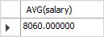

To calculate the distinct average salary of all employees, use `DISTINCT`.

```sql
SELECT 
    AVG(DISTINCT salary)
FROM
    employees;
```

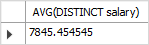

To round the result to 2 decimal places, use `ROUND`.

```sql
SELECT 
    ROUND(AVG(DISTINCT salary), 2)
FROM
    employees;
```

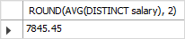

To calculate the average salary of employees in the department id 5, use `WHERE`.

```sql
SELECT
    AVG(DISTINCT salary)
FROM
    employees
WHERE
    department_id = 5;
```


To get the departments and the average salary of employees of each department, use `GROUP BY`.

```sql
SELECT
    department_id,
    AVG(salary)
FROM
    employees
GROUP BY
    department_id;
```

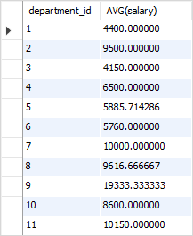

To get the department name data, use `INNER JOIN`.

```sql
SELECT
    e.department_id,
    department_name,
    AVG(salary)
FROM
    employees e
    INNER JOIN departments d
        ON d.department_id = e.department_id
GROUP BY
    e.department_id;
```

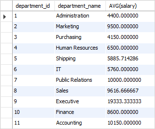

To sort salary in desc, use `ORDER BY`.

```sql
SELECT
    e.department_id,
    e.department_name,
    AVG(salary)
FROM
    employees e
    INNER JOIN departments d
        ON d.department_id = e.department_id
GROUP BY
    e.department_id
ORDER BY
    AVG(salary) DESC;
```

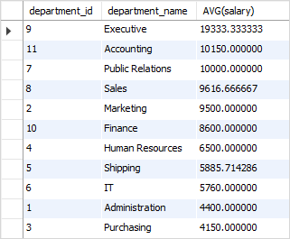

To filter salary is greater then 400, use `HAVING`.

```sql
SELECT
    e.department_id,
    department_name,
    AVG(salary)
FROM
    employees e
    INNER JOIN departments d
        ON d.department_id = e.department_id
GROUP BY
    e.department_id
HAVING AVG(salary) > 4000
ORDER BY AVG(salary) DESC;
```

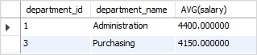

To calculate the average salary of employees in each department and apply the average of it, use subquery.

```sql
SELECT
    AVG(t.employee_sal_avg)
FROM
    (
        SELECT
            AVG(salary) employee_sal_avg
        FROM
            employees
        GROUP BY
            department_id
    ) t;
```

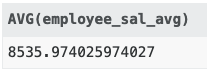

[Go to top](#sql-query)

#### Count

- Returns the number of rows returned by a query. 
- `DISTINCT` 쓰면 unique 하고 null이 아닌 것들만 포함.
- `Count`하고 column 넣으면 해당 column이 null이 아닌 것들만 포함.

To get the number of rows in the employees table, use `COUNT`.

```sql
SELECT
    COUNT(*)
FROM
    employees;
```

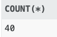

To get the number of jobs, use `COUNT`.

```sql
SELECT 
    COUNT(job_id)
FROM
    employees;
```

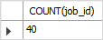

To get the distinct number of jobs, use `DISTINCT`.

```sql
SELECT 
    COUNT(DISTINCT job_id)
FROM
    employees;
```

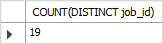

To find how many employees who work in the department id 6, use `WHERE`.

```sql
SELECT 
    COUNT(*)
FROM
    employees
WHERE
    department_id = 6;
```

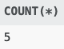

To find the number of employees per department, use `GROUP BY`.

```sql
SELECT
    department_id,
    COUNT(*)
FROM
    employees
GROUP BY
    department_id;
```

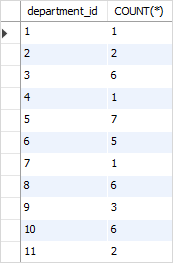

To get department_name, use `INNER JOIN`.

```sql
SELECT
    e.department_id,
    d.department_name,
    COUNT(*)
FROM
    employees e
    INNER JOIN departments d
        ON d.department_id = e.department_id
GROUP BY
    e.department_id;
```

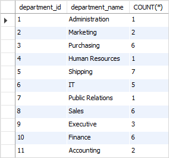

To sorts the result set based on the number of employees in descending order, use `ORDER BY`.

```sql
SELECT
    e.department_id,
    d.department_name,
    COUNT(*)
FROM
    employees e
    INNER JOIN departments d
        ON d.department_id = e.department_id
GROUP BY
    e.department_id
ORDER BY
    COUNT(*) DESC;
```

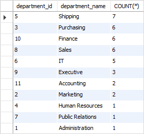

To selects only departments whose the number of employees is greater than 5, use `HAVING`

```sql
SELECT
    e.department_id,
    department_name,
    COUNT(*)
FROM
    employees e
    INNER JOIN departments d
        ON d.department_id = e.department_id
GROUP BY
    e.department_id
HAVING
    COUNT(*) > 5
ORDER BY
    COUNT(*) DESC;
```

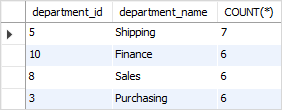

[Go to top](#sql-query)

#### MAX

- To find the maximum value in a set of values. 
- `DISTINCT` 은 못씀. NULL 은 무시.

To get the highest (maximum) salary of employees in the employees table, use `MAX`

```sql
SELECT 
    MAX(salary)
FROM
    employees;
```

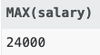

To get the employees who have the highest salary, use subquery.

```sql
SELECT
    employee_id,
    first_name,
    last_name,
    salary
FROM
    employees
WHERE
    salary = (
        SELECT
            MAX(salary)
        FROM
            employees
    );
```

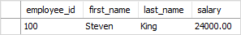

To find the highest salary of employee in each department, use `GROUP BY`.

```sql
SELECT
    department_id,
    MAX(salary)
FROM
    employees
GROUP BY
    department_id;
```


To include the department names in the result, use `INNER JOIN`.

```sql
SELECT
    d.department_id,
    department_name,
    MAX(salary)
FROM
    employees e
    INNER JOIN departments d
        ON d.department_id = e.department_id
GROUP BY
    e.department_id;
```

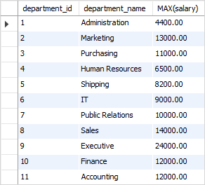

To get the highest salaries of employees in each department and sorts the result set based on the highest salaries, use `ORDER BY`.

```sql
SELECT
    d.department_id,
    department_name,
    MAX(salary)
FROM
    employees e
INNER JOIN departments d ON d.department_id = e.department_id
GROUP BY
    e.department_id
ORDER BY
    MAX(salary) DESC;
```

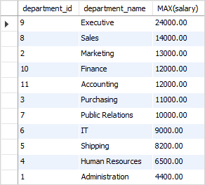

To get the department that has employee whose highest salary is greater than 12000, use `HAVING`.

```sql
SELECT
    d.department_id,
    department_name,
    MAX(salary)
FROM
    employees e
    INNER JOIN departments d
        ON d.department_id = e.department_id
GROUP BY
    e.department_id
HAVING
    MAX(salary) > 12000;
```

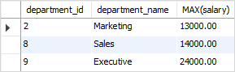

[Go to top](#sql-query)

#### MIN

- To find the minimum value in a set of values. 
- `DISTINCT` 은 못씀. NULL 은 무시.

To find the lowest (minimum) salary of employees, use `MIN`.

```sql
SELECT 
    MIN(salary)
FROM
    employees;
```

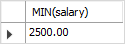

To get the information of the employee who has the lowest salary, use subquery.

```sql
SELECT
    employee_id,
    first_name,
    last_name,
    salary
FROM
    employees
WHERE
    salary = (
        SELECT
            MIN(salary)
        FROM
            employees
    );
```

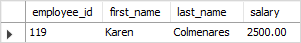

To get the employees who have the lowest salaries in each department, use `GROUP BY`.

```sql
SELECT
    department_id,
    MIN(salary)
FROM
    employees
GROUP BY
    department_id;
```

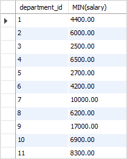

To combine the department’s name in the result set, use `INNER JOIN`.

```sql
SELECT
    d.department_id,
    department_name,
    MIN(salary)
FROM
    employees e
    INNER JOIN departments d
        ON d.department_id = e.department_id
GROUP BY
    d.department_id;
```

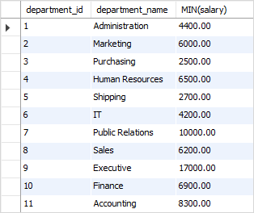

To retrieves the employee who has the lowest salary in each department, then sorts these departments by the salary in ascending order, use `ORDER BY`.

```sql
SELECT
    d.department_id,
    department_name,
    MIN(salary)
FROM
    employees e
    INNER JOIN departments d
        ON d.department_id = e.department_id
GROUP BY
    d.department_id
ORDER BY
    MIN(salary);
```

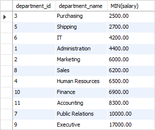

To retrieves the employees who have the lowest salary in each department filter salary less than 3000, use `HAVING`.

```sql
SELECT
    d.department_id,
    d.department_name,
    MIN(salary)
FROM
    employees e
    INNER JOIN departments d
        ON d.department_id = e.department_id
GROUP BY
    d.department_id
HAVING
    MIN(salary) < 3000;
```

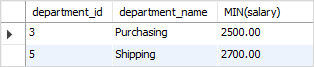

[Go to top](#sql-query)

#### SUM

- Returns the sum of all or distinct values.
- `DISTINCT` 쓰면 unique 하고 null이 아닌 것들만 포함.

To get the sum of salaries of all employees, use `SUM`.

```sql
SELECT 
    SUM(salary)
FROM
    employees;
```

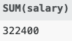

To calculate the sum of salaries of employees who work in department id 5, use `WHERE`.

```sql
SELECT 
    SUM(salary)
FROM
    employees
WHERE
    department_id = 5;
```

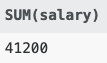

To calculate the sum of salaries of employees for each department, use `GROUP BY`.

```sql
SELECT
    department_id,
    SUM(salary)
FROM
    employees
GROUP BY
    department_id;
```


To include the department name in the result set, use `INNER JOIN`.

```sql
SELECT
    e.department_id,
    department_name,
    SUM(salary)
FROM
    employees e
    INNER JOIN departments d
        ON d.department_id = e.department_id
GROUP BY
    e.department_id;
```

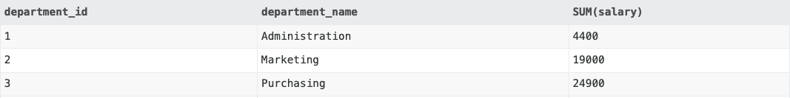

To have the sums of salaries of departments sorted in descending order, use `ORDER BY`.

```sql
SELECT
    e.department_id,
    department_name,
    SUM(salary)
FROM
    employees e
INNER JOIN departments d ON d.department_id = e.department_id
GROUP BY
    e.department_id
ORDER BY
    SUM(salary) DESC;
```

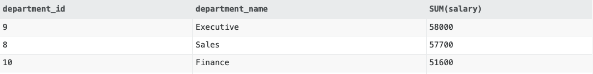

To get the departments and their sums of salaries greater than 57000, use `HAVING`.

```sql
SELECT
    e.department_id,
    department_name,
    SUM(salary)
FROM
    employees e
INNER JOIN departments d ON d.department_id = e.department_id
GROUP BY
    e.department_id
HAVING
    SUM(salary) > 57000
ORDER BY
    SUM(salary) DESC;
```

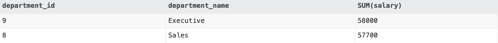

[Go to top](#sql-query)

### Grouping

todo: https://www.sqltutorial.org/sql-group-by/

#### Group By

#### Having

#### Groupoing Sets

#### Rollup

#### Cube

### Set

#### Union

#### Union All

#### Intersect

#### Minus

### SubQuery

#### SubQuery

#### Correlated SubQuery

#### Exists

#### All

#### Any

## References

- [SQL Tutorial](https://www.sqltutorial.org/)
- [SQL (wiki)](https://en.wikipedia.org/wiki/SQL)
- [SQLBolt](https://sqlbolt.com/)
- [SQLZOO](https://sqlzoo.net/wiki/)
- [w3school SQL](https://www.w3schools.com/sql)
- [sql-tutorial (javatpoint)](https://www.javatpoint.com/sql-tutorial)
