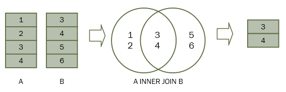
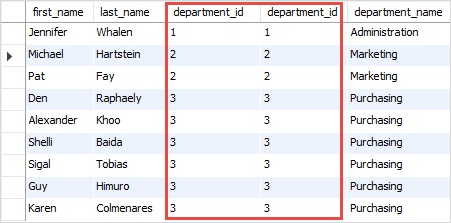
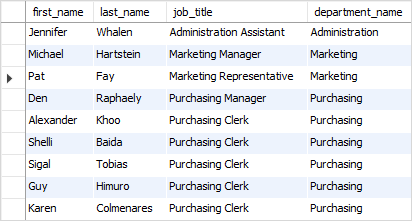
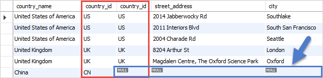
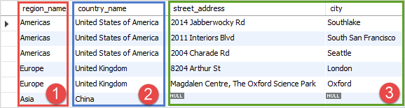
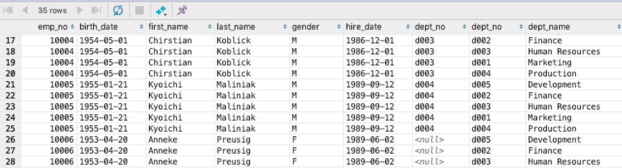
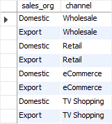
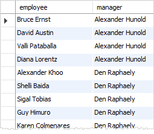
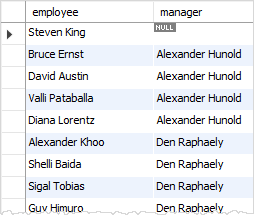

# Sql Advanced

- [Join](#join)
  - [Alias](#alias)
  - [Inner Join](#inner-join)
  - [Left Outer Join](#left-outer-join)
  - [Right Outer Join](#right-outer-join)
  - [Full Outer Join](#full-outer-join)
  - [Cross Join](#cross-join)
  - [Self Join](#self-join)
- [Index](#index)
  - [Index Architecture](#index-architecture)
  - [Index Types](#index-types)
  - [Multiple Index](#multiple-index)
  - [Index를 정하는 기준](#index를-정하는-기준)
  - [Index Locking](#index-locking)
- [Query Tuning](#query-tuning)
  - [Query Plan](#query-plan)
  - [Driving Table, Driven Table](#driving-table-driven-table)
  - [Cost-Based Optimizer (CBO)](#cost-based-optimizer-cbo)
- [Reference](#reference)

## Join

### Alias

- SQL alias allows you to assign a table or a column a temporary name during the execution of a query.
- Two types of aliases: table and column aliases.
- `FROM` > `WHERE` > `SELECT` > `ORDER BY` 순서로 조회를 하기 때문에 alias 이름을 where 조건에 쓸 수 없음. 하지만 order by에서는 쓸 수 있음.

Column aliases.

```sql
SELECT
    inv_no AS invoice_no,
    amount,
    due_date AS 'Due date',
    cust_no 'Customer No' -- 없어도 되긴 함
FROM
    invoices;
```

Alias for expression.

```sql
SELECT 
    first_name, 
    last_name, 
    salary * 1.1 AS new_salary
FROM
    employees;
```

Using alias in where (error).

```sql
SELECT 
    first_name, 
    last_name, 
    salary * 1.1 AS new_salary
FROM
    employees
WHERE
    new_salary > 5000; -- error
```

Using alias in order by (not error)

```sql
SELECT 
    first_name, 
    last_name, 
    salary * 1.1 AS new_salary
FROM
    employees
ORDER BY new_salary;
```

Table alias.

```sql
SELECT 
    e.first_name, 
    e.last_name
FROM
    employees AS e;
```

### Inner Join



- Select statement는 여러 table의 값들을 link해서 조회할 수 있음. 이를 Join이라고 부름.
- Inner join은 겹치는거를 출력.

Inner join on two tables.

```sql
SELECT 
    first_name,
    last_name,
    employees.department_id,
    departments.department_id,
    department_name
FROM
    employees
    INNER JOIN departments
        ON departments.department_id = employees.department_id
WHERE
    employees.department_id IN (1 , 2, 3);
```



Inner join on three tables.

```sql
SELECT
    first_name,
    last_name,
    job_title,
    department_name
FROM
    employees e
    INNER JOIN departments d
        ON d.department_id = e.department_id
    INNER JOIN jobs j
        ON j.job_id = e.job_id
WHERE
    e.department_id IN (1, 2, 3);
```



Explicit notation.

```sql
SELECT
    *
FROM
    employees
    INNER JOIN dept_emp
        ON employees.emp_no = dept_emp.emp_no;
```

Implicit notation.

```sql
SELECT
    *
FROM 
    employees, dept_emp
WHERE 
    employees.emp_no = dept_emp.emp_no;
```

### Left Outer Join


- Right table의 값이 없어도 Left table은 다 출력.

Left outer join on two table.

```sql
SELECT
    c.country_name,
    c.country_id,
    l.country_id,
    l.street_address,
    l.city
FROM
    countries c
    LEFT OUTER JOIN locations l
        ON l.country_id = c.country_id
WHERE
    c.country_id IN ('US', 'UK', 'CN');
```



Left outer join on three tables.

```sql
SELECT
    r.region_name,
    c.country_name,
    l.street_address,
    l.city
FROM
    regions r
    LEFT OUTER JOIN countries c
        ON c.region_id = r.region_id
    LEFT OUTER JOIN locations l
        ON l.country_id = c.country_id
WHERE
    c.country_id IN ('US', 'UK', 'CN');
```



todo: Implicit notation.

### Right Outer Join

- Left outer join과 동일한데 방향만 다름.

### Full Outer Join


- Left outer join + right outer join .
- 어느 한쪽에 매칭되는 데이터가 없어도 다 출력.

Full outer join.

```sql
INSERT INTO baskets (basket_id, basket_name)
VALUES
    (1, 'A'),
    (2, 'B'),
    (3, 'C');

INSERT INTO fruits (
    fruit_id,
    fruit_name,
    basket_id
)
VALUES
    (1, 'Apple', 1),
    (2, 'Orange', 1),
    (3, 'Banana', 2),
    (4, 'Strawberry', NULL);
```

```sql
SELECT
    basket_name,
    fruit_name
FROM
    fruits
    FULL OUTER JOIN baskets
        ON baskets.basket_id = fruits.basket_id;
```

```text
 basket_name | fruit_name
-------------+------------
 A           | Apple
 A           | Orange
 B           | Banana
 (null)      | Strawberry
 C           | (null)
```

todo: Implicit notation.

### Cross Join



- Make a Cartesian product of the joined tables.
- 다른 Join과는 다르게 Join 조건이 없음.

```sql
INSERT INTO sales_organization (sales_org_id, sales_org)
VALUES
    (1, 'Domestic'),
    (2, 'Export');

INSERT INTO sales_channel (channel_id, channel)
VALUES
    (1, 'Wholesale'),
    (2, 'Retail'),
    (3, 'eCommerce'),
    (4, 'TV Shopping');
```

Cross join.

```sql
SELECT
    sales_org,
    channel
FROM
    sales_organization
CROSS JOIN sales_channel; 
```

Cross join (without keyword).

```sql
SELECT
    sales_org,
    channel
FROM
    sales_organization,
    sales_channel;
```



todo: Implicit notation.

### Self Join

- 필요에 따라 자기 자신과 Join하는 것. 주로 Inner join이나 Left outer join 사용.

Joins the employees table to itself to query the information of who reports to whom (이름을 같이 보기 위해).

```sql
SELECT 
    e.first_name || ' ' || e.last_name AS employee,
    m.first_name || ' ' || m.last_name AS manager
FROM
    employees e
    INNER JOIN employees m
        ON m.employee_id = e.manager_id
ORDER BY manager;
```



Joins the employees table to itself to query the information of who reports to whom including no manager.

```sql
SELECT 
    e.first_name || ' ' || e.last_name AS employee,
    m.first_name || ' ' || m.last_name AS manager
FROM
    employees e
    LEFT JOIN employees m
        ON m.employee_id = e.manager_id
ORDER BY manager;
```



## Index

- lookup을 빠르게 하기 위해 table의 일부 column들을 가지고 별도의 data structure를 만드는 것.
- primary key, foreign key 같은 constraints를 빠르게 확인하기 위해서도 사용. eg. pk의 pair에 대해서는 db가 보통 알아서 index를 만들어버림.
- 장점 : index된 값으로 검색하면 속도가 빠름
- 단점 : 데이터를 추가할 시 Index도 같이 업데이트 시켜줘야 함. 별도의 저장공간도 필요.

### Index Architecture

- Non-clustered
  - 물리적으로 저장 할때 logical index order을 굳이 따르지 않는 것. 보통 primary key가 아닌 column들을 index할 때 사용.
  - Like a linked list.
  - 장점 : index를 수정하는 경우 물리적으로 수정 안해도 됨.
  - 단점 : clustered index에 비해 느림.
- Clustered
  - primary key에만 적용 가능한 것으로 물리적으로 키값이 비슷한 record끼리 묶어서 저장하는 것.
  - Like an array.
  - 장점 : 비슷한 값들을 묶어서 저장하기 때문에 검색시 속도가 빠름.
  - 단점 : primary key를 수정하는 경우 물리적으로 실제 저장되어야 하는 위치가 변경.

### Index Types

- Primary Index : primary key에 따라서 생성. 보통 table 생성 시 자동 생성.
- Secondary Index : key field나 ordering field 이외의 field들로 index를 생성한 것.

### Multiple Index

- index가 주어진 column 순으로 만들어지기 때문에 2번째 column만 사용하면 index를 사용하지 않음.

```sql
CREATE INDEX person_first_name_last_name_idx ON person(last_name, first_name);

SELECT * FROM person WHERE last_name="kim"; -- 빠름
SELECT * FROM person WHERE last_name="kim" AND first_name="john"; -- 빠름
SELECT * FROM person WHERE first_name="john"; -= 느림.
```

### Index를 정하는 기준

- Index로 최대한 많은 효율을 뽑아내려면 Cardinality가 높은 column들을 선택해야 함.
- Cardinality란 해당 column의 중복된 수치로 중복도가 낮으면 Cardinality가 높고 중복도가 높으면 Cardinality가 낮다.
- Cardinality가 높은 (중복도가 낮은) column에 index를 걸면 index를 활용해서 최대한 많은 column을 걸러낼 수 있음.

### Index Locking

- db insert, update, delete는 때때로 index update가 필요. index 정합성을 보장하기 위해 transaction이 일어나는 동안 index의 일부를 lock하는 과정.

## Query Tuning

- Sql 속도를 빠르게 하는 것.

### Query Plan

- A sequence of steps used to access data in a rdbms.
- index를 제대로 타는지 등의 확인을 통해 query tuning 하는데 사용.

### Driving Table, Driven Table

- Driving Table : Join시에 먼저 access 되어서 join을 주도하는 table.
- Driven Table : Join시 Driving table 이후에 access 되는 table.

### Cost-Based Optimizer (CBO)

- 쿼리를 수행하는데 소요되는 예상 시간에 기반해서 query plan을 생성.
- eg. 
  ```sql
  SELECT * FROM employees e, dept_emp de WHERE e.emp_no = de.emp_no;
  ```
  - 두 칼럼 모두 각각 인덱스가 있는 경우 : 각각 테이블의 record 건수에 따라 둘중 하나를 driving table로 선택 (적은거로).
  - dept_emp.emp_no 에만 인덱스가 있는 경우 : employees의 반복된 full scan을 막기 위해 employees를 driving table로 선택 dept_emp를 driven table로 해서 index를 활용.
  - employees.emp_no에만 인덱스가 있는 경우 : dept_emp의 반복된 full scan을 막기 위해 dept_emp를 driving table로 선택 employees를 driven table로 해서 index를 활용.
  - 두 칼럼 모두 인덱스가 없는 경우 : 뭔 짓을 해도 driven table의 full scan은 발생하기 때문에 테이블의 record 수에 따라 driving table을 선택.

## Reference

- Join
  - [SQL Tutorial](https://www.sqltutorial.org/)
  - [SQL (wiki)](https://en.wikipedia.org/wiki/SQL)
  - [SQLBolt](https://sqlbolt.com/)
  - [SQLZOO](https://sqlzoo.net/wiki/)
  - [w3school SQL](https://www.w3schools.com/sql)
  - [sql-tutorial (javatpoint)](https://www.javatpoint.com/sql-tutorial)
- Index
  - [Database index (wiki)](https://en.wikipedia.org/wiki/Database_index)
  - [Index locking (wiki)](https://en.wikipedia.org/wiki/Index_locking)
  - [Query plan (wiki)](https://en.wikipedia.org/wiki/Query_plan)
  - [[SQL 튜닝] 드라이빙 테이블(DRIVING TABLE)의 개념/결정 규칙 (튜나 개발일기)](https://devuna.tistory.com/36)