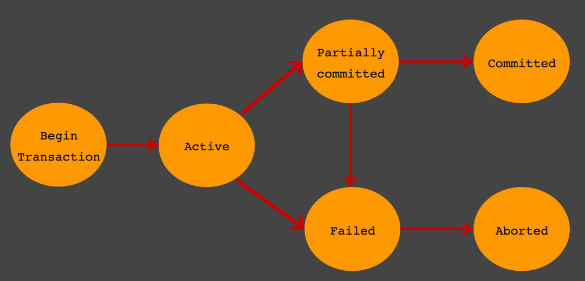

# Sql Advanced
- [Transaction](#transaction)
  - [Pattern](#pattern)
  - [ACID](#acid)
  - [Transaction Status](#transaction-status)
  - [Exclusive Lock](#exclusive-lock)
  - [Shared Lock](#shared-lock)
  - [Deadlock](#deadlock)
  - [Two-phase Locking (2PL)](#two-phase-locking-2pl)
- [Read Phenomena](#read-phenomena)
  - [Dirty Reads](#dirty-reads)
  - [Non-repeatable reads](#non-repeatable-reads)
  - [Phantom reads](#phantom-reads)
- [Isolation Levels](#isolation-levels)
  - [READ UNCOMMITTED](#read-uncommitted)
  - [READ COMMITTED](#read-committed)
  - [REPEATABLE READS](#repeatable-reads)
  - [SERIALIZABLE](#serializable)
- [Lock vs Transaction](#lock-vs-transaction)
- [Index](#index)
  - [Index Architecture](#index-architecture)
  - [Index Types](#index-types)
  - [Index Locking](#index-locking)
- [Query Tuning](#query-tuning)
  - [Query Plan](#query-plan)
  - [Driving Table, Driven Table](#driving-table-driven-table)
  - [Cost-Based Optimizer (CBO)](#cost-based-optimizer-cbo)
- [Reference](#reference)

## Transaction

- A unit of work performed within a database management system.
- Purpose
  - To provide reliable units of work that allow correct recovery from failures and **keep a database consistency**.
  - To provide isolation between programs accessing a database concurrently.
- 장점 : All or nothing이라서 한개가 에러가 발생하면 rollback함
- 단점 : db connection수는 한정되어 있기 때문에 과도하게 사용하면 collection pool이 남아나질 않음

eg. Dobule-entry accounting.

```text
Debit $100 to Groceries Expense Account
Credit $100 to Checking Account

-> both entries should pass or fail.
```

### Pattern

1. Begin the transaction.
2. Execute a set of data manipulations and/or queries.
3. If no error occurs, then commit the transaction.
4. If an error occurs, then roll back the transaction.

### ACID

Transaction이 가지는 속성

- Atomicity (원자성)
  - 여러 개의 statement가 전부 성공하거나 전부 실패해야 함.
- Consistency (일관성)
  - Transaction 전후 한 db의 상태가 invariant를 지키는 선에서 바뀌어야 함.
  - eg. primary key - foreign key 참조무결성을 지켜야 함.
- Isolation (고립성)
  - 여러 개의 transaction가 동시에 수행되어도 격리가 되어서 순차적으로 수행되는거랑 결과가 같아야 함.
  - Isolation level에 따라 서로 어느정도 격리를 할건지가 결정.
- Durability (지속성)
  - Tx가 종료된 후 system failure와 상관 없이 결과가 저장되어야 함.
  - 즉, non-volatile memory에 결과가 저장되어야 함.

### Transaction Status



- Active : 활동 상태
- Partial Committed
  - 트랜잭션의 `Commit` 명령이 도착한 상태. `commit`이전 `sql`문이 수행되고 `commit`만 남은 상태
  - `Commit`을 문제없이 수행할 수 있으면 `Committed` 상태로 전이, 오류가 발생하면 `Failed` 상태가 됨
- Committed : Commit 완료
- Failed : Commit 실패
- Aborted : 트랜잭션이 취소되고 Rollback된 상태

# Record Lock

- The technique of preventing simultaneous access to data in a database, to prevent inconsistent results.
- ACID의 Isolation을 구현하기 위해 사용.

### Exclusive Lock

- 보통 record writing을 위해 한번에 한개의 holder가 lock을 잡을 수 있게 하는 것.

### Shared Lock

- 여러 개의 lock holder가 동시에 같은 데이터를 읽는 것을 보증하기 위해 record가 변경되지 않게하는 lock.
- Exclusive locks cannot be obtained when a record is already locked (exclusively or shared).

### Deadlock

Deaclock 조건.

- Mutual exclusion : only one process at a time can use the resources.
- Hold and wait or resource holding : A process is currently holding at least one resource and requesting additional resources which are being held by other processes.
- No preemption : 선점 불가.
- Circular wait : Wait하는거 사이에 cycle이 있어야 함.

### Two-phase Locking (2PL)

- In transaction processing, 2PL is a concurrency control method that guarantees serializability.
- Locks are applied and removed in two phases
  1. Expanding phase: locks are acquired and no locks are released.
  2. Shrinking phase: locks are released and no locks are acquired.
- Deadlock을 일으킬 수 있음.

## Read Phenomena

- The ANSI/ISO standard SQL 92 refers to three different read phenomena when Transaction 1 reads data that Transaction 2 might have changed.

### Dirty Reads

- 다른 transaction에서 commit 되지 않는 data를 읽어서 나타나는 현상.

### Non-repeatable reads

- 한 transaction에서 두번 데이터를 읽었는데 두개의 데이터가 다른 현상.
- read lock이 select를 할 때 일어나지 않거나 select를 하고 read lock을 release 해서 다른 trasaction이 commit을 하는 경우 두번 읽었을 때 다르게 데이터가 나옴.

### Phantom reads

- tx가 진행되는 동안 다른 tx에서 new row가 added되거나 removed되어서 두번 읽는 경우 다르게 읽게 되는 현상.

## Isolation Levels

- Determines how transaction integrity is visible to other users and systems.
- 격리 수준이 낮을 수록 concurrency로인해 이상하게 읽는 상황이 많아짐. 반대로 높아질 수록 concurrency로 인해 이상하게 읽는 상황은 적어지지만 자원을 많이 소모하고 한 transaction이 다른 transaction을 block할 확률이 높아짐.
- Isolation Level은 ANSI/ISO 에 정의되어 있음.

### READ UNCOMMITTED

- commit되지 않은 데이터도 읽는 격리 수준.
- Read Phenomena
  - Dirty read : o
  - Non-repeatable reads : o
  - phantom read : o

### READ COMMITTED

- select된 데이터에 대해서 write lock은 유지하지만 read lock은 select를 하고 나서 release함.
- transaction이 진행되는 동안 다른 tx가 commit을 하는 경우 Non-repeatable reads는 발생 가능.
- Read Phenomena
  - Dirty read : x
  - Non-repeatable reads : o
  - phantom read : o

### REPEATABLE READS

- transaction이 진행되는 동안 read, write lock을 유지해서 동일한 data를 계속 읽는 것을 보장하는 것.
- range lock은 여전히 미사용해서 phantom read는 발생 가능.
- Read Phenomena
  - Dirty read : x
  - Non-repeatable reads : x
  - phantom read : o

### SERIALIZABLE

- tx가 진행되는 동안 read, write lock을 유지해서 동일한 data를 계속 읽는 것을 보장하는 것.
- `SELECT ... WHERE`을 사용하는 range lock도 걸어서 phantom read도 방지.
- Read Phenomena
  - Dirty read : x
  - Non-repeatable reads : x
  - phantom read : x

## Lock vs Transaction

- Lock
  - 동시성을 제어하는 기술.
- Transaction
  - 데이터의 정합성을 보장하는 기술.
  - transaction을 수행할 때 lock을 걸기도 함.

## Index

- lookup을 빠르게 하기 위해 table의 일부 column들을 가지고 별도의 data structure를 만드는 것.
- primary key, foreign key 같은 constraints를 빠르게 확인하기 위해서도 사용. eg. pk의 pair에 대해서는 db가 보통 알아서 index를 만들어버림.
- 장점 : index된 값으로 검색하면 속도가 빠름
- 단점 : 데이터를 추가할 시 Index도 같이 업데이트 시켜줘야 함. 별도의 저장공간도 필요.

### Index Architecture

- Non-clustered
  - 물리적으로 저장 할때 logical index order을 굳이 따르지 않는 것. 보통 primary key가 아닌 column들을 index할 때 사용.
  - 장점 : primary Key를 수정하는 경우 물리적으로 수정 안해도 됨.
  - 단점 : clustered index에 비해 느림.
- Clustered
  - primary key에만 적용 가능한 것으로 물리적으로 키값이 비슷한 record끼리 묶어서 저장하는 것.
  - 장점 : 비슷한 값들을 묶어서 저장하기 때문에 검색시 속도가 빠름.
  - 단점 : primary key를 수정하는 경우 물리적으로 실제 저장되어야 하는 위치가 변경.

### Index Types

- Primary Index : primary key에 따라서 생성. 보통 table 생성 시 자동 생성.
- Secondary Index : key field나 ordering field 이외의 field들로 index를 생성한 것.

### Index Locking

- db insert, update, delete는 때때로 index update가 필요. index 정합성을 보장하기 위해 transaction이 일어나는 동안 index의 일부를 lock하는 과정.

## Query Tuning

- Sql 속도를 빠르게 하는 것.

### Query Plan

- A sequence of steps used to access data in a rdbms.
- index를 제대로 타는지 등의 확인을 통해 query tuning 하는데 사용.

### Driving Table, Driven Table

- Driving Table : Join시에 먼저 access 되어서 join을 주도하는 table.
- Driven Table : Join시 Driving table 이후에 access 되는 table.

### Cost-Based Optimizer (CBO)

- 쿼리를 수행하는데 소요되는 예상 시간에 기반해서 query plan을 생성.
- eg. 
  ```sql
  SELECT * FROM employees e, dept_emp de WHERE e.emp_no = de.emp_no;
  ```
  - 두 칼럼 모두 각각 인덱스가 있는 경우 : 각각 테이블의 record 건수에 따라 둘중 하나를 driving table로 선택 (적은거로).
  - dept_emp.emp_no 에만 인덱스가 있는 경우 : employees의 반복된 full scan을 막기 위해 employees를 driving table로 선택 dept_emp를 driven table로 해서 index를 활용.
  - employees.emp_no에만 인덱스가 있는 경우 : dept_emp의 반복된 full scan을 막기 위해 dept_emp를 driving table로 선택 employees를 driven table로 해서 index를 활용.
  - 두 칼럼 모두 인덱스가 없는 경우 : 뭔 짓을 해도 driven table의 full scan은 발생하기 때문에 테이블의 record 수에 따라 driving table을 선택.

## Reference

- [Database transaction (wiki)](https://en.wikipedia.org/wiki/Database_transaction)
- [ACID (wiki)](https://en.wikipedia.org/wiki/ACID)
- [Record locking (wiki)](https://en.wikipedia.org/wiki/Record_locking)
- [Two-phase locking (wiki)](https://en.wikipedia.org/wiki/Two-phase_locking)
- [Isolation (wiki)](https://en.wikipedia.org/wiki/Isolation_(database_systems))
- [Database index (wiki)](https://en.wikipedia.org/wiki/Database_index)
- [Index locking (wiki)](https://en.wikipedia.org/wiki/Index_locking)
- [Query plan (wiki)](https://en.wikipedia.org/wiki/Query_plan)
- [[SQL 튜닝] 드라이빙 테이블(DRIVING TABLE)의 개념/결정 규칙 (튜나 개발일기)](https://devuna.tistory.com/36)