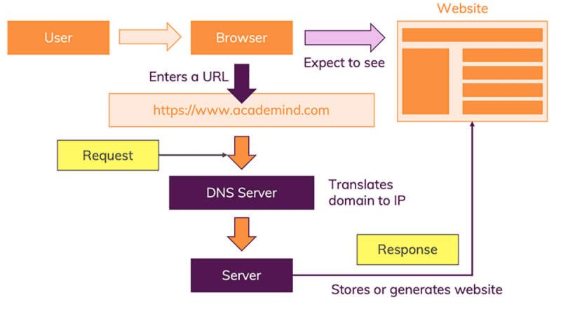

# How Internet Works

- [How Internet Works](#how-internet-works)
  - [Terms](#terms)
  - [Internet Infrastructure](#internet-infrastructure)
  - [Identification](#identification)
  - [How Web Works](#how-web-works)
  - [References](#references)

## Terms

- Packet
- Router
- Modem
- ISP (Internet Service Provider)
- Domain Name System
- IP Address
- URL (Uniform Resource Locator)

## Internet Infrastructure

- 기본적으로 컴퓨터가 물리적인 선으로 연결해서 Packet을 보내서 통신하는 것.
- 여러대의 컴퓨터가 각각 서로 연결하는 것은 오바니까 중간에 Router를 두고 컴퓨터는 Router랑만 서로 연결. Router가 각각 Packet이 어디로 가야 하는지 결정해줌.
- 여기서 더 발전해서 서로 먼 지역 내에서 서로 연결하기 위해 모뎀을 통해 전화선에 연결. 모뎀은 네트워크의 정보를 전화 시설에서 처리할 수 있는 정보로 전환함.=
- 전화 시설을 이용하여 도달하려는 네트워크로 Packet을 보내기 위해 ISP (Internet Service Provider)에 연결. ISP가 다른 ISP에 access 가능. 이러한 전체 인프라가 Internet.

## Identification

- 네트워크에 연결된 모든 컴퓨터에는 IP Address라는 고유한 주소가 있음 (eg. 192.168.0.1)
- IP Address는 숫자로 구성되어 있어서 외우기가 어려움. 그래서 사람이 읽을 수 있는 Domain Name으로 IP를 지정함 (eg. www.naver.com)

## How Web Works

Internet은 infrastructure임. Web은 Internet 위에 구축된 서비스.

- Browser에 URL을 치면 Browser가 OS를 통해 DNS Server로 요청을 보내서 IP Address를 반환함.
- Browser는 받은 IP Address를 가지고 실제 서버에 Internet Infrastructure를 통해 요청을 보냄.
- Web Server는 Request를 받아서 Response를 Internet Infrastructure를 통해 Browser로 보냄.
- Browser는 받은 Response를 parsing해서 dislpay함.

## References

- Overview
  - [인터넷은 어떻게 동작하는가? (mdn)](https://developer.mozilla.org/ko/docs/Learn/Common_questions/How_does_the_Internet_work)
  - [How the Internet Works in 5 Minutes (youtube)](https://www.youtube.com/watch?v=7_LPdttKXPc)
  - [How The Web Works - The Big Picture (youtube)](https://www.youtube.com/watch?v=hJHvdBlSxug)
  - [How The Web Works (academind)](https://academind.com/tutorials/how-the-web-works)
- Detail
  - [How Does the Internet Work?](http://www.theshulers.com/whitepapers/internet_whitepaper/index.html)