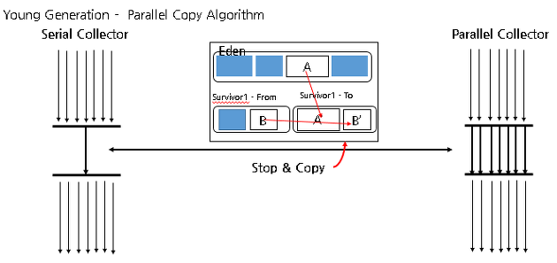
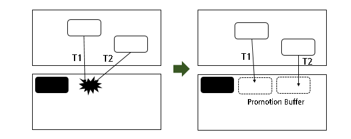
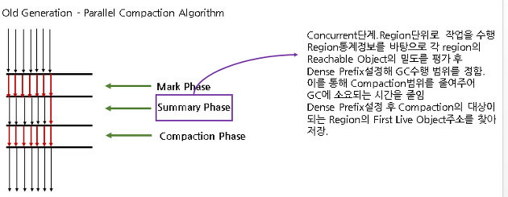
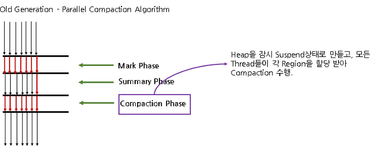
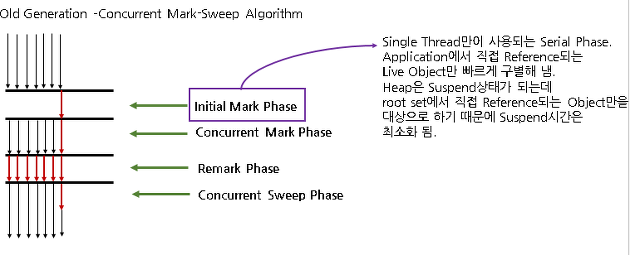
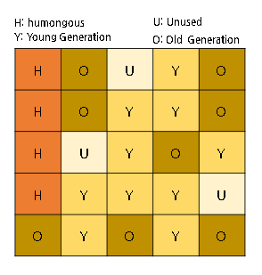

# JVM

- [JVM](#jvm)
  - [Architecture](#architecture)
  - [Heap Structure](#heap-structure)
    - [Constant Pool](#constant-pool)
  - [Garbage Collectors](#garbage-collectors)
    - [Root Set Reference](#root-set-reference)
    - [Card Table](#card-table)
    - [Thread-Local Allocation Buffers](#thread-local-allocation-buffers)
    - [Stop the world](#stop-the-world)
    - [Serial Collector](#serial-collector)
    - [Parallel Collector](#parallel-collector)
      - [PLAB (Parallel Local Allocation Buffer)](#plab-parallel-local-allocation-buffer)
    - [Parallel Compacting Collector](#parallel-compacting-collector)
    - [CMS Collector](#cms-collector)
    - [G1 Collector](#g1-collector)
  - [GC Tuning](#gc-tuning)
    - [Out Of Memory (OOM) Error](#out-of-memory-oom-error)
  - [Reference](#reference)

## Architecture

- Java Source : *.java
- Java Compiler : *.java -> *.class
- Java Byte Code : *.class
- ClassLoader : Loads *.class to Runtime Data Areas
- Execution Engine : Interpret *.class in a memory
- Runtime Data Area : JVM process가 OS로부터 할당받은 memory area
  - Method Area : 클래스, 변수, Method, static변수, 상수 등이 저장 (shared amoung thread)
  - Heap Area : 객체 instances 저장, GC의 대상
  - Stack Area : Method 내에서 사용되는 값들 (parameter, return local variable)등을 저장. Thread별로 생성
  - PC Register : Program Counter Register (다음에 실행될 명령어의 주소를 저장)
  - Native Method Stack : c/c++ 등의 native method를 호출하기 위해 할당되는 구역

## Heap Structure

- Young Generation (Minor GC Target)
  - Eden : 최초로 할당되는 영역
  - Survivor : GC 몇번 해도 살아남았을 때 Eden에서 이동.
- Old Generation : Survivor에서 GC몇번 살아남으면 이동 ,Major GC Target
- Perm : Class metadata, method metadata, static 변수 상수 저장
  - 1.8부터 Metaspace로 변경 (더 커짐) : static 변수 상수를 heap으로 이동

### Constant Pool

String같은거는 내부적으로 Pool을 만들어서 활용. 중복 생성을 방지함.

## Garbage Collectors

사용되지 않는 Object를 제거하는 과정. RootSet에서 Reference를 가지지 않는 것을 제거. 메모리가 부족할 때 일어남.

### Root Set Reference

- Local variable, Operend Stack에 Object의 Reference가 있는 경우
- Constant Pool이 참조하는 Object
- Object가 JNI의 형태로 호출하고 있는 경우

### Card Table

Young Generation의 Object를 참조하는 Old Generation의 Object가 있다면 Minor GC의 대상이 되서는 안됨\
이를 표시하는 Old Generation에 있는 메모리 구조

### Thread-Local Allocation Buffers

메모리를 연속으로 할당하게 되면 여러 스레드가 하나의 영역을 할당받기 위해 병목이 발생할 수 있음\
스레드별로 각자 영역을 할당받으면 동시에 할당받는게 가능\
Young Generation의 Fast Allocation을 위한 것

### Stop the world

GC대상을 확인하기 위해 JVM이 멈추는 것 (Suspend time)

### Serial Collector

- Young Generation Collection : Serial

- Old Generation Collection : Serial Mark-sweep Compact

### Parallel Collector

- Young Generation Collection : Parallel Scavenge

- Old Generation Collection : Serial Mark-sweep Compact, Serial Collector와 동일

#### PLAB (Parallel Local Allocation Buffer)

같은 메모리 공간을 여러 thread가 참조하게 되면 corruption이 발생해서 성능이 떨어짐.\
GC를 수행하는 thread들이 배타적으로 사용하기 위함.

### Parallel Compacting Collector

- Young Generation Collection : Parallel Scavenge, Parallel Collector와 동일

- Old Generation Collection : Parallel Mark-sweep Compact

### CMS Collector

Low-Latency Collecteor. 자원이 여유있을 때 Pause time을 줄이는게 목적

- Young Generation Collection : Parallel Scavenge, Parallel Collector와 동일

- Old Generation Collection : Concurrent Mark-Sweep

- Cons : 외부단편화가 심해짐 (young generation에서 어디로 가야할 지 모름)

### G1 Collector

CMS를 대체하기 위해 만들어짐. 물리적 Generation을 없애고 Region단위로 나눔

Garbage First -> Garbage로 가득 차 있는 Region부터 GC를 수행

- Young Generation Collection : Snapshot-At-The-Beginning
- Old Generation Collection : Snapshot-At-The-Beginning

## GC Tuning

Old area로 넘어가는 Object를 최소화

### Out Of Memory (OOM) Error

heap dump떠서 뭐가 많이 차지하는지 확인

## Reference

https://blog.embian.com/68