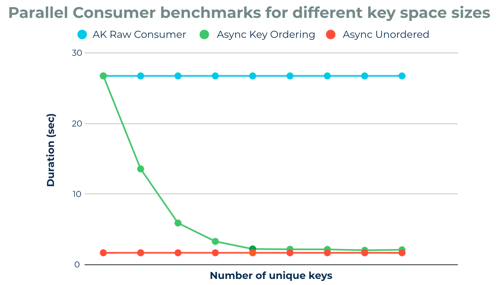

# Spring Kafka

- [Admin](#admin)
- [Configuring Topic](#configuring-topic)
- [Producer](#producer)
- [Consumer](#consumer)
- [Samples](#samples)
- [Parallel Consumer](#parallel-consumer)
  - [What for](#what-for)
  - [Features](#features)
  - [Ordering](#ordering)
  - [Api](#api)
- [Reference](#reference)

## Admin

## Configuring Topic

- `KafkaAdmin`빈으로 등록하고 `TopicBuilder` 사용해서 `NewTopic`을 빈으로 등록하면 `KafkaAdmin`이 알아서 Topic 등록해줌.

## Producer

- `KafkaTemplate`를 사용해서 message 보내기 가능.
- `ProducerFactory`를 사용해서 `KafkaTemplate`을 bean으로 등록 가능.

## Consumer

- `ConsumerFactory`

## Samples

https://github.com/spring-projects/spring-kafka/tree/main/samples

## Parallel Consumer

### What for

- Kafka의 parallelism은 partition임. But 가끔은 consumer를 늘리지 말고 thread 여러개로 대응하고 싶을 수 있음.
- 그런데 thread 여러개로 사용하면 offset management 등 고려해야 할 점이 많음. 이런거 추상화해서 제공하는 라이브러리임.
- 이런 경우에 유용함.
  - partition 수를 쉽게 못늘리는 경우.
  - highly-parallel consumer group으로 인한 broker의 부하를 줄이고 싶을 때.

### Features

https://github.com/confluentinc/parallel-consumer#features-list

- kafka consumer client 수나 partition 수를 늘리지 않고 하는 processing량을 늘릴 수 있음.
- Client side queueing system on top of Apache Kafka consumer.
- Almost zero dependencies (slf4j, lombok only).

### Ordering

https://github.com/confluentinc/parallel-consumer#ordering-guarantees

- Unordered level : Ordering이 필요 없을 때 사용. 제일 빠름.
- Key level : 각 partition의 key 단위로 순서 보장. key는 어떤 partition을 선택할지 결정하는 친구임.
- partition level : 전통적인 kafka client처럼 partition단위로 보장. 하지만 적은 consumer instance로 이걸 가능하게 함.

key 수에 따른 성능 차이.

### Api

[Usage](./spring-kafka/src/main/java/acktsap/spring/kafka/parallelconsumer)

Basic

- ParallelStreamProcessor : 걍 이게 핵심임.
- JStreamParallelStreamProcessor : callback vs Stream이라는데 지금 뭔가 제대로 동작 안하는 듯.

3rd Party integration

- JStreamVertxParallelStreamProcessor
- ReactorProcessor
  > 3rd party integration 안써도 충분할거 같은데?

## Reference

- [Spring Kafka Official Doc (3.0.0)](https://docs.spring.io/spring-kafka/docs/3.0.0/reference/html/)
- [Spring Kafka Support (spring official)](https://spring.io/projects/spring-kafka#support)
- [Kafka Streams (kafka official)](https://kafka.apache.org/33/documentation/streams/)
- [Parallel Consumer (github)](https://github.com/confluentinc/parallel-consumer)
- [Introducing the Confluent Parallel Consumer (confluent)](https://www.confluent.io/blog/introducing-confluent-parallel-message-processing-client)
