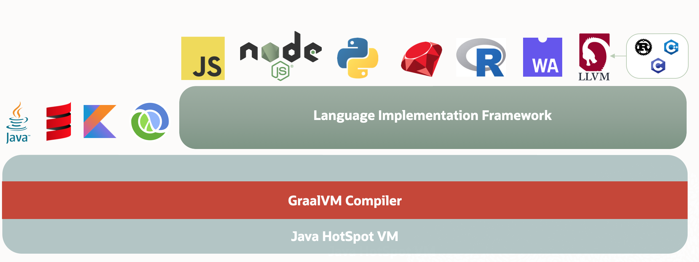

# Graalvm

- [History](#history)
- [Architecture](#architecture)
- [Runtime Modes](#runtime-modes)
- [Distributions](#distributions)
- [License](#license)
- [Getting Started](#getting-started)
  - [Install](#install)
  - [Run](#run)
- [References](#references)

## History

- Sum Microsystems에서 jvm을 cpp 말고 java로 작성하고 싶어서 Maxine Virtual Machine라는 프로젝트를 함.
- 한번에 이걸 하는건 빡센거 같아서 Compiler부터 해보려고 함. 그래서 처음에 Oracle Hotspot compiler를 Java로 바꾸는거 부터 시작함.

## Architecture



- HotSpot VM에 고급 just-in-time (JIT) compiler를 추가한거.
- 고급 JIT 뿐만 아니라  GraalVM’s language implementation framework (Truffle)를 추가해서  JavaScript, Ruby, Python 등을 JVM 위에서 처리할 수 있게 함.

## Runtime Modes

- JVM Runtime Mode
  - HotSpot JVM인데 GraalVM compiler를 JIT로 쓰는거.
- Native Image
  - Java code를 native executable이나 shared library로 바꾸는 것.
- Java on Truffle
  - JVM Spec에 구현한거임. 그런데 Truffle Language Implementation Framework가 추가되어서 여러 언어를 JVM에서 돌릴 수 있게 함.
  - polyglot.

## Distributions

- GraalVM Enterprise
  - Based on Oracle JDK.
- GraalVM Community
  - Based on OpenJDK.

## License

- GraalVM Community는 Java와 같음 (GPLv2 with Classpath Exception). 자유롭게 쓸 수 있음.
- 그런데 다른 언어들은 License 다를 수 있으니 [참고바람](https://github.com/oracle/graal#license).

## Getting Started

### Install

[참고](https://www.graalvm.org/22.2/docs/getting-started/#install-graalvm)

- osx
  - tar.gz 받아서 `/Library/Java/JavaVirtualMachines`에 넣음.
  - 환경변수 설정 (.zshrc에 넣음)
    ```sh
    export JAVA_HOME=/Library/Java/JavaVirtualMachines/graalvm-ce-java17-22.2.0/Contents/Home
    ```
  - 체크
    ```sh
    java --version
    ```

### Run

Java

```sh
javac HelloWorld.java
java HelloWorld
Hello World!
```

- 그냥 *.class 파일 수행.

Native image

```sh
$GRAALVM_HOME/bin/gu install native-image
javac HelloWorld.java
$GRAALVM_HOME/bin/native-image HelloWorld
```

Polyglot 

```sh
$GRAALVM_HOME/bin/gu install native-image
$GRAALVM_HOME/bin/gu install js  
javac PrettyPrintJSON.java
$GRAALVM_HOME/bin/native-image --language:js --initialize-at-build-time PrettyPrintJSON   
```

- js 코드를 실행.
- binary가 큰데 js runtime도 빌드해서 포함시켜서임. `ls -lh`로 확인해봐.


## References

- [GraalVM (wiki)](https://en.wikipedia.org/wiki/GraalVM)
- [Maxine Virtual Machine (wiki)](https://en.wikipedia.org/wiki/Maxine_Virtual_Machine)
- [graalvm official doc](https://www.graalvm.org/22.2/docs/)
