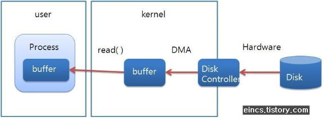

# Java Questions

- [Java Questions](#java-questions)
  - [Type](#type)
    - [Primitive types](#primitive-types)
    - [Wrapper Class, AutoBoxing, Unboxing](#wrapper-class-autoboxing-unboxing)
    - [Integer.valueOf vs Integer.parseInt](#integervalueof-vs-integerparseint)
  - [Class](#class)
    - [Overridding vs Overloading](#overridding-vs-overloading)
    - [Interface vs Abstract class](#interface-vs-abstract-class)
    - [Access Modifier (접근지정자)](#access-modifier-접근지정자)
    - [static, default method in interface](#static-default-method-in-interface)
    - [Java Class정의 필수요소](#java-class정의-필수요소)
    - [Annotation, Generics](#annotation-generics)
    - [Exception](#exception)
    - [ClassLoader](#classloader)
  - [Collection vs Stream](#collection-vs-stream)
    - [ArrayList, LinkedList](#arraylist-linkedlist)
    - [Vector vs ArrayList](#vector-vs-arraylist)
    - [HashMap vs LinkedHashMap vs TreeMap](#hashmap-vs-linkedhashmap-vs-treemap)
    - [HashTable vs ConcurrentHashMap](#hashtable-vs-concurrenthashmap)
    - [Lambda, @FunctionalInterface](#lambda-functionalinterface)
    - [Java Lambda vs Anonymous class](#java-lambda-vs-anonymous-class)
    - [Java에 Closure가 있는가](#java에-closure가-있는가)
  - [Concurrency](#concurrency)
    - [Java Thread & Kernal thread](#java-thread--kernal-thread)
    - [Volatile](#volatile)
    - [ForkJoinPool](#forkjoinpool)
    - [Atomic Operation](#atomic-operation)
  - [I/O](#io)
    - [InputStream, OutputStream, Reader, Writer](#inputstream-outputstream-reader-writer)
    - [NIO](#nio)
    - [Stream (I/O) vs Channel](#stream-io-vs-channel)
  - [Reflection](#reflection)
    - [Proxy vs DynamicProxy](#proxy-vs-dynamicproxy)
    - [What is Synthetic?](#what-is-synthetic)
  - [References](#references)

## Type

값들의 집합과 그것들 사이의 연산들. 숫자를 바라보는 관점이기도 함.

### Primitive types

- boolean: 1 byte, default: false, bit가 대부분의 architecture에서 directly 접근 안되서 byte임
- byte: 1 byte, default: 0
- char: 2 byte, for storing character default: '\u0000'
- short: 2 byte, default: 0
- int: 4 byte, default: 0
- long: 8 byte, default: 0L
- float: 4 byte, default: 0.0f
- double: 8 byte, default: 0.0d

### Wrapper Class, AutoBoxing, Unboxing

- Wrapper class : primitive type에 각각 해당하는 클래스
- AutoBoxing : primitive type -> Wrapper class로 자동으로 변환해 주는 것 (java 5부터 지원)
- Unboxing : Wrapper class -> primitive type 로 자동으로 변환해 주는 것 (java 5부터 지원)

### Integer.valueOf vs Integer.parseInt

- Integer.valueOf : Wrapper class(Integer)를 반환. -128~127에 대해서는 미리 만들어둔 객체를 반환
- Integer.parseInt : primitive type(int)을 반환

```java
public static Integer valueOf(int i) {
  final int offset = 128;
  if (i >= -128 && i <= 127) { // must cache
    return IntegerCache.cache[i + offset];
  }
  return new Integer(i);
}
```

## Class

객체를 정의해 놓은 것으로 실제 객체는 instance라고 부름

### Overridding vs Overloading

- Overridding
  - 부모의 method를 자손이 재정의하는 것
- Overloading
  - 같은 이름의 method를 여러개 정의하는 것. Method의 signature가 다르면 가능
  - method의 return type은 영향을 주지 않고 parameter쪽이 달라야 가능

### Interface vs Abstract class

- Interface
  - 상태를 가질 수 없음
  - 1.8 이전까지는 기본 구현을 할 수 없었음. 1.8 이후부터 default method가 추가되서 가능
  - 모든 method가 public
  - 다중상속이 가능
- Abstract class
  - 상태를 가질 수 있음 (field 가능)
  - 기본 구현 가능
  - method에 접근지정자를 설정할 수 있음
  - 다중상속이 불가능

### Access Modifier (접근지정자)

- public : 전부가능
- protected : 같은 패키지, 자손들
- default (안적은거) : 같은 패키지만
- private : 클래스 내부에서만

### static, default method in interface

- Since java 8
- 둘다 java 8부터 추가
- static method
  - jdk7까지는 일관성을 위해 안만들었음. Collections가 그래서 있는 것
- default method
  - interface에 method를 추가할 경우 그것을 상속하는 모든 클래스가 이를 구현해야 되서 추가
  - 이것으로 인해 추상 클래스와 인터페이스의 차이점은 상태를 가지느냐 안가지느냐 밖에 없게 됨

### Java Class정의 필수요소

- equals, hashCode : Set, Map에서 사용
- toString : 사람이 읽기 편한 형태로, 권장사항임
- Comparable : 객체 사이의 자연적인 순서를 표현. `Arrays.sort()`, `Collections.sort()` 같은거를 별도의 Comparator 없이 사용할 수 있음. 권장사항임

### Annotation, Generics

- Since java 5
- Annotation
  - Annotation처리를 통해 MetaPrograming을 해서 bolierplate code를 줄이려고 나옴
  - 잘 쓴 예시로는 Lombok, Spring Framework가 있음
- Generics
  - 다양한 타입에 대해 compile type checking을 해주는 기능
  - Compile하면 Generics정보는 사라지고 특정 타입으로 변경됨

### Exception

- Throwable : 최고 조상
  - Error : 심각한 에러
    - OutOfMemoryError
    - ...
  - Exception : 사용하는 쪽에서 에러 처리가 강제
    - IOException
    - ...
    - RuntimeException : 사용하는 쪽에서 에러 처리가 강제되진 않음
      - NullPointerException
      - UnSupportedOperationException
      - ...

### ClassLoader

- Class를 Loading하는 녀석
  - Bootstrap ClassLoader : 'jre/lib/rt.jar' 안의 클래스를 Loading. Native C로 구현되어 있음
  - ExtClassLoader (PlatformClassLoader in java 9) : 'jre/lib/ext' 안의 jar들을 Loading
  - AppClassLoader (SystemClassLoader in java 9) : classpath에 있거나 manifest의 classpath값으로 지정된 경로에서 class를 loading
- ClassLoader간에는 hierarchy가 있어서 class를 찾을 때 부모에서 먼저 찾고 자손에서 찾는 식임. 그래서 상위 클래스로더는 상위 클래스로더가 로드한 클래스를 볼 수 있지만 부모에서는 자손이 로드한 것을 볼 수 없음.

## Collection vs Stream

- Collection
  - 자료를 저장하는 것에 대한 추상화
  - List, Set, Map 등이 있음
  - Iterating을 사용자가 직접 해야함
- Stream
  - 자료를 처리하는 방식에 대한 추상화
  - map, filter, flatMap등의 operation이 적용됨
  - Iterating을 내부적으로 해서 terminal operation (reduce, collect)이 와야만 iterating 실행
  - 내부적으로 forkJoinPool을 사용하는 parallel stream이라는 것도 있음

### ArrayList, LinkedList

- 둘다 List의 구현체
- ArrayList
  - 내부적으로 배열로 저장
  - random access를 constant time에 가능
  - 값을 추가할 때 capacity가 가득 찬 경우 새로운 배열을 만들어서 기존 값들을 복사를 해줘야 함
  - 값을 삭제할 때는 뒤에 있는 값들을 모두 다시 복사해줘야함
  - Iterating시 locality의 관점에서 LinkedList보다 좋을 수 있음
- LinkedList
  - 내부적으로 노드들의 연결로 저장
  - random access를 위해서는 해당 index까지 iterating을 해야 함
  - 값을 추가할 때 새로운 노드를 만들어서 연결을 해주면 됨
  - 값을 삭제할 때는 노드의 연결을 끊어주면 됨
  - Iterating시 locality의 관점에서 ArrayList보다 안좋을 수 있음

### Vector vs ArrayList

- 둘다 List의 구현체, 내부적으로 배열로 값을 저장
- Vector
  - Since 1.0
  - 모든 method에 synchronized가 걸려 있음
  - single thread일 때 monitor lock때문에 ArrayList보다 느림
- ArrayList
  - Since 1.2
  - 모든 method에 걸려 있지 않음
  - single thread일 때 monitor lock이 없어서 Vector보다 빠름

### HashMap vs LinkedHashMap vs TreeMap

- HashMap
  - 일반적인 HashTable 구현체
  - put, get에 O(1)
- LinkedHashMap
  - HashMap에 내부적으로 Linked로 저장해서 Iterating시 insertion order를 보장
  - put, get에 O(1)
- TreeMap
  - Comparator를 기반으로 Red-Black Tree로 값을 저장
  - put, get에 O(log(n))
- HashMap 구현
  - 내부적으로 array로 저장하는데 `hashCode() & (n - 1)`의 index에 값을 저장. 이를 bucket이라고 부름
  - Collision의 경우 separate chaining방식으로 해당 index의 값에 LinkedList로 저장. Search는 O(m)
  - 1.8부터는 TreeNode로 저장. bucket안에서 search가 O(log(m)

### HashTable vs ConcurrentHashMap

- HashTable
  - Since 1.0
  - 모든 method에 synchronized가 걸려있음
- ConcurrentHashMap
  - Since 1.5
  - synchronized를 최소한으로 걸음. `hash & (n - 1)`에 해당하는 bucket에만 synchronized가 걸려 있음. 다른 bucket에 대해서는 동시에 처리를 할 수 있음

### Lambda, @FunctionalInterface

- 둘다 Since 1.8
- Lambda
  - `@FunctionalInterface` annotation하고 관계 없이 method가 1개인 인터페이스에 쓸 수 있음
- `@FunctionalInterface`
  - 함수가 한개인거를 강제해서 컴파일 시 체크를 해주는 annotation
  - `@FunctionalInterface`가 붙어있는 interface vs 일반 interface
    - `@FunctionalInterface`가 붙어있는 interface : method가 한개만 가능
    - 일반 interface : method가 2개 이상 가능
- 자바에서 기본적으로 제공해주는 함수형 인터페이스
  - `Runnable` : void run()
  - `Supplier` : T get()
  - `Consumer` : void accept()
  - `Function` : R apply(T t)
  - `Predicate` : boolean test(T t)

### Java Lambda vs Anonymous class

https://dreamchaser3.tistory.com/5

### Java에 Closure가 있는가

- Closure는 부모 scope에 묶인 변수를 binding하기 위한 기술
- Java에서는 둘러싼 변수가 final로 선언되어 있을 경우에만 참조 가능
- 변경하려면 reference참조를 통해 해야 함

## Concurrency

### Java Thread & Kernal thread

- Java thread는 기본적으로 user thread나 Kernal thread에 mapping되어서 실행됨

### Volatile

- 한 thread에서 수정한 값이 cache에만 저장되어 있어서 다른 thread에 보이지 않는 메모리의 가시성 문제를 해결하기 위한 것
- 이 키워드를 쓴 변수에 대해서는 cache를 사용하지 않고 memory만 사용
- jvm이 4 byte단위로 연산하기 때문에 8바이트를 사용하는 long, double에 대해서는 2개의 연산이 필요해서 동작하지 않음.

### ForkJoinPool

- Thread pool의 일종으로 특정 기준에 따라 fork을 계속 하고 join을 통해 결과를 합치는 식으로 동작.
- 각 Thread들이 개별 queue를 가지고 자기의 task queue가 비어있으면 다른 thread의 task를 뺏어와서 작업하기 때문에 multi-core환경에서 최적의 성능을 낼 수 있음. 그래서 Work-Stealing Pool이라고도 함.

### Atomic Operation

- CPU Cache에 있는 값과 memory에 있는 값이 다른 가시성 문제를 해결한 operation
- Cache와 memory의 값을 비교해서 값이 다르면 실패하고 재시도를 하는 Compare and Swap (CAS)를 함

## I/O

### InputStream, OutputStream, Reader, Writer

- InputStream / OutputStream : 은 byte단위로 I/O를 수행
- Reader / Writer : char단위 (2 byte)로 I/O를 수행. 문자열 처리를 위한 것.

### NIO



- New I/O (Non-blocking I/O 아님)로 기존의 느린 I/O를 보완하기 위한 것
- 기존의 I/O
  1. JVM이 Kernal에 I/O를 요청
  2. Kernal이 system call을 함
  3. Disk Controller가 디스크로부터 파일을 읽어서 DMA를 통해 (Direct Memory Access)를 이용해서 kernal buffer로 복사
  4. JVM 내부 buffer로 복사 : 이것 자체가 느리고 내부 버퍼가 GC되어야 하는 문제점이 있음.
- 이것을 해결하기 위해 Kernal의 buffer에 directly하게 접근하게 할 수 있는 방법이 NIO 로 `ByteBuffer`라는 클래스를 제공

### Stream (I/O) vs Channel

- Stream
  - One-way라서 I/O 둘다를 위해서는 InputStream, OutputStream 두개가 필요함.
  - Blocking만 가능
- Channel
  - Two-way라서 I/O 둘다를 한개로 처리 가능
  - Non-blocking도 가능
  
## Reflection

- 클래스의 구체적인 타입을 알지 못해도 클래스의 method, type, field를 접근하게 할 수 있게 해주는 api
- Java의 Class에 대한 정보가 static영역에 올라가 있기 때문에 이것이 가능.

### Proxy vs DynamicProxy

- Proxy : interface (또는 class)에 해당하는 메소드를 다 정의해야함
- DynamicProxy : Reflection을 통해 실행되는 method를 가져와서 직접 다 정의하지 않고도 동적으로 proxy 처리를 할 수 있음

### What is Synthetic?

https://javapapers.com/core-java/java-synthetic-class-method-field/

- compiler에 의해 인조적으로 만들어지는 method
- java lambda가 invokeDynamic으로 호출하게 변환될 때 호출하는 static method가 synthetic임

## References

valueOf, parseInt

https://m.blog.naver.com/sthwin/221000179980

AutoBoxing, Unboxing

https://hyeonstorage.tistory.com/168

ClassLoader

https://homoefficio.github.io/2018/10/13/Java-%ED%81%B4%EB%9E%98%EC%8A%A4%EB%A1%9C%EB%8D%94-%ED%9B%91%EC%96%B4%EB%B3%B4%EA%B8%B0/

Reflection

https://brunch.co.kr/@kd4/8

Collection vs Stream

https://javaconceptoftheday.com/collections-and-streams-in-java/

ForkJoinPool, Parallel Stream

https://m.blog.naver.com/PostView.nhn?blogId=tmondev&logNo=220945933678&proxyReferer=https%3A%2F%2Fwww.google.com%2F

CAP

https://beomseok95.tistory.com/225

NIO

http://eincs.com/2009/08/java-nio-bytebuffer-channel-file/

https://homoefficio.github.io/2016/08/06/Java-NIO%EB%8A%94-%EC%83%9D%EA%B0%81%EB%A7%8C%ED%81%BC-non-blocking-%ED%95%98%EC%A7%80-%EC%95%8A%EB%8B%A4/

Java thread & Kernal thread

https://stackoverflow.com/questions/18278425/are-java-threads-created-in-user-space-or-kernel-space
