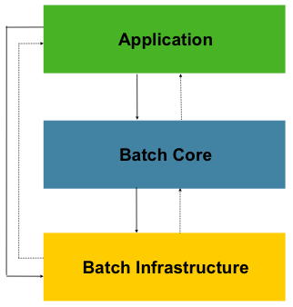

# Spring Batch Introduction

## Introduction

- 많은 다음의 요구사항을 만족하는 application이 필요
  - 주기적으로 자동으로 수행
  - 비슷한 처리를 대용량의 데이터를 대상으로 함
  - 처리를 transaction하게 해야 함
- 이러한 요구사항을 Spring 기반으로 해결하기 위한 framework가 Spring Batch.

Spring Batch

- logging/tracing, tx management, job processing statistics, job restart/skip 등의 기능을 제공.
- Extremely high-volume인 데이터에 대해 partition을 통해 빠른 처리를 제공.
- Spring Batch는 scheduling framework가 아님 scheulder랑 같이 쓰려고 있는 것

## Background

- Spring-based batch application을 만들었던 여러 사람들이 고심해서 만든 framework.

## Usage Scenario

보통 배치는 다음의 동작을 함 이런거 해야 할 때 사용

- Reads a large number of records from a database, file, or queue.
- Processes the data in some fashion.
- Writes back data in a modified form.

## Spring Batch Architecture

Layered Architecture

- Application
  - Contains all batch jobs and custom code written by developers using Spring Batch.
- Batch Core
  - Contains the core runtime classes necessary to launch and control a batch job.
    It includes implementations for JobLauncher, Job, and Step.
- Batch Infrastructure
  - Contains common readers and writers and services (such as the RetryTemplate), which are used both by application
    developers (such as ItemReader and ItemWriter) and the core framework itself.

## Tips

- [General Batch Principle and Guidelines](https://docs.spring.io/spring-batch/docs/current/reference/html/spring-batch-intro.html#batchArchitectureConsiderations)
- [Batch Processing Strategies](https://docs.spring.io/spring-batch/docs/current/reference/html/spring-batch-intro.html#batchProcessingStrategy)

## References

- [spring batch intro (official)](https://docs.spring.io/spring-batch/docs/current/reference/html/spring-batch-intro.html)
