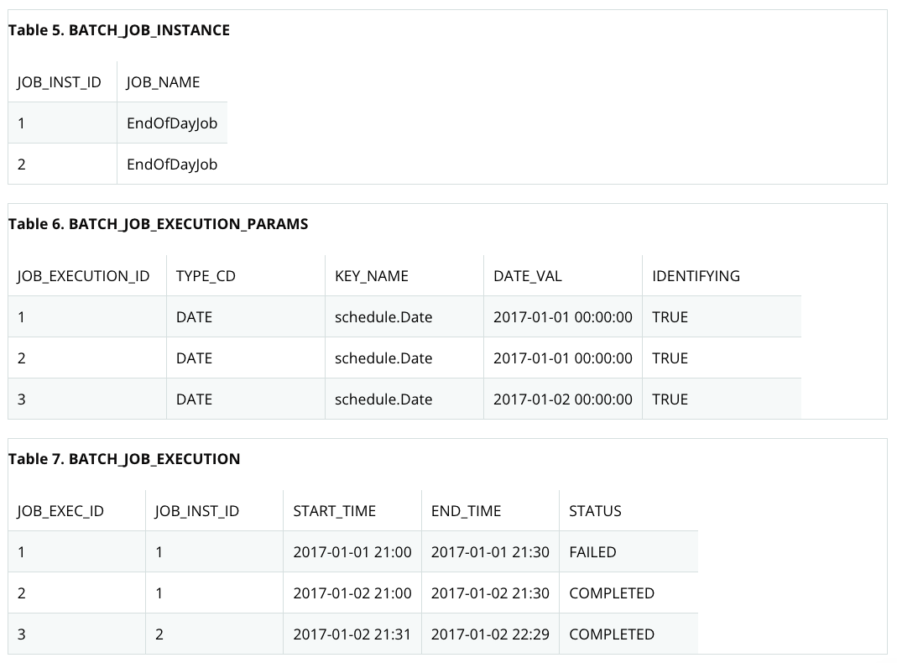
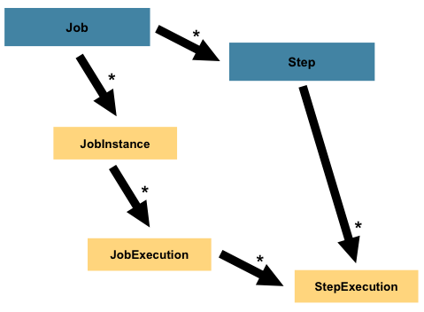
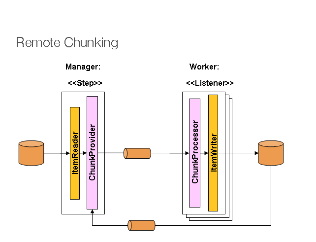

# Spring Batch Introduction

- [Introduction](#introduction)
  - [Background](#background)
  - [Usage Scenario](#usage-scenario)
- [Spring Batch Architecture](#spring-batch-architecture)
- [Spring Batch Domain Language](#spring-batch-domain-language)
  - [Job](#job)
  - [JobInstance](#jobinstance)
  - [JobParameters](#jobparameters)
  - [JobExecution](#jobexecution)
  - [Relation](#relation)
  - [Step](#step)
  - [ExecutionContext](#executioncontext)
  - [JobRepository](#jobrepository)
  - [JobLauncher](#joblauncher)
- [Item Reader, Writer, Processor](#item-reader-writer-processor)
  - [Chunk-oriented Processing](#chunk-oriented-processing)
- [Scalling](#scalling)
  - [Remote Chunking](#remote-chunking)
  - [Partitioning](#partitioning)
- [Tips](#tips)
- [See also](#see-also)

## Introduction

- 많은 다음의 요구사항을 만족하는 application이 필요
  - 주기적으로 자동으로 수행
  - 비슷한 처리를 대용량의 데이터를 대상으로 함
  - 처리를 transaction하게 해야 함
- 이러한 요구사항을 Spring 기반으로 해결하기 위한 framework가 Spring Batch.

Spring Batch

- logging/tracing, tx management, job processing statistics, job restart/skip 등의 기능을 제공.
- Extremely high-volume인 데이터에 대해 partition을 통해 빠른 처리를 제공.
- Spring Batch는 scheduling framework가 아님 scheulder랑 같이 쓰려고 있는 것

### Background

- Spring-based batch application을 만들었던 여러 사람들이 고심해서 만든 framework.

### Usage Scenario

보통 배치는 다음의 동작을 함 이런거 해야 할 때 사용

- Reads a large number of records from a database, file, or queue.
- Processes the data in some fashion.
- Writes back data in a modified form.

## Spring Batch Architecture


Layered Architecture

- Application
  - Contains all batch jobs and custom code written by developers using Spring Batch.
- Batch Core
  - Contains the core runtime classes necessary to launch and control a batch job.
    It includes implementations for JobLauncher, Job, and Step.
- Batch Infrastructure
  - Contains common readers and writers and services (such as the RetryTemplate), which are used both by application
    developers (such as ItemReader and ItemWriter) and the core framework itself.

## Spring Batch Domain Language


- A Job has one to many steps, each of which has exactly one ItemReader, one ItemProcessor, and one ItemWriter.
- A job needs to be launched (with JobLauncher), and metadata needs to be stored in JobRepository.

### Job


- Job configuration including name, step ordering, restartable, etc.

### JobInstance

- The concept of a logical job run.
- Distinguished by identifying JobParameters.
- Can have multiple executions.
- Using a new JobInstance means 'start from the beginning',
  and using an existing instance generally means 'start from where you left off'.
- Enable correct restart semantics.

### JobParameters

- Holds a set of parameters used to start a batch job.
- Has identifying flag to determine whether to be used as JobInstance identification.

### JobExecution

- The technical concept of a single attempt to run a Job.
- The JobInstance corresponding to a given execution is not considered
  to be complete unless the execution completes successfully.
  - eg. JobInstance for 01-01-2017 that failed.
    If it run with the same job parameters, a new JobExecution is created. But still only one JobInstance.
- The primary storage mechanism for what actually happened during a run.
  - Status : the status of the execution.
    - eg. BatchStatus#STARTED. BatchStatus#FAILED, BatchStatus#COMPLETED
  - startTime
    - Empty if the job has yet to start.
  - endTime
    - Empty if the job has yet to finish.
  - exitStatus : The result of the run. Contains an exit code that is returned to the caller.
  - createTime
    - The job may not have been started yet, but it always has a createTime
  - lastUpdated
    - Empty if the job has yet to finish.
  - executionContext : The "property bag" containing any user data.
  - failureExceptions

### Relation



### Step



todo

- Step : A domain object that encapsulates an independent, sequential phase of a batch job.
- StepExecution : A single attempt to execute a Step.
  - If a step fails to execute because the step before it fails, no execution is persisted for it. A StepExecution is
    created only when its Step is actually started.

### ExecutionContext

- Represents a collection of key/value pairs that are persisted and controlled by the framework.
- Allow developers a place to store persistent state that is scoped to a StepExecution object or a JobExecution object.
- JobExecution::ExecutionContext
  - At least one ExecutionContext per JobExecution.
  - Saved in between every StepExecution.
- StepExecution::ExecutionContext
  - ExecutionContext for every StepExecution
  - Saved at every commit point in the Step.

```java
// ecJob does not equal ecStep
ExecutionContext ecJob = jobExecution.getExecutionContext();
ExecutionContext ecStep = stepExecution.getExecutionContext();
```

### JobRepository

- Provides CRUD operations for JobLauncher, Job, and Step implementations.

### JobLauncher

- Represents a simple interface for launching a Job with a given set of JobParameters.

## Item Reader, Writer, Processor

- ItemReader : Represents the retrieval of input for a Step, one item at a time.
- ItemWriter : Represents the output of a Step, one batch or chunk of items at a time.
- ItemProcessor : Represents the business processing of an item.

### Chunk-oriented Processing


- Reading the data one at a time and creating 'chunks' that are written out within a transaction boundary.

```java
// pseudo code of chunk-oriented processing

List items = new Arraylist();
for (int i = 0; i < commitInterval; i++) {
    Object item = itemReader.read();
    if (item != null){
        items.add(item);
    }
}

List processedItems = new Arraylist();
for (Object item : items) {
    Object processedItem = itemProcessor.process(item);
    if (processedItem != null) {
      processedItems.add(processedItem);
    }
}

itemWriter.write(processedItems);
```

## Scalling

### Remote Chunking



- Step processing is split across multiple processes, communicating with each other through some middleware.
- Works best if the manager is not a bottleneck, so the processing must be more expensive than the reading of item.

### Partitioning


## Tips

- [General Batch Principle and Guidelines](https://docs.spring.io/spring-batch/docs/current/reference/html/spring-batch-intro.html#batchArchitectureConsiderations)
- [Batch Processing Strategies](https://docs.spring.io/spring-batch/docs/current/reference/html/spring-batch-intro.html#batchProcessingStrategy)

## See also

- [spring batch intro (official)](https://docs.spring.io/spring-batch/docs/current/reference/html/spring-batch-intro.html)
- [spring batch domain (official)](https://docs.spring.io/spring-batch/docs/current/reference/html/domain.html)