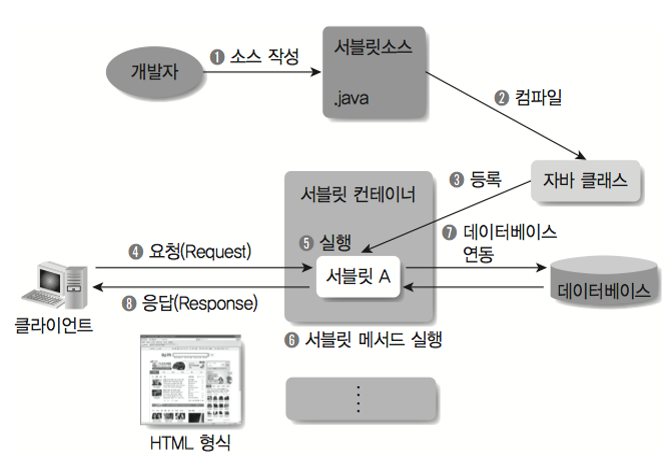
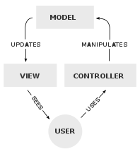
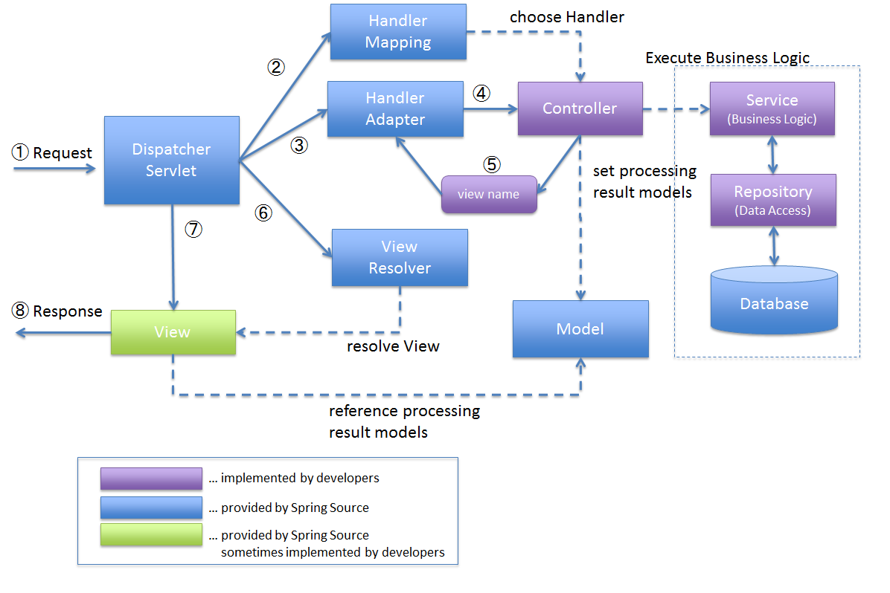

# Spring Web Servlet

- [Introduction](#introduction)
- [Background](#background)
  - [Web Server vs Web Application Server](#web-server-vs-web-application-server)
  - [Servlet](#servlet)
  - [Servlet container](#servlet-container)
  - [Jsp](#jsp)
  - [MVC, MVC2](#mvc-mvc2)
  - [SSR vs CSR](#ssr-vs-csr)
- [Dispatcher Servlet](#dispatcher-servlet)
  - [Context Hierarchy](#context-hierarchy)
  - [Dispatcher Servlet Internal Model](#dispatcher-servlet-internal-model)
  - [Dispatcher Servlet 동작](#dispatcher-servlet-동작)
  - [Usage](#usage)
- [See also](#see-also)

## Introduction

- [spring-mvc 모듈](https://github.com/spring-projects/spring-framework/tree/main/spring-webmvc) 에 대한 것.

## Background

### Web Server vs Web Application Server

- Web Server
  - Static Server.
  - 정적인 content 만 제공 (*.html, *.jpeg)
  - eg. nginx, apache server
- Web Application Server
  - Dynamic Server.
  - 정적 리소스 뿐만 아니라 프로그램 코드를 수행해서 application logic 수행.
  - eg. Tomcat, Jetty

> 사실 경계가 모호하고 Web Application Server는 한국에만 있는 용어같음. wiki에도 application server밖에 없음. 그냥 굳이 구분한다면 이 정도로 이야기 한다고 보면 될 듯.

### Servlet



- A Java software component that extends the capabilities of a server.
  > software component란 특정한 기능을 캡슐화 한 친구.
- 여러 요청을 처리할 수 있는 component지만 거의 http requets를 처리.
- filter1 -> filter2 -> ... -> servlet 식으로 처리.

### Servlet container

- Servlet 객체를 생성, 초기화, 호출하는 생명주기 관리.
- Servlet 객체는 싱글톤으로 관리.
- 요청에 따라 Servlet을 mapping시킴.
- eg. Tomcat, Jetty

### Jsp

Before

```java
public TestServlet extends HttpServlet {
    public void doGet(HttpServletRequest request, HttpServletResponse response) throws ServletException, IOException {
        response.setContentType("text/html");
        printWriter out = response.getWriter();
        
        out.println(docType + 
            "<html>\n" +
            "<head></head>\n" +
            "<ul>\n" + 
            "<li><b>param1</b>: " + request.getparameter("param1") + "\n" +
            "<li><b>param2</b>: " + request.getparameter("param2") + "\n" +
            "<li><b>param3</b>: " + request.getparameter("param3") + "\n" +
            "</ul>\n" +
            "</body>\b" + 
            "</html>");
    }
}
```

After

```xml
<html>
<head>
</head>

<body>
<ul>
    <li><b>param1</b>: <%= request.getparameter("param1") %>
    <li><b>param2</b>: <%= request.getparameter("param2") %>
    <li><b>param3</b>: <%= request.getparameter("param3") %>
</ul>
</body>
</html>
```

- 원래는 html을 만들때 Servlet을 가지고 html을 직접 string으로 리턴 했었음. 근데 이게 빡세서 html을 가지고 Servlet 코드를 생성하기 위해 사용.

### MVC, MVC2



- Model : application의 data를 관리하는 layer.
- View : model에 기반해서 실제 display 하는 layer.
- Controller : user input을 받아서 로직 처리를 하고 model을 변경.

### SSR vs CSR

- Server Side Rendering : 서버에서 동적으로 html까지 다 만들어서 전달.
- Client Side Rendering : Client에서 javascript로 서버에 http 요청한 결과로 (주로 json 리턴) html 결과를 렌더링함.

## Dispatcher Servlet

- `Servlet` 인데 front controller pattern을 써서 실제 request를 processing하고 response를 rendering하는 일은 configurable delegate component에서 수행됨.
- 전통적인 MVC임.

### Context Hierarchy


- Root WebApplicationContext : Service 등 여러 Servlet에서 사용할 bean을 등록.
- Servlet WebApplicationContext : Controller, View Resolver 등 bean을 정의.
- 계층 구조로 되어 있어서 Servlet WebApplicationContext에서 bean을 못찾으면 Root WebApplicationContext에서 찾음. 그런데 보통 Servlet WebApplicationContext 한개면 충분.

### Dispatcher Servlet Internal Model

`DispatcherServlet`

- `doService`에서 실제 servlet 일을 함.
- `doDispatch`에서 front controller 역할을 함.
- `initStrategies` method를 보면 중요한 interface들이 있음.

Delegate들. 이 interface들이 bean으로 있는지 먼저 확인하고 없으면 [DispatcherServlet.properties 의 기본값](https://github.com/spring-projects/spring-framework/blob/main/spring-webmvc/src/main/resources/org/springframework/web/servlet/DispatcherServlet.properties) 사용.

- [`HandlerMapping`](https://github.com/spring-projects/spring-framework/blob/main/spring-webmvc/src/main/java/org/springframework/web/servlet/HandlerMapping.java)
  - request를 handler에 mapping시킴.
  - 대표적인 구현체는 `@RequestMapping`를 처리하는 `RequestMappingHandlerMapping`가 있음.
  - HandlerMapping 구현체는 보통 `HandlerInterceptor`](https://github.com/spring-projects/spring-framework/blob/main/spring-webmvc/src/main/java/org/springframework/web/servlet/HandlerInterceptor.java) 들을 가지고 있어서 `preHandle(..)`, `postHandle(..)`, `afterCompletion()`을 처리.
- 이것들 모두 contract가 있지만 customizing 은 가능
- [`HandlerAdapter`](https://github.com/spring-projects/spring-framework/blob/main/spring-webmvc/src/main/java/org/springframework/web/servlet/HandlerAdapter.java)
  - `DispatcherServlet`가 handler를 호출 할 때 실제 어떻게 호출되는지 등을 알 필요 없게 하기 위한 추상화.
  - 대표적인 구현체는 `@RequestMapping`를 처리하는 `RequestMappingHandlerAdapter`가 있음.
- [`HandlerExceptionResolver`](https://github.com/spring-projects/spring-framework/blob/main/spring-webmvc/src/main/java/org/springframework/web/servlet/HandlerExceptionResolver.java)
  - 예외 처리.
- [`ViewResolver`](https://github.com/spring-projects/spring-framework/blob/main/spring-webmvc/src/main/java/org/springframework/web/servlet/ViewResolver.java)
  - handler로부터 받은 view name을 actual view에 mapping 시킴.
- [`LocaleResolver`](https://github.com/spring-projects/spring-framework/blob/main/spring-webmvc/src/main/java/org/springframework/web/servlet/LocaleResolver.java), [`LocaleContextResolver`](https://github.com/spring-projects/spring-framework/blob/main/spring-webmvc/src/main/java/org/springframework/web/servlet/LocaleContextResolver.java)
  - Locale 처리.
- [`ThemeResolver`](https://github.com/spring-projects/spring-framework/blob/main/spring-webmvc/src/main/java/org/springframework/web/servlet/ThemeResolver.java)
  - theme 설정.
- [`MultipartResolver`](https://github.com/spring-projects/spring-framework/blob/main/spring-web/src/main/java/org/springframework/web/multipart/MultipartResolver.java)
  - 파일 업로드 같은 multi part를 처리.
- [`FlashMapManager`](https://github.com/spring-projects/spring-framework/blob/main/spring-webmvc/src/main/java/org/springframework/web/servlet/FlashMapManager.java)
  - 요청간 attribute를 공유할 수 있게 해줌.
  - FlashMap 사용.
  - [`FlashMap`](https://github.com/spring-projects/spring-framework/blob/main/spring-webmvc/src/main/java/org/springframework/web/servlet/FlashMap.java)
    - HashMap 상속해서 기능 몇개 추가한거.

### Dispatcher Servlet 동작



- `DispatcherServlet.WEB_APPLICATION_CONTEXT_ATTRIBUTE` key로 `WebApplicationContext`를 찾음.
- locale 설정이 있는 경우 `LocaleResolver`를 binding.
- theme 설정이 있는 경우 `ThemeResolver`를 binding.
- multipart가 있는 경우 `MultipartResolver`를 사용하여 `HttpServletRequest`를 [`MultipartHttpServletRequest`](https://github.com/spring-projects/spring-framework/blob/main/spring-web/src/main/java/org/springframework/web/multipart/MultipartHttpServletRequest.java)로 wrapping 시킴.
- Handler를 찾아서 Controller를 실행.
- Handler에서 model을 리턴하는 경우 `ViewResolver`를 사용해서 적절한 view를 render. 리턴 안하면 이미 처리된 것으로 보고 미처리.
- 이 전체 과정에서 나는 에러는 `HandlerExceptionResolver`이 처리.

### Usage

- [legacy servlet](spring-legacy-servlet/src/main/webapp/WEB-INF/web.xml)
- delegate 들 `@EnableWebMvc`로 설정 예시 : todo, https://docs.spring.io/spring-framework/docs/current/reference/html/web.html#mvc-config 참고

## See also

- [spring web servlet (official)](https://docs.spring.io/spring-framework/docs/current/reference/html/web.html)
- [Jakarta Servlet (wiki)](https://en.wikipedia.org/wiki/Jakarta_Servlet)
- [Component-based software engineering, Software component (wiki)](https://en.wikipedia.org/wiki/Component-based_software_engineering#Software_component)
- [Application server (wiki)](https://en.wikipedia.org/wiki/Application_server)
- [Web server (wiki)](https://en.wikipedia.org/wiki/Web_server)
- [Model-view-controller (wiki)](https://en.wikipedia.org/wiki/Model%E2%80%93view%E2%80%93controller)
- [[Web] Servlet과 JSP의 차이와 관계](https://gmlwjd9405.github.io/2018/11/04/servlet-vs-jsp.html)