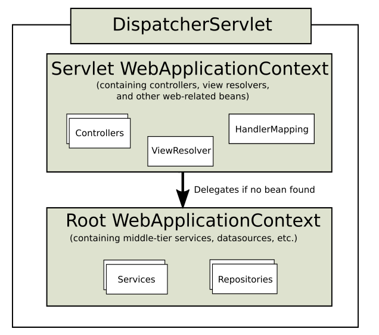

# Spring Web Servelt

- [Introduction](#introduction)
- [Dispatcher Servlet](#dispatcher-servlet)
  - [Servlet](#servlet)
  - [Context Hierarchy](#context-hierarchy)
  - [Dispatcher Abstraction for Framework Contract](#dispatcher-abstraction-for-framework-contract)
  - [Usage](#usage)
- [See also](#see-also)

## Introduction

- [spring-mvc 모듈](https://github.com/spring-projects/spring-framework/tree/main/spring-webmvc) 에 대한 것.

## Dispatcher Servlet

- `Servlet` 인데 실제 request를 processing하고 response를 rendering하는 일은 configurable delegate component에서 수행됨.
- `Servlet` 처럼 web.xml에 spec이 정의되어야 함

### Servlet

- a Java software component that extends the capabilities of a server.
- 여러 요청을 처리할 수 있는 component지만 주로 http requets를 처리.
- software component란 특정한 기능을 캡슐화 한 친구.

### Context Hierarchy

- 보통 Servlet WebApplicationContext 한개면 충분. 이건 Controller, View resolver 등을 가지고 있음.
- Root WebApplicationContext 가 있는데 Servlet WebApplicationContext에 빈이 없으면 빈을 Root에서 가져옴. Service, Repository 등 공통 빈을 가지고 있음.

### Dispatcher Abstraction for Framework Contract

Delegate들.

- [`HandlerMapping`](https://github.com/spring-projects/spring-framework/blob/main/spring-webmvc/src/main/java/org/springframework/web/servlet/HandlerMapping.java)
  - request를 handler에 mapping시킴.
  - 대표적인 구현체는 `@RequestMapping`를 처리하는 `RequestMappingHandlerMapping`가 있음.
  - HandlerMapping 구현체는 [`HandlerInterceptor`](https://github.com/spring-projects/spring-framework/blob/main/spring-webmvc/src/main/java/org/springframework/web/servlet/HandlerInterceptor.java) 들을 가지고 있어서 `preHandle(..)`, `postHandle(..)`, `afterCompletion()`을 처리.
- 이것들 모두 contract가 있지만 customizing 은 가능
- [`HandlerAdapter`](https://github.com/spring-projects/spring-framework/blob/main/spring-webmvc/src/main/java/org/springframework/web/servlet/HandlerAdapter.java)
  - `DispatcherServlet`가 handler를 호출 할 때 detail한걸 알 필요 없게 하기 위한 추상화.
- [`HandlerExceptionResolver`](https://github.com/spring-projects/spring-framework/blob/main/spring-webmvc/src/main/java/org/springframework/web/servlet/HandlerExceptionResolver.java)
  - 예외 처리.
- [`ViewResolver`](https://github.com/spring-projects/spring-framework/blob/main/spring-webmvc/src/main/java/org/springframework/web/servlet/ViewResolver.java)
  - handler로부터 받은 view name을 actual view에 mapping 시킴.
- [`LocaleResolver`](https://github.com/spring-projects/spring-framework/blob/main/spring-webmvc/src/main/java/org/springframework/web/servlet/LocaleResolver.java), [`LocaleContextResolver`](https://github.com/spring-projects/spring-framework/blob/main/spring-webmvc/src/main/java/org/springframework/web/servlet/LocaleContextResolver.java)
  - Locale 처리.
- [`ThemeResolver`](https://github.com/spring-projects/spring-framework/blob/main/spring-webmvc/src/main/java/org/springframework/web/servlet/ThemeResolver.java)
  - theme 설정.
- [`MultipartResolver`](https://github.com/spring-projects/spring-framework/blob/main/spring-web/src/main/java/org/springframework/web/multipart/MultipartResolver.java)
  - 파일 업로드 같은 multi part를 처리.
- [`FlashMapManager`](https://github.com/spring-projects/spring-framework/blob/main/spring-webmvc/src/main/java/org/springframework/web/servlet/FlashMapManager.java)
  - FlashMap을 저장하고 조회.
  - [`FlashMap`](https://github.com/spring-projects/spring-framework/blob/main/spring-webmvc/src/main/java/org/springframework/web/servlet/FlashMap.java)
    - 한 요청에서 저장하고 다른 요청에서 저장한 값을 쓸 수 있게 하는 객체.
    - HashMap 상속함.

### Usage

todo: servlet container랑 활용한 예시, 주로 delegate들 예시.

## See also

- [spring web servlet (official)](https://docs.spring.io/spring-framework/docs/current/reference/html/web.html)
- [Jakarta Servlet (wiki)](https://en.wikipedia.org/wiki/Jakarta_Servlet)
- [Component-based software engineering, Software component (wiki)](https://en.wikipedia.org/wiki/Component-based_software_engineering#Software_component)