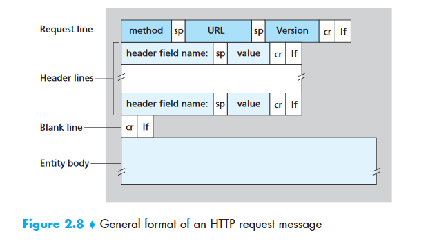
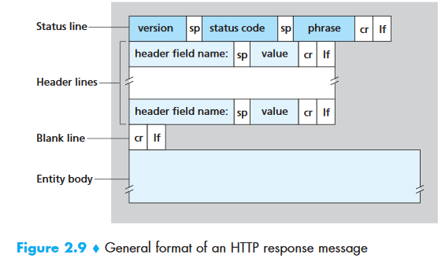
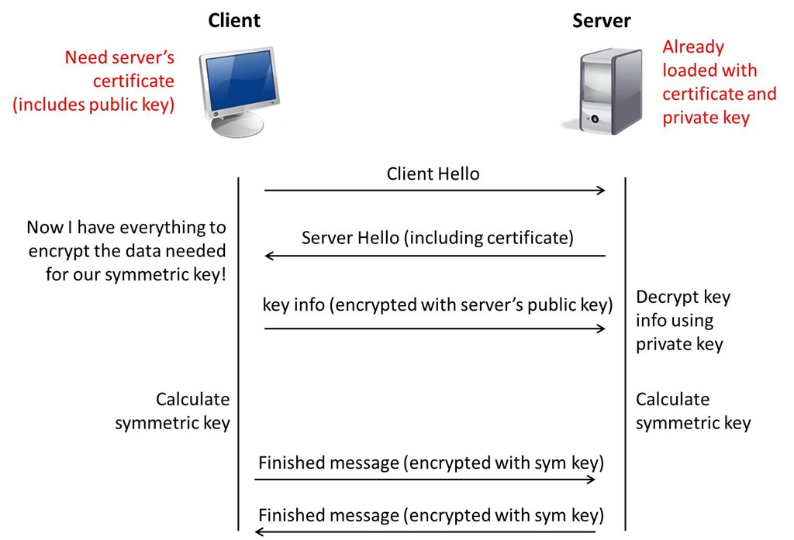
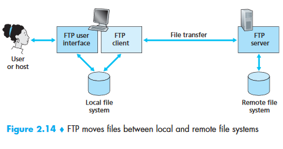
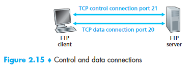
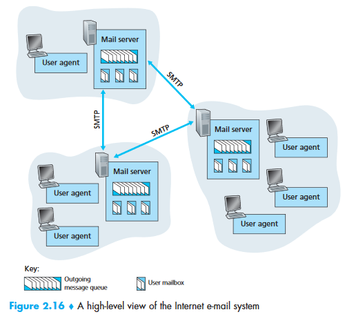
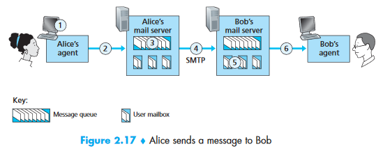

# Application Layer

- [HTTP](#http)
  - [Message Format](#message-format)
  - [Respones Code](#respones-code)
  - [GET vs POST](#get-vs-post)
  - [Keep Alive on HTTP](#keep-alive-on-http)
  - [Cookie vs Session](#cookie-vs-session)
- [HTTPS](#https)
- [FTP](#ftp)
- [SMTP](#smtp)
  - [HTTP vs SMTP](#http-vs-smtp)
- [WebSocket](#websocket)
- [Socket.io](#socketio)
- [References](#references)

## HTTP

- HyperText Transfer Protocol
- Application-level protocol로 보통 TCP 위에서 동작
- 보통 80 port 사용
- `http://` 로시작
- stateless protocol

### Message Format

Request



```text
GET /somedir/page.html HTTP/1.1
Host: www.someschool.edu
Connection: close
User-agent: Mozilla/5.0
Accept-language: fr
```

Response



```text
HTTP/1.1 200 OK
Connection: close
Date: Tue, 09 Aug 2011 15:44:04 GMT
Server: Apache/2.2.3 (CentOS)
Last-Modified: Tue, 09 Aug 2011 15:11:03 GMT
Content-Length: 6821
Content-Type: text/html

(contents..)
```

### Respones Code

- 2xx : 성공
  - 200 : Ok, 성공
- 3xx : 리다이렉션 완료
  - 301 : Moved Permanently, 영구 이동
  - 302 : Found, 임시적으로 url 이동
- 4xx : 클라이언트 오류
  - 400 : Bad Request, 잘못된 요청
  - 401 : Unauthorized, 인증 실패
  - 403 : Forbidden, 인가 실패
  - 404 : Not Found, 응 없어
- 5xx : 서버 오류
  - 500 : Internal Server Error, 알 수 없는 서버 오류

### GET vs POST

GET

- 데이터를 uri의 parameter로 전송
- 보통 데이터를 조회할 때 사용
- 장점
  - 같은 요청에 대해서 브라우저가 cache를 할 수 있음
- 단점
  - url의 크기제한
  - 보안상 취약

POST

- Request Body에 데이터를 담아서 전송
- 보통 서버의 값이나 상태를 변경할 때 사용
- 장점
  - 데이터 제한이 큼
  - GET보단 상대적으로 보안에 나음
- 단점
    - 같은 요청에 대해서 브라우저가 cache를 할 수 없음

### Keep Alive on HTTP

- 연결한 TCP 연결을 재활용 하기 위해 설정한 timeout 이내에 재요청을 하면 연결을 재사용.
- HTTP 1.1부터 생김
- Header
  ```text
  Connection: Keep-Alive 
  ```
- 장점
  - 커넥션 재활용 가능
- 단점
  - Timeout을 너무 오래 설정하면 서버의 가용성이 떨어짐.

### Cookie vs Session

Cookie

- Client에 key, value를 저장하는 파일.
- 동작 방식
  - 브라우저가 서버에 요청
  - 서버가 응답할 때 HTTP header에 쿠키를 포함해서 전송
    ```text
    Set−Cookie: id=hey
    ```
  - client는 받은 cookie 값을 브라우저에 저장하고 있다가 다음 전송 때 http header에 넣어서 전송.
    ```text
    cookie: id=hey
    ```

Session

- 일정 시간 동안 같은 브라우저로부터 들어오는 요청을 하나의 상태로 보고 그 상태를 유지하는 기술.
- 동작 방식
  - 브라우저가 서버에 요청
  - 서버가 응답할 때 쿠키에 session id를 전송
    ```text
    Set−Cookie: JSESSIONID=xdfml3w21l
    ```
  - client는 받은 session id 값을 쿠키에 저장하고 있다가 다음 전송 때 http header에 넣어서 전송.
    ```text
    cookie: JSESSIONID=xdfml3w21l
    ```

## HTTPS



- HyperText Transfer Protocol Secure 
- HTTP통신할 때 Transfer layer에 TLS(Transport Layer Security)를 적용한 것로 덮어쓴 것
- 보통 443 port 사용
- 동작 과정
  - 클라이언트가 서버에 요청.
  - 서버가 인증서를 클라이언트에 전송. 인증서는 서버의 공개키를 인증기관(Certificate Authority, CA)이 개인키로 암호화한 것임.
  - 클라이언트는 CA의 개인키에 대응되는 공개키를 사용하여 서버의 공개키를 추출.
  - 클라이언트가 대칭키로 사용할 임의의 키를 서버의 공개키로 암호화하여 서버에 전송.
  - 서버에서는 자신의 개인키로 임의의 키를 복호화하여 대칭키 암호방식으로 암호화 해서 클라이언트와 통신.
- 장점
  - HTTP에 비해서 보안성 높음.
- 단점
  - 암호화/복호화 하는 비용.
  - 연결이 끊기면 재인증 시간이 필요.

## FTP





- File Transfer Protocol
- 파일을 옮기기 위한 프로토콜
- TCP 위에서 동작
- 2개의 TCP connection이 필요
  - control connection
    - 두 host간 id, password, command 등을 전송하기 위해 사용
    - 보통 21 port 사용
  - data connection
    - 실제 파일 데이터 전송
    - 보통 20 port 사용

## SMTP





- Simple Mail Transfer Protocol
- 메일을 보내기 위해 사용
- TCP 위에서 동작
- 동작 과정
  1. Alice invokes her user agent for e-mail, provides Bob’s e-mail address.
  2. Alice’s user agent sends the message to her mail server, where it is placed in a message queue.
  3. The client side of SMTP, running on Alice’s mail server, sees the message in the message queue. It opens a TCP connection to an SMTP server, running on Bob’s mail server.
  4. After some initial SMTP handshaking, the SMTP client sends Alice’s message into the TCP connection.
  5. At Bob’s mail server, the server side of SMTP receives the message. Bob’s mail server then places the message in Bob’s mailbox.
  6. Bob invokes his user agent to read the message at his convenience.

### HTTP vs SMTP

- HTTP
  - 서버에 뭔가 올려놓고 클라이언트가 요청하는 pull protocol임
- SMTP
  - mail server로 mail 보내는 push protocol임

## WebSocket

- http기반에서 bidirectional communication을 제공하려고 만들어짐.
- http와 같은 같이 80, 443 port 사용
- `ws://` 로시작
- 장점
  - http request를 그대로 사용하기 때문에 http의 기능을 그대로 사용할 수 있음.

## Socket.io

- client로 push를 지원하는 다양한 방식을(Ajax, WebSocket, ...) 추상화 해놓은 node.js 모듈 .
- 장점
  - WebSocket를 지원하지 않는 브라우저에서 사용하면 알아서 Ajax 등 되는 방식으로 처리해줌.

## References

- Common
  - [Computer-Networks-for-Interviews, notescs](https://github.com/notescs/notes/tree/main/Computer-Networks-for-Interviews)
  - [네트워크통신 면접, hyeonu1258](https://hyeonu1258.github.io/2018/03/10/%EB%84%A4%ED%8A%B8%EC%9B%8C%ED%81%AC%ED%86%B5%EC%8B%A0%20%EB%A9%B4%EC%A0%91/)
  - [https://github.com/JaeYeopHan/Interview_Question_for_Beginner](https://github.com/JaeYeopHan/Interview_Question_for_Beginner)
  - [https://github.com/WeareSoft/tech-interview](https://github.com/WeareSoft/tech-interview)
- HTTP
  - [HTTP 상태 코드, wiki](https://ko.wikipedia.org/wiki/HTTP_%EC%83%81%ED%83%9C_%EC%BD%94%EB%93%9C)
  - [List of HTTP status codes, wiki](https://en.wikipedia.org/wiki/List_of_HTTP_status_codes)