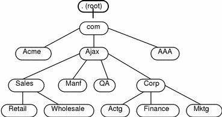
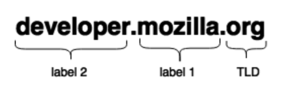
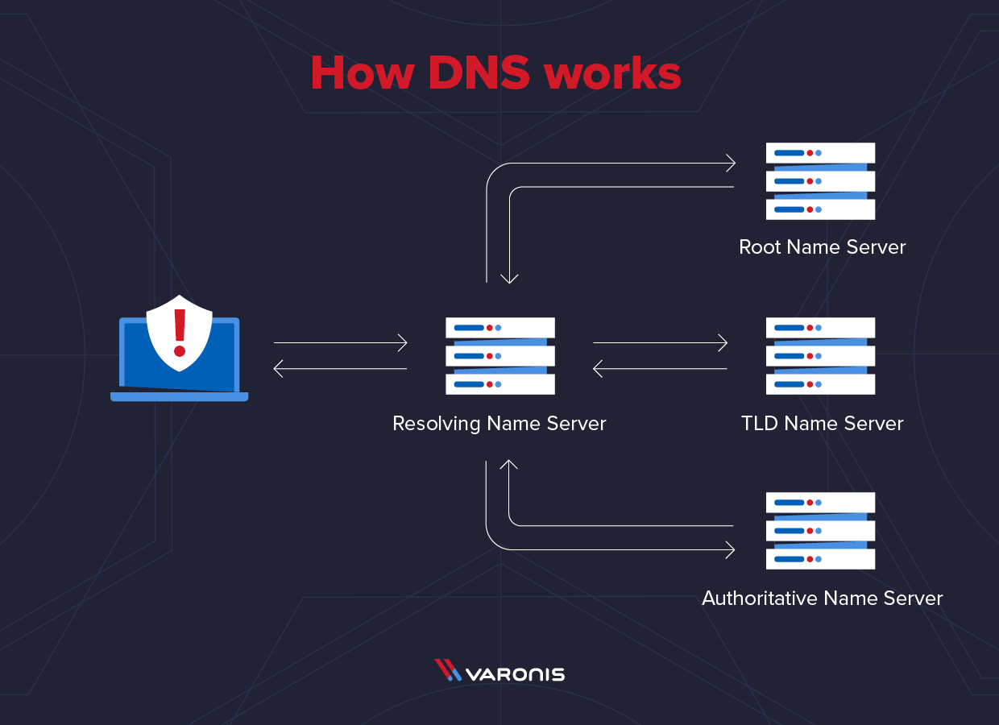

# Domain Name System

- [Domain Name System](#domain-name-system)
  - [Term](#term)
  - [Domain Name](#domain-name)
  - [DNS Namespace Hierarchy](#dns-namespace-hierarchy)
  - [How does a DNS request work?](#how-does-a-dns-request-work)
  - [Get domain information](#get-domain-information)
  - [Buying a domain name](#buying-a-domain-name)
  - [References](#references)

## Term

- Structure
  - TLD (Top Level Domain)
  - SLD (Secondary Level Domain)
  - Label
- Server Type
  - Resolving Name Server : Root Name Server가 어디있는지 알음. domain name 정보 받아서 처리.
  - Root Name Server : TLD Name Server가 어디있는지 알음.
  - TLD Name Server : Authoritative Name Server가 어디있는지 알음.
  - Authoritative Name Server : 실제 IP Address을 알음.
- Organizations
  - ICANN (Internet Corporation for Assigned Names and Numbers) : DNS Root 관리 등을 하는 비영리기관.
  - Domain Name Registry : TLD를 관리하는 기관. (eg. KISA)
  - Domain Name Registrar : top-level domain (gTLD) registry or a country code top-level domain (ccTLD) registry에 의해 공인받은 기관이로 도메인 이름 등록을 관리하고 관련 서비스를 제공. (eg. 가비아, 카페 24)
- DDNS (Dynamic DNS) : 도메인의 IP가 유동적인 경우 이를 계속 반영.
- DHCP (Dynamic Host Configuration Protocol) : PC에 자동으로 네임 서버 주소, IP 주소, 게이트웨이 주소 등을 할당해줌.

## Domain Name

- IP를 사람이 읽기 쉬운 형식으로 표현한 것 (eg. 192.168.0.1 -> www.google.com)
- 마지막에 root namespace인 '.'이 생략되어서 사용 (eg. www.google.com은 사실 www.google.com. 임)

## DNS Namespace Hierarchy





- Root
  - Root domain인 '.'에서 시작
- TLD (Top Level Domain)
  - Root domain 다음으로 있는것
  - Type
    - Generic TLD : 일반 TLD(eg. `.com`, `.org`, `.net`)
    - Local TLD : 해당 언어로 제공하거나 해당 국가에서 호스팅 함 (eg. `.us`, `.fr`, ...)
    - 정부용 TLD : `.gov`
    - ...
- Label
  - TLD 다음에 있는 것으로 여러개가 있을 수 있음
  - TLD 바로 옆에 있는 Label을 SLD (Secondary Level Domain)라고도 부름

## How does a DNS request work?



- Browser에 domain name (example.com.)을 입력하면 OS에 요청해서 Resolving Name Server에 IP Address를 요청.
- Resolving Name Server는 Root name Server에 요청해서 TLD Name Server (`com` name server)에 대한 정보를 받음.
- Resolving Name Server는 TLD Name Server로 가서 Authoritative Name Server (`example.com` name server)에 대한 정보를 받음.
- Resolving Name Server는 Authoritative Name Server로 가서 domain name에 매칭되는 IP Address를 받아서 os에 반환.
- OS는 Browser에 받은 IP Address를 넘김.

## Get domain information

```sh
> whois naver.com

Domain Name: NAVER.COM
Registry Domain ID: 793803_DOMAIN_COM-VRSN
Registrar WHOIS Server: whois.gabia.com
Registrar URL: http://www.gabia.com
Updated Date: 2020-10-22T01:15:57Z
Creation Date: 1997-09-12T04:00:00Z
Registry Expiry Date: 2023-09-11T04:00:00Z
Registrar: Gabia, Inc.
Registrar IANA ID: 244
Registrar Abuse Contact Email: abuse@gabia.com
Registrar Abuse Contact Phone: +82.2.829.3543
Domain Status: clientDeleteProhibited https://icann.org/epp#clientDeleteProhibited
Domain Status: clientTransferProhibited https://icann.org/epp#clientTransferProhibited
Domain Status: clientUpdateProhibited https://icann.org/epp#clientUpdateProhibited
Name Server: E-NS.NAVER.COM
Name Server: NS1.NAVER.COM
Name Server: NS2.NAVER.COM
DNSSEC: unsigned
URL of the ICANN Whois Inaccuracy Complaint Form: https://www.icann.org/wicf/
```

## Buying a domain name

- Domain을 구매한다는 것은 없음. 해당 domain을 일정 기간동안 사용할 수 있는 권리를 구매하는 것.
- Domain Name Registrars (도메인 등록 대행자)에 등록 요청.
- 일정 시간이 지난 후 DNS 서버들이 갱신되고 사용 가능해짐.

## References

- [What is a Domain Name? (mdn)](https://developer.mozilla.org/en-US/docs/Learn/Common_questions/What_is_a_domain_name)
- [DNS Explained (youtube)](https://www.youtube.com/watch?v=72snZctFFtA)
- [What is DNS? (varonis)](https://www.varonis.com/blog/what-is-dns/)
- [Introducing the DNS Namespace (oracle)](https://docs.oracle.com/cd/E19455-01/806-1387/6jam692f3/index.html)
- [ICANN (archive.icann)](https://archive.icann.org/tr/english.html)
- [Domain name registrar (wikipedia)](https://en.wikipedia.org/wiki/Domain_name_registrar)