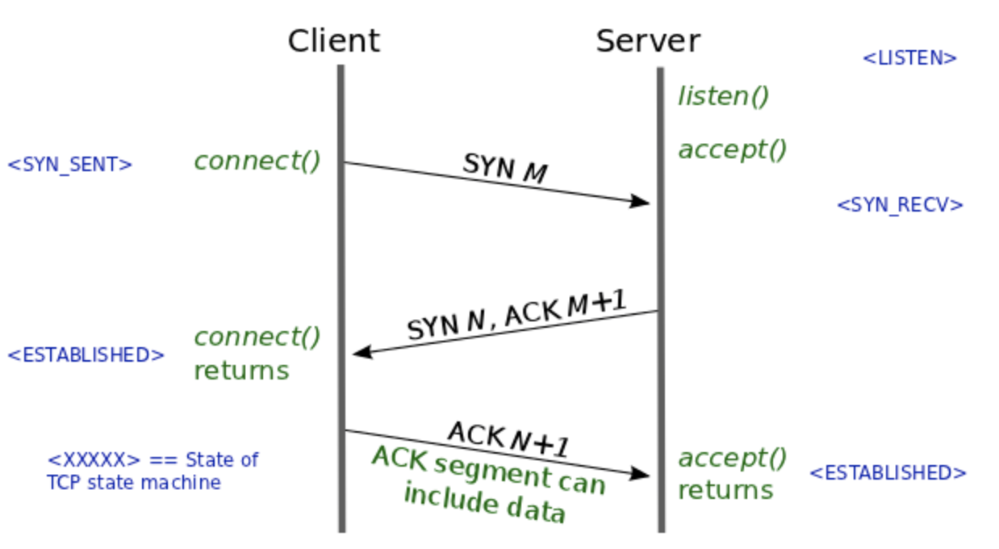
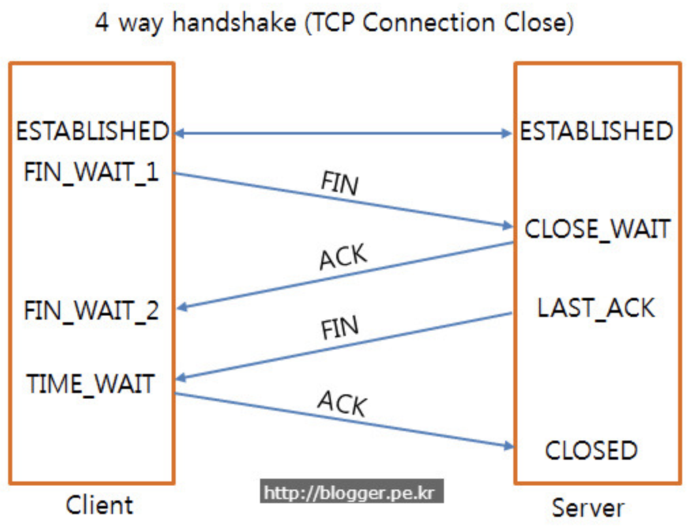

# Transport Layer

## TCP

- Transmission Control Protocol
- 연결지향형
- 흐름 및 혼잡제어를 함
- 장점
  - 데이터 전송의 신뢰성을 보장
- 단점
  - UDP보다 느림

### TCP 3 way handshaking : on connection

A: 가도됨? B: ㅇㅋ. A: 간다!!!!

- 클라이언트에서 서버로 SYN(M)보냄
- SYN(M)을 받은 서버는 클라이언트에 ACK(M + 1)과 SYN(N)을 보냄
- ACK(M + 1), SYN(N)을 받은 클라이언트는 ESTABLISHED 상태로 전환하고 ACK(N + 1)을 보냄
- ACK(N + 1)을 받은 서버는 ESTABLISHED 상태로 전환

### TCP 4 way handshaking : on disconnection

A: 끊을게. B: 어 잠깐만 마저 하고, B: 어 다 했어 끊어. A : ok bye~

- 클라이언트가 FIN을 서버에 보냄
- FIN으 받은 서버가 클라이언트에 ACK를 보냄
- 서버가 보내던 데이터를 다 보내면 클라이언트에 FIN을 보냄
- FIN을 받은 클라이언트는 TIME_WAIT 상태로 변경되고 서버에 ACK를 보냄
- ACK를 받은 서버는 CLOSED 로 변경

### Keep Alive on TCP

- payload가 없는 패킷을 주기적으로 보내는 것
- 양쪽중 한쪽이 죽었을 때 다른 한 쪽을 정리하기 위해 사용

## UDP

- User Datagram Protocol
- 비연결형
- 각각의 패킷은 독립적으로 다른 경로로 전송됨.
- 장점
  - TCP보다 빠름
- 단점
  - 데이터 전송의 신뢰성을 보장하지 않음

## References

- Common
  - [Computer-Networks-for-Interviews, notescs](https://github.com/notescs/notes/tree/main/Computer-Networks-for-Interviews)
  - [네트워크통신 면접, hyeonu1258](https://hyeonu1258.github.io/2018/03/10/%EB%84%A4%ED%8A%B8%EC%9B%8C%ED%81%AC%ED%86%B5%EC%8B%A0%20%EB%A9%B4%EC%A0%91/)
  - [https://github.com/JaeYeopHan/Interview_Question_for_Beginner](https://github.com/JaeYeopHan/Interview_Question_for_Beginner)
  - [https://github.com/WeareSoft/tech-interview](https://github.com/WeareSoft/tech-interview)