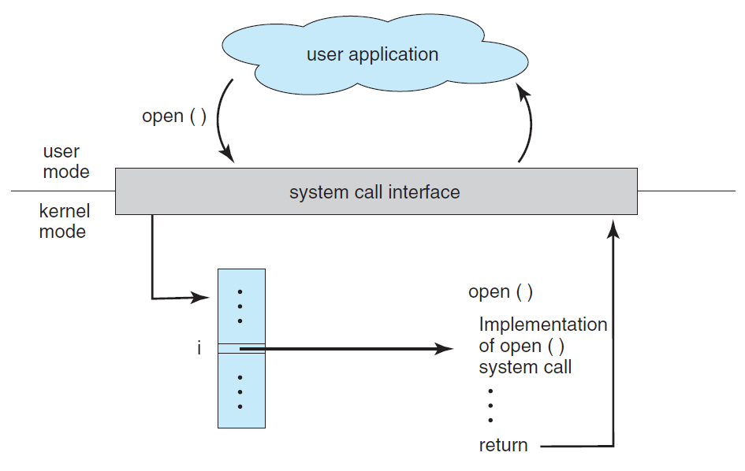
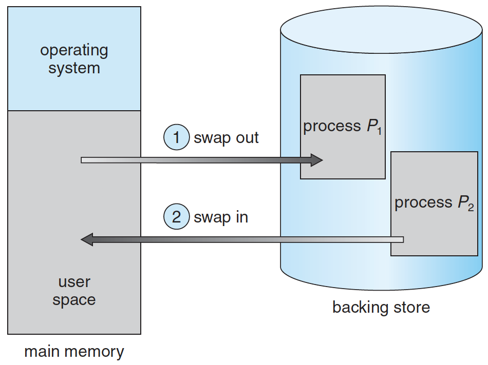
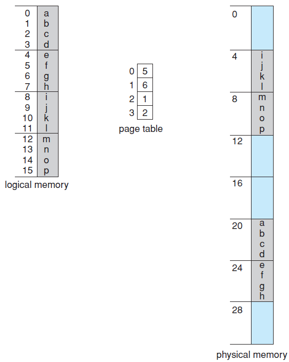

# Operating System

- [Operating System](#operating-system)
  - [User Mode vs Kernal Mode](#user-mode-vs-kernal-mode)
  - [Process Management](#process-management)
    - [Process vs Thread](#process-vs-thread)
    - [Process Synchronization](#process-synchronization)
      - [Critical Section](#critical-section)
      - [Spinlock](#spinlock)
      - [Monitors](#monitors)
    - [Deadlocks](#deadlocks)
  - [Memory Management](#memory-management)
    - [Swapping](#swapping)
    - [Fragmentation](#fragmentation)
    - [Paging](#paging)
    - [Segmentation](#segmentation)
    - [Virtual Memory](#virtual-memory)
  - [Storage Management](#storage-management)
    - [Cache Locality](#cache-locality)
  - [Etc](#etc)
    - [Blocking / Non-Blocking I/O, Synchronous / Asynchronous Programming](#blocking--non-blocking-io-synchronous--asynchronous-programming)
  - [References](#references)

## User Mode vs Kernal Mode

- 프로그램이 동작 하다가 I/O등 시스템 콜을 하면 kernal mode로 진입
- I/O등의 작업이 끝나면 다시 user mode로 돌아감

## Process Management

### Process vs Thread

- Process
  - OS로부터 CPU, Memory 등 자원을 받아서 일하는 녀석
  - 메모리는 Code, Heap, Data등으로 구성
  - 장점 : 서로 다른 프로세스가 분리되어 있어서 한 프로세스가 죽어도 다른 프로세스에 영향이 없음
  - 단점 : 프로세스간 다른 메모리 영역을 사용해서 자원 공유가 힘들고 Context Switching 비용이 큼
- Thread
  - Process의 실행 단위
  - Process안의 Code, Heap, Data를 공유하고 Thread별로 별도의 Stack영역을 가짐
  - 장점 : 한 Process의 메모리 공간을 공유해서 자원 공유가 쉽고 Context switching비용이 작음
  - 단점 : 자원 공유를 할 때 동시성 문제를 제어해야 함

---

### Process Synchronization

#### Critical Section

- 둘 이상의 Thread가 동시에 접근할 수 없는 영역. 동시에 접근하면 race condition을 야기 (check-then-act)
- 해결방법
  - Mutex : 자원에 한개의 thread만 접근 가능
  - Counting Semaphore : 해당 자원을 얼마만큼 사용할 수 있느냐

#### Spinlock

- Critical Section에 진입이 불가능 할 때 진입이 가능할 때 까지 loop를 돌면서 재시도하는 방식.
- 장점 : Context switching이 필요 없음
- 단점 : CPU시간이 낭비될 수 있음

#### Monitors

- 공유 자원과 그것에 대한 mutual exclusion을 보장하는 operation들을 포함하는 일종의 ADT(Abstract Data Type)
- 공유 자원에 접근하기 위한 키 획득과 해제를 추상화해서 처리해줌
- Java에서 synchronized를 거는게 monitor lock이라고 하는데 이게 이거임 (bytecode에서 monitorenter, monitorexit을 삽입함)

### Deadlocks

- 두개의 프로세스 이상이 서로 상대 프로세스가 끝나길 기다리고 있어서 아무것도 완료되지 못하는 상황
- 4가지 조건이 동시에 성립해야만 발생
  - Mutual exclusion : 자원은 한 번에 한 프로세스만이 사용할 수 있음
  - Hold and wait : 하나의 자원을 점유하고 있으면서 다른 프로세스에 할당되어 사용하고 있는 자원을 점유하기 위해 대기하는 프로세스가 있어야 함
  - No preemption : 자원에 대한 선점이 불가능
  - Circular wait : 자원을 대기하는 프로세스간 Cycle이 있어야 함 (e. A -> B, B -> C, C -> A)

[위로](#Operating-System)

---

## Memory Management

### Swapping

메모리 관리를 위해 Memory에 있는 Process를 Disk로 내보내고 다시 불러오는 작업을 하는 것

### Fragmentation

- Fragmentation
  - 외부 단편화 : Process들이 차지하는 memory영역 사이에 사용하지 않는 틈이 생기는 것
    - Compaction
      - 외부 단편화를 해소하기 위해 프로세스가 사용하는 공간들을 한쪽으로 몰아서 자유공간을 확보하는 기법
      - JVM의 Old Generation이 Object에 대해서 이 작업을 함
  - 내부 단편화 : Process에 memory를 할당할 때 특정 단위로 할당해서 실제 사용하지 않는 부분이 생김. 이 부분을 말함

### Paging

- 프로세스를 일정 크기의 page로 나누어서 frame단위로 나눈 메모리에 적재하는 방식. 프로세스가 사용하는 공간이 연속적이지 않아도 됨.
- 장점
  - 외부 단편화를 해결
  - 같은 프로그램을 사용하는 프로세스간 메모리의 공유가 가능
- 단점
  - frame 크기에 따라 내부 단편화가 더 심해질 수 있음

### Segmentation

- Process를 논리적인 segment의 단위로 구분해서 메모리에 적재하는 기법
  - 장점
    - 같은 프로그램을 사용하는 프로세스간 메모리의 공유가 가능
  - 단점
    - 외부 단편화

### Virtual Memory

- 가상 주소 공간을 실제 물리 메모리 보다 크게 잡아서 메모리 용량보다 더 많은 process를 올리는 기법
- 프로그램 실행 시작 시에 프로그램 전체를 Memory에 올리지 않고 필요한 것만 올리는 Depend Paging (요구 페이징)을 사용. 그렇기 때문에 필요한 page가 없는 경우 page fault가 발생
- Page fault가 발생하면 page를 디스크에서 가져와야함. But 이 때 물리 메모리가 가득 차 있는 경우 page replacement가 이루어져야함
- Page Replacement Algorithm
  - First-In First-Out (FIFO) : 가장 먼저 메모리에 들어온 페이지를 교체
    - 문제점 : `Belady의 모순`: 페이지를 저장할 수 있는 페이지 프레임의 갯수를 늘려도 되려 페이지 부재가 더 많이 발생하는 모순이 발생
  - Optimal : 앞으로 가장 오랫동안 사용되지 않을 페이지를 찾아 교체 (불가능)
  - Least Recently Used (LRU) : 가장 오랫동안 사용되지 않은 페이지를 선택하여 교체
  - Least Frequently Used (LFU) : 참조 횟수가 가장 적은 페이지를 교체
  - Most Frequently Used (MFU) : 참조 횟수가 가장 많은 페이지를 교체

[위로](#Operating-System)

---

## Storage Management

### Cache Locality

- Cache의 적중률을 극대화 시키기 위해 사용되는 원리
  - Temporal Locality (시간 지역성) : 최근에 참조된 주소는 조만간 다시 참조되는 특성
  - Spatical Locality (공간 지역성) : 참조된 주소와 인접한 주소의 내용이 다시 참조되는 특성
    - eg. array

## Etc

### Blocking / Non-Blocking I/O, Synchronous / Asynchronous Programming

- Blocking I/O vs Non-Blocking I/O
  - Kernal에 I/O를 요청한 후 ready queue에 들어가서 기다리면 blocking, 안들어가고 바로 응답을 보내면 non-blocking
- Synchronous vs Asynchronous
  - return시간과 요청 결과를 얻는 시간이 같으면 synchronous, 다르면 asynchronous
- Non-Blocking I/O vs Asynchronous
  - 관점이 다를 뿐임. Asynchronous를 위한 재료로써 Non-blocking I/O가 활용될 수 있으나 필수조건은 아님. I/O를 다른 Thread에 위임하고 그 thread는 blocking하고 있어도 Asynchronous 한거임

[위로](#Operating-System)

---

## References

Basic

https://github.com/JaeYeopHan/Interview_Question_for_Beginner/tree/master/OS

OS book

http://os-book.com/OS9/slide-dir/index.html

blocking, non-blocking, synchronous, Asynchronous

http://asfirstalways.tistory.com/348

https://tech.peoplefund.co.kr/2017/08/02/non-blocking-asynchronous-concurrency.html