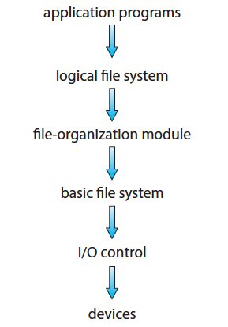
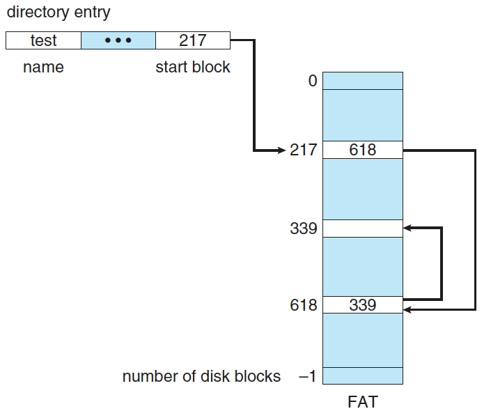
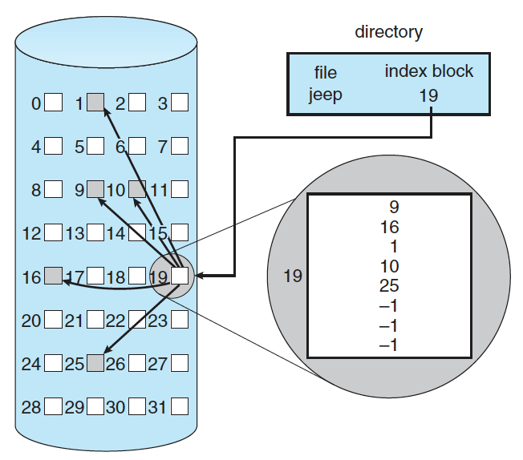

# File System

- [File System Interface](#file-system-interface)
  - [File](#file)
    - [File Attributes](#file-attributes)
    - [File Operations](#file-operations)
  - [Access Method](#access-method)
    - [Sequential Access](#sequential-access)
    - [Direct Access](#direct-access)
    - [Other Access Methods](#other-access-methods)
  - [Directory](#directory)
  - [Directory Structure](#directory-structure)
  - [Mounting](#mounting)
  - [File Sharing](#file-sharing)
  - [File Protection](#file-protection)
- [File-System Implementation](#file-system-implementation)
  - [Structure](#structure)
  - [Implementation](#implementation)
  - [Directory Implementation](#directory-implementation)
    - [Linear List](#linear-list)
    - [Hash Table](#hash-table)
  - [Allocation Methods](#allocation-methods)
    - [Contiguous Allocation](#contiguous-allocation)
    - [Linked Allocation](#linked-allocation)
    - [File-Allocation Table (FAT)](#file-allocation-table-fat)
    - [Indexed Allocation](#indexed-allocation)
  - [Free-Space Management](#free-space-management)
  - [Bit Vector](#bit-vector)
    - [Linked List](#linked-list)
  - [Efficiency](#efficiency)
  - [Performance](#performance)
  - [Recovery](#recovery)
- [Reference](#reference)

## File System Interface

### File

- Storage에 대한 추상화를 파일이라고 함.
- 파일에 접근하기 위해서는 파일을 open하고 처리 후 close해야 함.
- File lock도 제공.

#### File Attributes

- Name
- Identifier
- Type
- Location
- Size
- Protection
- Time & Date
- User ID

#### File Operations

- Creating
- Writing
- Reading
- Deleting
- Repositioning : 해당 file에서 데이터 찾는거. I/O 안일어남.
- Truncating : 파일 삭제 안하고 파일 contents 만 다 지우는거.

### Access Method

#### Sequential Access

- magnetic tape 과 비슷한 operation을 제공.
  - read next
  - write next
  - rewind
  - skip n records

#### Direct Access

- record로 jump해서 읽을 수 있는 operation을 제공.
  - read n
  - write n
  - jump to record n

#### Other Access Methods

- Direct access 기반으로 index 같은거를 할 수도 있음.

### Directory

todo

### Directory Structure

### Mounting

### File Sharing

### File Protection

## File-System Implementation

### Structure

### Implementation

todo : 해야하나?

### Directory Implementation

- Goal : Fast to search/insert/delete with minimum space.

#### Linear List

#### Hash Table

### Allocation Methods

- 파일을 disk에 할당하는 방법.

#### Contiguous Allocation

- disk에 연달아서 file을 할당.
- 장점
  - 이어서 있어서 읽기가 쉬움.
- 단점
  - 외부 단편화가 발생 가능.
  - 파일 크기를 예측 불가능하기 때문에 공간이 남거나 모자라는 경우가 많아짐.

#### Linked Allocation

- disk의 block을 link해서 file을 할당. 각 block에 link에 대한 정보가 담겨있음.
- 장점
  - 외부단편화가 없음.
  - 동적으로 파일 사이즈 증가 가능.
- 단점
  - random access일때 처음부터 순회해야 함.
  - pointer가 손상되면 문제가 될 여지가 있음.
    - Doubly linked list를 사용해서 리스크를 줄일 수 있음.

#### File-Allocation Table (FAT)

#### Indexed Allocation
  

- 파일에 대한 block number를 한 block에 기록해서 관리하는 방법.
- 장점
  - 외부단편화 제거.
  - random access 가능.
- 단점
  - index를 관리하기 위한 공간 낭비가 있음.

### Free-Space Management

- free space를 관리해서 요청이 온 경우 빠르게 할당하는 방법.

### Bit Vector

- 1 : free, 0 : allocated.
- 장점
  - 연달아서 빈 block을 찾기 쉬움.
- 단점
  - bitmap을 저장해야 해서 공간 낭비.

#### Linked List

- 빈 block을 Linked List로 이어서 관리
- 장점
  - 빈 block 할당할때 Linked List에서 그냥 빼면 됨.
- 단점
  - 물리적으로 붙어 있는 빈 block을 찾기 힘듬.

### Efficiency

### Performance

### Recovery

## Reference

- Operating System Concepts (Operating System Concepts, Ninth Edition)
  - [File-System Interface](https://www.cs.uic.edu/~jbell/CourseNotes/OperatingSystems/11_FileSystemInterface.html)
  - [File-System Implementation](https://www.cs.uic.edu/~jbell/CourseNotes/OperatingSystems/12_FileSystemImplementation.html)