# Memory Management

- [Main Memory](#main-memory)
  - [How to seperate memory space between process?](#how-to-seperate-memory-space-between-process)
  - [Logical Address Space vs Physical Address Space](#logical-address-space-vs-physical-address-space)
  - [Swapping](#swapping)
  - [Fragmentation](#fragmentation)
  - [Segmentation](#segmentation)
  - [Paging](#paging)
- [Virtual Memory](#virtual-memory)
  - [Demand Paging](#demand-paging)
  - [Page Fault](#page-fault)
  - [Copy-on-Write Fork](#copy-on-write-fork)
- [Page Replacement](#page-replacement)
  - [Page Replacement Algorithm](#page-replacement-algorithm)
  - [First-In First-Out (FIFO) Page Replacement Algorithm](#first-in-first-out-fifo-page-replacement-algorithm)
  - [Optimal Page Replacement Algorithm](#optimal-page-replacement-algorithm)
  - [Least Recently Used (LRU) Page Replacement Algorithm](#least-recently-used-lru-page-replacement-algorithm)
  - [Least Frequently Used (LFU) Page Replacement Algorithm](#least-frequently-used-lfu-page-replacement-algorithm)
  - [Most Frequently Used (MFU) Page Replacement Algorithm](#most-frequently-used-mfu-page-replacement-algorithm)
  - [Page-Buffering Algorithms](#page-buffering-algorithms)
- [Allocation of Frames](#allocation-of-frames)
  - [Thrashing](#thrashing)
  - [Working-Set Model](#working-set-model)
  - [Memory-Mapped Files](#memory-mapped-files)
- [Example](#example)
- [Reference](#reference)

## Main Memory

- Every instruction has to be fetched from memory before it can be executed, and most instructions involve retrieving data from memory or storing data in memory or both.

### How to seperate memory space between process?

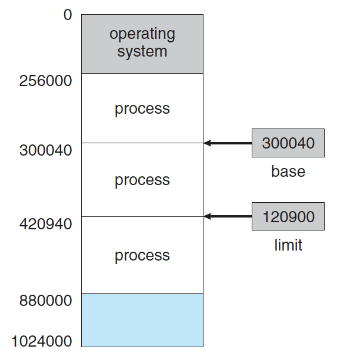

- base register에 Physical memory address를 담고 limit register에 사이즈를 담아서 구분.

### Logical Address Space vs Physical Address Space

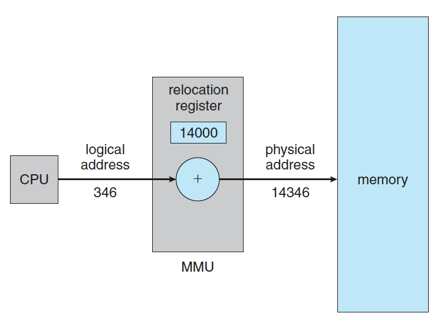

- CPU에서는 실제 Logical Address를 사용하고 이를 memory-management unit (MMU)가 relocation register에 기반해서 Physical Address로 바꿈.

### Swapping

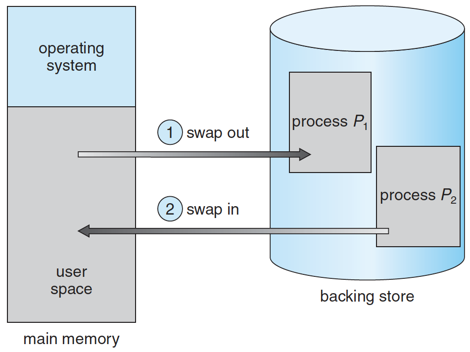

- 메모리 관리를 위해 Memory에 있는 Process를 Disk로 내보내고 (swap out) 다시 불러오는 (swap in) 작업을 하는 것.

### Fragmentation

- External Fragmentation : Process들이 차지하는 memory영역 사이에 사용하지 않는 틈이 생기는 것.
  - Solution : Compaction
    - 외부 단편화를 해소하기 위해 프로세스가 사용하는 공간들을 한쪽으로 몰아서 자유공간을 확보하는 기법.
    - JVM의 Old Generation이 Object에 대해서 이 작업을 함.
- Internal Fragmentation : Process에 memory를 할당할 때 특정 단위로 할당해서 실제 사용하지 않는 부분이 생겨서 발생.

### Segmentation

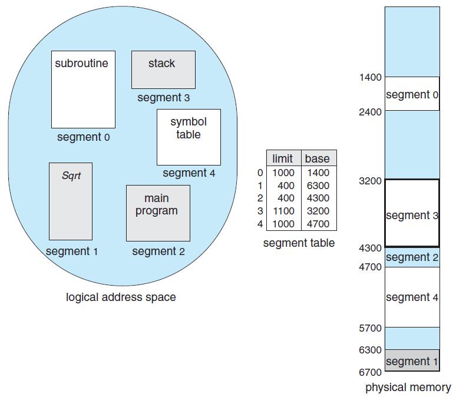

- Process를 논리적인 segment의 단위로 구분해서 메모리에 적재하는 기법.
- 장점
  - 같은 프로그램을 사용하는 프로세스간 메모리의 공유가 가능.
- 단점
  - 외부 단편화.

### Paging

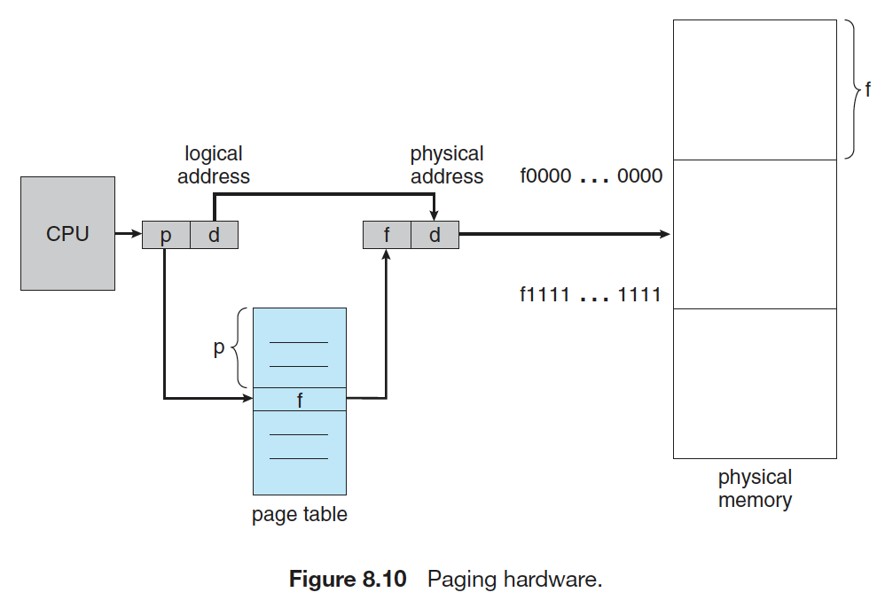

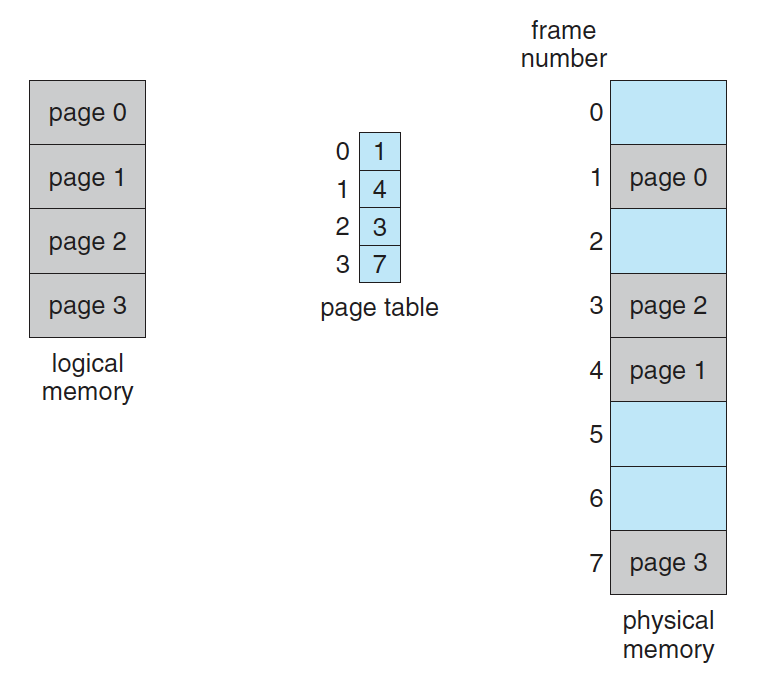

- Logical memory space를 특정 크기의 page, Physical memory space를 같은 크기의 frame으로 나누어서 page를 서로 연속적이지 않은 frame에 할당하는 방식.
- Page table이란걸 둬서 page를 어떤 frame에 할당했는지를 기록.
- 장점
  - 외부 단편화를 해결.
  - 같은 program이나 같은 shared library를 사용하는 proces간 page의 공유가 가능.
- 단점
  - frame 크기에 따라 내부 단편화가 더 심해질 수 있음.

## Virtual Memory

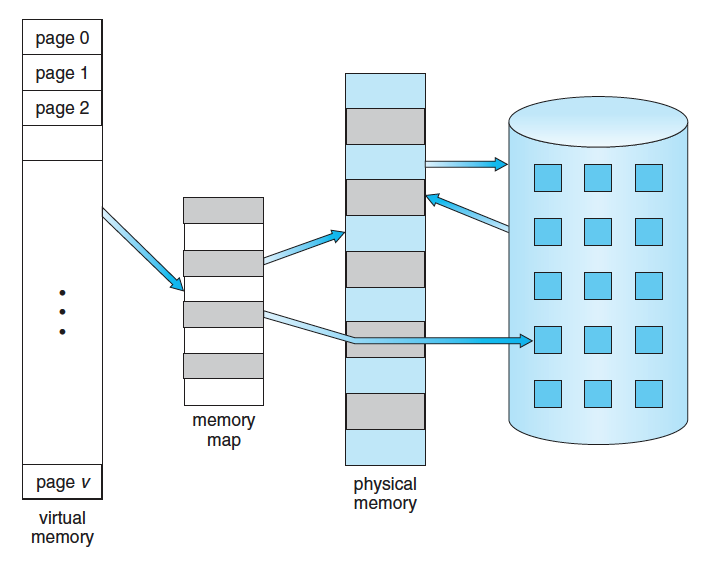

- 실제로 사용 가능한 memory를 추상화 해서 사용자에게 큰 memory로 보게 만드는 기법.

- 가상 주소 공간을 실제 물리 메모리 보다 크게 잡아서 메모리 용량보다 더 많은 process를 올리는 기법
- 프로그램 실행 시작 시에 프로그램 전체를 Memory에 올리지 않고 필요한 것만 올리는 Depend Paging (요구 페이징)을 사용. 그렇기 때문에 필요한 page가 없는 경우 page fault가 발생

### Demand Paging

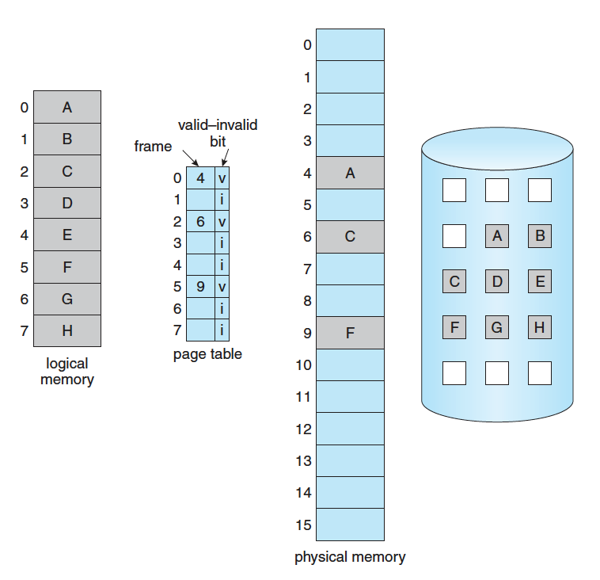

- Process가 사용하는 page를 memory에 올릴 때 (swap in) 전부 올리지 않고 사용하는 page만 올리는 기법.
- Page table에 validity bit를 추가해서 올라와있지 않는 page는 invalid로 표시해 둠.

### Page Fault

- Process가 사용하려는 page가 physical memory에 올라와 있지 않는 경우.

### Copy-on-Write Fork

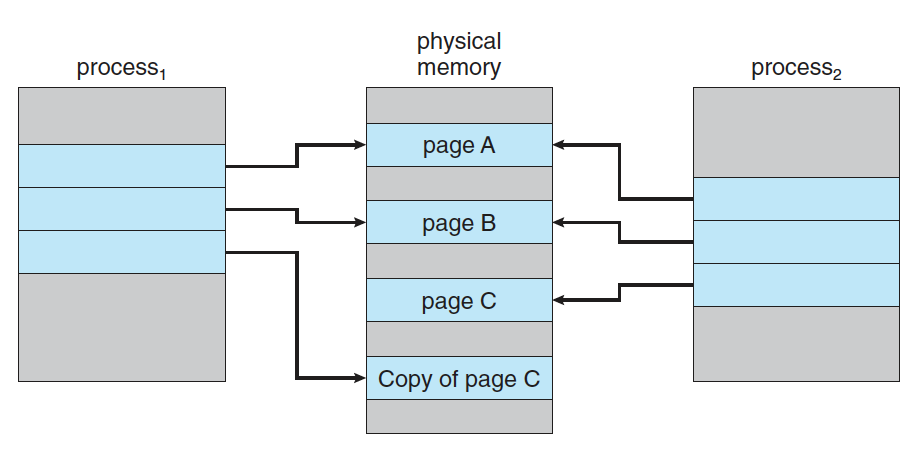

- 한 process가 fork하면 child process가 memory의 값을 바꾸지 않는 이상 parent process와 같은 page를 사용 가능.
- child process가 memory의 값을 변경시 해당 page만 copy해서 write.

## Page Replacement

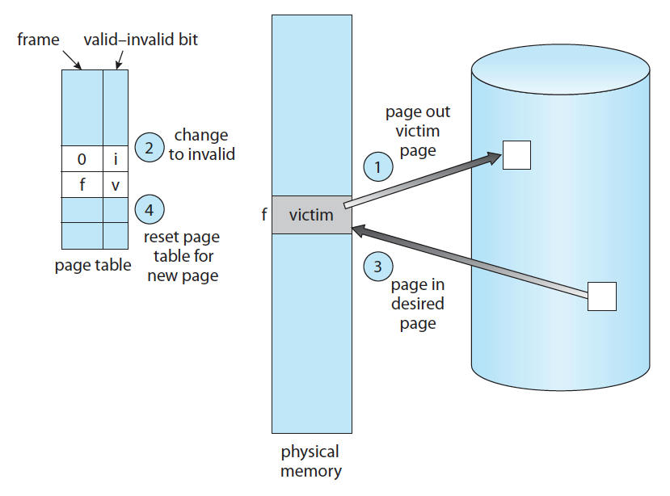

- Page fault가 발생하면 page를 디스크에서 가져와야함. 이 때 physical memory가 가득 차 있는 경우 frame이 비길 기다려야 하는데 보통 사용하지 않는 page를 swap out하고 요청받은 page를 swap in하는 page replacement를 주로 함.
- Page Replacement를 할 때 변경된 page는 디스크에 write하는 작업을 해줘야 함. 이를 관리하기 위해  dirty bit를 설정해둠.

### Page Replacement Algorithm

- Page Replacement Algorithm의 goal은 page fault를 최소한으로 줄이는 것. Page fault가 일어나면 I/O가 일어나서 비용이 많이 듬.
- 보통 이용가능한 frame의 수가 많아지면 (process에 더 많은 memory를 할당) page fault가 적어짐.

### First-In First-Out (FIFO) Page Replacement Algorithm

- 가장 먼저 메모리에 들어온 (oldest load time) 페이지를 교체.
- 문제점
  - Belady's anomaly (Belady의 모순) : process에 더 많은 frame을 할당해도 page fault가 더 많이 발생하는 모순.

> Belady's anomaly 는 자주 사용되는 page를 swap out시켜서 발생하는 듯.

### Optimal Page Replacement Algorithm

- 앞으로 가장 오랫동안 사용되지 않을 페이지를 찾아 교체.
- 문제점 : 미래에 언제 어떻게 사용될지 몰라서 이상적으로는 불가능. 실전에서는 적당히 추정해서 victim을 결정.

### Least Recently Used (LRU) Page Replacement Algorithm

- 가장 오랫동안 사용되지 않은 (oldset use time) page를 선택하여 교체.

### Least Frequently Used (LFU) Page Replacement Algorithm

- 참조 횟수가 가장 적은 page를 교체. 자주 안쓰이니까 미래에도 잘 안쓰일거라 가정.

### Most Frequently Used (MFU) Page Replacement Algorithm

- 참조 횟수가 가장 많은 page를 이미 교체. 이미 많이 쓰였으니 미래에 잘 안쓰일거라 가정.

### Page-Buffering Algorithms

- 성능 향상을 위해 page를 buffering하는 방법.
- 동작
  - free frame의 수를 일정 이상 유지해서 page fault가 나서 frame 요청이 올 경우 바로 free frame을 할당해서 빠르게 응답. background에서 page replacement를 통해 free frame을 다시 채움.
  - 변경된 page를 CPU가 놀고 있을 때 disk에 기록도 가능.

## Allocation of Frames

- Frame을 process에 어떻게 할당할 것인가.
- 고려사항
  - Minimum Number of Frames : process에 할당도는 최소한의 frame수를 어떻게 할 것인가?
  - Allocation Algorithms : 각 process에 동일한 수의 frame을 할당할 것인가? process의 크기에 비례해서 할당할 것인가?
  - Global vs Local Allocation : Page fault가 발생했을 때 해당 process에서 page victim을 찾을것인가 전체 process에서 page victim을 찾을 것인가?
  - Non-Uniform Memory Access : Multi core에서 memory랑 cpu가 같은 board에 있느냐 아니냐에 따라 속도가 차이나는데 어떻게 할당할 것인가?

### Thrashing

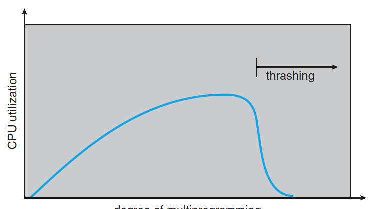

- 할당된 frame의 수가 사용하는 page의 수보다 적어서 page fault가 자주 일어나게 되서 paging을 하는 시간이 cpu를 사용하는 시간보다 커지는 현상.
- Local page replacement 정책을 쓰면 해당 process에 영향을 한정지을 수 있지만 I/O queue를 여전히 차지해서 느려짐.
- 해결책
  - 한 memory의 근처에 있는 memory를 사용할 확률이 높다는 것 (Locality)를 감안해서 Locality size만큼 frame 수를 주면 page fault를 줄일 수 있음. 다른 Locality를 사용할 때만 page fault가 발생.

### Working-Set Model

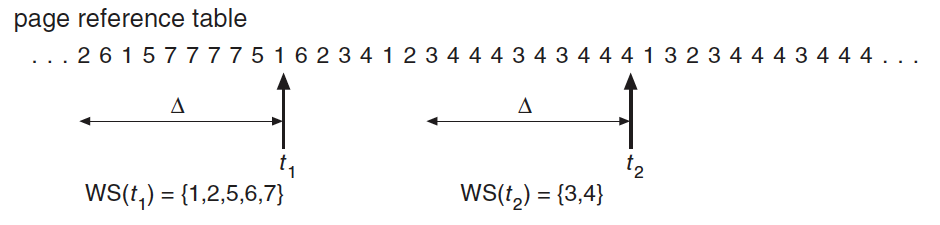

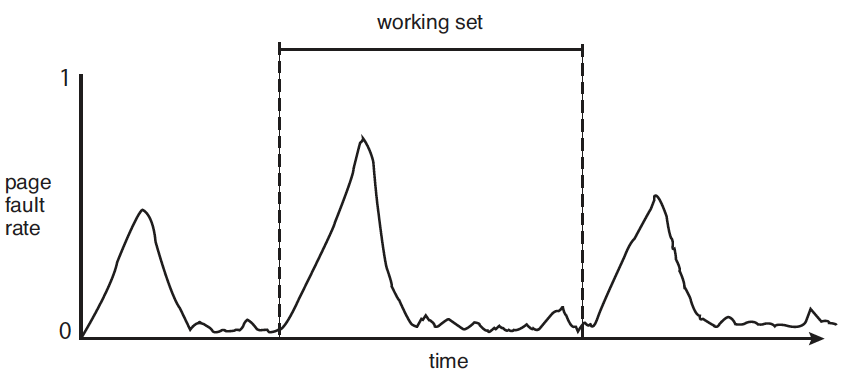

- 최근 사용된 page를 시간순으로 나열하고 working set window 를 관리해서 Locality를 정의.

### Memory-Mapped Files
  
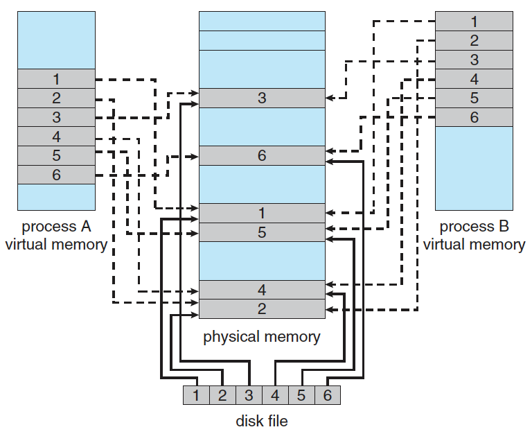

- Data file을 process file처럼 memory에 올려서 더 빨리 access하는 기법.
- File에 write하는게 바로 disk에 반영되지 않고 `flush()` system call을 하거나 `close()`를 해야 반영됨.

## Example

- [paging](./practice/paging.c) : `./run.sh paging.c 19986`

## Reference

- Operating System Concepts (Operating System Concepts, Ninth Edition)
  - [Main Memory](https://www.cs.uic.edu/~jbell/CourseNotes/OperatingSystems/8_MainMemory.html)
  - [Virtual Memory](https://www.cs.uic.edu/~jbell/CourseNotes/OperatingSystems/9_VirtualMemory.html)
- wiki
  - [Virtual Memory](https://en.wikipedia.org/wiki/Virtual_memory)