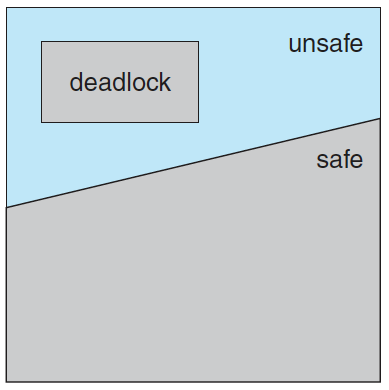
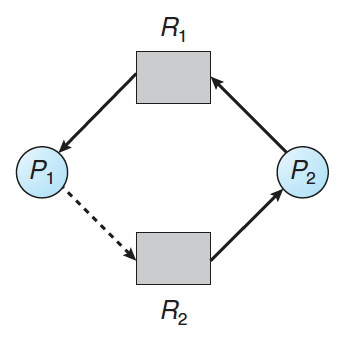
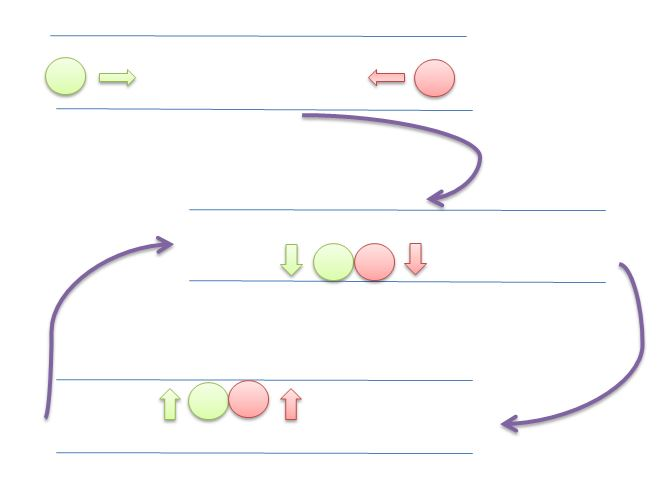

# Process Management - 2

- [Process Synchronization](#process-synchronization)
  - [Race Contition](#race-contition)
  - [Critical Section](#critical-section)
  - [Critical Section Example (++operator)](#critical-section-example-operator)
  - [Critical Section Problem](#critical-section-problem)
  - [Peterson's Solution](#petersons-solution)
  - [Peterson's Solution Problem](#petersons-solution-problem)
  - [Compare and Swap](#compare-and-swap)
  - [Mutex (MUTal EXclusion)](#mutex-mutal-exclusion)
  - [Semaphore](#semaphore)
  - [SpinLock](#spinlock)
  - [Monitor](#monitor)
  - [Bounded-Buffer Problem using mutex](#bounded-buffer-problem-using-mutex)
  - [Readers-Writers Problem](#readers-writers-problem)
  - [Dining-Philosophers Problem](#dining-philosophers-problem)
- [Deadlock](#deadlock)
  - [Resource Allocation Graph](#resource-allocation-graph)
  - [DeadLock Preconditions](#deadlock-preconditions)
  - [Deadlock Prevention](#deadlock-prevention)
  - [Deadlock Avoidance](#deadlock-avoidance)
    - [Safe State vs Unsafe State](#safe-state-vs-unsafe-state)
    - [On Single Instance Per Resource](#on-single-instance-per-resource)
    - [On Multiple Instance Per Resource](#on-multiple-instance-per-resource)
  - [Deadlock Detection](#deadlock-detection)
    - [On Single Instance Per Resource](#on-single-instance-per-resource-1)
    - [On Multi Instance Per Resource](#on-multi-instance-per-resource)
  - [Deadlock Recovery](#deadlock-recovery)
  - [Deadlock Ignore](#deadlock-ignore)
- [LiveLock](#livelock)
- [Practice](#practice)
- [Reference](#reference)

## Process Synchronization

- 여러 개의 process나 thread가 critical section 을 동시에 수행하지 못하게 하는 기법

### Race Contition

- 여러개의 Process가 동시에 같은 데이터를 수정하는데 서로 돌아가는 순서에 따라 결과가 달라지는 경우를 말함.

### Critical Section

- 서로 다른 프로세스가 같은 데이터를 수정할 수 있는 코드 영역.

### Critical Section Example (++operator)

- ++operator가 실제로는 더한 값을 임시 변수에 뒀다가 최종적으로 다시 할당하는 식인데 순서에 따라 값이 이상하게 나올 수 있음.
  ```cpp
  // T0, ++value, T1가 --value을 하는 경우

  value = 3
  T0: 0_tmp = value
  T1: 1_tmp = value
  T0: 0_tmp = 0_tmp + 1 // 4
  T1: 1_tmp = 1_tmp - 1 // 2
  T0: value = 0_tmp
  T1: value = 1_tmp

  // value == 2가 됨 (3이어야 함)
  ```

### Critical Section Problem

- 서로 다른 Process가 critical section에 동시에 접근할 수 있게 protocol을 짜는 것.
- 다음의 요구사항을 만족해야 함
  - Mutual exclusion : 서로 다른 process가 동시에 같은 critical section을 실행 못함.
  - Progress : critical section을 수행하는 process가 없으면 요청받은 process중 하나를 선택해서 수행.
  - Bounded Waiting : starvation 방지하기 위해 critical section에 대한 요청을 하고 무기한 기다리지 않음.

### Peterson's Solution

- `turn = i` : process i 턴임, `flag[i]` : process i 가 공유자원 쓰고 싶음.
- turn만 사용한 경우.
  ```cpp
  // process i
  do {
    while (turn == j); // j턴이면 기다림

    /* critical section */

    turn = j;

    /* remainder section */
  } while (true);

  // process j
  do {
    while (turn == i); // i턴이면 기다림

    /* critical section */

    turn = i;

    /* remainder section */
  } while (true);
  ```
  - j가 끝나고 remainder section에 있는 상태에서 i가 수행, i가 끝나고 다시 수행하고 싶어도 j가 다시 끝나야 수행 가능 (progress 불만족).
- flag만 사용한 경우.
  ```cpp
  // process j
  do {
    flag[i] = true;
    while (flag[j]); // j가 쓰려고 하면 기다림

    /* critical section */

    flag[i] = false;

    /* remainder section */
  } while (true);

  // process j
  do {
    flag[j] = true;
    while (flag[i]); // i가 쓰려고 하면 기다림

    /* critical section */

    flag[j] = false;

    /* remainder section */
  } while (true);
  ```
  - flag[i], flag[j]이 동시에 true가 된다면 서로가 서로를 끝나기 위해 기다려서 progress를 보장하지 못함.
- turn, flag 둘다 사용한 경우.
  ```cpp
  // process i
  do {
    flag[i] = true;
    turn = j; // j 먼저 들어가도록 양보
    while (flag[j] && turn == j); // j가 이용할 의사가 있고 j턴이면 기다림

    /* critical section */

    flag[i] = false;

    /* remainder section */
  } while (true);

  // process j
  do {
    flag[j] = true;
    turn = i; // i 먼저 들어가도록 양보
    while (flag[i] && turn == i); // i가 이용할 의사가 있고 i턴이면 기다림

    /* critical section */

    flag[j] = false;

    /* remainder section */
  } while (true);
  ```
  - Mutual Exclusion 보장
    ```text
    flag[i], flag[j]가 동시에 true가 된다고 가정.
    i쪽이 먼저 while문까지 가는 경우 while문에서 대기함 (flag[j] && turn == j). 이후 j쪽이 turn = i 로 하면서 i쪽이 수행.
    만약 i, j 둘다 turn을 수행하는 경우 둘중 나중에 수행되는걸로 turn이 설정됨.
    ```
  - Progress && Bounded Waiting
    ```text
    We note that a process Pi can be prevented from
    entering the critical section only if it is stuck in the while loop with the condition
    flag[j] == true and turn == j; this loop is the only one possible. If Pj is not
    ready to enter the critical section, then flag[j] == false, and Pi can enter its
    critical section. If Pj has set flag[j] to true and is also executing in its while
    statement, then either turn == i or turn == j. If turn == i, then Pi will enter
    the critical section. If turn == j, then Pj will enter the critical section. However,
    once Pj exits its critical section, it will reset flag[j] to false, allowing Pi to
    enter its critical section. If Pj resets flag[j] to true, it must also set turn to i.
    Thus, since Pi does not change the value of the variable turn while executing
    the while statement, Pi will enter the critical section (progress).
    ```
  - Bounded Waiting
    ```
    i, j 둘다 entry section을 수행하는 경우 turn이 둘중 한개가 되고 해당 process가 critical section을 수행.
    critical section을 수행한 process는 다음에 돌 때 turn을 다른 process에게줌. 즉, 처음 critical section을
    수행하지 못한 process는 기껏해야 1개의 process만 기다리게 됨.
    ```

### Peterson's Solution Problem

- Compiler 최적화 때문에 문제가 발생 가능
  ```cpp
    do {
      // compiler가 아래의 2개 statement간 dependency가 없다고 보고 순서를 바꿀 수 있음. 그러면 문제 발생.
      flag[i] = true;
      turn = j;

      while (flag[j] && turn == j);

      ...

    } while (true);
  ```

### Compare and Swap

- hardware에서 지원해주는 operation.
- pseudocode (대략적인 컨셉으로 실제 하드웨어에서는 구현이 다름)
  ```cpp
  int compare_and_swap(int *value, int expected, int new_value) {
    int temp = *value;
    if (*value == expected) {
      *value = new_value;
    }
    return temp;
  }
  ```

> java의 AtomicXXX class들이 volatile (cache 안쓰고 메모리에서 읽음)과 cas instruction을 사용해서 구현.

### Mutex (MUTal EXclusion)

- Critical section에 들어가기 전에 lock을 얻고 다 하면 lock을 푸는 형식. lock이 이미 걸려있으면 기다림.
- Binary Semaphore라고도 부름.

### Semaphore

- Critical section에 n개의 process가 동시에 접근 가능한 것. 자원의 수가 1 이상이면 해당 자원을 가져오고 수가 0이면 기다림.

### SpinLock

- critical section에 진입이 가능할 때 까지 루프돌면서 계속 재시도 하는 것 (Busy Waiting).
- 장점 : context switching이 없어서 짧은 시간 사이에 lock을 얻는다는 보장이 있으면 괜찮음.
- 단점 : 해당 core가 계속 loop 돌아서 다른거 못함.

### Monitor

- process가 mutual exclusion 하고 wait 할 수 있게 해주는 ADT (Abstract Data Type).
- Condition x에 두가지 연산을 제공
  - x.signal() : x를 요청한 process중 하나를 깨움. 어떠한 process도 기다리고 있지 않다면 아무 일도 일어나지 않음.
  - x.wait() : x를 요청한 process를 block.

> 
>
> - java synchronized 쓰면 내부적으로 monitor의 개념으로 동작.
>   - entry set : `synchronized` 사용해서 기다리는 thread들.
>   - wait set : `wait()`써서 기다리는 thread들.

### Bounded-Buffer Problem using mutex

- 생산자가 buffer에 데이터 넣고 소비자가 buffer에 있는 데이터를 빼는 경우.
- 생산자, 소비자가 동시에 접근하면 꼬일 수 있음. buffer에 semaphore 사용.
  ```cpp
  // semaphore 정의
  semaphore mutex = 1;  // critical section용
  semaphore empty = n;  // n개 비어 있음
  semaphore full = 0    // 0개 가득차 있음

  // 생산자
  do {
    /* produce an item in next produced */

    wait(empty);  // empty가 한개라도 있을 때 까지 기다림
    wait(mutex);

    /* add next produced to the buffer */

    signal(mutex);
    signal(full); // full을 한개 증가
  } while (true);

  // 소비자
  do {
    wait(full);  // full이 한개라도 있을 때 까지 기다림
    wait(mutex);

    /* remove an item from buffer to next consumed */

    signal(mutex);
    signal(empty); // empty를 한개 증가

    /* consume the item in next consumed */
  } while (true);
  ```

### Readers-Writers Problem

- 여러 개의 Reader와 Writer가 동시에 같은 데이터를 각각 읽고, 변경하고자 하는 경우.
- Reader에 우선순위를 줘서 정합성을 해결하는 경우 의 예시 (writer에 starvation이 일어날 수 있음).
  ```cpp
  // semaphore 정의
  semaphore rw_mutex = 1; // r/w mutex
  semaphore mutex = 1;    // read_count용 mutex
  int read_count = 0;     // 읽고 있는 독자의 수

  // Writer
  do {
    wait(rw_mutex);

    /* writing is performed */

    signal(rw_mutex);
  } while (true);

  // Reader
  do {
    wait(mutex);
    read_count++;
    if (read_count == 1) { // 첫 번째 reader라면
      wait(rw_mutex);      // writer block
    }
    signal(mutex);

    /* reading is performed */

    wait(mutex);
    read_count--;
    if (read_count == 0) { // 마지막 writer라면
      signal(rw_mutex);    // writer가 access 할 수 있게 함
    }
    signal(mutex);
  } while (true);
  ```

### Dining-Philosophers Problem


- 원판의 철학자가 음식을 먹기 위해 양쪽의 젓가락을 들어야 하는 경우.
- 각각의 철학자가 왼쪽, 오른쪽 젓가락을 순차로 기다리는 경우 (5개 동시에 왼쪽 젓가락 집으면 deadlock이 발생).
  ```cpp
  semaphore chopstick[5];

  do {
    wait(chopstick[i]);
    wait(chopstick[(i+1) % 5]);

    /* eat for awhile */

    signal(chopstick[i]);
    signal(chopstick[(i+1) % 5]);

    /* think for awhile */
  } while (true);
  ```

## Deadlock


- 두개의 프로세스 이상이 서로 상대 프로세스가 끝나길 기다리고 있어서 아무것도 완료되지 못하는 상황.

### Resource Allocation Graph

todo : 그림 정리, https://github.com/jhyuk316/study/blob/main/Backend%20Roadmap/02%20General%20Knowledge/02.5%20Deadlock.md#12-resource-allocation-graph

- Request Edges(요청 에지) - 프로세스(Pi)에서 리소스(Rj)로. 리소스 요청 후 대기
- Assignment Edges(할당 에지) - 리소스(Rj)에서 프로세스(Pi)로. 리소스가 할당됨

### DeadLock Preconditions

- 4가지 조건이 동시에 성립해야만 발생
  - Mutual exclusion : 자원은 한 번에 한 process만이 사용할 수 있음.
  - Hold and wait : 자원을 사용하는 process가 있고 그 자원에 접근하려고 대기하는 process가 있어야 함.
  - No preemption : 자원에 대한 선점이 불가능.
  - Circular wait : 자원을 대기하는 프로세스간 Cycle이 있어야 함 (e. A -> B, B -> C, C -> A).

### Deadlock Prevention

- 4개의 조건 중 적어도 한개 이상이 절대로 일어나지 않게 하는 방법.
- Mutual exclusion 해결
  - Read-only resource에는 lock을 걸 필요 없음.
  - Read-only가 아니라면 보통은 불가능.
- Hold and wait 해결
  - 요청할 때 가지고 있는 resource가 하나도 없게.
  - 방법
    - 필요한 resource를 한번에 요청하게.
    - 다른 resource를 요청할 때 가지고 있는 resource를 내려놓게.
  - 문제점 : 두가지 방법 모두 인기있는 resource를 요청하면 starvation이 될 수 있음.
- No preemption 해결
  - 선점이 가능하게.
  - 방법
    - 요청한 resource를 다른 process가 쓰고 있으면 요청한 process가 가지고 있는 resource를 release하고 새롭게 요청한 resource와 기존에 가지고 있던 resource를 같이 요청.
    - 요청한 resource를 점유하고 있는 process가 waiting상태라면 그 resource를 점유.
  - 문제점 : 둘다 빠르게 save/load되는 resource가 아니라면 사용하기 힘듬.
- Circular wait 해결
  - resource에 순서를 부여하고 숫자가 증가하는 방향으로만 resource를 요청할 수 있게. 제일 흔한 전략.
  - 문제점 : 어떻게 순서를 부여할것인가? 가져오고 쓰는 타이밍도 달라서 자원 점유시간이 길어질 수 있다.

### Deadlock Avoidance

- 4개의 조건을 막지는 않고 system이 unsafe state로 가지 않게 하는 방법.
- 새 resource 요청을 받았을 때 unsafe state로 갈 수 있다면 resource를 거부하는 식으로 deadlock을 방지.

#### Safe State vs Unsafe State



- Safe State
  - If there exists a safe sequence of processes { P0, P1, ..., PN } such that all of the resource requests for Pi can be granted using the resources currently allocated to Pi and all processes Pj where j < i (j가 끝내고 resource 반환하면 i가 끝낼 수 있는 상태).
- Unsafe State
  - Safe state가 될 수 있는 process의 sequence가 없는 경우.
  - unsafe 상태의 부분집합이 deadlock임.

#### On Single Instance Per Resource




`P2 -> R2 request edge` to `P2 -> R2 assignment edge`

- 각 resource가 하나밖에 없으면 Resource allocation graph에서 request edge(dot line)를 assignment edge로 바꿔서 cycle이 있는지 확인하면 됨.

#### On Multiple Instance Per Resource

- Banker's Algorithm
  - Data structure (n : process수, m : resource 수)
    - Available[j] : 이용가능한 resource j의 수.
    - Max[i][j] : Process i가 요청할 수 있는 최대 resource j의 수.
    - Allocation[i][j] : Process i가 resource j를 가지고 있는 수.
    - Need[i][j] : Process i가 필요한 resource j의 수 (Need[i][j] = Max[i][j] - Allocation[i][j]).
    - Request[i][j] : Process i가 요청한 resource j의 수.
  - Safety check step
    ```cpp
    // Work, Finish는 각각 길이 m, n의 vector
    1. Work = Available, Finish[i] = false for all i
    2. If Finish[i] == false && Need[i] <= Work for some i, goto 3
       Else, goto 4 
    3. Work = Work + Allocation[i]
       Finish[i] = true
       goto 2
    // 즉, 앞으로 필요한게 이용 가능 한거보다 많은게 한개라도 있으면 unsafe state
    4. If Finish[i] == true for all i, system is safe state
    ```
  - Resource allocation pseudo code
    ```cpp
    Request[i][j] = k
    if (Request[i][j] <= Need[i][j]) {
      if (Requset[i][j] <= Available[i][j]) {
        if (isSafeState(아래의 3개 라인을 할당한다고 가정)) {
          Available[i][j] = Available[i][j] - Request[i][j]
          Allocation[i][j] = Allocation[i][j] + Request[i][j]
          Need[i][j] = Need[i][j] - Request[i][j]
        }
      } else {
        /* Process i 대기 */
      }
    } else {
        /* Process i 에러 */
    }
    ```

### Deadlock Detection

#### On Single Instance Per Resource


- 각 resource가 하나밖에 없으면 resource allocation graph에서 resource를 빼고 process끼리의 graph에서 cycle이 있는지 확인하면 됨.

#### On Multi Instance Per Resource

- Banker's Algorithm과 비슷
  - Data structure (n : process수, m : resource 수)
    - Available[j] : 이용가능한 resource j의 수.
    - Max[i][j] : Process i가 요청할 수 있는 최대 resource j의 수.
    - Allocation[i][j] : Process i가 resource j를 가지고 있는 수.
    - Need[i][j] : Process i가 필요한 resource j의 수 (Need[i][j] = Max[i][j] - Allocation[i][j]).
    - Request[i][j] : Process i가 요청한 resource j의 수.
  - Step
    ```cpp
    // Work, Finish는 각각 길이 m, n의 vector
    1. Work = Available.
       For all i, If Allocation[i] != 0, then Finish[i] = false. Else, Finish[i] = true
    2. If Finish[i] == false && Request[i] <= Work for some i, goto 3
       Else, goto 4 
    3. Work = Work + Allocation[i]
       Finish[i] = true
       goto 2
    // 즉, 요청한게 이용 가능 한거보다 많은게 한개라도 있으면 deadlock
    4. If Finish[i] == false for some i, system is deadlock 
    ```

### Deadlock Recovery

- Process Termination
  - 관계되어 있는 모든 process를 죽이거나 deadlock이 풀릴 때 까지 process를 죽임.
  - 문제점 : deadlock이 풀릴 때 까지 죽이는 것은 죽이는 process를 어떻게 정할건지 생각해야 함.
- Resource Preemption
  - 자원이 선점 가능하게.
  - 문제점 : 어떤 process로부터 자원을 빼올것인가, starvation은 일어나지 않을까 고민해야 함.

### Deadlock Ignore

- Critical 하지 않은 경우 deadlock을 무시하기도 함.

## LiveLock



- Deadlock과 비슷하지만 서로가 서로의 resource를 가져오기 위해 blocked된 상태가 아니라 resource를 가져오기 위해 cpu를 계속 쓰고 있는 상태.
- Resource starvation의 특별한 case임.

## Practice

none

## Reference

- Operating System Concepts (Operating System Concepts, Ninth Edition)
  - [Synchronization](https://www.cs.uic.edu/~jbell/CourseNotes/OperatingSystems/5_Synchronization.html)
  - [Deadlocks](https://www.cs.uic.edu/~jbell/CourseNotes/OperatingSystems/7_Deadlocks.html)
- wiki
  - [Reader Writers Problem](https://en.wikipedia.org/wiki/Readers%E2%80%93writers_problem)
  - [Deadlock](https://en.wikipedia.org/wiki/Deadlock)
- [Difference between lock and monitor – Java Concurrency](https://howtodoinjava.com/java/multi-threading/multithreading-difference-between-lock-and-monitor/)
- [What's the difference between deadlock and livelock? (stackoverflow)](https://stackoverflow.com/questions/6155951/whats-the-difference-between-deadlock-and-livelock)
- [Why does a simplification of Peterson's Algorithm using a single 'turn' variable not provide process synchronization? (stackoverflow)](https://stackoverflow.com/questions/48385998/why-does-a-simplification-of-petersons-algorithm-using-a-single-turn-variable)
- [[OS] critical section problem & peterson's algorithm](https://velog.io/@chy0428/OS-%ED%94%84%EB%A1%9C%EC%84%B8%EC%8A%A4-%EB%8F%99%EA%B8%B0%ED%99%94#-erroneous-algorithm-1)
- [기술사, 은행가 알고리즘, Banker’s Algorithm (youtube)](https://www.youtube.com/watch?v=6iHO6ApjkTw)