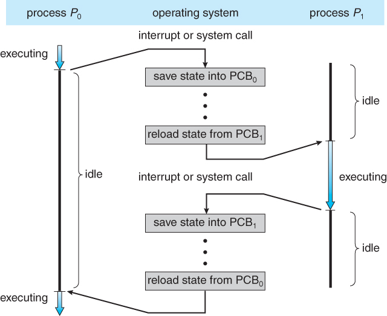
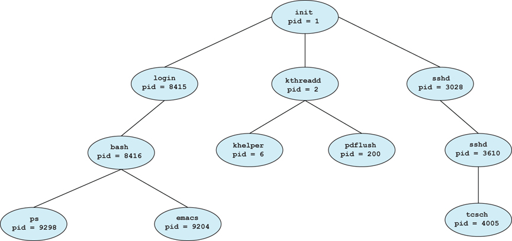

# Process Management

- [Process Management](#process-management)
  - [Program](#program)
  - [Process](#process)
    - [Process Memory Model](#process-memory-model)
    - [Process State](#process-state)
    - [Process Control Block (PCB)](#process-control-block-pcb)
    - [Context Switching](#context-switching)
  - [Process Operation](#process-operation)
    - [Process Termination](#process-termination)
  - [Process Scheduling](#process-scheduling)
    - [Long Term Scheduler (Job Scheduler)](#long-term-scheduler-job-scheduler)
    - [Medium Term Scheduler](#medium-term-scheduler)
    - [Short Term Scheduler (CPU Scheduler)](#short-term-scheduler-cpu-scheduler)
  - [CPU Scheduling](#cpu-scheduling)
    - [Scheduling Criteria](#scheduling-criteria)
    - [Non-preemptive vs Preemptive](#non-preemptive-vs-preemptive)
    - [First Come, First Served Scheduling (FCFS)](#first-come-first-served-scheduling-fcfs)
    - [Shortest Job First Scheduling (SJF)](#shortest-job-first-scheduling-sjf)
    - [Priority Scheduling](#priority-scheduling)
    - [Round Robin Scheduling](#round-robin-scheduling)
    - [Multilevel Queue Scheduling](#multilevel-queue-scheduling)
  - [Real-Time CPU Scheculing](#real-time-cpu-scheculing)
  - [Inter-Process Communication](#inter-process-communication)
  - [Client-Server Communication](#client-server-communication)
    - [Socket](#socket)
    - [Remote Procedure Call](#remote-procedure-call)
    - [Pipe](#pipe)
  - [Thread](#thread)
    - [Multicore Programming](#multicore-programming)
    - [Multithreading Model](#multithreading-model)
    - [Implicit Threading](#implicit-threading)
  - [Synchronization](#synchronization)
    - [Producer Consumer](#producer-consumer)
    - [Critical Section](#critical-section)
    - [Mutex](#mutex)
    - [Semaphore](#semaphore)
    - [Monitor](#monitor)
  - [Deadlock](#deadlock)
  - [Reference](#reference)

## Program

- 명령어의 집합

## Process

- 실행중인 프로그램.

### Process Memory Model

- Text section : 프로그램 코드를 저장.
- Data section : 프로그램의 main 함수를 실행하기 전에 할당되는 static, 전역변수 같은걸 저장.
- Heap : 프로세스 실행중 동적으로 할당되는 공간.
- Stack : 지역번수, 함수 인자같은 임시 data를 저장.
- Heap과 stack은 memory space 각각 서로 반대방향으로 메모리를 할당.

### Process State

- New : 처음에 만들어 지면 new 상태.
- Ready : In ready queue.
- Running : 실행중.
- Waiting : I/O등 작업을 기다리는 경우.
- Terminated : 종료.

### Process Control Block (PCB)

- Process의 정보를 저장해두는 공간. Process State, Process ID, Program Counter, Register 등을 저장.

### Context Switching

- CPU가 한 프로세스를 실행하다가 다른 프로세스를 실행하려면 Process정보를 저장하고 새로 실행할 프로세스의 정보를 불러와야함. 이 때 PCB에 Process 정보를 저장.

## Process Operation

- Process는 system call을 통해 다른 process를 만들 수 있음. 만든 process를 parent process라고 부르고 만들어진 process를 child process라고 부름.
- Linux에서는 init process (PID 1)이 다른 process의 root임.
- parent process는 child process와 동시에 실행되거나 child process가 끝나길 기다릴 수 있음.
- child process는 parent process의 resource 일부를 공유할 수 있음.

### Process Termination

- Process는 exit() system call을 하면 정수값을 반환하며 종료. process가 종료하면 할당받은 resource를 모두 반환.

## Process Scheduling

- CPU의 사용률을 최대로 높이게 process를 CPU에 할당하는 기법.

### Long Term Scheduler (Job Scheduler)

- Disk로부터 Memory에 어떤 Process를 올려둘건지 결정.
- Degree of Multiprogramming (memory에 있는 process의 수)을 관리.

### Medium Term Scheduler

- Process를 실행 중에 Memory로부터 빼는 scheduler.
- Memory로부터 빼는걸 swap out, 다시 Memory에 올리는걸 swap in, 이 모든 과정을 swapping이라고 함.

### Short Term Scheduler (CPU Scheduler)

- Ready Queue의 어떤 Process에 CPU를 할당할지 결정.
- CPU에 할당된 Process가 I/O request 같은거를 하면 ready queue에 들어가고 다른 Process에 CPU를 할당.

## CPU Scheduling

### Scheduling Criteria

- CPU utilization : CPU 사용량.
- Throughput : 시간별 process 처리량.
- Turnaround time : process 제출시부터 종료까지의 시간.
- Waiting time : process가 read queue에 있는 시간.
- Response time : 최초 input으로부터 반응시간.

> 한정된 자원을 효율적으로 사용해야 하는 모든 곳에서 적용가능해보임.

### Non-preemptive vs Preemptive

- Non-preemptive (비선점형) : process가 종료하거나 wait() call 등을 통해 waiting state로 갔을때 scheduling을 하는 경우
- Preemptive (선점형) : process가 interrupt 같은 이유로 ready state로 갔을 때 scheduling을 하는 경우.

### First Come, First Served Scheduling (FCFS)

- 먼저 온 process에 CPU를 할당.
- 문제점 : Convoy Effect, 소요시간이 긴 프로세스가 먼저 도달하여 효율성을 낮추는 현상이 발생.

### Shortest Job First Scheduling (SJF)

- Next CPU burst time 이 짧을 것으로 예측되는 프로세스에게 선 할당.
- 선점형, 비선전형 둘다 가능.
- 문제점 : Starvation, 사용 시간이 긴 프로세스는 거의 영원히 CPU 를 할당받을 수 없음.

### Priority Scheduling

- 우선순위가 가장 높은 프로세스에게 CPU 를 할당. 작은 숫자가 우선순위가 높다.
- 선점형, 비선전형 둘다 가능.
- 문제점 : Starvation, 우선순위가 낮은 프로세스가 무기한 대기할 수 있음.
  - Aging으로 오래 머무르면 우선순위를 높여주는 식으로 해결 가능.

### Round Robin Scheduling 

- 각 프로세스는 동일한 크기의 할당 시간(time quantum)을 받고 할당이 끝나면 queue의 제일 뒤로 감.
- 장점 : Response time이 증가 (아무리 오래 기다려도 (n-1) * q 이상 기다리지 않음)
- 문제점 : time quantum이 너무 커지면 FCFS랑 똑같아짐. 너무 작아지면 잦은 Context Switching으로 overhead가 발생

### Multilevel Queue Scheduling

- Process를 분류해서 우선순위를 준다면 foreground (interactive) process에는 높은 우선순위를, background (batch) process에는 낮은 우선순위를 주는 기법.
- 우선순위가 높은 process부터 실행하거나 아니면 CPU time을 Level별로 다르게 줄 수도 있음.

## Real-Time CPU Scheculing

- Hard read-time system은 높은 수준의 요구사항을 가지고 있음.

> 게임 같은거랄까..?

TODO

## Inter-Process Communication

TODO

## Client-Server Communication

### Socket

### Remote Procedure Call

### Pipe

## Thread

### Multicore Programming

### Multithreading Model

### Implicit Threading

## Synchronization

### Producer Consumer

### Critical Section

### Mutex

### Semaphore

### Monitor

## Deadlock

## Reference

- Operating System Concepts (Operating System Concepts, Ninth Edition)
  - [Process](https://www.cs.uic.edu/~jbell/CourseNotes/OperatingSystems/3_Processes.html)
  - [Thread](https://www.cs.uic.edu/~jbell/CourseNotes/OperatingSystems/4_Threads.html)
  - [Synchronization](https://www.cs.uic.edu/~jbell/CourseNotes/OperatingSystems/5_Synchronization.html)
  - [CPU Scheduling](https://www.cs.uic.edu/~jbell/CourseNotes/OperatingSystems/6_CPU_Scheduling.html)
  - [Deadlocks](https://www.cs.uic.edu/~jbell/CourseNotes/OperatingSystems/7_Deadlocks.html)