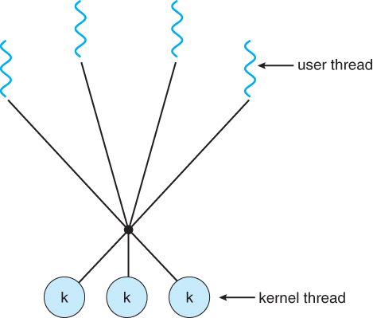
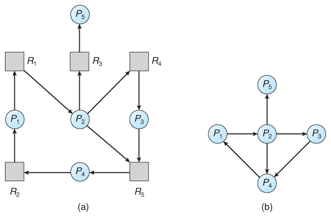

# Process Management

- [Process Management](#process-management)
  - [Program](#program)
  - [Subroutine](#subroutine)
  - [Process](#process)
    - [Process Memory Model](#process-memory-model)
    - [Process State](#process-state)
    - [Process Control Block (PCB)](#process-control-block-pcb)
    - [Context Switching](#context-switching)
  - [Process Operation](#process-operation)
    - [Process Termination](#process-termination)
  - [Process Scheduling](#process-scheduling)
    - [Degree of Multiprogramming](#degree-of-multiprogramming)
    - [Scheduling Queue](#scheduling-queue)
    - [Long Term Scheduler (Job Scheduler)](#long-term-scheduler-job-scheduler)
    - [Medium Term Scheduler](#medium-term-scheduler)
    - [Short Term Scheduler (CPU Scheduler)](#short-term-scheduler-cpu-scheduler)
  - [CPU Scheduling](#cpu-scheduling)
    - [Scheduling Criteria](#scheduling-criteria)
    - [Non-preemptive vs Preemptive](#non-preemptive-vs-preemptive)
    - [First Come, First Served Scheduling (FCFS)](#first-come-first-served-scheduling-fcfs)
    - [Shortest Job First Scheduling (SJF)](#shortest-job-first-scheduling-sjf)
    - [Priority Scheduling](#priority-scheduling)
    - [Round Robin Scheduling](#round-robin-scheduling)
    - [Multilevel Queue Scheduling](#multilevel-queue-scheduling)
  - [Real-Time CPU Scheculing](#real-time-cpu-scheculing)
  - [Inter-Process Communication](#inter-process-communication)
    - [Message Passing](#message-passing)
    - [Shared Memory](#shared-memory)
    - [Socket](#socket)
    - [Remote Procedure Call](#remote-procedure-call)
    - [Anonymous Pipe](#anonymous-pipe)
    - [Named Pipe](#named-pipe)
    - [File](#file)
  - [Thread](#thread)
    - [Process vs Thread](#process-vs-thread)
    - [Why Thread?](#why-thread)
    - [Concurrency vs Parallelism](#concurrency-vs-parallelism)
    - [Designing Multicore Programming](#designing-multicore-programming)
    - [Data Parallelism vs Task Parallelism](#data-parallelism-vs-task-parallelism)
    - [User Thread vs Kernel Thread](#user-thread-vs-kernel-thread)
    - [Multithreading Model](#multithreading-model)
    - [Implicit Threading](#implicit-threading)
  - [Process Synchronization](#process-synchronization)
    - [Race Contition](#race-contition)
    - [Critical Section](#critical-section)
    - [Critical Section Example (++operator)](#critical-section-example-operator)
    - [Critical Section Problem](#critical-section-problem)
    - [Peterson's Solution](#petersons-solution)
    - [Peterson's Solution Problem](#petersons-solution-problem)
    - [Compare and Swap](#compare-and-swap)
    - [Mutex (MUTal EXclusion)](#mutex-mutal-exclusion)
    - [Semaphore](#semaphore)
    - [SpinLock](#spinlock)
    - [Monitor](#monitor)
    - [Bounded-Buffer Problem using mutex](#bounded-buffer-problem-using-mutex)
    - [Readers-Writers Problem](#readers-writers-problem)
    - [Dining-Philosophers Problem](#dining-philosophers-problem)
  - [Deadlock](#deadlock)
    - [DeadLock Preconditions](#deadlock-preconditions)
    - [Deadlock Prevention](#deadlock-prevention)
    - [Deadlock Avoidance](#deadlock-avoidance)
    - [Deadlock Detection on Single Instance Resource](#deadlock-detection-on-single-instance-resource)
    - [Deadlock Detection on Multi Instance Resource](#deadlock-detection-on-multi-instance-resource)
    - [Deadlock Recovery](#deadlock-recovery)
  - [LiveLock](#livelock)
  - [Practice](#practice)
  - [Reference](#reference)

## Program

- 명령어의 집합.

## Subroutine

- 특정한 작업을 하기 위한 명령어의 집합. Program의 일부로도 활용.

## Process

- 실행중인 프로그램.

### Process Memory Model


- Text section : 프로그램 코드를 저장.
- Data section : 프로그램의 main 함수를 실행하기 전에 할당되는 static, 전역변수 같은걸 저장.
- Heap : 프로세스 실행중 동적으로 할당되는 공간.
- Stack : 지역번수, 함수 인자같은 임시 data를 저장.
- Heap과 stack은 memory space 각각 서로 반대방향으로 메모리를 할당.

### Process State


- New / Created : 처음에 만들어 지면 new 상태.
- Ready : In ready queue.
- Running : 실행중.
- Waiting : I/O등 작업을 기다리는 경우.
- Terminated : 종료.

### Process Control Block (PCB)


- Process의 정보를 저장해두는 공간. Process State, Process ID, Program Counter, Register 등을 저장.

### Context Switching


- CPU가 한 프로세스를 실행하다가 다른 프로세스를 실행하려면 Process정보를 저장하고 새로 실행할 프로세스의 정보를 불러와야함. 이 때 PCB에 Process 정보를 저장.

## Process Operation


- Process는 system call을 통해 다른 process를 만들 수 있음. 만든 process를 parent process라고 부르고 만들어진 process를 child process라고 부름.
- Linux에서는 init process (PID 1)이 다른 process의 root임.
- parent process는 child process와 동시에 실행되거나 child process가 끝나길 기다릴 수 있음.
- child process는 parent process의 resource 일부를 공유할 수 있음.

### Process Termination

- Process는 exit() system call을 하면 정수값을 반환하며 종료. process가 종료하면 할당받은 resource를 모두 반환.

## Process Scheduling

- CPU의 사용률을 최대로 높이게 process를 CPU에 할당하는 기법.

### Degree of Multiprogramming

- Memory위의 Process의 수.

### Scheduling Queue


- Job Queue : HDD에 있던 프로그램을 메모리에 로드 할 때 대기.
- Ready Queue : 프로세스들이 실행을 위해 대기.
- Device Queue : I/O장치를 이용하려는 작업이 대기.

### Long Term Scheduler (Job Scheduler)

- Disk로부터 Memory에 어떤 Process를 올려둘건지 결정하는 scheduler.
- Degree of Multiprogramming 을 관리.
- CPU bound process와 I/O bound process간의 적절한 조화를 관리.
- Process 상태는 new -> ready.

### Medium Term Scheduler


- Process들이 cpu 경쟁이 심해지면 Process를 실행 중에 Memory로부터 빼는 scheduler.
- Degree of Multiprogramming 을 줄임.
- Memory로부터 빼는걸 swap out, 다시 Memory에 올리는걸 swap in, 이 모든 과정을 swapping이라고 함.
- Process 상태는 ready -> suspended.

### Short Term Scheduler (CPU Scheduler)


- I/O, system call 같은게 생길때 Ready Queue의 어떤 Process에 CPU를 할당할지 결정하는 scheduler.
- Process 상태는 ready -> running.

## CPU Scheduling

### Scheduling Criteria

- CPU utilization : CPU 사용량.
- Throughput : 시간별 process 처리량.
- Turnaround time : process 제출시부터 종료까지의 시간.
- Waiting time : process가 read queue에 있는 시간.
- Response time : 최초 input으로부터 반응시간.

> 한정된 자원을 효율적으로 사용해야 하는 모든 곳에서 적용가능해보임.

### Non-preemptive vs Preemptive

- Non-preemptive (비선점형)
  - OS가 프로세서를 관리하지 않기 때문에 Process에 할당되면 끝날 때 까지 프로세스를 소유.
  - 일괄 처리 시스템에 적합.
- Preemptive (선점형)
  - OS가 프로세서를 관리하기 때문에 interrupt 등의 이유일때 다른 Process에 프로세서를 할당하는 형식.
  - 특정 요건들을 기준으로 자원을 배분. 스케줄링을 많이 함.

### First Come, First Served Scheduling (FCFS)

- 먼저 온 process에 CPU를 할당.
- 문제점 : Convoy Effect, 소요시간이 긴 프로세스가 먼저 도달하여 효율성을 낮추는 현상이 발생.

### Shortest Job First Scheduling (SJF)

- Next CPU burst time 이 짧을 것으로 예측되는 프로세스에게 선 할당.
- 선점형, 비선점형 둘다 가능. 선점형의 경우 Shortest Remaining Time (SRT) 라고도 부름.
- 문제점 : Starvation, 사용 시간이 긴 프로세스는 거의 영원히 CPU 를 할당받을 수 없음.

### Priority Scheduling

- 우선순위가 가장 높은 프로세스에게 CPU 를 할당. 작은 숫자가 우선순위가 높다.
- 선점형, 비선점형 둘다 가능.
- 문제점 : Starvation, 우선순위가 낮은 프로세스가 무기한 대기할 수 있음.
  - Aging으로 오래 머무르면 우선순위를 높여주는 식으로 해결 가능.

### Round Robin Scheduling

- 각 프로세스는 동일한 크기의 할당 시간(time quantum)을 받고 할당이 끝나면 queue의 제일 뒤로 감.
- 장점 : Response time이 증가 (아무리 오래 기다려도 (n-1) * q 이상 기다리지 않음)
- 문제점 : time quantum이 너무 커지면 FCFS랑 똑같아짐. 너무 작아지면 잦은 Context Switching으로 overhead가 발생

### Multilevel Queue Scheduling


- Process를 분류해서 우선순위를 준다면 foreground (interactive) process에는 높은 우선순위를, background (batch) process에는 낮은 우선순위를 주는 기법.
- 우선순위가 높은 process부터 실행하거나 아니면 CPU time을 Level별로 다르게 줄 수도 있음.

## Real-Time CPU Scheculing

- Hard read-time system은 높은 수준의 요구사항을 가지고 있음.

> 게임 같은거랄까..?

TODO

## Inter-Process Communication

- Process는 기본적으로 독립적이나 Computation speedup이나 Modularity를 위해 협력하기도 함.
- 이때 서로 통신하기 위해 하는 과정을 IPC (Inter-Process Communication) 라고 함.

### Message Passing


- communication link를 만들고 (eg. shared memory, network) 서로 send, receive message를 주고받으면서 할 수도 있음.
- 고려해야 할 점
  - Naming
    - Direct communication : 두 process가 서로를 알아서 넘겨줘야 함.
    - Indirect communication :  생산자 소비자가 서로 공유된 mailbox에 넣고 빼는 구조.
  - Synchronization
    - Blocking : Sender는 Receiver가 받을 때 까지 blocked. Receiver는 Sender가 보낼 때 까지 blocked.
    - Unblocking : Sender는 보내고 끝. Receiver는 message queue가 비어 있는 경우 null을 처리.
    - Sender와 Receiver가 서로 blocking이면 생산자-소비자에서 동시성 문제가 없어짐.
  - Buffering
    - Zero capacity : buffer 크기 0. sender가 receiver가 처리할 때 까지 대기해야 함.
    - Bounded capacity : buffer 크기 제한. buffer가 가득차 있으면 sender가 대기.
    - Unbounded capacity : buffer 크기 무제한. sender가 대기 안하고 계속 넣음.

### Shared Memory


- 서로 다른 Process는 기본적으로는 같은 address space에 접근하지 못하지만 이를 예외적으로 허용.
- 어떤 식으로 공유 memory를 구성할건지, 동시성 관리를 어떻게 할건지는 Process에 달려 있음.
- 보통 Buffer같은거 둬서 생산자는 Buffer에 넣고 소비자는 Buffer에 있는거 빼는 식으로 동작.
  - Unbounded Buffer : size 제한이 없는 buffer.
  - Bounded Buffer : size 제한이 있는 buffer. buffer가 차있으면 생산자가 기다리고 buffer가 비어있으면 소비자가 기다림.

### Socket


- An endpoint for communication.
- IP address와 port number로 구성 (eg. 192.168.0.1:1000)
  - 1024 이전의 포트들은 공식적으로 정해져 있음. (eg. ftp: 21, http: 80, https: 443)
  - 1024 보다 큰 포트들은 connection을 새로 만들때 사용.
  - 127.0.0.1 (or localhost)은 자기 자신을 가리키는 loopback IP.
- Client가 server랑 연결 맺을 때 host의 남는 port를 할당받는 식으로 동작.

### Remote Procedure Call

- 다른 address space (주로 다른 network의 computer) 의 subroutine을 마치 local의 subroutine을 수행하는것 마냥 할 수 있게 하는 것.
- IPC의 일종.
- Object-Oriented Paradigm에서는 RMI (Remote Method Call)로 불림.

### Anonymous Pipe

- one-way IPC의 일종.
- 보통 parent process가 만들고 child process가 활용.

### Named Pipe

- IPC의 일종.
- 보통 파일을 생성해서 pipe로 사용하며 process가 죽어도 있음.
- 이름이 있어서 reader, writer가 이름으로 동시에 접근 가능.

### File

- 서로 다른 process가 같은 파일에 쓰고 읽어도 통신한다고 볼 수 있음.

## Thread

- A basic unit of CPU utilization.

### Process vs Thread


- Process
  - OS로부터 CPU, Memory 등 자원을 받아서 일하는 녀석
  - 메모리는 Code, Heap, Data등으로 구성
  - 장점 : 서로 다른 프로세스가 분리되어 있어서 한 프로세스가 죽어도 다른 프로세스에 영향이 없음
  - 단점 : 프로세스간 다른 메모리 영역을 사용해서 자원 공유가 힘들고 Context Switching 비용이 큼
- Thread
  - Process의 실행 단위
  - Process안의 Code, Heap, Data를 공유하고 Thread별로 별도의 Stack, Register를 가짐
  - 장점 : 한 Process의 메모리 공간을 공유해서 자원 공유가 쉽고 Context switching비용이 작음
  - 단점 : 자원 공유를 할 때 동시성 문제를 제어해야 함

### Why Thread?

- 요청올때마다 Process를 만드는건 비용이 큼. 어차피 비슷한 일 할텐데 Process 안에서 일을 하게해보자! 하는 김에 자원 공유도 할 수 있게 하고.

### Concurrency vs Parallelism


- Concurrency
  - 2개 이상의 task가 진행이 되게 하는 것 (동시에 실행될 필요는 없음).
  - Single core에서도 switwching을 통해 달성 가능.
- Parallelism
  - 2개 이상의 task를 완전히 동시에 실행하는 것.
  - Multi core에서만 가능

### Designing Multicore Programming

- Identifying tasks : 서로 독립적으로 실행될 수 있는 task를 찾는 과정.
- Balance : 분리한 task가 서로 비슷한 처리를 할 수 있게.
- Data splitting : 서로 독립적인 작업을 하기 때문에 data도 분리되어서 처리될 수 있게.
- Data dependency : 데이터가 서로 의존적인 경우 서로 간섭이 일어나지 않게.
- Testing and debugging : Single core일때보다 테스트나 디버깅이 어려우므로 이를 잘 해결할 수 있게.

### Data Parallelism vs Task Parallelism

- Data Parallelism : 같은 데이터에 대해 범위를 분리해서 처리하는 것 (eg. image를 구역을 나눠서 처리)
- Task Parallelism : Data를 나누는게 아니라 Task를 나누는 것 (eg. 요청 여러개를 분리)

### User Thread vs Kernel Thread

- User Thread : Kernel 위에서 돌아감.
- Kernel Thread : OS Kernel에 의해 직접적으로 관리됨.

### Multithreading Model




- User Thread랑 Kernal Thread는 서로 mapping되어야 함.
- Many-to-One Model
  - n user thread - 1 kernel thread
  - Blocking call이 있으면 전체 thread가 block.
- One-to-One Model
  - 1 user thread - 1 kernel thread
  - Blocking call이 있으면 다른 thread를 수행해서 parallism을 달성.
  - user thread마다 kernel thread가 있어야 해서 thread 수에 제약이 있음.
- Many-to-Many Model
  - n user thread - n kernel thread
  - thread수에 제약도 없고 blocking call의 경우에도 괜찮음.

> 이건 이론적인거고 실제로는 [이렇다고 한다](https://stackoverflow.com/questions/40707221/multithreading-model-in-linux-and-windows)
>
> - Many to Many가 설명상 좋아보이지만 이론적일 뿐. 실제로는 one-to-one model을 사용.
> - process를 여러개의 thread가 있는 address space로 보고 thread 단위로 스케줄링 (one-to-one).

### Implicit Threading

- 스레드의 생성과 관리 책임을 개발자가 하기에는 번거로움.
- 컴파일러와 런타임 라이브러리가 스레드 처리를 하고 개발자는 병렬로 실행할 수 있는 작업만 식별하여 작업을 함수로 작성.
- Thread pool 같은거를 미리 만들어서 사용.

## Process Synchronization

- 여러 개의 process나 thread가 critical section 을 동시에 수행하지 못하게 하는 기법

### Race Contition

- 여러개의 Process가 동시에 같은 데이터를 수정하는데 서로 돌아가는 순서에 따라 결과가 달라지는 경우를 말함.

### Critical Section

- 서로 다른 프로세스가 같은 데이터를 수정할 수 있는 코드 영역.

### Critical Section Example (++operator)

- ++operator가 실제로는 더한 값을 임시 변수에 뒀다가 최종적으로 다시 할당하는 식인데 순서에 따라 값이 이상하게 나올 수 있음.
  ```cpp
  // T0, ++value, T1가 --value을 하는 경우

  value = 3
  T0: 0_tmp = value
  T1: 1_tmp = value
  T0: 0_tmp = 0_tmp + 1 // 4
  T1: 1_tmp = 1_tmp - 1 // 2
  T0: value = 0_tmp
  T1: value = 1_tmp

  // value == 2가 됨 (3이어야 함)
  ```

### Critical Section Problem

- 서로 다른 Process가 critical section에 동시에 접근할 수 있게 protocol을 짜는 것.
- 다음의 요구사항을 만족해야 함
  - Mutual exclusion : 서로 다른 process가 동시에 같은 critical section을 실행 못함.
  - Progress : critical section을 수행하는 process가 없으면 요청받은 process중 하나를 선택해서 수행.
  - Bounded Waiting : starvation 방지하기 위해 critical section에 대한 요청을 하고 무기한 기다리지 않음.

### Peterson's Solution

- `turn = i` : process i 턴임, `flag[i]` : process i 가 공유자원 쓰고 싶음.
- turn만 사용한 경우.
  ```cpp
  // process i
  do {
    while (turn == j); // j턴이면 기다림

    /* critical section */

    turn = j;

    /* remainder section */
  } while (true);

  // process j
  do {
    while (turn == i); // i턴이면 기다림

    /* critical section */

    turn = i;

    /* remainder section */
  } while (true);
  ```
  - j가 끝나고 remainder section에 있는 상태에서 i가 수행, i가 끝나고 다시 수행하고 싶어도 j가 다시 끝나야 수행 가능 (progress 불만족).
- flag만 사용한 경우.
  ```cpp
  // process j
  do {
    flag[i] = true;
    while (flag[j]); // j가 쓰려고 하면 기다림

    /* critical section */

    flag[i] = false;

    /* remainder section */
  } while (true);

  // process j
  do {
    flag[j] = true;
    while (flag[i]); // i가 쓰려고 하면 기다림

    /* critical section */

    flag[j] = false;

    /* remainder section */
  } while (true);
  ```
  - flag[i], flag[j]이 동시에 true가 된다면 서로가 서로를 끝나기 위해 기다려서 progress를 보장하지 못함.
- turn, flag 둘다 사용한 경우.
  ```cpp
  // process i
  do {
    flag[i] = true;
    turn = j; // j 먼저 들어가도록 양보
    while (flag[j] && turn == j); // j가 이용할 의사가 있고 j턴이면 기다림

    /* critical section */

    flag[i] = false;

    /* remainder section */
  } while (true);

  // process j
  do {
    flag[j] = true;
    turn = i; // i 먼저 들어가도록 양보
    while (flag[i] && turn == i); // i가 이용할 의사가 있고 i턴이면 기다림

    /* critical section */

    flag[j] = false;

    /* remainder section */
  } while (true);
  ```
  - Mutual Exclusion 보장
    ```text
    flag[i], flag[j]가 동시에 true가 된다고 가정.
    i쪽이 먼저 while문까지 가는 경우 while문에서 대기함 (flag[j] && turn == j). 이후 j쪽이 turn = i 로 하면서 i쪽이 수행.
    만약 i, j 둘다 turn을 수행하는 경우 둘중 나중에 수행되는걸로 turn이 설정됨.
    ```
  - Progress && Bounded Waiting
    ```text
    We note that a process Pi can be prevented from
    entering the critical section only if it is stuck in the while loop with the condition
    flag[j] == true and turn == j; this loop is the only one possible. If Pj is not
    ready to enter the critical section, then flag[j] == false, and Pi can enter its
    critical section. If Pj has set flag[j] to true and is also executing in its while
    statement, then either turn == i or turn == j. If turn == i, then Pi will enter
    the critical section. If turn == j, then Pj will enter the critical section. However,
    once Pj exits its critical section, it will reset flag[j] to false, allowing Pi to
    enter its critical section. If Pj resets flag[j] to true, it must also set turn to i.
    Thus, since Pi does not change the value of the variable turn while executing
    the while statement, Pi will enter the critical section (progress).
    ```
  - Bounded Waiting
    ```
    i, j 둘다 entry section을 수행하는 경우 turn이 둘중 한개가 되고 해당 process가 critical section을 수행.
    critical section을 수행한 process는 다음에 돌 때 turn을 다른 process에게줌. 즉, 처음 critical section을
    수행하지 못한 process는 기껏해야 1개의 process만 기다리게 됨.
    ```

### Peterson's Solution Problem

- Compiler 최적화 때문에 문제가 발생 가능
  ```cpp
    do {
      // compiler가 아래의 2개 statement간 dependency가 없다고 보고 순서를 바꿀 수 있음. 그러면 문제 발생.
      flag[i] = true;
      turn = j;

      while (flag[j] && turn == j);

      ...

    } while (true);
  ```

### Compare and Swap

- hardware에서 지원해주는 operation.
- pseudocode (대략적인 컨셉으로 실제 하드웨어에서는 구현이 다름)
  ```cpp
  int compare_and_swap(int *value, int expected, int new_value) {
    int temp = *value;
    if (*value == expected) {
      *value = new_value;
    }
    return temp;
  }
  ```

> java의 AtomicXXX class들이 volatile (cache 안쓰고 메모리에서 읽음)과 cas instruction을 사용해서 구현.

### Mutex (MUTal EXclusion)

- Critical section에 들어가기 전에 lock을 얻고 다 하면 lock을 푸는 형식. lock이 이미 걸려있으면 기다림.
- Binary Semaphore라고도 부름.

### Semaphore

- Critical section에 n개의 process가 동시에 접근 가능한 것. 자원의 수가 1 이상이면 해당 자원을 가져오고 수가 0이면 기다림.

### SpinLock

- critical section에 진입이 가능할 때 까지 루프돌면서 계속 재시도 하는 것 (Busy Waiting).
- 장점 : context switching이 없어서 짧은 시간 사이에 lock을 얻는다는 보장이 있으면 괜찮음.
- 단점 : 해당 core가 계속 loop 돌아서 다른거 못함.

### Monitor

- process가 mutual exclusion 하고 wait 할 수 있게 해주는 ADT (Abstract Data Type).
- Condition x에 두가지 연산을 제공
  - x.signal() : x를 요청한 process중 하나를 깨움. 어떠한 process도 기다리고 있지 않다면 아무 일도 일어나지 않음.
  - x.wait() : x를 요청한 process를 block.

> 
>
> - java synchronized 쓰면 내부적으로 monitor의 개념으로 동작.
>   - entry set : lock 얻기 위해 막 도착한 thread들.
>   - wait set : `this.wait()`써서 기다리는 thread들.

### Bounded-Buffer Problem using mutex

- 생산자가 buffer에 데이터 넣고 소비자가 buffer에 있는 데이터를 빼는 경우.
- 생산자, 소비자가 동시에 접근하면 꼬일 수 있음. buffer에 semaphore 사용.
  ```cpp
  // semaphore 정의
  semaphore mutex = 1;  // critical section용
  semaphore empty = n;  // n개 비어 있음
  semaphore full = 0    // 0개 가득차 있음

  // 생산자
  do {
    /* produce an item in next produced */

    wait(empty);  // empty가 한개라도 있을 때 까지 기다림
    wait(mutex);

    /* add next produced to the buffer */

    signal(mutex);
    signal(full); // full을 한개 증가
  } while (true);

  // 소비자
  do {
    wait(full);  // full이 한개라도 있을 때 까지 기다림
    wait(mutex);

    /* remove an item from buffer to next consumed */

    signal(mutex);
    signal(empty); // empty를 한개 증가

    /* consume the item in next consumed */
  } while (true);
  ```

### Readers-Writers Problem

- 여러 개의 Reader와 Writer가 동시에 같은 데이터를 각각 읽고, 변경하고자 하는 경우.
- Reader에 우선순위를 줘서 정합성을 해결하는 경우 의 예시 (writer에 starvation이 일어날 수 있음).
  ```cpp
  // semaphore 정의
  semaphore rw_mutex = 1; // r/w mutex
  semaphore mutex = 1;    // read_count용 mutex
  int read_count = 0;     // 읽고 있는 독자의 수

  // Writer
  do {
    wait(rw_mutex);

    /* writing is performed */

    signal(rw_mutex);
  } while (true);

  // Reader
  do {
    wait(mutex);
    read_count++;
    if (read_count == 1) { // 첫 번째 reader라면
      wait(rw_mutex);      // writer block
    }
    signal(mutex);

    /* reading is performed */

    wait(mutex);
    read_count--;
    if (read_count == 0) { // 마지막 writer라면
      signal(rw_mutex);    // writer가 access 할 수 있게 함
    }
    signal(mutex);
  } while (true);
  ```

### Dining-Philosophers Problem


- 원판의 철학자가 음식을 먹기 위해 양쪽의 젓가락을 들어야 하는 경우.
- 각각의 철학자가 왼쪽, 오른쪽 젓가락을 순차로 기다리는 경우 (5개 동시에 왼쪽 젓가락 집으면 deadlock이 발생).
  ```cpp
  semaphore chopstick[5];

  do {
    wait(chopstick[i]);
    wait(chopstick[(i+1) % 5]);

    /* eat for awhile */

    signal(chopstick[i]);
    signal(chopstick[(i+1) % 5]);

    /* think for awhile */
  } while (true);
  ```

## Deadlock


- 두개의 프로세스 이상이 서로 상대 프로세스가 끝나길 기다리고 있어서 아무것도 완료되지 못하는 상황.

### DeadLock Preconditions

- 4가지 조건이 동시에 성립해야만 발생
  - Mutual exclusion : 자원은 한 번에 한 process만이 사용할 수 있음.
  - Hold and wait : 자원을 사용하는 process가 있고 그 자원에 접근하려고 대기하는 process가 있어야 함.
  - No preemption : 자원에 대한 선점이 불가능.
  - Circular wait : 자원을 대기하는 프로세스간 Cycle이 있어야 함 (e. A -> B, B -> C, C -> A).

### Deadlock Prevention

- Mutual exclusion 해결
  - Read-only resource에는 lock을 걸 필요 없음.
  - Read-only가 아니라면 보통은 불가능.
- Hold and wait 해결
  - 요청할 때 가지고 있는 resource가 하나도 없게.
  - 방법
    - 필요한 resource를 한번에 요청하게.
    - 다른 resource를 요청할 때 가지고 있는 resource를 내려놓게.
  - 문제점 : 두가지 방법 모두 인기있는 resource를 요청하면 starvation이 될 수 있음.
- No preemption 해결
  - 선점이 가능하게.
  - 방법
    - 요청한 resource를 다른 process가 쓰고 있으면 요청한 process가 가지고 있는 resource를 release하고 새롭게 요청한 resource와 기존에 가지고 있던 resource를 같이 요청.
    - 요청한 resource를 점유하고 있는 process가 waiting상태라면 그 resource를 점유.
  - 문제점 : 둘다 빠르게 save/load되는 resource가 아니라면 사용하기 힘듬.
- Circular wait 해결
  - resource에 순서를 부여하고 숫자가 증가하는 방향으로만 resource를 요청할 수 있게. 제일 흔한 전략.
  - 문제점 : 어떻게 순서를 부여할것인가? 가져오고 쓰는 타이밍도 달라서 자원 점유시간이 길어질 수 있다.

### Deadlock Avoidance

todo

### Deadlock Detection on Single Instance Resource



- Resource가 single category일때는 resource allocation graph에서 resource를 빼고 process끼리의 graph에서 cycle이 있는지 확인하면 됨.

### Deadlock Detection on Multi Instance Resource

todo

### Deadlock Recovery

- Process Termination : 관계되어 있는 모든 process를 죽이거나 deadlock이 풀릴 때 까지 process를 죽임.
  - 문제점 : deadlock이 풀릴 때 까지 죽이는 것은 죽이는 process를 어떻게 정할건지 생각해야 함.
- Resource Preemption : 자원이 선점 가능하게.
  - 문제점 : 어떤 process로부터 자원을 빼올것인가, starvation은 일어나지 않을까 고민해야 함.

## LiveLock


- Deadlock과 비슷하지만 서로가 서로의 resource를 가져오기 위해 blocked된 상태가 아니라 resource를 가져오기 위해 cpu를 계속 쓰고 있는 상태.
- Resource starvation의 특별한 case임.

## Practice

- [process-fork](./practice/process-fork.c)
- [pthread](./practice/thread.c) : `./run.sh thread.c 1000000000`
- [make-pipe](./practice/make-pipe.sh)

## Reference

- Operating System Concepts (Operating System Concepts, Ninth Edition)
  - [Process](https://www.cs.uic.edu/~jbell/CourseNotes/OperatingSystems/3_Processes.html)
  - [Thread](https://www.cs.uic.edu/~jbell/CourseNotes/OperatingSystems/4_Threads.html)
  - [Synchronization](https://www.cs.uic.edu/~jbell/CourseNotes/OperatingSystems/5_Synchronization.html)
  - [CPU Scheduling](https://www.cs.uic.edu/~jbell/CourseNotes/OperatingSystems/6_CPU_Scheduling.html)
  - [Deadlocks](https://www.cs.uic.edu/~jbell/CourseNotes/OperatingSystems/7_Deadlocks.html)
- wiki
  - [Process State](https://en.wikipedia.org/wiki/Process_state)
  - [Remote procedure call](https://en.wikipedia.org/wiki/Remote_procedure_call)
  - [Anonymous pipe](https://en.wikipedia.org/wiki/Anonymous_pipe)
  - [Named pipe](https://en.wikipedia.org/wiki/Named_pipe)
  - [Scheduling](https://en.wikipedia.org/wiki/Scheduling_(computing))
  - [Reader Writers Problem](https://en.wikipedia.org/wiki/Readers%E2%80%93writers_problem)
  - [Deadlock](https://en.wikipedia.org/wiki/Deadlock)
- [Process Management (코딩스낵)](https://gusdnd852.tistory.com/82)
- [Difference between lock and monitor – Java Concurrency](https://howtodoinjava.com/java/multi-threading/multithreading-difference-between-lock-and-monitor/)
- [What's the difference between deadlock and livelock? (stackoverflow)](https://stackoverflow.com/questions/6155951/whats-the-difference-between-deadlock-and-livelock)
- [Why does a simplification of Peterson's Algorithm using a single 'turn' variable not provide process synchronization? (stackoverflow)](https://stackoverflow.com/questions/48385998/why-does-a-simplification-of-petersons-algorithm-using-a-single-turn-variable)
- [[OS] critical section problem & peterson's algorithm](https://velog.io/@chy0428/OS-%ED%94%84%EB%A1%9C%EC%84%B8%EC%8A%A4-%EB%8F%99%EA%B8%B0%ED%99%94#-erroneous-algorithm-1)