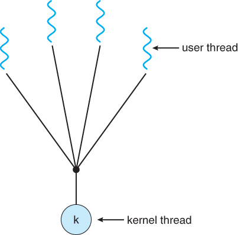

# Process Management

- [Process Management](#process-management)
  - [Program](#program)
  - [Process](#process)
    - [Process Memory Model](#process-memory-model)
    - [Process State](#process-state)
    - [Process Control Block (PCB)](#process-control-block-pcb)
    - [Context Switching](#context-switching)
  - [Process Operation](#process-operation)
    - [Process Termination](#process-termination)
  - [Process Scheduling](#process-scheduling)
    - [Degree of Multiprogramming](#degree-of-multiprogramming)
    - [Scheduling Queue](#scheduling-queue)
    - [Long Term Scheduler (Job Scheduler)](#long-term-scheduler-job-scheduler)
    - [Medium Term Scheduler](#medium-term-scheduler)
    - [Short Term Scheduler (CPU Scheduler)](#short-term-scheduler-cpu-scheduler)
  - [CPU Scheduling](#cpu-scheduling)
    - [Scheduling Criteria](#scheduling-criteria)
    - [Non-preemptive vs Preemptive](#non-preemptive-vs-preemptive)
    - [First Come, First Served Scheduling (FCFS)](#first-come-first-served-scheduling-fcfs)
    - [Shortest Job First Scheduling (SJF)](#shortest-job-first-scheduling-sjf)
    - [Priority Scheduling](#priority-scheduling)
    - [Round Robin Scheduling](#round-robin-scheduling)
    - [Multilevel Queue Scheduling](#multilevel-queue-scheduling)
  - [Real-Time CPU Scheculing](#real-time-cpu-scheculing)
  - [Inter-Process Communication](#inter-process-communication)
    - [Message Passing](#message-passing)
    - [Shared Memory](#shared-memory)
  - [Client-Server Communication](#client-server-communication)
    - [Socket](#socket)
    - [Remote Procedure Call](#remote-procedure-call)
    - [Pipe](#pipe)
  - [Thread](#thread)
    - [Process vs Thread](#process-vs-thread)
    - [Why Thread?](#why-thread)
    - [Concurrency vs Parallelism](#concurrency-vs-parallelism)
    - [Designing Multicore Programming](#designing-multicore-programming)
    - [Data Parallelism vs Task Parallelism](#data-parallelism-vs-task-parallelism)
    - [User Thread vs Kernel Thread](#user-thread-vs-kernel-thread)
    - [Multithreading Model](#multithreading-model)
  - [Synchronization](#synchronization)
    - [Producer Consumer](#producer-consumer)
    - [Critical Section](#critical-section)
    - [Mutex](#mutex)
    - [Semaphore](#semaphore)
    - [Monitor](#monitor)
  - [Deadlock](#deadlock)
  - [Practice](#practice)
  - [Reference](#reference)

## Program

- 명령어의 집합

## Process

- 실행중인 프로그램.

### Process Memory Model

- Text section : 프로그램 코드를 저장.
- Data section : 프로그램의 main 함수를 실행하기 전에 할당되는 static, 전역변수 같은걸 저장.
- Heap : 프로세스 실행중 동적으로 할당되는 공간.
- Stack : 지역번수, 함수 인자같은 임시 data를 저장.
- Heap과 stack은 memory space 각각 서로 반대방향으로 메모리를 할당.

### Process State

- New / Created : 처음에 만들어 지면 new 상태.
- Ready : In ready queue.
- Running : 실행중.
- Waiting : I/O등 작업을 기다리는 경우.
- Terminated : 종료.

### Process Control Block (PCB)

- Process의 정보를 저장해두는 공간. Process State, Process ID, Program Counter, Register 등을 저장.

### Context Switching

- CPU가 한 프로세스를 실행하다가 다른 프로세스를 실행하려면 Process정보를 저장하고 새로 실행할 프로세스의 정보를 불러와야함. 이 때 PCB에 Process 정보를 저장.

## Process Operation

- Process는 system call을 통해 다른 process를 만들 수 있음. 만든 process를 parent process라고 부르고 만들어진 process를 child process라고 부름.
- Linux에서는 init process (PID 1)이 다른 process의 root임.
- parent process는 child process와 동시에 실행되거나 child process가 끝나길 기다릴 수 있음.
- child process는 parent process의 resource 일부를 공유할 수 있음.

### Process Termination

- Process는 exit() system call을 하면 정수값을 반환하며 종료. process가 종료하면 할당받은 resource를 모두 반환.

## Process Scheduling

- CPU의 사용률을 최대로 높이게 process를 CPU에 할당하는 기법.

### Degree of Multiprogramming

- Memory위의 Process의 수.

### Scheduling Queue

- Job Queue : HDD에 있던 프로그램을 메모리에 로드 할 때 대기.
- Ready Queue : 프로세스들이 실행을 위해 대기.
- Device Queue : I/O장치를 이용하려는 작업이 대기.

### Long Term Scheduler (Job Scheduler)

- Disk로부터 Memory에 어떤 Process를 올려둘건지 결정하는 scheduler.
- Degree of Multiprogramming 을 관리.
- CPU bound process와 I/O bound process간의 적절한 조화를 관리.
- Process 상태는 new -> ready.

### Medium Term Scheduler

- Process들이 cpu 경쟁이 심해지면 Process를 실행 중에 Memory로부터 빼는 scheduler.
- Degree of Multiprogramming 을 줄임.
- Memory로부터 빼는걸 swap out, 다시 Memory에 올리는걸 swap in, 이 모든 과정을 swapping이라고 함.
- Process 상태는 ready -> suspended.

### Short Term Scheduler (CPU Scheduler)

- I/O, system call 같은게 생길때 Ready Queue의 어떤 Process에 CPU를 할당할지 결정하는 scheduler.
- Process 상태는 ready -> running.

## CPU Scheduling

### Scheduling Criteria

- CPU utilization : CPU 사용량.
- Throughput : 시간별 process 처리량.
- Turnaround time : process 제출시부터 종료까지의 시간.
- Waiting time : process가 read queue에 있는 시간.
- Response time : 최초 input으로부터 반응시간.

> 한정된 자원을 효율적으로 사용해야 하는 모든 곳에서 적용가능해보임.

### Non-preemptive vs Preemptive

- Non-preemptive (비선점형)
  - OS가 프로세서를 관리하지 않기 때문에 Process에 할당되면 끝날 때 까지 프로세스를 소유.
  - 일괄 처리 시스템에 적합.
- Preemptive (선점형)
  - OS가 프로세서를 관리하기 때문에 interrupt 등의 이유일때 다른 Process에 프로세서를 할당하는 형식.
  - 특정 요건들을 기준으로 자원을 배분. 스케줄링을 많이 함.

### First Come, First Served Scheduling (FCFS)

- 먼저 온 process에 CPU를 할당.
- 문제점 : Convoy Effect, 소요시간이 긴 프로세스가 먼저 도달하여 효율성을 낮추는 현상이 발생.

### Shortest Job First Scheduling (SJF)

- Next CPU burst time 이 짧을 것으로 예측되는 프로세스에게 선 할당.
- 선점형, 비선점형 둘다 가능. 선점형의 경우 Shortest Remaining Time (SRT) 라고도 부름.
- 문제점 : Starvation, 사용 시간이 긴 프로세스는 거의 영원히 CPU 를 할당받을 수 없음.

### Priority Scheduling

- 우선순위가 가장 높은 프로세스에게 CPU 를 할당. 작은 숫자가 우선순위가 높다.
- 선점형, 비선점형 둘다 가능.
- 문제점 : Starvation, 우선순위가 낮은 프로세스가 무기한 대기할 수 있음.
  - Aging으로 오래 머무르면 우선순위를 높여주는 식으로 해결 가능.

### Round Robin Scheduling 

- 각 프로세스는 동일한 크기의 할당 시간(time quantum)을 받고 할당이 끝나면 queue의 제일 뒤로 감.
- 장점 : Response time이 증가 (아무리 오래 기다려도 (n-1) * q 이상 기다리지 않음)
- 문제점 : time quantum이 너무 커지면 FCFS랑 똑같아짐. 너무 작아지면 잦은 Context Switching으로 overhead가 발생

### Multilevel Queue Scheduling

- Process를 분류해서 우선순위를 준다면 foreground (interactive) process에는 높은 우선순위를, background (batch) process에는 낮은 우선순위를 주는 기법.
- 우선순위가 높은 process부터 실행하거나 아니면 CPU time을 Level별로 다르게 줄 수도 있음.

## Real-Time CPU Scheculing

- Hard read-time system은 높은 수준의 요구사항을 가지고 있음.

> 게임 같은거랄까..?

TODO

## Inter-Process Communication

- Process는 기본적으로 독립적이나 Computation speedup이나 Modularity를 위해 협력하기도 함.
- 이때 서로 통신하기 위해 하는 과정을 IPC (Inter-Process Communication) 라고 함.

### Message Passing

- communication link를 만들고 (eg. shared memory, network) 서로 send, receive message를 주고받으면서 할 수도 있음.
- 고려해야 할 점
  - Naming
    - Direct communication : 두 process가 서로를 알아야 함.
    - Indirect communication :  생산자 소비자가 서로 공유된 mailbox에 넣고 빼는 구조.
  - Synchronization
    - Blocking : Sender는 Receiver가 받을 때 까지 blocked. Receiver는 Sender가 보낼 때 까지 blocked.
    - Unblocking : Sender는 보내고 끝. Receiver는 message queue가 비어 있는 경우 null을 처리.
    - Sender와 Receiver가 서로 blocking이면 생산자-소비자에서 동시성 문제가 없어짐.
  - Buffering
    - Zero capacity : buffer 크기 0. sender가 receiver가 처리할 때 까지 대기해야 함.
    - Bounded capacity : buffer 크기 제한. buffer가 가득차 있으면 sender가 대기.
    - Unbounded capacity : buffer 크기 무제한. sender가 대기 안하고 계속 넣음.

### Shared Memory

- 서로 다른 Process는 기본적으로는 같은 address space에 접근하지 못하지만 이를 예외적으로 허용.
- 어떤 식으로 공유 memory를 구성할건지, 동시성 관리를 어떻게 할건지는 Process에 달려 있음.
- 보통 Buffer같은거 둬서 생산자는 Buffer에 넣고 소비자는 Buffer에 있는거 빼는 식으로 동작.
  - Unbounded Buffer : size 제한이 없는 buffer.
  - Bounded Buffer : size 제한이 있는 buffer. buffer가 차있으면 생산자가 기다리고 buffer가 비어있으면 소비자가 기다림.

## Client-Server Communication

- IPC에서 적용된 개념이 Client Server간 통신에도 적용될 수 있음.

### Socket

- An endpoint for communication.
- IP address와 port number로 구성 (eg. 192.168.0.1:1000)
  - 1024 이전의 포트들은 공식적으로 정해져 있음. (eg. ftp: 21, http: 80, https: 443)
  - 1024 보다 큰 포트들은 connection을 새로 만들때 사용.
  - 127.0.0.1 (or localhost)은 자기 자신을 가리키는 loopback IP.
- Client가 server랑 연결 맺을 때 host의 남는 port를 할당받는 식으로 동작.

### Remote Procedure Call

TODO

### Pipe

TODO

## Thread

- A basic unit of CPU utilization.

### Process vs Thread

- Process
  - OS로부터 CPU, Memory 등 자원을 받아서 일하는 녀석
  - 메모리는 Code, Heap, Data등으로 구성
  - 장점 : 서로 다른 프로세스가 분리되어 있어서 한 프로세스가 죽어도 다른 프로세스에 영향이 없음
  - 단점 : 프로세스간 다른 메모리 영역을 사용해서 자원 공유가 힘들고 Context Switching 비용이 큼
- Thread
  - Process의 실행 단위
  - Process안의 Code, Heap, Data를 공유하고 Thread별로 별도의 Stack, Register를 가짐
  - 장점 : 한 Process의 메모리 공간을 공유해서 자원 공유가 쉽고 Context switching비용이 작음
  - 단점 : 자원 공유를 할 때 동시성 문제를 제어해야 함

### Why Thread?

- 요청올때마다 Process를 만드는건 비용이 큼. 어차피 비슷한 일 할텐데 Process 안에서 일을 하게해보자! 하는 김에 자원 공유도 할 수 있게 하고.

### Concurrency vs Parallelism

- Concurrency
  - 2개 이상의 task가 진행이 되게 하는 것 (동시에 실행될 필요는 없음).
  - Single core에서도 switwching을 통해 달성 가능.
- Parallelism
  - 2개 이상의 task를 완전히 동시에 실행하는 것.
  - Multi core에서만 가능

### Designing Multicore Programming

- Identifying tasks : 서로 독립적으로 실행될 수 있는 task를 찾는 과정.
- Balance : 분리한 task가 서로 비슷한 처리를 할 수 있게.
- Data splitting : 서로 독립적인 작업을 하기 때문에 data도 분리되어서 처리될 수 있게.
- Data dependency : 데이터가 서로 의존적인 경우 서로 간섭이 일어나지 않게.
- Testing and debugging : Single core일때보다 테스트나 디버깅이 어려우므로 이를 잘 해결할 수 있게.

### Data Parallelism vs Task Parallelism

- Data Parallelism : 같은 데이터에 대해 범위를 분리해서 처리하는 것 (eg. image를 구역을 나눠서 처리)
- Task Parallelism : Data를 나누는게 아니라 Task를 나누는 것 (eg. 요청 여러개를 분리)

### User Thread vs Kernel Thread

- User Thread : Kernel 위에서 돌아감.
- Kernel Thread : OS Kernel에 의해 직접적으로 관리됨.

### Multithreading Model

- User Thread랑 Kernal Thread는 서로 mapping되어야 함.
- Many-to-One Model
  - n user thread - 1 kernel thread
  - Blocking call이 있으면 전체 thread가 block.
- One-to-One Model
  - 1 user thread - 1 kernel thread
  - Blocking call이 있으면 다른 thread를 수행해서 parallism을 달성.
  - user thread마다 kernel thread가 있어야 해서 thread 수에 제약이 있음.
- Many-to-Many Model
  - n user thread - n kernel thread
  - thread수에 제약도 없고 blocking call의 경우에도 괜찮음.

> 이건 이론적인거고 실제로는 [이렇다고 한다](https://stackoverflow.com/questions/40707221/multithreading-model-in-linux-and-windows)
>
> - Many to Many가 설명상 좋아보이지만 이론적일 뿐. 실제로는 one-to-one model을 사용.
> - process를 여러개의 thread가 있는 address space로 보고 thread 단위로 스케줄링 (one-to-one).

## Synchronization

### Producer Consumer

### Critical Section

### Mutex

### Semaphore

### Monitor

## Deadlock

- 두개의 프로세스 이상이 서로 상대 프로세스가 끝나길 기다리고 있어서 아무것도 완료되지 못하는 상황
- 4가지 조건이 동시에 성립해야만 발생
  - Mutual exclusion : 자원은 한 번에 한 프로세스만이 사용할 수 있음
  - Hold and wait : 하나의 자원을 점유하고 있으면서 다른 프로세스에 할당되어 사용하고 있는 자원을 점유하기 위해 대기하는 프로세스가 있어야 함
  - No preemption : 자원에 대한 선점이 불가능
  - Circular wait : 자원을 대기하는 프로세스간 Cycle이 있어야 함 (e. A -> B, B -> C, C -> A)

## Practice

- Process
  - [process-fork](./practice/process-fork.c)

## Reference

- Operating System Concepts (Operating System Concepts, Ninth Edition)
  - [Process](https://www.cs.uic.edu/~jbell/CourseNotes/OperatingSystems/3_Processes.html)
  - [Thread](https://www.cs.uic.edu/~jbell/CourseNotes/OperatingSystems/4_Threads.html)
  - [Synchronization](https://www.cs.uic.edu/~jbell/CourseNotes/OperatingSystems/5_Synchronization.html)
  - [CPU Scheduling](https://www.cs.uic.edu/~jbell/CourseNotes/OperatingSystems/6_CPU_Scheduling.html)
  - [Deadlocks](https://www.cs.uic.edu/~jbell/CourseNotes/OperatingSystems/7_Deadlocks.html)
- [Process Management (코딩스낵)](https://gusdnd852.tistory.com/82)
- [Process State (wiki)](https://en.wikipedia.org/wiki/Process_state)
- [Scheduling (wiki)](https://en.wikipedia.org/wiki/Scheduling_(computing))
