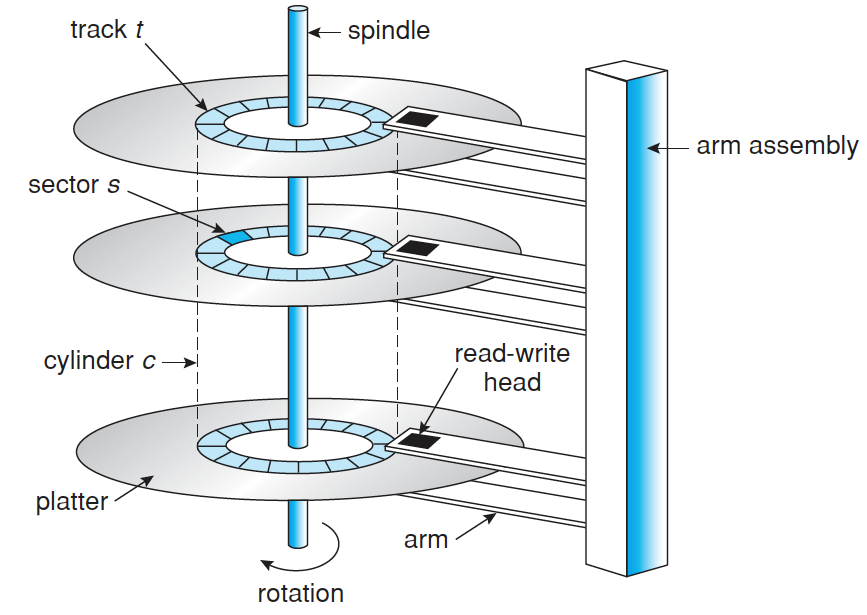
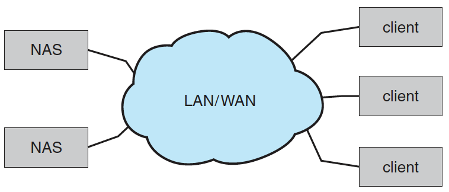
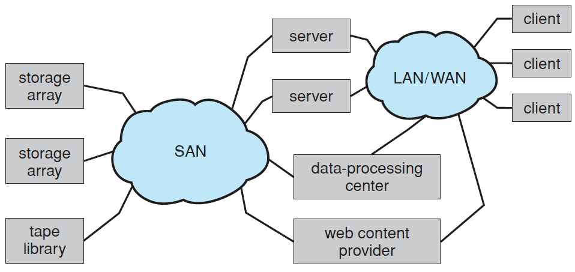

# Storage Management

- [Mass-Storage Structure](#mass-storage-structure)
  - [Secondary Storages](#secondary-storages)
    - [Magnetic Disks (HHD)](#magnetic-disks-hhd)
    - [Solid-State Disks (SSD)](#solid-state-disks-ssd)
    - [Magenetic Tapes](#magenetic-tapes)
  - [Disk Attachment](#disk-attachment)
    - [Host-Attashed Storage](#host-attashed-storage)
    - [Network-Attashed Storage (NAS)](#network-attashed-storage-nas)
    - [Storage-Area Network (SAN)](#storage-area-network-san)
  - [Disk Scheduling](#disk-scheduling)
    - [First-Come First-Serve Scheduling (FCFS)](#first-come-first-serve-scheduling-fcfs)
    - [Shortest Seek Time First Scheduling (SSTF)](#shortest-seek-time-first-scheduling-sstf)
    - [SCAN scheduling](#scan-scheduling)
    - [Circular SCAN Scheculing (C-SCAN)](#circular-scan-scheculing-c-scan)
    - [LOOK Scheculing](#look-scheculing)
  - [Disk Formatting](#disk-formatting)
  - [Swap-Space Management](#swap-space-management)
  - [RAID Structure](#raid-structure)
- [I/O Systems](#io-systems)
- [Reference](#reference)

## Mass-Storage Structure

### Secondary Storages

#### Magnetic Disks (HHD)

- platter가 겹겹히 쌓인 구조.
- 한 platter는 track이라는 여러개의 ring으로 구분.
- 각 platter에 같은 위치에 존재하는 track들의 집합을 cylinder.
- track은 sector라는 단위로 나누어짐.

#### Solid-State Disks (SSD)

- HDD보다 빠르지만 비쌈.

#### Magenetic Tapes

- HDD 이전에 주로 사용. But 되게 느려서 요즘은 backup용으로만 사용.

### Disk Attachment

#### Host-Attashed Storage

- Local I/O port로 접근.

#### Network-Attashed Storage (NAS)

- remote-procedure-call interface를 사용해서 Network를 통해 파일에 접근.

#### Storage-Area Network (SAN)

- nas와는 다르게 network protocal 말고 storage protocal을 통해 접근.
- Network bandwidth를 타지 않음

### Disk Scheduling

- Disk의 처리량은 cylinder를 옮기는 seek time과 원하는 sector를 찾는 rotational latency에 좌우됨.
- 여러개의 요청이 왔을 때 어떤 순서로 처리하느냐에 따라 성능이 크게 달라질 수 있음.

#### First-Come First-Serve Scheduling (FCFS)

- 처음 온거 먼저 처리.
- 장점
  - Simple.
- 단점
  - 요청받은 데이터가 저장되어 있는 cylinder간 간격이 멀면 되게 느려짐.

#### Shortest Seek Time First Scheduling (SSTF)

- seek time이 제일 짧은걸 먼저 처리.
- 장점
  - Efficient.
- 단점
  - seek time이 먼 경우 starvation이 일어날 수 있음.

#### SCAN scheduling

- Elevator algorithm, Elevator처럼 cylinder를 쭉 올렸다가 내렸다가 하면서 처리.
- 장점
  - 나름 동일하게 순회?
- 단점
  - cylinder의 앞쪽에 요청받은 데이터가 있고 해당 cylinder를 막 순회한 경우 다시 해당 cylinder를 순회하기까지 시간이 많이 걸림.

#### Circular SCAN Scheculing (C-SCAN)

- SCAN의 단점을 개선해서 cylinder를 쭉 올리면서 순회 후 다시 처음으로 돌아가서 쭉 올리면서 순회하는 방식.
- 장점
  - 진짜 동일하게 순회.

#### LOOK Scheculing

- 요청받은 데이터가 있는 가려는 방향에 먼저 있는지 확인 (LOOK)하고 SCAN하는 방식. 해당 방향에 기다리는 요청이 없으면 즉시 reverse로 순회하는 식으로 동작.

### Disk Formatting

- Physical formatting (Low-level formatting)
  - disk를 sector 단위로 분할.
- Logical formatting
  - file system을 만드는 과정.

### Swap-Space Management

- virtual memory용으로 사용될 swap space를 관리.

### RAID Structure

- Redundant Array of Inexpensive Disks.
- reliability나 성능 향상을 위해 데이터를 여러 disk 에 중복해서 저장하는 방법.

## I/O Systems

## Reference

- Operating System Concepts (Operating System Concepts, Ninth Edition)
  - [Mass-Storage Structure](https://www.cs.uic.edu/~jbell/CourseNotes/OperatingSystems/10_MassStorage.html)
  - [I/O Systems](https://www.cs.uic.edu/~jbell/CourseNotes/OperatingSystems/13_IOSystems.html)