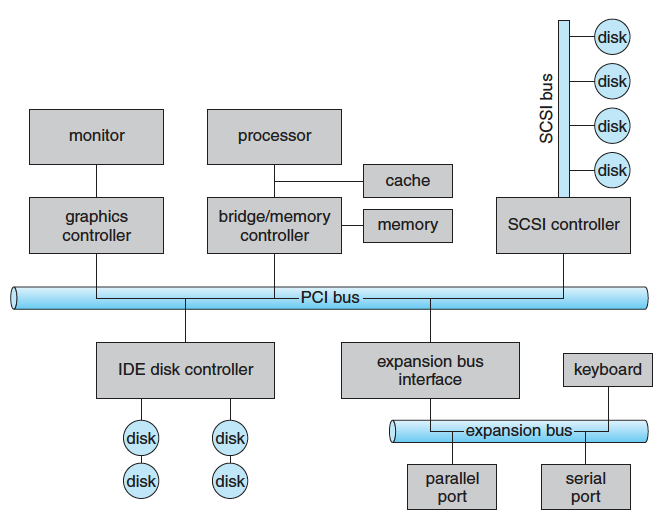
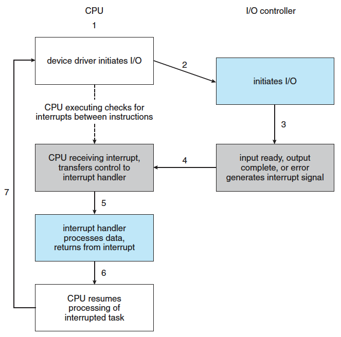
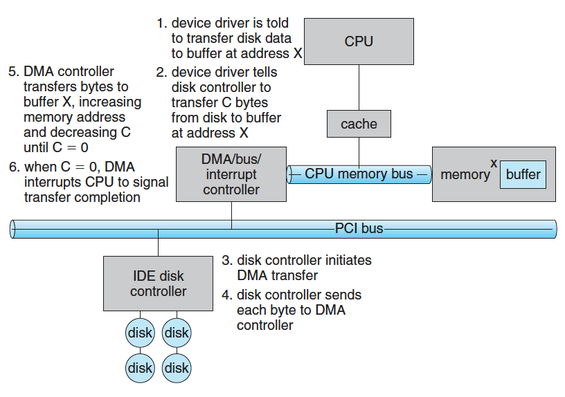
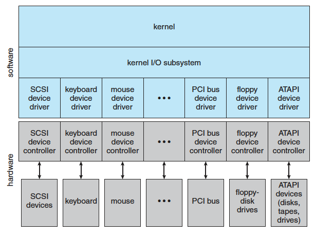
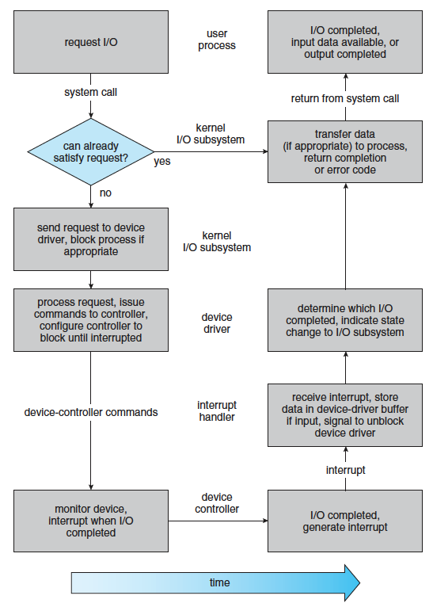

# Storage Management

- [Mass-Storage Structure](#mass-storage-structure)
  - [Secondary Storages](#secondary-storages)
    - [Magnetic Disks (HHD)](#magnetic-disks-hhd)
    - [Solid-State Disks (SSD)](#solid-state-disks-ssd)
    - [Magenetic Tapes](#magenetic-tapes)
  - [Disk Attachment](#disk-attachment)
    - [Host-Attashed Storage](#host-attashed-storage)
    - [Network-Attashed Storage (NAS)](#network-attashed-storage-nas)
    - [Storage-Area Network (SAN)](#storage-area-network-san)
  - [Disk Scheduling](#disk-scheduling)
    - [First-Come First-Serve Scheduling (FCFS)](#first-come-first-serve-scheduling-fcfs)
    - [Shortest Seek Time First Scheduling (SSTF)](#shortest-seek-time-first-scheduling-sstf)
    - [SCAN scheduling](#scan-scheduling)
    - [Circular SCAN Scheculing (C-SCAN)](#circular-scan-scheculing-c-scan)
    - [LOOK Scheculing](#look-scheculing)
  - [Disk Formatting](#disk-formatting)
  - [Swap-Space Management](#swap-space-management)
  - [RAID Structure](#raid-structure)
- [I/O Systems](#io-systems)
  - [Device Driver](#device-driver)
  - [I/O Hardware Structure](#io-hardware-structure)
  - [Memory Mapped I/O](#memory-mapped-io)
  - [Polling](#polling)
  - [Interrupt](#interrupt)
    - [Software interrupt (Trap)](#software-interrupt-trap)
  - [Direct Memory Access (DMA)](#direct-memory-access-dma)
  - [Application I/O Interface](#application-io-interface)
    - [Block Devices](#block-devices)
    - [Character Devices](#character-devices)
    - [Network Devices](#network-devices)
    - [Clocks and Timers](#clocks-and-timers)
    - [Blocking and Non-blocking I/O](#blocking-and-non-blocking-io)
    - [Vectored I/O](#vectored-io)
  - [Kernel I/O Subsystem](#kernel-io-subsystem)
    - [I/O Scheduling](#io-scheduling)
    - [Buffering](#buffering)
    - [Caching](#caching)
    - [Spooling and Device Reservation](#spooling-and-device-reservation)
    - [Error Handling](#error-handling)
    - [Kernel Data Structures](#kernel-data-structures)
  - [Transforming I/O Request to Hardware](#transforming-io-request-to-hardware)
- [Reference](#reference)

## Mass-Storage Structure

### Secondary Storages

#### Magnetic Disks (HHD)

- platter가 겹겹히 쌓인 구조.
- 한 platter는 track이라는 여러개의 ring으로 구분.
- 각 platter에 같은 위치에 존재하는 track들의 집합을 cylinder.
- track은 sector라는 단위로 나누어짐.

#### Solid-State Disks (SSD)

- HDD보다 빠르지만 비쌈.

#### Magenetic Tapes

- HDD 이전에 주로 사용. But 되게 느려서 요즘은 backup용으로만 사용.

### Disk Attachment

#### Host-Attashed Storage

- Local I/O port로 접근.

#### Network-Attashed Storage (NAS)

- remote-procedure-call interface를 사용해서 Network를 통해 파일에 접근.

#### Storage-Area Network (SAN)

- nas와는 다르게 network protocal 말고 storage protocal을 통해 접근.
- Network bandwidth를 타지 않음

### Disk Scheduling

- Disk의 처리량은 cylinder를 옮기는 seek time과 원하는 sector를 찾는 rotational latency에 좌우됨.
- 여러개의 요청이 왔을 때 어떤 순서로 처리하느냐에 따라 성능이 크게 달라질 수 있음.

#### First-Come First-Serve Scheduling (FCFS)

- 처음 온거 먼저 처리.
- 장점
  - Simple.
- 단점
  - 요청받은 데이터가 저장되어 있는 cylinder간 간격이 멀면 되게 느려짐.

#### Shortest Seek Time First Scheduling (SSTF)

- seek time이 제일 짧은걸 먼저 처리.
- 장점
  - Efficient.
- 단점
  - seek time이 먼 경우 starvation이 일어날 수 있음.

#### SCAN scheduling

- Elevator algorithm, Elevator처럼 cylinder를 쭉 올렸다가 내렸다가 하면서 처리.
- 장점
  - 나름 동일하게 순회?
- 단점
  - cylinder의 앞쪽에 요청받은 데이터가 있고 해당 cylinder를 막 순회한 경우 다시 해당 cylinder를 순회하기까지 시간이 많이 걸림.

#### Circular SCAN Scheculing (C-SCAN)

- SCAN의 단점을 개선해서 cylinder를 쭉 올리면서 순회 후 다시 처음으로 돌아가서 쭉 올리면서 순회하는 방식.
- 장점
  - 진짜 동일하게 순회.

#### LOOK Scheculing

- 요청받은 데이터가 있는 가려는 방향에 먼저 있는지 확인 (LOOK)하고 SCAN하는 방식. 해당 방향에 기다리는 요청이 없으면 즉시 reverse로 순회하는 식으로 동작.

### Disk Formatting

- Physical formatting (Low-level formatting)
  - disk를 sector 단위로 분할.
- Logical formatting
  - file system을 만드는 과정.

### Swap-Space Management

- virtual memory용으로 사용될 swap space를 관리.

### RAID Structure

- Redundant Array of Inexpensive Disks.
- reliability나 성능 향상을 위해 데이터를 여러 disk 에 중복해서 저장하는 방법.

## I/O Systems

### Device Driver

- Kernel이 복잡하고 다양한 I/O device를 다 담당하기에는 무리가 있음.
- 이를 추상화 해서 I/O subsystem에 접근할 수 있는 interface를 device driver가 제공.

### I/O Hardware Structure

- port : computer와 연결되어 있는 port가 있고 각 port에 4 bytes의 register가 있음.
  - data-in register : device로부터 쓰여진 데이터로 host에게 읽혀짐.
  - data-out register : host로부터 쓰여진 데이터로 device에게 읽혀짐.
  - status register : device의 상태를 나타내기 위한 register로 host에게 읽혀짐.
  - control register : host로부터 입력된 device의 설정을 바꾸기 위한 command로 device에게 읽혀짐.
- bus : 여러개의 device를 연결하기 위한 wire들과 wire에서 message를 보내기 위한 protocal들의 집합.

### Memory Mapped I/O

- device-controll register들이 process의 address space에 mapping 되어서 I/O는 해당 memory를 통해 이루어짐.
- graphic처럼 대용량의 데이터를 한꺼번에 처리해야 할 때 적합함.

### Polling

- host가 controller가 I/O를 처리할 때 까지 계속 port의 busy bit를 확인하는 방법.
- 장점
  - device와 controller가 빠르면 효율적임.
- 단점
  - host가 오래 기다려야 하면 비효율적임.

### Interrupt

- cpu에는 interrupt-request line이라는 cpu가 매 instruction마다 체크하는 부분이 있음.
- device에 i/o 요청 보내고 cpu는 자기 일 하고 있다가 interrupt-request line이 set이면 interrupt-handler routine으로 dispatch해서 interrupt를 처리함.

#### Software interrupt (Trap)

- System call을 구현하기 위한 특별한 instruction.
- trap instruction을 받으면 user mode -> kernel mode로 전환 후 instruction에 명시된 kernel service로 가서 요청한 system call을 수행.

### Direct Memory Access (DMA)

todo

### Application I/O Interface

- I/O device를 handling하기 위한 추상회된 interface.
- But os별로 interface가 달라서 device-hardware 제조사들은 각각 대응해야 함..

> Like other complex software-engineering problems, the approach here involves abstraction, encapsulation, and software layering. <- 책에 있는 말인데 와닿는다.

#### Block Devices

- Disk I/O에 대한 interface.
- operations : `read()`, `write()`, `seek()`
- raw I/O
  - filesystem structure를 사용하지 않고 바로 하는 방법.
  - locking, buffering 같은거를 os단에서는 pass하고 application 단에서 함.
- direct I/O
  - filesystem access를 사용. But os단에서 하는 locking, buffering을 pass함.

#### Character Devices

- 한번에 한 byte만
- operations : `get()`, `put()`

#### Network Devices

- network I/O를 추상화해서 full-duplex한 socket이라는 interface를 사용.
- operations : `select()`

#### Clocks and Timers

- Not standardized across operating systems...
- operations : `select()`

#### Blocking and Non-blocking I/O

#### Vectored I/O

### Kernel I/O Subsystem

#### I/O Scheduling

#### Buffering

#### Caching

#### Spooling and Device Reservation

#### Error Handling

#### Kernel Data Structures

### Transforming I/O Request to Hardware 

todo

## Reference

- Operating System Concepts (Operating System Concepts, Ninth Edition)
  - [Mass-Storage Structure](https://www.cs.uic.edu/~jbell/CourseNotes/OperatingSystems/10_MassStorage.html)
  - [I/O Systems](https://www.cs.uic.edu/~jbell/CourseNotes/OperatingSystems/13_IOSystems.html)