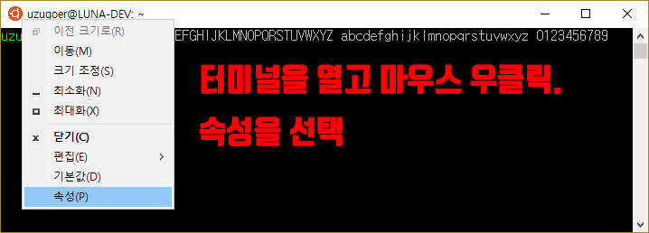

# Terminal

## Setup

- Setup : `setup.sh`
- Setup vim : `vi .` and :PluginInstall

## Color

https://github.com/sindresorhus/hyper-snazzy

### Iterm

- Import color presets : Profiles -> colors -> color presets -> import, import Snazzy.itermcolors
- Text size : Profile -> Text, text size as 13

### Window terminal

Set as ubuntu theme.

- 슬롯#1 : Red: 48, Green: 10, Blue: 36
- 슬롯#2 : Red: 52, Green: 101, Blue: 164
- 슬롯#3 : Red: 78, Green: 154, Blue: 6
- 슬롯#4 : Red: 6, Green: 152, Blue: 154
- 슬롯#5 : Red: 204, Green: 0, Blue: 0
- 슬롯#6 : Red: 117, Green: 80, Blue: 123
- 슬롯#7 : Red: 196, Green: 160, Blue: 0
- 슬롯#8 : Red: 211, Green: 215, Blue: 207
- 슬롯#9 : Red: 85, Green: 87, Blue: 83
- 슬롯#10 : Red: 114, Green: 159, Blue: 207
- 슬롯#11 : Red: 138, Green: 226, Blue: 52
- 슬롯#12 : Red: 52, Green: 226, Blue: 226
- 슬롯#13 : Red: 239, Green: 41, Blue: 41
- 슬롯#14 : Red: 173, Green: 127, Blue: 168
- 슬롯#15 : Red: 252, Green: 233, Blue: 79
- 슬롯#16 : Red: 238, Green: 238, Blue: 238

- 화면 텍스트 : 슬록#8
- 화면 배경 : 슬록#1
- 팝업 텍스트 : 슬록#1
- 팝업 배경  : 슬록#16

## References

wsl ubuntu theme

https://webdir.tistory.com/546
