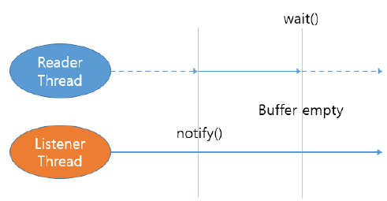
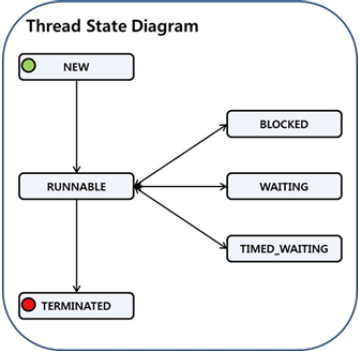

# 3. JVM Synchronization

## 3.1. Introduction

Jvm has thread. It can be used to take care of multiple requests.

But thread has synchronization issue on accessing shared resources. We need object lock to synchronize it.

- Critical section : A section which cannot be executed by more than one thread at a time.
- Mutual exclusion : A property of concurrency control, which is instituted for the purpose of preventing race conditions.
- Lock (in jvm object) : A kind of data which is logically part of an object's header on the heap memory

A Monitor is a synchronization construct that allows threads to have both mutual exclusion (using locks) and cooperation.

It has the ability to make threads wait for certain condition to be true (using wait-set).


Jvm uses monitor to resolve synchronization issue.

[lock-vs-monitor-in-jvm](https://howtodoinjava.com/java/multi-threading/multithreading-difference-between-lock-and-monitor/)\
[kdata-this-book](https://www.kdata.or.kr/info/info_04_view.html?field=&keyword=&type=techreport&page=18&dbnum=183741&mode=detail&type=techreport)

## 3.2. Java synchronization

Jvm increment/decrement lock count everytime a thread is entering critical section.

When object lock count == 0, release locked object.

### Synchronized statement

It generate bytecodes to lock/unlock monitor. It obtain lock when entering critical section.

```java
class SyncStatement {
  private int[] intArr = new int[10];

  void syncBlock() {
    // MONITORENTER statement in bytecode (critical section start)
    synchronized (this) {
      for (int i = 0; i < intArr.length; ++i) {
        intArr[i] = i;
      }
    }
    // MONITOREXIT statement in bytecode (critical section end)
    // it's called before throwing exception
  }
}
```

### Synchronized method

No bytecode to lock/unlock monitor. It should get lock to call `syncMethod`.

```java
class SyncMethod {
  private int[] intArr = new int[10];

  // need lock to call it
  // release unlock on normal execution
  // release unlock on exception
  public synchronized void syncMethod() {
    for (int i = 0; i < intArr.length; ++i) {
      intArr[i] = i;
    }
  }
}
```

### Wait and notify



- Reader waits for listeer to notify.
- Listener notifies to a listeer on buffer ready.
- When reader process buffer, it waits again.

Java has `wait`, `notify`, `notifyAll`, etc.. methods for it.

### Heavy-weight vs Light-weight

Using `synchronized` keyword is called heavy-weight lock. We should rather use light-weight lock which uses CAS (Compare And Swap) instead.

## 3.3. Thread state



- NEW : Not yet started is in this state.
- RUNNABLE : Executing in the Java virtual machine is in this state.
- BLOCKED : Waiting for a monitor lock is in this state. Caused by
  - `synchronized` block
  - `synchronized` method
- WAITING : Waiting indefinitely for another thread to perform a particular action is in this state. Caused by
  - `Object.wait` with no timeout
  - `Thread.join` with no timeout
  - `LockSupport.park`
- TIMED_WAITING : Similar with WAITING but has timeout. Caused by
  - `Thread.sleep`
  - `Object.wait` with timeout
  - `Thread.join` with timeout
  - `LockSupport.parkNanos`
  - `LockSupport.parkUntil`
- TERMINATED : Exited is in this state.

[javase-thread-state](https://docs.oracle.com/javase/8/docs/api/java/lang/Thread.State.html)

## 3.4. Thread type

- VM Background Thread : Executing compile, optimization, garbage collection, etc..
- Main Thread : Executing `main(String[] args)` method. VM Thread in the Hotspot VM.
- User Thread : Made by extending `java.lang.Thread` or implementing `java.lang.Runnable`

## 3.5. Diagnosing Thread Waiting

Occurs when threads are competing for shared resources along with synchronization issue.\
We can diagonse it by dumping thread or GC

## 3.6. Thread Dump

`jstack <pid>` or `jcmd <pid> Thread.print`

```java
// thread name, priority, thread id, state description
//   thread state: SOME_STATE
//       at call stack
"Thread-0" #9 prio=5 os_prio=31 tid=0x00007fcdc2046800 nid=0x3b03 waiting for monitor entry [0x000070000ccfc000]
   java.lang.Thread.State: BLOCKED (on object monitor)
        at SyncStatement$Thread2.run(SyncStatement.java:20)
        - waiting to lock <0x00000006c0006728> (a java.lang.Object)
```

Details are different per jvm implementation.

## 3.7. Thread dump practice

### Dumping

Run `SyncStatement.java`, `SyncMethod.java`, `WaitNotify.java` and dump it.

Blocked vs Waiting

- `BLOCKED` : caused by `synchronized` keyword, description is `waiting for monitor entry [xxx]`
- `WAITING` : caused by `explicit wait`, description is `Object.wait() [xxx]`

```java
while (true) {
  synchronized (LockObject) { // obtain lock (RUNNABLE) or waiting for unlock (BLOCKED)
    LockObject.wait(); // does to Wait Set (WAITING)
    doSomething(); // do something on notification (RUNNABLE)
  }
}
```

### bytecode comparision

Compile `SyncStatement.java`, `SyncMethod.java`.

Show bytecode by `javap -c -p SyncXXX\$Infinity.class` where XXX Statement or Method.

SyncMethod doesn't have __monitorenter__, __monitorexit__ bytecode whereas SyncStatement has it.
