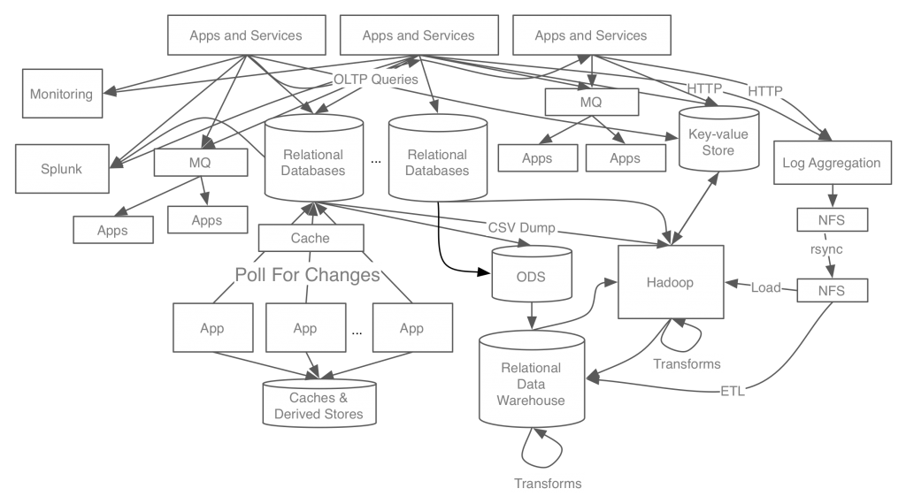

# 1. What is kafka

- [1.1. 카프카의 탄생 배경과 발전 과정](#11-카프카의-탄생-배경과-발전-과정)
- [1.2. 카프카의 동작 방식과 특징](#12-카프카의-동작-방식과-특징)
- [1.3. 카프카의 특징](#13-카프카의-특징)
- [1.4. 카프카의 확장과 발전](#14-카프카의-확장과-발전)
- [Reference](#reference)

## 1.1. 카프카의 탄생 배경과 발전 과정

- 2002년 설립된 링크드인이 내부 이슈들을 해결하려고 만듬.

kafka 이전의 시스템 구성도.



- 처음부터 이렇게 복잡했던게 아님. 서비스가 커지면서 자연스럽게 데이터 스토어가 분화되었고 관리 부담이 증가되어서 기능 개발이 지연되었음. ActiveMQ같이 메시지 큐 시스템이 있는데 이게 좀 무거워서 느림.
- 그래서 빡쳐서 제이 크렙스가 4가지 목표를 가지고 새로운 시스템을 만듦.
  - 프로듀서와 컨슈머의 분리.
  - 메시징 시스템과 같이 영구 메시지 데이터를 여러 컨슈머에세 허용.
  - 높은 처리량을 위한 최적화된 메시지.
  - scale out이 가능.

kafka 이후의 시스템 구성도.


- 링크드인 사용자가 프로필을 업데이트 하면 정보가 카프카로 전송됨. 이 정보를 실시간 스트림으로 처리해서 데이터 웨어하우스에 저장된 회사 정보, 위치, 속성들을 변경. 검색 인덱스 시스템도 변경, 소셜 그래프 시스템도 변경, 직업 추천 시스템도 변경함. 이 과정이 수 ms 단위로 처리.
- 하루에 약 1조개 이상의 메시지를 처리하는중.

Kafka는 메시지 전달의 중앙 플랫폼으로 두고 기업에서 필요한 모든 데이터 시스템과 상호작용하는 데이터 파이프라인으로 만드는 것을 목표로 두고 개발함. 그래서 Kafka 로고에도 'O'들이 이어져 있음.


> kafka는 그냥 데이터 pipelining을 중앙화해서 처리하기 위한 message queue군.

## 1.2. 카프카의 동작 방식과 특징

kafka는 기본적으로 메시징 서버임.

- 메시징 시스템 : publisher가 message를 publish하고 subscriber가 메시지를 받는 pub/sub model

일반적인 통신

```text
a --- b
| \ / |
| / \ |
c --- d
```

- 4개가 통신하면 서로 연결해야 함.
- 장점.
  - 빠른 전송과 전송 결과를 바로 알 수 있음.
- 단점
  - 컴포넌트간 연결을 해야 하기 때문에 확장성이 안좋음.

전통적인 pub/sub model

```text
a        c-queue --- c
 \      /
  broker
 /      \
b        d-queue --- d
```

- producer가 consumer에게 메시지를 직접 전달하는게 아니라 메시지 수신자의 ID를 포함시켜서 메시징 시스템에 전송.
- 메시징 시스템은 ID를 보고 적당한 컨슈머의 큐에 전달.
- 컨슈머는 자신들의 큐를 모니터링 하다가 메시지가 전달되면 값을 가져감.
- 장점
  - 개체가 빠져도 메시징 시스템만 살아 있으면 데이터 유실이 안됨.
  - 확장성이 용이.
- 단점
  - 데이터가 정확하게 전달되었는지 확인하려면 코드가 복잡해짐.
  - 메시지 전달 속도가 직접 통신보다 느림.
  - 기존의 메시징 시스템은 신뢰성을 보장하는데 중점을 맞췄기 때문에 속도, 용량을 신경 안써서 성능이 후달렸음. 그래서 작은 시스템에서만 쓰임.

Kafka

- 메시징 교환 전달의 신뢰성 관리를 producer와 consumer로 넘기고 부하가 많이 걸리는 교환기 역시 컨슈머가 만들 수 있게 해서 메시징 시스템 내의 부하를 줄임.
  > 걍 니들이 다 해라 이거 아님?
- 절약한 작업량을 메시징 전달 기능에 집중.
- Kafka 메시지 전달 과정.
  1. Producer가 message를 kafka에 보냄.
  2. Kafka는 Kafka의 consumer queue에 message를 저장.
  3. Consumer는 Kafka에 접속해서 메시지를 가져감.

## 1.3. 카프카의 특징

Kafka 특징

- Producer와 Consumer의 분리.
  - 서버간 loosely coupled 되면서 한 서버가 죽어도 괜찮아짐.
    > kafka가 SPOF가 된거 아님??
- Multi producer, Multi consumer.
  - 하나의 토픽에 여러 producer, consumer가 접근 가능한 구조.
  - 하나의 producer가 여러 topic에 메시지를 보낼 수 있고 하나의 consumer도 여러 topic으로부터 메시지를 가져올 수 있음.
  - 하나의 데이터를 다양한 용도로 사용하는 요구가 많아져서 이렇게 만듬.
- 디스크에 메시지 저장
  - 일반적인 메시지 시스템은 컨슈머가 데이터를 읽어가면 큐에서 메시지를 바로 삭제. But Kafka는 보관 주기 동안 데이터를 디스크에 저장함.
  - 트래픽이 몰려서 consumer의 처리가 늦어져도 데이터는 디스크에 안전하게 보관되어 있음.
  - Multi consumer도 데이터를 디스크에 저장해서 가능.
  - consumer가 이상해서 뻗더라도 message 데이터는 디스크에 잘 저장되어 있기 때문에 쉽게 재시작 가능.
- 확장성
  - Kafka 설계 자체가 확장이 용이하도록 설계.
  - 서비스 중단 없이 온라인 상태에서 손쉽게 작업 가능.
- 높은 성능
  - 고성능 자체를 목표로 만듬. 내부에서 분산 처리, 배치 처리 등 다양한 기법을 사용.
  - 링크드인만 봐도 고성능인거 알 수 있음.

Kafka Terms

- Kafka : Application 이름. cluster 구성이 가능해서 Kafka Cluster라고도 부름.
- Broker : Kafka node를 말함.
- Topic : Message들을 구분하기 위한 이름.
- Partition : 병렬처리가 가능하도록 topic을 분리하는 단위.
- Producer : Message를 생산.
- Consumer : Message를 가져감.

## 1.4. 카프카의 확장과 발전

- Kafka를 통해 고성능의 pub/sub model이 가능해지면서 2000년대 초 등장한 SOA (Service Oriented Architecture)의 핵심 구성요소중 하나인 ESB (Enterprise Service Bus)를 쉽게 구현할 수 있게 됨.
- SOA : 업무를 서비스라는 단위로 쪼개고 각 서비스간의 연결은 ESB를 통해 지원한다는 철학을 지향.
- ESB의 특징
  - 다양한 시스템과 연동하기 위한 멀티 프로토콜과 데이터 타입 지원.
  - loosely coupled를 위한 message queue.
  - 정기적으로 데이터를 가져오는 대신 Event-Driven 통신 지향.
- Kafka는 강략한 message 전달 능력을 바탕으로 Kafka Streams, KSQL 등 분석 시스템도 제공하려고 하고 있음.

## Reference

- [confluent - stream data platform 1](https://www.confluent.io/blog/event-streaming-platform-1/)