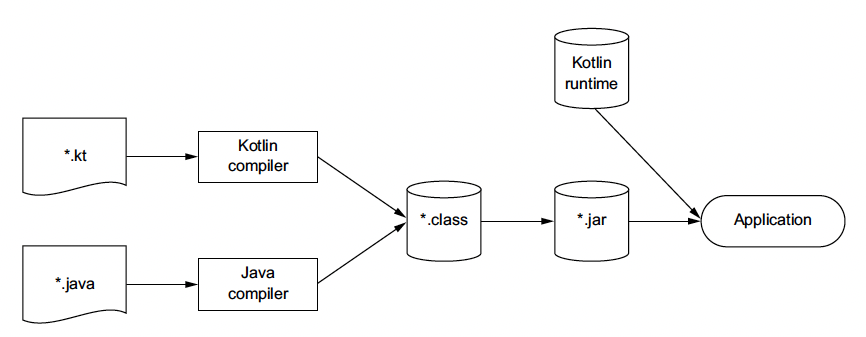

# 1. Kotlin: What and why

- [Introduction](#introduction)
- [1.1. A taste of Kotlin](#11-a-taste-of-kotlin)
- [1.2. Kotlin Primary traits](#12-kotlin-primary-traits)
  - [Target platforms: server-side, Android, anywhere Java runs](#target-platforms-server-side-android-anywhere-java-runs)
  - [Statically typed](#statically-typed)
  - [Functional and object-oriented](#functional-and-object-oriented)
  - [Free and open source](#free-and-open-source)
- [1.3. Kotlin applications](#13-kotlin-applications)
  - [Kotlin on the server side](#kotlin-on-the-server-side)
  - [Kotlin on Android](#kotlin-on-android)
- [1.4. The philosophy of Kotlin](#14-the-philosophy-of-kotlin)
  - [Pragmatic (실용적인)](#pragmatic-실용적인)
  - [Concise](#concise)
  - [Safe](#safe)
  - [Interoperable](#interoperable)
- [1.5. Using the Kotlin tools](#15-using-the-kotlin-tools)
  - [Compiling Kotlin code](#compiling-kotlin-code)
  - [Plug-in for Intellij IDE and Android Studio](#plug-in-for-intellij-ide-and-android-studio)
  - [Interactive Shell](#interactive-shell)
  - [Eclipse plug-in](#eclipse-plug-in)
  - [Online playground](#online-playground)
  - [Java-to-Kotlin converter](#java-to-kotlin-converter)

## Introduction

- Kotlin은 Java platform을 대상으로 함.
- Java 호환성을 중요시.
- Java가 쓰일 수 있는 곳에 거의 사용 가능함.

## 1.1. A taste of Kotlin

- 여러 Person 중에서 나이 제일 많은거 찾을 수 있는 Kotlin 코드 맛좀 봐.
  ```kotlin
  // data class
  data class Person(val name: String,
                    val age: Int? = null) // nullable type, default value is null

  // main function
  fun main(args: Array<String>) {
      val persons = listOf(
          Person("Alice"),
          Person("Bob", age = 29) // named argument
      )

      // lambda expression, elvis operator
      val oldest = persons.maxBy { it.age ?: 0 }

      // string template
      println("The oldest is: $oldest")
  }
  ```
- 예제 코드 실행 해보고 싶으면 https://play.kotlinlang.org/ 에 방문해.

## 1.2. Kotlin Primary traits

### Target platforms: server-side, Android, anywhere Java runs

- Kotlin은 Java가 쓰이는 모든 곳에 더 정확하고 생산성 높고 안전한 대체제가 되려고 함.
- 대표적인 사용처는
  - server-side code (Backend).
  - Android.
- But Kotlin -> JavaScript로 변환해서 kotlin을 browser에서도 사용 가능하는 등 다른 곳에서도 사용 가능.

> jvm 생태계나 좀 잘 잡아보지. Java가 계속 발전하는데 괜찮을까?

### Statically typed

- Java처럼 Statically typed라서 type of expression이 compile time에 결정.
- Dynamically typed는 유연하지만 오타 등을 compile time에 확인할 수 없다는 문제점이 있음.
- Java와는 다르게 변수의 type을 추론해 줘서 타입을 굳이 명시 안해도 됨.
  - eg. `val x = 1` -> Int라고 compiler가 추론.
- 정적 언어를 사용함으로써 다음의 이점이 있음.
  - Performance : 어떤 method call을 해야 하는지 runtime에 결정하지 않아서 호출이 빠름.
  - Reliability : Compiler가 검증을 하기 때문에 runtime에 뻗을 위험이 적음.
  - Maintainability : 모르는 코드를 봤을 때 명확하게 보이기 때문에 유지보수가 쉬움.
  - Tool support : static typing은 refactoring, code complete 같은 IDE feature를 사용할 수 있게 해줌.
- Class, interface, generic 같은 개념을 Java에서 가져와서 친숙함.
- nullable type을 도입해서 사용하는 field가 null이 아닌지 compile time에 확인 가능.
- functional programming을 위해 function type을 도입함.

> Java 10에 `var` keyword가 도입되면서 type 추론이 가능해지긴 함.

### Functional and object-oriented

- Java 해봤으면 OOP는 알거고. 그런데 Kotlin은 FP도 됨.
- FP의 개념들.
  - First-class function : function을 값으로 처리해서 변수에 넣거나 인자로 넘기거나 리턴할 수 있음.
  - Immutability : 생성되면 안바뀌는거 확신 가능.
  - No side effects : pure function만 사용하면 같은 input에 같은 결과가 나오는걸 보장 가능.
- FP는 imperative code에 비해 간결하고 높은 수준의 추상화를 제공함.
  - eg. 
  ```kotlin
  // findPerson() contains the general logic of finding a person.
  fun findAlice() = findPerson { it.name == "Alice" }
  fun findBob() = findPerson { it.name == "Bob" }
  ```
- FP는 객체가 immutable하기 때문에 multi threading 할 때 같은 데이터를 다른 thread에서 변경할 일 자체가 없음.
- FP는 side effect가 없어서 테스트가 쉬움.
- Functional Style은 모든 언어에서 사용 가능하긴 하지만 이를 언어 차원에서 제공이 안되는 경우가 있음. Java에서는 8 이전에는 없었음.
- 반면에 Kotlin에는 FP 지원 짱짱.
  - Function type : function을 인자로 넘기거나 리턴 가능.
  - Lambda expression : 함수 작성할 때 적은 코드 사용.
  - Data class : immutable value를 쉽게 작성.
  - object, collection에 사용할 수 있는 functional style의 rich API를 제공.
- 물론 Kotlin에서는 FP를 강제하지는 않으니까 상황따라 OOP, FP 적당히 섞어서 쓰셈.

### Free and open source

- compiler, libraries, tooling 전부 Apache 2.0 라이선스로 open & free to use임. 
- 오픈소스 ide는 Intellij community, Android studio, Eclipse가 있음.

## 1.3. Kotlin applications

### Kotlin on the server side

- Server side programming은 다음을 모두 포함함.
  - HTML을 Browser에 리턴하는 web application.
  - HTTP 기반으로 JSON API를 제공하는 mobile application backend.
  - MSA에서 RPC 프로토콜로 서로 통신하는 microservice server.
- Backend 개발은 Java기반의 다양한 framework나 기술에 기반하여 많이 이루어졌음. Kotlin은 이 생태계를 그대로 이용 가능. 생태계를 그대로 이용하면서 more compact, reliable, easier to maintain 한 코드를 짤 수 있음.
- 그런 생태계에 추가로 Kotlin은 여러 가지 신기술을 도입함.
  - eg. Builder pattern
    ```kotlin
    // Use kotlin to write HTML
    fun renderPersonList(persons: Collection<Person>) =
        createHTML().table {
            for (person in persons) {
                tr {
                    td { +person.name }
                    td { +person.age }
                }
            }
        }
    }
    ```
  - eg. [Exposed framework](https://github.com/jetbrains/exposed) : Kotlin SQL framework.
    ```kotlin
    // Use kotlin to write SQL
    object CountryTable : IdTable() {
        val name = varchar("name", 250).uniqueIndex()
        val iso = varchar("iso", 2).uniqueIndex()
    }

    class Country(id: EntityID) : Entity(id) {
        var name: String by CountryTable.name
        var iso: String by CountryTable.iso
    }

    val russia = Country.find {
        CountryTable.iso.eq("ru")
    }.first()
    ```

### Kotlin on Android

- Modile application은 existing codebase에 상대적으로 덜 의존적이고 여러 device에 잘 동작하는 방식으로 빨리 배포하는게 중요함.
- Kotlin의 feature + 특정한 compiler plugin을 결합하면 android development를 보다 쉽게할 수 있음. 예를 들어 listener를 추가하는 과정 같은거를 보다 적은 code로 할 수 있음.
  -  eg. [Anko](https://github.com/kotlin/anko) : A type-safe DSL for building Android.
    ```kotlin
    verticalLayout {
        val name = editText()
        button("Say Hello") {
            onClick { toast("Hello, ${name.text}!") }
        }
    }
    ```
- 그리고 당시 기준으로 Java 6과 호환되게 만들어서 Kotlin으로 작성한 mobile application을 옛날 Android의 버전에서도 돌릴 수 있음.
- 성능 측면에서도 Kotlin이 최적화를 잘해놓아서 딱히 느리지 않음. 

> anko는 이제 deprecated되긴 함.
> 처음에 a type-safe DSL for building Android layouts로 만들었는데 나중에 하다 보니까 다른 곳에서도 type-safe DSL을 작성할 수 있으면 좋을거 같아서 Anko-Commons 만듬.
> Anko가 꽤 유명해지긴 했으나 Android View API에서 제공하는 기능을 100% 제공하기는 어려운 점이 있었음. 안되는거 지원하려면 DSL had to rely on hacks or workarounds. 그 외에도 corner case가 많았는데 그걸 다 지원하기에는 시간적 여유가 없었음.
> 하지만 시간이 지난 후 Google이 android의 공식 언어로 Kotlin을 채택하고 Jetpack이라는 거도 만들어서 Anko의 문제점을 해결함.
> 현재 기준으로는 Anko도 나쁘지 않으나 더 좋은게 많이 나와서 deprecated시킴.

> -> 음.. type-safe builder를 작성해본 입장에서 기능을 100% 제공하는게 어려웠다는게 궁금하긴 하네.

## 1.4. The philosophy of Kotlin

### Pragmatic (실용적인)

- Kotlin is a practical language designed to solve real-world problems.
- Kotlin은 많은 경험 많은 개발자들에 의해 디자인 되었으며 beta version으로 feedback도 많이 받음.
- Kotlin은 실험적인 언어가 아니라서 이미 다른 PL에서 적용되고 검증된 기능만 추가. 그래서 배우기 쉽고 간단함.
- Kotlin은 패러다임을 강제하지 않아서 개발자가 알아서 하면 됨.
  > 이건 좀 아쉽긴 하다.
- Kotlin은 tooling에 집중함. tooling이 개발자 생산성에 직접적으로 영향을 주기 때문에 language feature를 도입할 때도 tooling을 고려함.

### Concise

- 유지보수 할 때 이미 존재하는 code를 읽어야 함. Kotlin은 Java와는 다르게 boilerplate code (eg. getter, setter) 등을 최소화 하려고 함.
- Kotlin은 rich std library를 제공해서 많은 작업을 api 한개만 호출해서 되게 함.
  eg. 여러 element중 한개를 찾는거 api 호출 한개로 가능.

### Safe

- 프로그래밍 언어가 안전하다는 말은 여러 에러들을 언어 차원에서 잡아준다는 것.
- 그런데 safe하게 하기 위해서는 compiler에게 더 알려줘야 하기 때문에 비용이 듬. 즉, trade-off 관계임.
- Safety를 지키는 것도 비용이므로 kotlin은 적은 비용으로 이걸 달성하려고 함.
  - 타입 추론 : 비용 덜 들면서 statically typed system을 더 잘 활용 가능.
  - Null safety : `?` 한개만 붙여서 NPE를 방지.
    ```kotlin
    val s: String? = null // May be null
    val s2: String = "" // May not be null
    ```
  - ClassCaseException 방지 : 체크랑 cast를 한번에 해서 개발자들이 체크랑 cast를 따로 해야해서 실수하는거 방지. 
    ```kotlin
    if (value is String) { // check the type
        println(value.toUpperCase()) // Use the method of the type
    }
    ```

### Interoperable

- Java로 작성된 library 100% Kotlin에서 호출 가능.
- 심지어 Kotlin으로 작성된 코드를 Java에서 수행도 가능.
- Kotlin에는 자체적인 collection library가 없음. Java의 collection library를 사용. 물론 몇개 편리한 기능을 추가하긴 함.

## 1.5. Using the Kotlin tools

- Kotlin은 compiled language임.

### Compiling Kotlin code



```sh
# compoile
kotlinc <source file or directory> -include-runtime -d <jar name>

# run
java -jar <jar name>
```

- Kotlin으로 컴파일된 jar는 kotlin runtime library가 필요.
- kotlin runtime library는 자체적인 std library + Java API extension들로 구성됨.
- Ant, Maven, Gradle에서도 Kotlin 지원. Java, Kotlin을 mixed해서 쓰는 것도 지원함.

### Plug-in for Intellij IDE and Android Studio

- Intellij IDEA의 Kotlin support는 심지어 언어가 개발될 때 같이 개발됨.
- Android Studio 에도 Plugin 있음.

### Interactive Shell

- kotlin interactive shell (REPL) 제공.
- `kotlinc` 추가적인 명령어 없이 치면 REPL 실행.

### Eclipse plug-in

- Eclipse marketplace에 kotlin plugin 있음.

### Online playground

- http://try.kotl.in 에 online playground 있음

> 현재는 https://play.kotlinlang.org/ 로 대체됨.

### Java-to-Kotlin converter

- Java로 코드 작성하고 Kotlin file에 paste하면 알아서 kotlin code로 변환해줌.
- Intellij IDEA에서는 ㄹㅇ 그냥 Java code 복붙하면 됨.