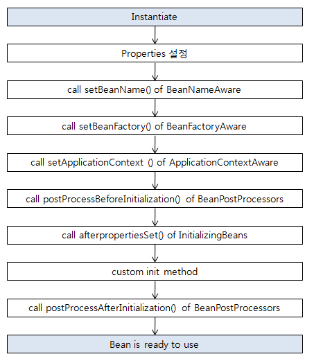

# Spring Core

스프링프레임워크(이하스프링)5.1버전이출시되었습니다.버전이올라갈수록스프링은다양한
프로그래밍기법과기능을제공하지만스프링의핵심기술은크게변하지않았습니다.

즉,IoC컨테이너,AOP그리고몇몇핵심API는스프링을탄탄하게지탱하는디딤돌과같습니다.따라서
스프링핵심기술을이해한다면,스프링이제공하는JDBC,테스트,MVC관련기능뿐아니라,스프링
부트와스프링데이터JPA와같은여러다른스프링프로젝트도빠르고정확히이해할수있습니다.

구체적으로이번강좌에서는​스프링IoC​(InversionofControl)컨테이너와빈그리고​스프링AOP​(Aspect
OrientedProgramming)에대해자세히학습합니다.또한,스프링이제공하는여러기능의기반이되는
Resource,Validation,데이터바인딩과같은스프링의여러​추상API​와Null관련유틸리티도학습합니다.

이번강좌는IoC,AOP,PSA에대해들어는봤지만,실제스프링으로코딩을해본적이없는분들또는핵심
기술에대한이해없이MVC로웹애플리케이션개발만해온개발자또는학생을대상으로합니다.따라서
소개와이해를중심으로설명하기때문에매우깊이있게다루진않습니다.심화학습을하고싶으신
분들께는이번강좌를추천하지않습니다.

이번강좌는스프링부트를사용하며스프링핵심기술을학습합니다따라서스프링부트기반의프로젝트를
사용하고있는개발자또는학생에게유용한스프링강좌입니다.스프링부트가제공하는여러기능이
스프링의핵심기술과어떻게관련이있는지이해할수있습니다.

Goal

- 스프링 프레임워크의 핵심 기술 IoC, AOP, PSA를 이해합니다..
- 스프링 프레임워크 IoC 컨테이너의 다양한 기능을 사용할 수 있습니다.
- 다양한 방법으로 빈을 정의하고 의존 관계를 주입할 수 있습니다.
- 스프링 AOP를 사용하여 Aspect를 모듈화 할 수 있습니다.
- 그밖에 다양한 스프링 핵심 기술을 이해하고 또 활용할 수 있습니다.

Contents

- [Spring Core](#spring-core)
  - [Spring Basic](#spring-basic)
  - [IoC Container and Bean](#ioc-container-and-bean)
    - [IoC Container](#ioc-container)
    - [ApplicationContext](#applicationcontext)
    - [@Autowire](#autowire)
    - [@Component and @ComponentScan](#component-and-componentscan)
    - [Bean Scope](#bean-scope)
    - [Environment - Profile](#environment---profile)
    - [Environment - Property](#environment---property)
    - [MessageSource](#messagesource)
    - [ApplicationEventPublisher](#applicationeventpublisher)
    - [ResourceLoader](#resourceloader)
  - [Resource / Validation](#resource--validation)
    - [Resource](#resource)
    - [Validation](#validation)
  - [Data Binding](#data-binding)
    - [PropertyEditor](#propertyeditor)
    - [Converter and Formatter](#converter-and-formatter)
  - [SpEL](#spel)
    - [Spring Expression Language](#spring-expression-language)
  - [Spring AOP](#spring-aop)
    - [AOP](#aop)
    - [Proxy based AOP](#proxy-based-aop)
    - [@AOP](#aop-1)
  - [Advanced](#advanced)
    - [Null-safety](#null-safety)

## Spring Basic

참고: 스프링 프레임워크 레퍼런스

https://docs.spring.io/spring/docs/current/spring-framework-reference/index.html

스프링이란?

https://docs.spring.io/spring/docs/current/spring-framework-reference/overview.html#overview

“소규모 애플리케이션 또는 기업용 애플리케이션을 자바로 개발하는데 있어 유용하고 편리한 기능을 제공하는 프레임워크"

- 스프링 프레임워크 그 자체
- 스프링 프레임워크 포함 모든 스프링 프로젝트 (스프링 부트, 스프링 데이터, 스프링, 시큐리티...)
- 이 강좌에서 스프링은 “스프링 프레임워크"

스프링의 역사

- 2003 년 등장 (개발은 이미 그 이전부터 진행됐고)
  - 등장시 Java EE 표준과 싸우는 것처럼 보였지만 실제론 JEE 스팩 구현 모음체(+알파).
  - Servlet, WebSocket, Bean Validation, JPA, Dependency Injection, ...
- 최근까지 주로 서블릿 기반 애플리케이션을 만들 때 사용해 옴.
- 스프링 5 부터는 WebFlux 지원으로 서블릿 기반이 아닌 서버 애플리케이션도 개발할 수 있게 됨.

디자인 철학

- 모든 선택은 개발자의 몫. (예, 스프링이 특정 영속화 기술을 강요하지 않는다.)
- 다양한 관점을 지향한다. (유연성)
- 하위 호환성을 지킨다. (노력)
- API를 신중하게 설계 한다. (공들인다.)
- 높은 수준의 코드를 지향한다. (자랑)

## IoC Container and Bean

### IoC Container

Inversion of Control: 의존 관계 주입(Dependency Injection)이라고도 하며, 어떤 객체가 사용하는 ​의존 객체를 직접 만들어 사용하는게 아니라 주입 받아 사용하는 방법​을 말 함.

BeanFactory

- Spring IoC Container
- 애플리케이션 컴포넌트의 중앙 저장소.
- 빈 설정 소스​로 부터 ​빈 ​정의​를 읽어들이고, 빈을 구성하고 제공​한다.

https://docs.spring.io/spring-framework/docs/5.0.8.RELEASE/javadoc-api/org/springframework/beans/factory/BeanFactory.html

Bean

- 스프링 IoC 컨테이너가 관리 하는 객체.
- 장점
  - 의존성 관리
  - Scope
    - 싱글톤: 하나, 기본적으로 설정
    - 프로포토타입: 매번 다른 객체
  - Lifecycle Interface : Bean이 추가 됬을 때 뭔가 하고 싶다! 이럴 때 사용할 수 있음
    - `@PostConstruct` : 생성 되고 난 후 called

Creation



Destory


ApplicationContext : 실질적으로 사용하게 될 bean factory, 이것 저것 가지고 있음

- BeanFactory
- EnvironmentCapable
- MessageSource (i18n, internalization)
- 이벤트 발행 기능
- ResoruceLoader
- ...

https://docs.spring.io/spring-framework/docs/5.0.8.RELEASE/javadoc-api/org/springframework/context/ApplicationContext.html

### ApplicationContext

스프링 IoC 컨테이너의 역할

- 빈 인스턴스 생성
- 의존 관계 설정
- 빈 제공

AppcliationContext

- ClassPathXmlApplicationContext (XML) : POJO (Plain Old Java Object)를 사용. Spring에 의존성을 줄이나 번거로움.

  ```xml
  <bean id="bookService" class="io.acktsap.BookService">
    <property name="bookRepository" ref="bookRepository" />
  </bean>
  <bean id="bookRepository" class="io.acktsap.BookRepository" />
  ```

  ```java
  ApplicationContext context = new ClassPathXmlApplicationContext("application.xml");
  String[] names = context.getBeanDefinitioNames()
  BookService bookService = (BookService) context.getBean("bookService");
  ```

- AnnotationConfigApplicationContext (Java) : Scan bean with a configuration
  - Java bean config

    ```java
    @Configuration
    class ApplicationConfig {
      @Bean
      public BookRepository bookRepository() {
        return new BookRepository();
      }
      @Bean
      public BookService bookService() {
        return new BookService();
      }
    }
    ```

    ```java
    ApplicationContext context = new AnnotationConfigApplicationContext(ApplicationConfig.class);
    String[] names = context.getBeanDefinitioNames()
    BookService bookService = (BookService) context.getBean("bookService");
    ```

  - ComponentScan

    ```java
    @Configuration
    @ComponentScan(basePackageClasses = io.acktsap.DemoApplication.class)
    class ApplicationConfig {
    }
    ```

    ```java
    // same as previous one
    ```

빈 설정

- 빈 명세서
- 빈에 대한 정의를 담고 있다
  - 이름
  - 클래스
  - 스코프
  - 생성자 아규먼트 (constructor)
  - 프로퍼트 (setter)
  - ..

컴포넌트 스캔

- 설정 방법
  - XML 설정에서는 context:component-scan
  - 자바 설정에서 `@ComponentScan`
- 특정 패키지 이하의 모든 클래스 중에 `@Component` 애노테이션을 사용한 클래스를 빈으로 자동으로 등록 해 줌

### @Autowire

필요한 의존 객체의 “타입"에 해당하는 빈을 찾아 주입한다.

@Autowired

- required: 기본값은 true (따라서 못 찾으면 애플리케이션 구동 실패)

  ```java
  @Autowired(required = false)
  ```

사용할 수 있는 위치

- Constructor (스프링 4.3 부터는 생략 가능)

  ```java
  @Service
  public class BookService {
    BookRepository bookRepository

    @Autowired
    public BookService(BookRepository bookRepository) {
      this.bookRepository = bookRepository;
    }
  }
  ```

- Setter

  ```java
  @Service
  public class BookService {
    BookRepository bookRepository

    @Autowired
    public void setBookRepository(BookRepository bookRepository) {
      this.bookRepository = bookRepository;
    }
  }
  ```

- Field

  ```java
  @Service
  public class BookService {
    @Autowired
    BookRepository bookRepository
  }
  ```

경우의 수

- 해당 타입의 빈이 없는 경우 -> error
- 해당 타입의 빈이 한 개인 경우 -> ok
- 해당 타입의 빈이 여러 개인 경우 빈 이름으로 시도
  - 같은 이름의 빈 찾으면 해당 빈 사용 -> ok
  - 같은 이름 못 찾으면 실패 -> error

eg.

```java
@Repository
public class MyBookRepository implements BookRepository {
}

@Repository
public class SecondBookRepository implements BookRepository {
}

@Service
public class BookService {
  @Autowired
  BookRepository mybookRepository; // MyBookRepository is injected (bean name: mybookRepository)
}
```

같은 타입의 빈이 여러개 일 때

- @Primary : 추천

  ```java
  @Repository
  @Primary
  public class MyBookRepository implements BookRepository {
  }

  @Repository
  public class SecondBookRepository implements BookRepository {
  }
  ```

- @Qualifier (빈 이름으로 주입) : 비추

  ```java
  @Service
  public class BookService {
    @Autowired @Qualifier("myBookRepository")
    BookRepository bookRepository
  }
  ```

- 해당 타입의 빈 모두 주입 받기 (받아서 선택해서 사용)

  ```java
  @Service
  public class BookService {
    @Autowired
    List<BookRepository> bookRepositories;
  }
  ```

동작 원리

- 첫시간에 잠깐 언급했던 빈 라이프사이클 기억하세요?
- `BeanPostProcessor`
  - 새로 만든 빈 인스턴스를 수정할 수 있는 라이프 사이클 인터페이스
- `AutowiredAnnotationBeanPostProcessor​ extends BeanPostProcessor`
  - 스프링이 제공하는 @Autowired와 @Value 애노테이션 그리고 JSR-330의 @Inject 애노테이션을 지원하는 애노테이션 처리기.
  - Bean으로 등록되어 있음
  - 이름가지고 찾기, 타입가지고 찾기 등등의 일을 함

https://docs.spring.io/spring-framework/docs/current/javadoc-api/org/springframework/beans/factory/config/BeanPostProcessor.html

https://docs.spring.io/spring-framework/docs/current/javadoc-api/org/springframework/beans/factory/annotation/AutowiredAnnotationBeanPostProcessor.html

### @Component and @ComponentScan

컨포넌트 스캔 주요 기능

- 스캔 위치 설정
- 필터: 어떤 애노테이션을 스캔 할지 또는 하지 않을지

@Component : `@ComponentScan` target

- @Repository
- @Service
- @Controller
- @Configuration

동작 원리

- @ComponentScan은 스캔할 패키지와 애노테이션에 대한 정보
- `​BeanFactoryPostProcessor​` : Bean정의를 처리, Bean instance를 처리하지 않음
- 실제 스캐닝은 `​ConfigurationClassPostProcessor​ extends ​BeanFactoryPostProcessor​`에의해 처리 됨.

https://docs.spring.io/spring-framework/docs/current/javadoc-api/org/springframework/context/annotation/ConfigurationClassPostProcessor.html

https://docs.spring.io/spring-framework/docs/current/javadoc-api/org/springframework/beans/factory/config/BeanFactoryPostProcessor.html

펑션을 사용한 빈 등록

- 구동 시간이 빨라짐 (Reflection, Proxy같은거 안씀)
- But ComponentScan을 완전히 대체할 수 없음
- 일부의 bean에만 적용해

```java
public static void main(String[] args) {
  new SpringApplicationBuilder()
    .sources(Demospring51Application.class)
    .initializers((ApplicationContextInitializer<GenericApplicationContext>)
      applicationContext -> {
        // MyBean은 ComponentScan의 대상에 없음
        applicationContext.registerBean(MyBean.class);
    })
    .run(args);
}
```

### Bean Scope

Bean Scope

- Singleton : default

  ```java
  @Component // default : singleton
  public class Single {
  }
  ```

- Prototype
  - Request
  - Session
  - WebSocket
  - ...

  ```java
  @Component
  @Scope("prototype")
  public class Proto {
  }
  ```

프로토타입 빈이 싱글톤 빈을 참조하면?

- 아무 문제 없음

싱글톤 빈이 프로토타입 빈을 참조하면?

- Singleton 빈이 참조하는 Prototype bean이 항상 같음 -> 이상함!!
- 업데이트 하려면
  - Scoped-Proxy : Proxy proto instance가 bean으로 주입 됨

    ```java
    @Component
    @Scope("prototype", proxyMode = ScopedProxyMode.TARGET_CLASS) // proxy로 이 bean을 감싸라!
    public class Proto {
    }
    ```

  - Object-Provider : 비추, Single bean이 spring 코드에 의존성을 가짐

    ```java
    @Component
    public class Single {
      @Autowired
      ObjectFactory<Proto> proto;

      public Proto getProto() {
        return proto.getIfAvailable();
      }
    }
    ```

  - Provider (표준)

싱글톤 객체 사용시 주의할 점

- Multi thread 환경에서 Thread-safe하게 짜야 함 (if property sharing)
- ApplicationContext 초기 구동시 인스턴스 생성

### Environment - Profile

프로파일과 프로퍼티를 다루는 인터페이스.

`ApplicationContext extends ​EnvironmentCapable`

- getEnvironment()

https://docs.spring.io/spring-framework/docs/current/javadoc-api/org/springframework/core/env/EnvironmentCapable.html

Profile

- 빈들의 그룹
- Environment​의 역할은 활성화할 프로파일 확인 및 설정

프로파일 유즈케이스

- 테스트 환경에서는 A라는 빈을 사용하고, 배포 환경에서는 B라는 빈을 쓰고 싶다.
- 이 빈은 모니터링 용도니까 테스트할 때는 필요가 없고 배포할 때만 등록이 되면좋겠다.

프로파일 정의하기

- 클래스에 정의

  - `@Configuration @Profile(“test”)`

  ```java
  @Configuration
  @Profile("test") // only on "test" profile
  public class TestConfiguration {
    @Bean
    public BookRepository bookRepository() {
      return new TestBookRepository();
    }
  }
  ```

  - `@Component @Profile("test")`

    ```java
    @Repository
    @Profile("test") // only on "test" profile
    public class TestBookRepository implements BookRepository {
    }
    ```

- 메소드에 정의
  - `@Bean @Profile("test")`

  ```java
  @Configuration
  public class TestConfiguration {
    @Bean
    @Profile("test")
    public BookRepository bookRepository() {
      return new TestBookRepository();
    }
  }
  ```

프로파일 설정하기

- VM Options : -Dspring.profiles.avtive=”test,A,B,...”
- @ActiveProfiles​ (테스트용)

  ```java
  @ActiveProfiles("test")
  @ContextConfiguration
  public class BaseTest {
  }
  ```

프로파일 표현식

- ! (not)

  ```java
  @Repository
  @Profile("!prod") // not on prod
  public class TestBookRepository implements BookRepository {
  }
  ```

- & (and)
- | (or)

### Environment - Property

Property

- 다양한 방법으로 정의할 수 있는 설정값
- Environment​의 역할은 프로퍼티 소스 설정 및 프로퍼티 값 가져오기

  ```java
  @Autowired
  ApplicationContext context;
  public void run() {
    Environment environment = context.getEnvironment();
    // defined in -Dapp.name="my app name"
    String name = environment.getProperty("app.name");
  }
  ```

프로퍼티에는 우선 순위가 있다.

- StandardServletEnvironment의 우선순위
  - ServletConfig 매개변수
  - ServletContext 매개변수
  - JNDI (java:comp/env/)
  - JVM 시스템 프로퍼티 (-Dkey="value")
  - JVM 시스템 환경 변수 (운영 체제 환경 변수)

`@PropertySource`

- Environment를 통해 프로퍼티 추가하는 방법

  ```java
  // In app.properties, define app.name="namename"
  @SpringBootApplication
  @PropertySource("classpath:/app.properties")
  public class DemoApplication {
  }
  ```

스프링 부트의 외부 설정 참고

- 기본 프로퍼티 소스 지원 (application.properties)
- 프로파일까지 고려한 계층형 프로퍼티 우선 순위 제공

### MessageSource

국제화 (i18n) 기능을 제공하는 인터페이스.

`ApplicationContext extends MessageSource`

- getMessage(String code, Object[] args, String, default, Locale, loc)
- ...

  ```java
  @Autowired
  MessageSource messageSource;

  public void run() {
    String krName = messageSource.getMessage("greeting", new String[] {"lim"}, Locale.KOREA);
    String defaultName = messageSource.getMessage("greeting", new String[] {"lim"}, Locale.getDefault());
  }
  ```

스프링 부트를 사용한다면 별다른 설정 필요없이 messages.properties 사용할 수 있음

- messages.properties

  ```text
  greeting=Hello, {0}
  ```

- messages_ko_KR.properties

  ```text
  greeting=안녕, {0}
  ```

- ...

릴로딩 기능이 있는 메시지 소스 사용하기

```java
@Bean
public MessageSource messageSource() {
  var messageSource = new ReloadableResourceBundleMessageSource();
  messageSource.setBasename("classpath:/messages");
  messageSource.setDefaultEncoding("UTF-8");
  // 3초까지만 cache하고 다시 읽음, 3초간 message source가 달라지면 달라진 것이 반영됨
  messageSource.setCacheSeconds(3);
  return messageSource;
}
```

### ApplicationEventPublisher

이벤트 프로그래밍에 필요한 인터페이스 제공. ​옵저버 패턴​ 구현체.

`ApplicationContext extends ​ApplicationEventPublisher`

- publishEvent(ApplicationEvent event)

이벤트 만들기

- ApplicationEvent 상속
- 스프링 4.2 부터는 이 클래스를 상속받지 않아도 이벤트로 사용할 수 있다.

```java
public class MyEvent extends ApplicationEvent {
}
```

이벤트 발생 시키는 방법

- ApplicationEventPublisher.publishEvent();

```java
@Autowired
ApplicationEventPublisher eventPublisher;

public void run() {
  eventPublisher.publishEvent(new MyEvent());
}
```

이벤트 처리하는 방법

- ApplicationListener<이벤트> 구현한 클래스 만들어서 빈으로 등록하기.
- 스프링 4.2 부터는 ​@EventListener​를 사용해서 빈의 메소드에 사용할 수 있다.
- 기본적으로는 synchronized (여러 이벤트 핸들러가 순차적으로 실행됨).
- 순서를 정하고 싶다면 @Order와 함께 사용.
- 비동기적으로 실행하고 싶다면 @Async와 함께 사용.

```java
@Component
public class MyEventHandler1 {
  @EventHandler
  public void handle(MyEvent event) {
    System.out.println(event);
  }
}

@Component
public class MyEventHandler2 implements ApplicationListener<MyEvent> {
  @Override
  public void handle(MyEvent event) {
    System.out.println(event);
  }
}

@Component
public class RunFirstMyEventHandler {
  @EventHandler
  @Order(Ordered.HIGHEST_PRECENDENCE) // start first
  public void handle(MyEvent event) {
    System.out.println(event);
  }
}

@Component
public class AsyncMyEventHandler {
  @EventHandler
  @Async // need @EnableAsync in main Application
  public void handle(MyEvent event) {
    System.out.println(event);
  }
}
```

스프링이 제공하는 기본 이벤트

- ContextRefreshedEvent : ApplicationContext를 초기화 했거나 리프래시 했을 때 발생.
- ContextStartedEvent : ApplicationContext를 start()하여 라이프사이클 빈들이 시작 신호를 받은 시점에 발생.
- ContextStoppedEvent : ApplicationContext를 stop()하여 라이프사이클 빈들이 정지 신호를 받은 시점에 발생.
- ContextClosedEvent : ApplicationContext를 close()하여 싱글톤 빈 소멸되는 시점에 발생.
- RequestHandledEvent : HTTP 요청을 처리했을 때 발생.

### ResourceLoader

리소스를 읽어오는 기능을 제공하는 인터페이스

`ApplicationContext extends ​ResourceLoader`

리소스 읽어오기

- 파일 시스템에서 읽어오기
- 클래스패스에서 읽어오기
- URL로 읽어오기
- 상대/절대 경로로 읽어오기

Resource getResource (java.lang.String location)

```java
@Autowired
ResourceLoader resourceLoader;

public void run() {
  Resource resource = resourceloader.getResource("classpath:text.txt");
  System.out.println(resource.exists());
  System.out.println(resource.isFile());
  System.out.println(resource.getDescription());
}
```

자세한건 다음에 이어질 ​Resource ​추상화 시간에 자세히 다루겠습니다.

[To up](#spring-core)

---

## Resource / Validation

### Resource

`org.springframework.core.io.Resource`

특징

- java.net.URL을 추상화 한 것.
- 스프링 내부에서 많이 사용하는 인터페이스.

추상화 한 이유

- 클래스패스 기준으로 리소스 읽어오는 기능 부재
- ServletContext를 기준으로 상대 경로로 읽어오는 기능 부재
- 새로운 핸들러를 등록하여 특별한 URL 접미사를 만들어 사용할 수는 있지만 구현이 복잡하고 편의성 메소드가 부족하다.

인터페이스 둘러보기

- 상속 받은 인터페이스
- 주요 메소드
  - getInputStream()
  - exists()
  - isOpen()
  - getDescription() : 전체 경로 포함한 파일 이름 또는 실제 URL

구현체

- UrlResource: ​java.net.URL​ 참고, 기본으로 지원하는 프로토콜 http, https, ftp, file, jar.
- ClassPathResource: 지원하는 접두어 classpath:
- FileSystemResource
- ServletContextResource: 웹 애플리케이션 루트에서 상대 경로로 리소스 찾는다.
- ...

리소스 읽어오기

- Resource의 타입은 locaion 문자열과 ​ **ApplicationContext 의의 타입​에 따라 결정** 된다.
  - ClassPathXmlApplicationContext -> ClassPathResource
  - FileSystemXmlApplicationContext -> FileSystemResource
  - WebApplicationContext -> ServletContextResource

  ```java
  ApplicationContext classPathCtx = new ClassPathXmlApplicationContext("classpath.xml");
  ApplicationContext fileSystemCtx = new FileSystemXmlApplicationContext("file.xml");
  ```

- ApplicationContext 의의 타입에 상관없이 리소스 타입을 강제하려면 java.net.URL
  접두어 (+ classpath:) 중중 하나를 사용할 수 있다. (추천)
  - classpath: ​​me/whiteship/config.xml -> ClassPathResource
  - file:// ​​/some/resource/path/config.xml -> FileSystemResource

  ```java
  ApplicationContext context = new ClassPathXmlApplicationContext("classpath.xml");
  ApplicationContext fileSystemCtx = new FileSystemXmlApplicationContext("file.xml");
  ```

https://docs.spring.io/spring-framework/docs/current/javadoc-api/org/springframework/core/io/Resource.html

### Validation

`org.springframework.validation.Validator`

- 애플리케이션에서 사용하는 객체 검증용 인터페이스

특징

- 어떤한 계층과도 관계가 없다. => 모든 계층(웹, 서비스, 데이터)에서 사용해도 좋다

- 구현체 중 하나로, JSR-303(Bean Validation 1.0)과 JSR-349(Bean Validation 1.1)을
지원한다. (​LocalValidatorFactoryBean​)
- DataBinder에 들어가 바인딩 할 때 같이 사용되기도 한다.

인터페이스

- boolean supports(Class clazz): 어떤 타입의 객체를 검증할 때 사용할 것인지 결정함
- void validate(Object obj, Errors e): 실제 검증 로직을 이 안에서 구현
- 구현할 때 ValidationUtils 사용하며 편리 함.

스프링 부트 2.0.5 이상 버전을 사용할 때

- LocalValidatorFactoryBean ​​빈으로 자동 등록
- JSR-380(Bean Validation 2.0.1) 구현체로 hibernate-validator 사용.
- https://beanvalidation.org/

[To up](#spring-core)

---

## Data Binding

### PropertyEditor

`org.springframework.validation.DataBinder`

- 기술적인 관점: 프로퍼티 값을 타겟 객체에 설정하는 기능
- 사용자 관점: 사용자 입력값을 애플리케이션 도메인 모델에 동적으로 변환해 넣어주는 기능

해석하자면: 입력값은 대부분 “문자열”인데, 그 값을 객체가 가지고 있는 int, long, Boolean, Date 등 심지어 Event, Book 같은 도메인 타입으로도 변환해서 넣어주는 기능.

PropertyEditor

- 스프링 3.0 이전까지 DataBinder가 변환 작업 사용하던 인터페이스
- 쓰레드-세이프 하지 않음 (상태 정보 저장 하고 있음, 따라서 싱글톤 빈으로 등록해서
쓰다가는...)
- Object와 String 간의 변환만 할 수 있어, 사용 범위가 제한적 임. (그래도 그런 경우가
대부분이기 때문에 잘 사용해 왔음. 조심해서..)

```java
public class EventPropertyEditor extends PropertyEditorSupport {

  @Override
  public String getAsText() {
    return ((Event)getValue()).getTitle();
  }

  @Override
  public void setAsText(String text) throws IllegalArgumentException {
    int id = Integer.parseInt(text);
    Event event = new Event();
    event.setId(id);
    setValue(event);
  }
}
```

### Converter and Formatter

Converter

- S 타입을 T 타입으로 변환할 수 있는 매우 일반적인 변환기.
- 상태 정보 없음 == Stateless == 쓰레드세이프
- ConverterRegistry​에 등록해서 사용

```java
public class StringToEventConverter implements Converter<String, Event> {
  @Override
  public Event convert(String source) {
    Event event = new Event();
    event.setId(Integer.parseInt(source));
    return event;
  }
}
```

Formatter

- PropertyEditor 대체제
- Object와 String 간의 변환을 담당한다.
- 문자열을 Locale에 따라 다국화하는 기능도 제공한다. (optional)
- FormatterRegistry​에 등록해서 사용

```java
public class EventFormatter implements Formatter<Event> {

  @Override
  public Event parse(String text, Locale locale) throws ParseException {
    Event event = new Event();
    int id = Integer.parseInt(text);
    event.setId(id);
    return event;
  }

  @Override
  public String print(Event object, Locale locale) {
  return object.getId().toString();
  }
}
```

ConversionService

- 실제 변환 작업은 이 인터페이스를 통해서 쓰레드-세이프하게 사용할 수 있음.
- 스프링스프링 MVC ​​, 빈 (value) 설정, SpEL에서 사용한다.
- DefaultFormattingConversionService
- FormatterRegistry
- ConversionService
- 여러 기본 컴버터와 포매터 등록 해 줌.

Spring Boot

- 웹 애플리케이션인 경우에 DefaultFormattingConversionSerivce를 상속하여 만든
WebConversionService ​​를 빈으로 등록해 준다.
- Formatter와 Converter 빈을 찾아 자동으로 등록해 준다.

[To up](#spring-core)

---

## SpEL

### Spring Expression Language

스프링 EL​이란?

- 객체 그래프를 조회하고 조작하는 기능을 제공한다

- Unified EL​과 비슷하지만, 메소드 호출을 지원하며, 문자열 템플릿 기능도 제공한다.
- OGNL, MVEL, JBOss EL 등 자바에서 사용할 수 있는 여러 EL이 있지만, SpEL은
모든 스프링 프로젝트 전반에 걸쳐 사용할 EL로 만들었다.
- 스프링 3.0 부터 지원.

SpEL 구성

- ExpressionParser ​​ parser = new SpelExpressionParser()
- StandardEvaluationContext context = new Standard​ EvaluationContext ​​(bean)
- Expression expression = parser.parseExpression(“SpEL 표현식”)
- String value = expression.getvalue(context, String.class)

문법

- #{“표현식"}
- ${“프로퍼티"}
- 표현식은 프로퍼티를 가질 수 있지만, 반대는 안 됨.

- #{${my.data} + 1}
- 레퍼런스​ 참고

실제로 어디서 쓰나?

- @Value 애노테이션
- @ConditionalOnExpression 애노테이션
- 스프링 시큐리티
- 메소드 시큐리티, @PreAuthorize, @PostAuthorize, @PreFilter, @PostFilter
- XML 인터셉터 URL 설정
- ...
- 스프링 데이터
- @Query 애노테이션
- Thymeleaf
- ...

[To up](#spring-core)

---

## Spring AOP

### AOP

Aspect-oriendted Programming (AOP)은 OOP를 보완하는 수단으로, 흩어진 Aspect를

모듈화 할 수 있는 프로그래밍 기법.

흩어진 관심사 (Crosscutting Concerns)

AOP를 적용하면?

AOP 주요 개념

- Aspect와 Target
- Advice
- Join point와 Pointcut

AOP 구현체

- https://en.wikipedia.org/wiki/Aspect-oriented_programming
- 자바
- AspectJ
- 스프링 AOP

AOP 적용 방법

- 컴파일
- 로드 타임
- 런타임

### Proxy based AOP

스프링 AOP 특징

- 프록시 기반의 AOP ​​ 구현체
- 스프링 빈에만 AOP 를를 적용​적용​할 수 있다

- 모든 AOP 기능을 제공하는 것이 목적이 아니라, 스프링 IoC와 연동하여 엔터프라이즈
애플리케이션에서 가장 흔한 문제에 대한 해결책을 제공하는 것이 목적.

프록시 패턴

- 왜? (기존 코드 변경 없이) 접근 제어 또는 부가 기능 추가
- 기존 코드를 건드리지 않고 성능을 측정해 보자. (프록시 패턴으로)

문제점

- 매번 프록시 클래스를 작성해야 하는가?
- 여러 클래스 여러 메소드에 적용하려면?
- 객체들 관계도 복잡하고...

그래서 등장한 것이 스프링 AOP

- 스프링 IoC 컨테이너가 제공하는 기반 시설과 Dynamic 프록시를 사용하여 여러 복잡한 문제 해결.
- 동적 프록시: 동적으로 프록시 객체 생성하는 방법
- 자바가 제공하는 방법은 인터페이스 기반 프록시 생성.
- CGlib은 클래스 기반 프록시도 지원.
- 스프링 IoC: 기존 빈을 대체하는 동적 프록시 빈을 만들어 등록 시켜준다.
- 클라이언트 코드 변경 없음.
- AbstractAutoProxyCreator​ implements ​BeanPostProcessor

### @AOP

애노테이션 기반의 스프링 @AOP

의존성 추가

```xml
<dependency>
  <groupId>org.springframework.boot</groupId>
  <artifactId>spring-boot-starter-aop</artifactId>
</dependency>
```

애스팩트 정의

- `@Aspect`
- 빈으로 등록해야 하니까 (컴포넌트 스캔을 사용한다면) @Component도 추가.

포인트컷 정의

- @Pointcut(표현식)
- 주요 표현식
- execution
- @annotation
- bean
- 포인트컷 조합
- &&, ||,!

어드바이스 정의

- @Before
- @AfterReturning
- @AfterThrowing
- @Around

https://docs.spring.io/spring/docs/current/spring-framework-reference/core.html#aop-pointcuts

[To up](#spring-core)

---

## Advanced

### Null-safety

스프링 프레임워크 5 에 추가된 Null 관련 애노테이션

- @NonNull
- @Nullable
- @NonNullApi (패키지 레벨 설정)
- @NonNullFields (패키지 레벨 설정)

목적

- (툴의 지원을 받아) 컴파일 시점에 최대한 NullPointerException을 방지하는 것

[To up](#spring-core)