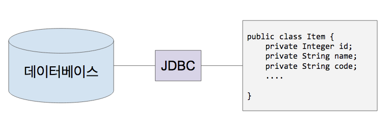
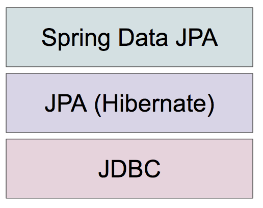

# 스프링 데이터 JPA

JPA(Java Persistence API)를 보다 쉽게 사용할 수 있도록 여러
기능을 제공하는 스프링 데이터 JPA에 대해 학습합니다.

왜 JPA를 학습해야 하는가?

- 도메인 주도 개발이 가능합니다.
  - 애플리케이션의 코드가 SQL 데이터베이스 관련 코드에 잠식 당하는 것을 방지하고
    도메인 기반의 프로그래밍으로 비즈니스 로직을 구현하는데 집중할 수 있습니다.
- 그리고 개발 생산성에 좋으며, 데이터베이스에 독립적인 프로그래밍이 가능하고,
  타입 세이프한 쿼리 작성 그리고 Persistent Context가 제공하는 캐시 기능으로 성능
  최적화까지 가능합니다.

이러한 여러 장점을 지닌 JPA의 한가지 단점. 높은 학습 비용. 이번 강좌가 그 학습 비용을 조금이라도 낮추는데 도움이 되길 바랍니다.

학습 목표

- ORM(Object-Relation Mapping)에 대해 이해합니다.
- JPA를 사용할 때 반드시 알아야 하는 특징을 이해합니다.
- 스프링 데이터 JPA의 구동 원리를 이해합니다.
- 스프링 데이터 JPA를 사용하여 다양한 방법으로 Repository를 구현할 수 있습니다.
- 스프링 데이터 JPA를 사용하여 다양한 방법으로 쿼리를 만들고 실행할 수 있습니다.

Contents

- [스프링 데이터 JPA](#%ec%8a%a4%ed%94%84%eb%a7%81-%eb%8d%b0%ec%9d%b4%ed%84%b0-jpa)
  - [Core Concept](#core-concept)
    - [RDB and Java](#rdb-and-java)
    - [ORM](#orm)
    - [ORM - Paradigm 불일치](#orm---paradigm-%eb%b6%88%ec%9d%bc%ec%b9%98)
    - [JPA Programming](#jpa-programming)
      - [Project Setup](#project-setup)
      - [Entity Mapping](#entity-mapping)
    - [Value Type Mapping](#value-type-mapping)
    - [1:n Mapping](#1n-mapping)
    - [Cascade](#cascade)
    - [Fetch](#fetch)
    - [Query](#query)
    - [Spring Data JPA Principle](#spring-data-jpa-principle)
    - [JPA Summary](#jpa-summary)
  - [Spring Data JPA](#spring-data-jpa)
  - [15. 스프링 데이터 JPA 활용 파트 소개](#15-%ec%8a%a4%ed%94%84%eb%a7%81-%eb%8d%b0%ec%9d%b4%ed%84%b0-jpa-%ed%99%9c%ec%9a%a9-%ed%8c%8c%ed%8a%b8-%ec%86%8c%ea%b0%9c)
        - [스프링 데이터 REST 저장소의 데이터를 하이퍼미디어 기반 HTTP 리소스로(REST](#%ec%8a%a4%ed%94%84%eb%a7%81-%eb%8d%b0%ec%9d%b4%ed%84%b0-rest-%ec%a0%80%ec%9e%a5%ec%86%8c%ec%9d%98-%eb%8d%b0%ec%9d%b4%ed%84%b0%eb%a5%bc-%ed%95%98%ec%9d%b4%ed%8d%bc%eb%af%b8%eb%94%94%ec%96%b4-%ea%b8%b0%eb%b0%98-http-%eb%a6%ac%ec%86%8c%ec%8a%a4%eb%a1%9crest)
        - [API로) 제공하는 프로젝트.](#api%eb%a1%9c-%ec%a0%9c%ea%b3%b5%ed%95%98%eb%8a%94-%ed%94%84%eb%a1%9c%ec%a0%9d%ed%8a%b8)
  - [16. 스프링 데이터 Common: Repository](#16-%ec%8a%a4%ed%94%84%eb%a7%81-%eb%8d%b0%ec%9d%b4%ed%84%b0-common-repository)
  - [17. 스프링 데이터 Common: Repository](#17-%ec%8a%a4%ed%94%84%eb%a7%81-%eb%8d%b0%ec%9d%b4%ed%84%b0-common-repository)
  - [인터페이스 정의하기](#%ec%9d%b8%ed%84%b0%ed%8e%98%ec%9d%b4%ec%8a%a4-%ec%a0%95%ec%9d%98%ed%95%98%ea%b8%b0)
        - [특정 리포지토리 당](#%ed%8a%b9%ec%a0%95-%eb%a6%ac%ed%8f%ac%ec%a7%80%ed%86%a0%eb%a6%ac-%eb%8b%b9)
        - [공통 인터페이스 정의](#%ea%b3%b5%ed%86%b5-%ec%9d%b8%ed%84%b0%ed%8e%98%ec%9d%b4%ec%8a%a4-%ec%a0%95%ec%9d%98)
  - [18. 스프링 데이터 Common: Null 처리하기](#18-%ec%8a%a4%ed%94%84%eb%a7%81-%eb%8d%b0%ec%9d%b4%ed%84%b0-common-null-%ec%b2%98%eb%a6%ac%ed%95%98%ea%b8%b0)
        - [인텔리J 설정](#%ec%9d%b8%ed%85%94%eb%a6%acj-%ec%84%a4%ec%a0%95)
  - [19. 스프링 데이터 Common: 쿼리 만들기 개요](#19-%ec%8a%a4%ed%94%84%eb%a7%81-%eb%8d%b0%ec%9d%b4%ed%84%b0-common-%ec%bf%bc%eb%a6%ac-%eb%a7%8c%eb%93%a4%ea%b8%b0-%ea%b0%9c%ec%9a%94)
        - [스프링 데이터 저장소의 메소드 이름으로 쿼리 만드는 방법](#%ec%8a%a4%ed%94%84%eb%a7%81-%eb%8d%b0%ec%9d%b4%ed%84%b0-%ec%a0%80%ec%9e%a5%ec%86%8c%ec%9d%98-%eb%a9%94%ec%86%8c%eb%93%9c-%ec%9d%b4%eb%a6%84%ec%9c%bc%eb%a1%9c-%ec%bf%bc%eb%a6%ac-%eb%a7%8c%eb%93%9c%eb%8a%94-%eb%b0%a9%eb%b2%95)
        - [- 메소드 이름을 분석해서 쿼리 만들기 (CREATE)](#ul-li%eb%a9%94%ec%86%8c%eb%93%9c-%ec%9d%b4%eb%a6%84%ec%9d%84-%eb%b6%84%ec%84%9d%ed%95%b4%ec%84%9c-%ec%bf%bc%eb%a6%ac-%eb%a7%8c%eb%93%a4%ea%b8%b0-createli-ul)
        - [- 미리 정의해 둔 쿼리 찾아 사용하기 (USE_DECLARED_QUERY)](#ul-li%eb%af%b8%eb%a6%ac-%ec%a0%95%ec%9d%98%ed%95%b4-%eb%91%94-%ec%bf%bc%eb%a6%ac-%ec%b0%be%ec%95%84-%ec%82%ac%ec%9a%a9%ed%95%98%ea%b8%b0-usedeclaredqueryli-ul)
        - [- 미리 정의한 쿼리 찾아보고 없으면 만들기 (CREATE_IF_NOT_FOUND)](#ul-li%eb%af%b8%eb%a6%ac-%ec%a0%95%ec%9d%98%ed%95%9c-%ec%bf%bc%eb%a6%ac-%ec%b0%be%ec%95%84%eb%b3%b4%ea%b3%a0-%ec%97%86%ec%9c%bc%eb%a9%b4-%eb%a7%8c%eb%93%a4%ea%b8%b0-createifnotfoundli-ul)
        - [쿼리 만드는 방법](#%ec%bf%bc%eb%a6%ac-%eb%a7%8c%eb%93%9c%eb%8a%94-%eb%b0%a9%eb%b2%95)
        - [쿼리 찾는 방법](#%ec%bf%bc%eb%a6%ac-%ec%b0%be%eb%8a%94-%eb%b0%a9%eb%b2%95)
        - [- 메소드 이름으로 쿼리를 표현하기 힘든 경우에 사용.](#ul-li%eb%a9%94%ec%86%8c%eb%93%9c-%ec%9d%b4%eb%a6%84%ec%9c%bc%eb%a1%9c-%ec%bf%bc%eb%a6%ac%eb%a5%bc-%ed%91%9c%ed%98%84%ed%95%98%ea%b8%b0-%ed%9e%98%eb%93%a0-%ea%b2%bd%ec%9a%b0%ec%97%90-%ec%82%ac%ec%9a%a9li-ul)
        - [- 저장소 기술에 따라 다름.](#ul-li%ec%a0%80%ec%9e%a5%ec%86%8c-%ea%b8%b0%ec%88%a0%ec%97%90-%eb%94%b0%eb%9d%bc-%eb%8b%a4%eb%a6%84li-ul)
  - [20. 스프링 데이터 Common: 쿼리 만들기 실습](#20-%ec%8a%a4%ed%94%84%eb%a7%81-%eb%8d%b0%ec%9d%b4%ed%84%b0-common-%ec%bf%bc%eb%a6%ac-%eb%a7%8c%eb%93%a4%ea%b8%b0-%ec%8b%a4%ec%8a%b5)
        - [기본 예제](#%ea%b8%b0%eb%b3%b8-%ec%98%88%ec%a0%9c)
        - [스트리밍](#%ec%8a%a4%ed%8a%b8%eb%a6%ac%eb%b0%8d)
  - [21. 스프링 데이터 Common: 비동기 쿼리](#21-%ec%8a%a4%ed%94%84%eb%a7%81-%eb%8d%b0%ec%9d%b4%ed%84%b0-common-%eb%b9%84%eb%8f%99%ea%b8%b0-%ec%bf%bc%eb%a6%ac)
        - [비동기 쿼리](#%eb%b9%84%eb%8f%99%ea%b8%b0-%ec%bf%bc%eb%a6%ac)
        - [권장하지 않는 이유](#%ea%b6%8c%ec%9e%a5%ed%95%98%ec%a7%80-%ec%95%8a%eb%8a%94-%ec%9d%b4%ec%9c%a0)
        - [- 테스트 코드 작성이 어려움.](#ul-li%ed%85%8c%ec%8a%a4%ed%8a%b8-%ec%bd%94%eb%93%9c-%ec%9e%91%ec%84%b1%ec%9d%b4-%ec%96%b4%eb%a0%a4%ec%9b%80li-ul)
        - [- 코드 복잡도 증가.](#ul-li%ec%bd%94%eb%93%9c-%eb%b3%b5%ec%9e%a1%eb%8f%84-%ec%a6%9d%ea%b0%80li-ul)
        - [- 성능상 이득이 없음.](#ul-li%ec%84%b1%eb%8a%a5%ec%83%81-%ec%9d%b4%eb%93%9d%ec%9d%b4-%ec%97%86%ec%9d%8cli-ul)
        - [- DB 부하는 결국 같고.](#ul-lidb-%eb%b6%80%ed%95%98%eb%8a%94-%ea%b2%b0%ea%b5%ad-%ea%b0%99%ea%b3%a0li-ul)
        - [- 메인 쓰레드 대신 백드라운드 쓰레드가 일하는 정도의 차이.](#ul-li%eb%a9%94%ec%9d%b8-%ec%93%b0%eb%a0%88%eb%93%9c-%eb%8c%80%ec%8b%a0-%eb%b0%b1%eb%93%9c%eb%9d%bc%ec%9a%b4%eb%93%9c-%ec%93%b0%eb%a0%88%eb%93%9c%ea%b0%80-%ec%9d%bc%ed%95%98%eb%8a%94-%ec%a0%95%eb%8f%84%ec%9d%98-%ec%b0%a8%ec%9d%b4li-ul)
  - [22. 스프링 데이터 Common: 커스텀](#22-%ec%8a%a4%ed%94%84%eb%a7%81-%eb%8d%b0%ec%9d%b4%ed%84%b0-common-%ec%bb%a4%ec%8a%a4%ed%85%80)
  - [리포지토리](#%eb%a6%ac%ed%8f%ac%ec%a7%80%ed%86%a0%eb%a6%ac)
        - [쿼리 메소드(쿼리 생성과 쿼리 찾아쓰기)로 해결이 되지 않는 경우 직접 코딩으로 구현 가능.](#%ec%bf%bc%eb%a6%ac-%eb%a9%94%ec%86%8c%eb%93%9c%ec%bf%bc%eb%a6%ac-%ec%83%9d%ec%84%b1%ea%b3%bc-%ec%bf%bc%eb%a6%ac-%ec%b0%be%ec%95%84%ec%93%b0%ea%b8%b0%eb%a1%9c-%ed%95%b4%ea%b2%b0%ec%9d%b4-%eb%90%98%ec%a7%80-%ec%95%8a%eb%8a%94-%ea%b2%bd%ec%9a%b0-%ec%a7%81%ec%a0%91-%ec%bd%94%eb%94%a9%ec%9c%bc%eb%a1%9c-%ea%b5%ac%ed%98%84-%ea%b0%80%eb%8a%a5)
        - [- 스프링 데이터 리포지토리 인터페이스에 기능 추가.](#ul-li%ec%8a%a4%ed%94%84%eb%a7%81-%eb%8d%b0%ec%9d%b4%ed%84%b0-%eb%a6%ac%ed%8f%ac%ec%a7%80%ed%86%a0%eb%a6%ac-%ec%9d%b8%ed%84%b0%ed%8e%98%ec%9d%b4%ec%8a%a4%ec%97%90-%ea%b8%b0%eb%8a%a5-%ec%b6%94%ea%b0%80li-ul)
        - [- 스프링 데이터 리포지토리 기본 기능 덮어쓰기 가능.](#ul-li%ec%8a%a4%ed%94%84%eb%a7%81-%eb%8d%b0%ec%9d%b4%ed%84%b0-%eb%a6%ac%ed%8f%ac%ec%a7%80%ed%86%a0%eb%a6%ac-%ea%b8%b0%eb%b3%b8-%ea%b8%b0%eb%8a%a5-%eb%8d%ae%ec%96%b4%ec%93%b0%ea%b8%b0-%ea%b0%80%eb%8a%a5li-ul)
        - [- 구현 방법](#ul-li%ea%b5%ac%ed%98%84-%eb%b0%a9%eb%b2%95li-ul)
        - [기능 추가하기](#%ea%b8%b0%eb%8a%a5-%ec%b6%94%ea%b0%80%ed%95%98%ea%b8%b0)
        - [기본 기능 덮어쓰기](#%ea%b8%b0%eb%b3%b8-%ea%b8%b0%eb%8a%a5-%eb%8d%ae%ec%96%b4%ec%93%b0%ea%b8%b0)
        - [접미어 설정하기](#%ec%a0%91%eb%af%b8%ec%96%b4-%ec%84%a4%ec%a0%95%ed%95%98%ea%b8%b0)
  - [23. 스프링 데이터 Common: 기본 리포지토리](#23-%ec%8a%a4%ed%94%84%eb%a7%81-%eb%8d%b0%ec%9d%b4%ed%84%b0-common-%ea%b8%b0%eb%b3%b8-%eb%a6%ac%ed%8f%ac%ec%a7%80%ed%86%a0%eb%a6%ac)
  - [커스터마이징](#%ec%bb%a4%ec%8a%a4%ed%84%b0%eb%a7%88%ec%9d%b4%ec%a7%95)
        - [모든 리포지토리에 공통적으로 추가하고 싶은 기능이 있거나 덮어쓰고 싶은 기본 기능이](#%eb%aa%a8%eb%93%a0-%eb%a6%ac%ed%8f%ac%ec%a7%80%ed%86%a0%eb%a6%ac%ec%97%90-%ea%b3%b5%ed%86%b5%ec%a0%81%ec%9c%bc%eb%a1%9c-%ec%b6%94%ea%b0%80%ed%95%98%ea%b3%a0-%ec%8b%b6%ec%9d%80-%ea%b8%b0%eb%8a%a5%ec%9d%b4-%ec%9e%88%ea%b1%b0%eb%82%98-%eb%8d%ae%ec%96%b4%ec%93%b0%ea%b3%a0-%ec%8b%b6%ec%9d%80-%ea%b8%b0%eb%b3%b8-%ea%b8%b0%eb%8a%a5%ec%9d%b4)
        - [있다면](#%ec%9e%88%eb%8b%a4%eb%a9%b4)
        - [2. 기본 구현체를 상속 받는 커스텀 구현체 만들기](#2-%ea%b8%b0%eb%b3%b8-%ea%b5%ac%ed%98%84%ec%b2%b4%eb%a5%bc-%ec%83%81%ec%86%8d-%eb%b0%9b%eb%8a%94-%ec%bb%a4%ec%8a%a4%ed%85%80-%ea%b5%ac%ed%98%84%ec%b2%b4-%eb%a7%8c%eb%93%a4%ea%b8%b0)
  - [24. 스프링 데이터 Common: 도메인 이벤트](#24-%ec%8a%a4%ed%94%84%eb%a7%81-%eb%8d%b0%ec%9d%b4%ed%84%b0-common-%eb%8f%84%eb%a9%94%ec%9d%b8-%ec%9d%b4%eb%b2%a4%ed%8a%b8)
        - [도메인 관련 이벤트를 발생시키기](#%eb%8f%84%eb%a9%94%ec%9d%b8-%ea%b4%80%eb%a0%a8-%ec%9d%b4%eb%b2%a4%ed%8a%b8%eb%a5%bc-%eb%b0%9c%ec%83%9d%ec%8b%9c%ed%82%a4%ea%b8%b0)
        - [스프링 프레임워크의 이벤트 관련 기능](#%ec%8a%a4%ed%94%84%eb%a7%81-%ed%94%84%eb%a0%88%ec%9e%84%ec%9b%8c%ed%81%ac%ec%9d%98-%ec%9d%b4%eb%b2%a4%ed%8a%b8-%ea%b4%80%eb%a0%a8-%ea%b8%b0%eb%8a%a5)
        - [흐흐흐 이거 뭐 노트만 봐서는 전혀 감이 안잡히시죠? 강좌를 보시길 추천 드립니다. 특히나](#%ed%9d%90%ed%9d%90%ed%9d%90-%ec%9d%b4%ea%b1%b0-%eb%ad%90-%eb%85%b8%ed%8a%b8%eb%a7%8c-%eb%b4%90%ec%84%9c%eb%8a%94-%ec%a0%84%ed%98%80-%ea%b0%90%ec%9d%b4-%ec%95%88%ec%9e%a1%ed%9e%88%ec%8b%9c%ec%a3%a0-%ea%b0%95%ec%a2%8c%eb%a5%bc-%eb%b3%b4%ec%8b%9c%ea%b8%b8-%ec%b6%94%ec%b2%9c-%eb%93%9c%eb%a6%bd%eb%8b%88%eb%8b%a4-%ed%8a%b9%ed%9e%88%eb%82%98)
        - [이 부분은 레퍼런스에서도 대충 언급하고 있어서 예제 찾거나 만달어 보시기 쉽진 않으실](#%ec%9d%b4-%eb%b6%80%eb%b6%84%ec%9d%80-%eb%a0%88%ed%8d%bc%eb%9f%b0%ec%8a%a4%ec%97%90%ec%84%9c%eb%8f%84-%eb%8c%80%ec%b6%a9-%ec%96%b8%ea%b8%89%ed%95%98%ea%b3%a0-%ec%9e%88%ec%96%b4%ec%84%9c-%ec%98%88%ec%a0%9c-%ec%b0%be%ea%b1%b0%eb%82%98-%eb%a7%8c%eb%8b%ac%ec%96%b4-%eb%b3%b4%ec%8b%9c%ea%b8%b0-%ec%89%bd%ec%a7%84-%ec%95%8a%ec%9c%bc%ec%8b%a4)
        - [겁니다.](#%ea%b2%81%eb%8b%88%eb%8b%a4)
  - [25. 스프링 데이터 Common: QueryDSL](#25-%ec%8a%a4%ed%94%84%eb%a7%81-%eb%8d%b0%ec%9d%b4%ed%84%b0-common-querydsl)
        - [여러 쿼리 메소드는 대부분 두 가지 중 하나.](#%ec%97%ac%eb%9f%ac-%ec%bf%bc%eb%a6%ac-%eb%a9%94%ec%86%8c%eb%93%9c%eb%8a%94-%eb%8c%80%eb%b6%80%eb%b6%84-%eb%91%90-%ea%b0%80%ec%a7%80-%ec%a4%91-%ed%95%98%eb%82%98)
        - [연동 방법](#%ec%97%b0%eb%8f%99-%eb%b0%a9%eb%b2%95)
        - [- 기본 리포지토리 커스터마이징 안 했을 때. (쉬움)](#ul-li%ea%b8%b0%eb%b3%b8-%eb%a6%ac%ed%8f%ac%ec%a7%80%ed%86%a0%eb%a6%ac-%ec%bb%a4%ec%8a%a4%ed%84%b0%eb%a7%88%ec%9d%b4%ec%a7%95-%ec%95%88-%ed%96%88%ec%9d%84-%eb%95%8c-%ec%89%ac%ec%9b%80li-ul)
        - [- 기본 리포지토리 커스타마이징 했을 때. (해맬 수 있으나... 제가 있잖습니까)](#ul-li%ea%b8%b0%eb%b3%b8-%eb%a6%ac%ed%8f%ac%ec%a7%80%ed%86%a0%eb%a6%ac-%ec%bb%a4%ec%8a%a4%ed%83%80%eb%a7%88%ec%9d%b4%ec%a7%95-%ed%96%88%ec%9d%84-%eb%95%8c-%ed%95%b4%eb%a7%ac-%ec%88%98-%ec%9e%88%ec%9c%bc%eb%82%98-%ec%a0%9c%ea%b0%80-%ec%9e%88%ec%9e%96%ec%8a%b5%eb%8b%88%ea%b9%8cli-ul)
        - [의존성 추가](#%ec%9d%98%ec%a1%b4%ec%84%b1-%ec%b6%94%ea%b0%80)
  - [26. 스프링 데이터 Common: Web 1부: 웹 지원](#26-%ec%8a%a4%ed%94%84%eb%a7%81-%eb%8d%b0%ec%9d%b4%ed%84%b0-common-web-1%eb%b6%80-%ec%9b%b9-%ec%a7%80%ec%9b%90)
  - [기능 소개](#%ea%b8%b0%eb%8a%a5-%ec%86%8c%ea%b0%9c)
        - [스프링 데이터 웹 지원 기능 설정](#%ec%8a%a4%ed%94%84%eb%a7%81-%eb%8d%b0%ec%9d%b4%ed%84%b0-%ec%9b%b9-%ec%a7%80%ec%9b%90-%ea%b8%b0%eb%8a%a5-%ec%84%a4%ec%a0%95)
        - [- 스프링 부트를 사용하는 경우에.. 설정할 것이 없음. (자동 설정)](#ul-li%ec%8a%a4%ed%94%84%eb%a7%81-%eb%b6%80%ed%8a%b8%eb%a5%bc-%ec%82%ac%ec%9a%a9%ed%95%98%eb%8a%94-%ea%b2%bd%ec%9a%b0%ec%97%90-%ec%84%a4%ec%a0%95%ed%95%a0-%ea%b2%83%ec%9d%b4-%ec%97%86%ec%9d%8c-%ec%9e%90%eb%8f%99-%ec%84%a4%ec%a0%95li-ul)
        - [- 스프링 부트 사용하지 않는 경우?](#ul-li%ec%8a%a4%ed%94%84%eb%a7%81-%eb%b6%80%ed%8a%b8-%ec%82%ac%ec%9a%a9%ed%95%98%ec%a7%80-%ec%95%8a%eb%8a%94-%ea%b2%bd%ec%9a%b0li-ul)
        - [제공하는 기능](#%ec%a0%9c%ea%b3%b5%ed%95%98%eb%8a%94-%ea%b8%b0%eb%8a%a5)
        - [- 도메인 클래스 컨버터](#ul-li%eb%8f%84%eb%a9%94%ec%9d%b8-%ed%81%b4%eb%9e%98%ec%8a%a4-%ec%bb%a8%eb%b2%84%ed%84%b0li-ul)
  - [27. 스프링 데이터 Common: Web 2 부:](#27-%ec%8a%a4%ed%94%84%eb%a7%81-%eb%8d%b0%ec%9d%b4%ed%84%b0-common-web-2-%eb%b6%80)
  - [DomainClassConverter](#domainclassconverter)
  - [28. 스프링 데이터 Common: Web 3 부:](#28-%ec%8a%a4%ed%94%84%eb%a7%81-%eb%8d%b0%ec%9d%b4%ed%84%b0-common-web-3-%eb%b6%80)
  - [Pageable과 Sort 매개변수](#pageable%ea%b3%bc-sort-%eb%a7%a4%ea%b0%9c%eb%b3%80%ec%88%98)
        - [페이징과 정렬 관련 매개변수](#%ed%8e%98%ec%9d%b4%ec%a7%95%ea%b3%bc-%ec%a0%95%eb%a0%ac-%ea%b4%80%eb%a0%a8-%eb%a7%a4%ea%b0%9c%eb%b3%80%ec%88%98)
  - [29. 스프링 데이터 Common: Web 4 부:](#29-%ec%8a%a4%ed%94%84%eb%a7%81-%eb%8d%b0%ec%9d%b4%ed%84%b0-common-web-4-%eb%b6%80)
  - [HATEOAS](#hateoas)
        - [리소스로 변환하기 전](#%eb%a6%ac%ec%86%8c%ec%8a%a4%eb%a1%9c-%eb%b3%80%ed%99%98%ed%95%98%ea%b8%b0-%ec%a0%84)
        - [리소스로 변환한 뒤](#%eb%a6%ac%ec%86%8c%ec%8a%a4%eb%a1%9c-%eb%b3%80%ed%99%98%ed%95%9c-%eb%92%a4)
  - [30. 스프링 데이터 Common: 마무리](#30-%ec%8a%a4%ed%94%84%eb%a7%81-%eb%8d%b0%ec%9d%b4%ed%84%b0-common-%eb%a7%88%eb%ac%b4%eb%a6%ac)
        - [지금까지 살펴본 내용](#%ec%a7%80%ea%b8%88%ea%b9%8c%ec%a7%80-%ec%82%b4%ed%8e%b4%eb%b3%b8-%eb%82%b4%ec%9a%a9)
  - [31. 스프링 데이터 JPA: JPA Repository](#31-%ec%8a%a4%ed%94%84%eb%a7%81-%eb%8d%b0%ec%9d%b4%ed%84%b0-jpa-jpa-repository)
        - [- 스프링 부트 사용할 때는 사용하지 않아도 자동 설정 됨.](#ul-li%ec%8a%a4%ed%94%84%eb%a7%81-%eb%b6%80%ed%8a%b8-%ec%82%ac%ec%9a%a9%ed%95%a0-%eb%95%8c%eb%8a%94-%ec%82%ac%ec%9a%a9%ed%95%98%ec%a7%80-%ec%95%8a%ec%95%84%eb%8f%84-%ec%9e%90%eb%8f%99-%ec%84%a4%ec%a0%95-%eb%90%a8li-ul)
  - [32. 스프링 데이터 JPA: 엔티티 저장하기](#32-%ec%8a%a4%ed%94%84%eb%a7%81-%eb%8d%b0%ec%9d%b4%ed%84%b0-jpa-%ec%97%94%ed%8b%b0%ed%8b%b0-%ec%a0%80%ec%9e%a5%ed%95%98%ea%b8%b0)
  - [33. 스프링 데이터 JPA: 쿼리 메소드](#33-%ec%8a%a4%ed%94%84%eb%a7%81-%eb%8d%b0%ec%9d%b4%ed%84%b0-jpa-%ec%bf%bc%eb%a6%ac-%eb%a9%94%ec%86%8c%eb%93%9c)
        - [쿼리 생성하기](#%ec%bf%bc%eb%a6%ac-%ec%83%9d%ec%84%b1%ed%95%98%ea%b8%b0)
        - [쿼리 찾아쓰기](#%ec%bf%bc%eb%a6%ac-%ec%b0%be%ec%95%84%ec%93%b0%ea%b8%b0)
  - [34. 스프링 데이터 JPA: 쿼리 메소드 Sort](#34-%ec%8a%a4%ed%94%84%eb%a7%81-%eb%8d%b0%ec%9d%b4%ed%84%b0-jpa-%ec%bf%bc%eb%a6%ac-%eb%a9%94%ec%86%8c%eb%93%9c-sort)
  - [35. 스프링 데이터 JPA: Named Parameter과](#35-%ec%8a%a4%ed%94%84%eb%a7%81-%eb%8d%b0%ec%9d%b4%ed%84%b0-jpa-named-parameter%ea%b3%bc)
  - [SpEL](#spel)
  - [36. 스프링 데이터 JPA: Update 쿼리 메소드](#36-%ec%8a%a4%ed%94%84%eb%a7%81-%eb%8d%b0%ec%9d%b4%ed%84%b0-jpa-update-%ec%bf%bc%eb%a6%ac-%eb%a9%94%ec%86%8c%eb%93%9c)
        - [쿼리 생성하기](#%ec%bf%bc%eb%a6%ac-%ec%83%9d%ec%84%b1%ed%95%98%ea%b8%b0-1)
  - [37. 스프링 데이터 JPA: EntityGraph](#37-%ec%8a%a4%ed%94%84%eb%a7%81-%eb%8d%b0%ec%9d%b4%ed%84%b0-jpa-entitygraph)
        - [- LOAD: 설정한 엔티티 애트리뷰트는 EAGER 패치 나머지는 기본 패치 전략](#ul-liload-%ec%84%a4%ec%a0%95%ed%95%9c-%ec%97%94%ed%8b%b0%ed%8b%b0-%ec%95%a0%ed%8a%b8%eb%a6%ac%eb%b7%b0%ed%8a%b8%eb%8a%94-eager-%ed%8c%a8%ec%b9%98-%eb%82%98%eb%a8%b8%ec%a7%80%eb%8a%94-%ea%b8%b0%eb%b3%b8-%ed%8c%a8%ec%b9%98-%ec%a0%84%eb%9e%b5li-ul)
        - [따름.](#%eb%94%b0%eb%a6%84)
  - [38. 스프링 데이터 JPA: Projection](#38-%ec%8a%a4%ed%94%84%eb%a7%81-%eb%8d%b0%ec%9d%b4%ed%84%b0-jpa-projection)
        - [엔티티의 일부 데이터만 가져오기.](#%ec%97%94%ed%8b%b0%ed%8b%b0%ec%9d%98-%ec%9d%bc%eb%b6%80-%eb%8d%b0%ec%9d%b4%ed%84%b0%eb%a7%8c-%ea%b0%80%ec%a0%b8%ec%98%a4%ea%b8%b0)
        - [인터페이스 기반 프로젝션](#%ec%9d%b8%ed%84%b0%ed%8e%98%ec%9d%b4%ec%8a%a4-%ea%b8%b0%eb%b0%98-%ed%94%84%eb%a1%9c%ec%a0%9d%ec%85%98)
        - [클래스 기반 프로젝션](#%ed%81%b4%eb%9e%98%ec%8a%a4-%ea%b8%b0%eb%b0%98-%ed%94%84%eb%a1%9c%ec%a0%9d%ec%85%98)
        - [- DTO](#ul-lidtoli-ul)
        - [다이나믹 프로젝션](#%eb%8b%a4%ec%9d%b4%eb%82%98%eb%af%b9-%ed%94%84%eb%a1%9c%ec%a0%9d%ec%85%98)
        - [- 프로젝션 용 메소드 하나만 정의하고 실제 프로젝션 타입은 타입 인자로 전달하기.](#ul-li%ed%94%84%eb%a1%9c%ec%a0%9d%ec%85%98-%ec%9a%a9-%eb%a9%94%ec%86%8c%eb%93%9c-%ed%95%98%eb%82%98%eb%a7%8c-%ec%a0%95%ec%9d%98%ed%95%98%ea%b3%a0-%ec%8b%a4%ec%a0%9c-%ed%94%84%eb%a1%9c%ec%a0%9d%ec%85%98-%ed%83%80%ec%9e%85%ec%9d%80-%ed%83%80%ec%9e%85-%ec%9d%b8%ec%9e%90%eb%a1%9c-%ec%a0%84%eb%8b%ac%ed%95%98%ea%b8%b0li-ul)
  - [39. 스프링 데이터 JPA: Specifications](#39-%ec%8a%a4%ed%94%84%eb%a7%81-%eb%8d%b0%ec%9d%b4%ed%84%b0-jpa-specifications)
        - [설정 하는 방법](#%ec%84%a4%ec%a0%95-%ed%95%98%eb%8a%94-%eb%b0%a9%eb%b2%95)
  - [40. 스프링 데이터 JPA: Query by Example](#40-%ec%8a%a4%ed%94%84%eb%a7%81-%eb%8d%b0%ec%9d%b4%ed%84%b0-jpa-query-by-example)
        - [QBE는 필드 이름을 작성할 필요 없이(뻥) 단순한 인터페이스를 통해 동적으로 쿼리를 만드는](#qbe%eb%8a%94-%ed%95%84%eb%93%9c-%ec%9d%b4%eb%a6%84%ec%9d%84-%ec%9e%91%ec%84%b1%ed%95%a0-%ed%95%84%ec%9a%94-%ec%97%86%ec%9d%b4%eb%bb%a5-%eb%8b%a8%ec%88%9c%ed%95%9c-%ec%9d%b8%ed%84%b0%ed%8e%98%ec%9d%b4%ec%8a%a4%eb%a5%bc-%ed%86%b5%ed%95%b4-%eb%8f%99%ec%a0%81%ec%9c%bc%eb%a1%9c-%ec%bf%bc%eb%a6%ac%eb%a5%bc-%eb%a7%8c%eb%93%9c%eb%8a%94)
        - [기능을 제공하는 사용자 친화적인 쿼리 기술입니다. (감이 1 도 안잡히는거 이해합니다.. 코드를 봐야](#%ea%b8%b0%eb%8a%a5%ec%9d%84-%ec%a0%9c%ea%b3%b5%ed%95%98%eb%8a%94-%ec%82%ac%ec%9a%a9%ec%9e%90-%ec%b9%9c%ed%99%94%ec%a0%81%ec%9d%b8-%ec%bf%bc%eb%a6%ac-%ea%b8%b0%ec%88%a0%ec%9e%85%eb%8b%88%eb%8b%a4-%ea%b0%90%ec%9d%b4-1-%eb%8f%84-%ec%95%88%ec%9e%a1%ed%9e%88%eb%8a%94%ea%b1%b0-%ec%9d%b4%ed%95%b4%ed%95%a9%eb%8b%88%eb%8b%a4-%ec%bd%94%eb%93%9c%eb%a5%bc-%eb%b4%90%ec%95%bc)
        - [장점](#%ec%9e%a5%ec%a0%90)
        - [- 별다른 코드 생성기나 애노테이션 처리기 필요 없음.](#ul-li%eb%b3%84%eb%8b%a4%eb%a5%b8-%ec%bd%94%eb%93%9c-%ec%83%9d%ec%84%b1%ea%b8%b0%eb%82%98-%ec%95%a0%eb%85%b8%ed%85%8c%ec%9d%b4%ec%85%98-%ec%b2%98%eb%a6%ac%ea%b8%b0-%ed%95%84%ec%9a%94-%ec%97%86%ec%9d%8cli-ul)
        - [- 도메인 객체 리팩토링 해도 기존 쿼리가 깨질 걱정하지 않아도 됨.(뻥)](#ul-li%eb%8f%84%eb%a9%94%ec%9d%b8-%ea%b0%9d%ec%b2%b4-%eb%a6%ac%ed%8c%a9%ed%86%a0%eb%a7%81-%ed%95%b4%eb%8f%84-%ea%b8%b0%ec%a1%b4-%ec%bf%bc%eb%a6%ac%ea%b0%80-%ea%b9%a8%ec%a7%88-%ea%b1%b1%ec%a0%95%ed%95%98%ec%a7%80-%ec%95%8a%ec%95%84%eb%8f%84-%eb%90%a8%eb%bb%a5li-ul)
        - [- 데이터 기술에 독립적인 API](#ul-li%eb%8d%b0%ec%9d%b4%ed%84%b0-%ea%b8%b0%ec%88%a0%ec%97%90-%eb%8f%85%eb%a6%bd%ec%a0%81%ec%9d%b8-apili-ul)
        - [단점](#%eb%8b%a8%ec%a0%90)
  - [41. 스프링 데이터 JPA: 트랜잭션](#41-%ec%8a%a4%ed%94%84%eb%a7%81-%eb%8d%b0%ec%9d%b4%ed%84%b0-jpa-%ed%8a%b8%eb%9e%9c%ec%9e%ad%ec%85%98)
  - [42. 스프링 데이터 JPA: Auditing](#42-%ec%8a%a4%ed%94%84%eb%a7%81-%eb%8d%b0%ec%9d%b4%ed%84%b0-jpa-auditing)
    - [스프링 데이터 JPA의 Auditing](#%ec%8a%a4%ed%94%84%eb%a7%81-%eb%8d%b0%ec%9d%b4%ed%84%b0-jpa%ec%9d%98-auditing)
        - [엔티티의 변경 시점에 언제, 누가 변경했는지에 대한 정보를 기록하는 기능.](#%ec%97%94%ed%8b%b0%ed%8b%b0%ec%9d%98-%eb%b3%80%ea%b2%bd-%ec%8b%9c%ec%a0%90%ec%97%90-%ec%96%b8%ec%a0%9c-%eb%88%84%ea%b0%80-%eb%b3%80%ea%b2%bd%ed%96%88%eb%8a%94%ec%a7%80%ec%97%90-%eb%8c%80%ed%95%9c-%ec%a0%95%eb%b3%b4%eb%a5%bc-%ea%b8%b0%eb%a1%9d%ed%95%98%eb%8a%94-%ea%b8%b0%eb%8a%a5)
        - [아쉽지만 이 기능은 스프링 부트가 자동 설정 해주지 않습니다.](#%ec%95%84%ec%89%bd%ec%a7%80%eb%a7%8c-%ec%9d%b4-%ea%b8%b0%eb%8a%a5%ec%9d%80-%ec%8a%a4%ed%94%84%eb%a7%81-%eb%b6%80%ed%8a%b8%ea%b0%80-%ec%9e%90%eb%8f%99-%ec%84%a4%ec%a0%95-%ed%95%b4%ec%a3%bc%ec%a7%80-%ec%95%8a%ec%8a%b5%eb%8b%88%eb%8b%a4)
    - [JPA의 라이프 사이클 이벤트](#jpa%ec%9d%98-%eb%9d%bc%ec%9d%b4%ed%94%84-%ec%82%ac%ec%9d%b4%ed%81%b4-%ec%9d%b4%eb%b2%a4%ed%8a%b8)
  - [43. 스프링 데이터 JPA: 마무리](#43-%ec%8a%a4%ed%94%84%eb%a7%81-%eb%8d%b0%ec%9d%b4%ed%84%b0-jpa-%eb%a7%88%eb%ac%b4%eb%a6%ac)

## Core Concept

본격적인 스프링 데이터 JPA 활용법을 학습하기에 앞서, ORM과 JPA에 대한 이론적인 배경을 학습합니다.

### RDB and Java

JDBC



- (관계형) 데이터베이스와 자바의 연결 고리

JDBC

- DataSource / DriverManager
- Connection
- PreparedStatement

SQL

- DDL (Data Definition Language)
- DML (Data Manapulation Language)

무엇이 문제인가?

- SQL을 실행하는 비용이 비싸다.
- SQL이 데이터베이스 마다 다르다.
- 스키마를 바꿨더니 코드가 너무 많이 바뀌네...
- 반복적인 코드가 너무 많아.
- 당장은 필요가 없는데 언제 쓸 줄 모르니까 미리 다 읽어와야 하나...

의존성 추가

```xml
<dependency>
  <groupId>org.postgresql</groupId>
  <artifactId>postgresql</artifactId>
</dependency>
```

PostgreSQL 설치 및 서버 실행 (docker)

```sh
docker run -p 5432:5432 -e POSTGRES_PASSWORD=pass -e
POSTGRES_USER=keesun -e POSTGRES_DB=springdata --name postgres_boot -
d postgres

docker exec -i -t postgres_boot bash

su - postgres

psql springdata
```

데이터베이스 조회

```sh
> \list
```

테이블 조회

```sh
> \dt
```

쿼리

```sql
> SELECT * FROM account;
```

### ORM

ORM (Object-Relation Mapping)

JDBC 사용

```java
try (Connection connection = DriverManager.getConnection(url, username, password)) {
  System.out.println("Connection created: " + connection);
  String sql = "INSERT INTO ACCOUNT VALUES(1, 'keesun', 'pass');";
  try (PreparedStatement statement = connection.prepareStatement(sql)) {
    statement.execute();
  }
}
```

도메인 모델 사용

```java
Account account = new Account(“keesun”, “pass”);
accountRepository.save(account);
```

JDBC 대신 도메인 모델 사용하려는 이유?

- 객체 지향 프로그래밍의 장점을 활용하기 좋으니까.
- 각종 디자인 패턴
- 코드 재사용
- 비즈니스 로직 구현 및 테스트 편함.

ORM은 애플리케이션의 클래스와 SQL 데이터베이스의 테이블 사이의 맵핑 정보를 기술한 메타데이터를 사용하여, 자바 애플리케이션의 객체를 SQL 데이터베이스의 테이블에 자동으로 (또 깨끗하게) 영속화 해주는 기술입니다.

```text
In a nutshell, object/relational mapping is the automated (and transparent) persistence of objects in a
Java application to the tables in an SQL database, using metadata that describes the mapping between
the classes of the application and the schema of the SQL database.

- Java Persistence with Hibernate, Second Edition
```

장점

- 생산성
- 유지보수성
- 성능
- 밴더 독립성

단점

- 학습비용

### ORM - Paradigm 불일치

객체를 릴레이션에 맵핑하려니 발생하는 문제들과 해결책

밀도(Granularity) 문제

객체

- 다양한 크기의 객체를 만들 수 있음.
- 커스텀한 타입 만들기 쉬움.

릴레이션

- 테이블
- 기본 데이터 타입 (UDT는 비추)

서브타입(Subtype) 문제

객체

- 상속 구조 만들기 쉬움.
- 다형성.

릴레이션

- 테이블 상속이라는게 없음.
- 상속 기능을 구현했다 하더라도 표준 기술이 아님.
- 다형적인 관계를 표현할 방법이 없음.

식별성(Identity) 문제

객체

- 레퍼런스 동일성 (==)
- 인스턴스 동일성 (equals() 메소드)

릴레이션

- 주키 (primary key)

관계(Association) 문제

객체

- 객체 레퍼런스로 관계 표현.
- 근본적으로 ‘방향'이 존재 한다.
- 다대다 관계를 가질 수 있음

릴레이션

- 외래키(foreign key)로 관계 표현.
- ‘방향'이라는 의미가 없음. 그냥 Join으로 아무거나 묶을 수 있음.
- 태생적으로 다대다 관계를 못만들고, 조인 테이블 또는 링크 테이블을 사용해서 두개의 1 대다 관계로 풀어야 함.

데이터 네비게이션(Navigation)의 문제

객체

- 레퍼런스를 이용해서 다른 객체로 이동 가능.
- 콜렉션을 순회할 수도 있음.

릴레이션

- 하지만 그런 방식은 릴레이션에서 데이터를 조회하는데 있어서 매우 비효율적이다.
- 데이터베이스에 요청을 적게 할 수록 성능이 좋다. 따라서 Join을 쓴다.
- 하지만, 너무 많이 한번에 가져오려고 해도 문제다. 그렇다고 lazy loading을 하자니 그것도 문제다. (n+1 select)

### JPA Programming

#### Project Setup

데이터베이스 실행

- PostgreSQL 도커 컨테이너 재사용
- docker start postgres_boot

스프링 부트

- 스프링 부트 v 2 .*
- 스프링 프레임워크 v 5 .*

스프링 부트 스타터 JPA

- JPA 프로그래밍에 필요한 의존성 추가
  - JPA v2.*
  - Hibernate v5.*
- 자동 설정: HibernateJpaAutoConfiguration
  - 컨테이너가 관리하는 EntityManager (프록시) 빈 설정
  - PlatformTransactionManager 빈 설정

JDBC 설정

- jdbc:postgresql://localhost:5432/springdata
- keesun
- pass

application.properties

- spring.jpa.properties.hibernate.jdbc.lob.non_contextual_creation=true
- spring.jpa.hibernate.ddl-auto=create

#### Entity Mapping

`@Entity`

- “엔티티”는 객체 세상에서 부르는 이름.
- 보통 클래스와 같은 이름을 사용하기 때문에 값을 변경하지 않음.
- 엔티티의 이름은 JQL에서 쓰임.

`@Table`

- “릴레이션" 세상에서 부르는 이름.
- @Entity의 이름이 기본값.
- 테이블의 이름은 SQL에서 쓰임.

`@Id`

- 엔티티의 주키를 맵핑할 때 사용.
- 자바의 모든 primitive 타입과 그 랩퍼 타입을 사용할 수 있음
- Date랑 BigDecimal, BigInteger도 사용 가능.
- 복합키를 만드는 맵핑하는 방법도 있지만 그건 논외로..

`@GeneratedValue`

- 주키의 생성 방법을 맵핑하는 애노테이션
- 생성 전략과 생성기를 설정할 수 있다.
- 기본 전략은 AUTO: 사용하는 DB에 따라 적절한 전략 선택
- TABLE, SEQUENCE, IDENTITY 중 하나.

`@Column`

- unique
- nullable
- length
- columnDefinition
- ...

`@Temporal`

- 현재 JPA 2 .1까지는 Date와 Calendar만 지원.

`@Transient`

- 컬럼으로 맵핑하고 싶지 않은 멤버 변수에 사용.

application.properties

- spring.jpa.show-sql=true
- spring.jpa.properties.hibernate.format_sql=true

### Value Type Mapping

엔티티 타입과 Value 타입 구분

- 식별자가 있어야 하는가.
- 독립적으로 존재해야 하는가.

Value 타입 종류

- 기본 타입 (String, Date, Boolean, ...)
- Composite Value 타입
- Collection Value 타입
- 기본 타입의 콜렉션
- 컴포짓 타입의 콜렉션

Composite Value 타입 맵핑

- @Embeddable
- @Embedded
- @AttributeOverrides
- @AttributeOverride

```java
@Embeddable
public class Address {
  private String street;
  private String city;
  private String state;
  private String zipCode;
}

// Account
@Embedded
@AttributeOverrides({
  @AttributeOverride(name = "street", column =
  @Column(name = "home_street"))
})
private Address address;
```

### 1:n Mapping

관계에는 항상 두 엔티티가 존재 합니다.

- 둘 중 하나는 그 관계의 주인(owning)이고
- 다른 쪽은 종속된(non-owning) 쪽입니다.
- 해당 관계의 반대쪽 레퍼런스를 가지고 있는 쪽이 주인.

단방향에서의 관계의 주인은 명확합니다.

- 관계를 정의한 쪽이 그 관계의 주인입니다.

단방향 `@ManyToOne`

- 기본값은 FK 생성

단방향 `@OneToMany`

- 기본값은 조인 테이블 생성

양방향

- FK 가지고 있는 쪽이 오너 따라서 기본값은 `@ManyToOne` 가지고 있는 쪽이 주인.
- 주인이 아닌쪽(@OneToMany쪽)에서 mappedBy 사용해서 관계를 맺고 있는 필드를 설정해야 합니다.

양방향

- @ManyToOne (이쪽이 주인)
- @OneToMany (mappedBy)
- 주인한테 관계를 설정해야 DB에 반영이 됩니다.

### Cascade

엔티티의 상태 변화를 전파 시키는 옵션.

잠깐? 엔티티의 상태가 뭐지?

- Transient: JPA가 모르는 상태
- Persistent: JPA가 관리중인 상태 (1차 캐시, Dirty Checking, Write Behind, ...)
- Detached: JPA가 더이상 관리하지 않는 상태.
- Removed: JPA가 관리하긴 하지만 삭제하기로 한 상태.


### Fetch

연관 관계의 엔티티를 어떻게 가져올 것이냐... 지금 (Eager)? 나중에(Lazy)?

- @OneToMany의 기본값은 Lazy
- @ManyToOne의 기본값은 Eager

### Query

JPQL (HQL)

- Java Persistence Query Language / Hibernate Query Language
- 데이터베이스 테이블이 아닌, 엔티티 객체 모델 기반으로 쿼리 작성.
- JPA 또는 하이버네이트가 해당 쿼리를 SQL로 변환해서 실행함.
- https://docs.jboss.org/hibernate/orm/5.2/userguide/html_single/Hibernate_User_Guide.html#hql

```java
TypedQuery<Post> query = entityManager.createQuery("SELECT p FROM Post Asp", Post.class);
List<Post> posts = query.getResultList();
```

Criteria

- 타입 세이프 쿼리
- https://docs.jboss.org/hibernate/orm/5.2/userguide/html_single/Hibernate_User_Guide.html#criteria

```java
CriteriaBuilder builder = entityManager.getCriteriaBuilder();
CriteriaQuery<Post> criteria = builder.createQuery(Post.class);
Root<Post> root = criteria.from(Post.class);
criteria.select(root);
List<Post> posts = entityManager.createQuery(criteria).getResultList();
```

Native Query

- SQL 쿼리 실행하기
- https://docs.jboss.org/hibernate/orm/5.2/userguide/html_single/Hibernate_User_Guide.html#sql

```java
List<Post> posts = entityManager
    .createNativeQuery("SELECT * FROM Post", Post.class)
    .getResultList();
```

### Spring Data JPA Principle

Application -> 스프링 데이터 JPA (-> JPA -> JDBC) -> Database



`JpaRepository<Entity, Id>` 인터페이스

- 매직 인터페이스
- @Repository가 없어도 빈으로 등록해 줌.

`@EnableJpaRepositories`

- 매직의 시작은 여기서 부터

매직은 어떻게 이뤄지나?

- 시작은 `@Import(JpaRepositoriesRegistrar.class)`
- 핵심은 `ImportBeanDefinitionRegistrar` 인터페이스

### JPA Summary

데이터베이스와 자바

패러다임 불일치

ORM이란?

JPA 사용법 (엔티티, 벨류 타입, 관계 맵핑)

JPA 특징 (엔티티 상태 변화, Cascade, Fetch, 1차 캐시, ...)

주의할 점

- 반드시 발생하는 SQL을 확인할 것.
- 팁: “?”에 들어있는 값 출력하기
- logging.level.org.hibernate.SQL=debug
- logging.level.org.hibernate.type.descriptor.sql=trace

## Spring Data JPA

## 15. 스프링 데이터 JPA 활용 파트 소개

```
스프링 데이터 SQL & NoSQL 저장소 지원 프로젝트의 묶음.
```

```
스프링 데이터 Common 여러 저장소 지원 프로젝트의 공통 기능 제공.
```
##### 스프링 데이터 REST 저장소의 데이터를 하이퍼미디어 기반 HTTP 리소스로(REST

##### API로) 제공하는 프로젝트.

```
스프링 데이터 JPA 스프링 데이터 Common이 제공하는 기능에 JPA 관련 기능
추가.
```
[http://projects.spring.io/spring-data/](http://projects.spring.io/spring-data/)

## 16. 스프링 데이터 Common: Repository


## 17. 스프링 데이터 Common: Repository

## 인터페이스 정의하기

Repository 인터페이스로 공개할 메소드를 직접 일일히 정의하고 싶다면

##### 특정 리포지토리 당

```
- @RepositoryDefinition
```
```
@RepositoryDefinition(domainClass = Comment.class, idClass = Long.class)
public interface CommentRepository {
Comment save(Comment comment);
List<Comment> findAll();
}
```
##### 공통 인터페이스 정의

```
- @NoRepositoryBean
```
```
@NoRepositoryBean
public interface MyRepository<T, ID extends Serializable> extends Repository<T, ID> {
```

```
<E extends T> E save(E entity);
List<T> findAll();
}
```
## 18. 스프링 데이터 Common: Null 처리하기

스프링 데이터 2. 0 부터 자바 8 의 Optional 지원.

```
- Optional<Post> findById(Long id);
```
콜렉션은 Null을 리턴하지 않고, 비어있는 콜렉션을 리턴합니다.

스프링 프레임워크 5. 0 부터 지원하는 Null 애노테이션 지원.

```
- @NonNullApi, @NonNull, @Nullable.
- 런타임 체크 지원 함.
- JSR 305 애노테이션을 메타 애노테이션으로 가지고 있음. (IDE 및 빌드 툴 지원)
```
##### 인텔리J 설정

```
- Build, Execution, Deployment
- Compiler
■ Add runtime assertion for notnull-annotated methods and
parameters
```


## 19. 스프링 데이터 Common: 쿼리 만들기 개요

##### 스프링 데이터 저장소의 메소드 이름으로 쿼리 만드는 방법

##### - 메소드 이름을 분석해서 쿼리 만들기 (CREATE)

##### - 미리 정의해 둔 쿼리 찾아 사용하기 (USE_DECLARED_QUERY)

##### - 미리 정의한 쿼리 찾아보고 없으면 만들기 (CREATE_IF_NOT_FOUND)

##### 쿼리 만드는 방법

```
- 리턴타입 {접두어}{도입부}By{프로퍼티 표현식}(조건식)[(And|Or){프로퍼티
표현식}(조건식)]{정렬 조건} (매개변수)
```
```
접두어 Find, Get, Query, Count, ...^
```
```
도입부 Distinct, First(N), Top(N)^
```
```
프로퍼티 표현식 Person.Address.ZipCode =>
find(Person)ByAddress_ZipCode(...)
```
```
조건식 IgnoreCase, Between, LessThan, GreaterThan, Like,
Contains, ...
```
```
정렬 조건 OrderBy{프로퍼티}Asc|Desc
```
```
리턴 타입 E, Optional<E>, List<E>, Page<E>, Slice<E>, Stream<E>^
```
```
매개변수 Pageable, Sort^
```
##### 쿼리 찾는 방법

##### - 메소드 이름으로 쿼리를 표현하기 힘든 경우에 사용.

##### - 저장소 기술에 따라 다름.

```
- JPA: @Query @NamedQuery
```
## 20. 스프링 데이터 Common: 쿼리 만들기 실습

##### 기본 예제


List<Person> findByEmailAddressAndLastname(EmailAddress emailAddress, String lastname);
// distinct
List<Person> findDistinctPeopleByLastnameOrFirstname(String lastname, String firstname);
List<Person> findPeopleDistinctByLastnameOrFirstname(String lastname, String firstname);
// ignoring case
List<Person> findByLastnameIgnoreCase(String lastname);
// ignoring case
List<Person> findByLastnameAndFirstnameAllIgnoreCase(String lastname, String firstname);

정렬

List<Person> findByLastnameOrderByFirstnameAsc(String lastname);
List<Person> findByLastnameOrderByFirstnameDesc(String lastname);

페이징

Page<User> findByLastname(String lastname, Pageable pageable);
Slice<User> findByLastname(String lastname, Pageable pageable);
List<User> findByLastname(String lastname, Sort sort);
List<User> findByLastname(String lastname, Pageable pageable);

##### 스트리밍

Stream<User> readAllByFirstnameNotNull();
- try-with-resource 사용할 것. (Stream을 다 쓴다음에 close() 해야 함)

## 21. 스프링 데이터 Common: 비동기 쿼리

##### 비동기 쿼리

@Async Future<User> findByFirstname(String firstname);
@Async CompletableFuture<User> findOneByFirstname(String firstname);
@Async ListenableFuture<User> findOneByLastname(String lastname);
- 해당 메소드를 스프링 TaskExecutor에 전달해서 별도의 쓰레드에서 실행함.
- Reactive랑은 다른 것임

##### 권장하지 않는 이유

##### - 테스트 코드 작성이 어려움.

##### - 코드 복잡도 증가.

##### - 성능상 이득이 없음.

##### - DB 부하는 결국 같고.


##### - 메인 쓰레드 대신 백드라운드 쓰레드가 일하는 정도의 차이.

```
- 단, 백그라운드로 실행하고 결과를 받을 필요가 없는 작업이라면 @Async를
사용해서 응답 속도를 향상 시킬 수는 있다.
```
## 22. 스프링 데이터 Common: 커스텀

## 리포지토리

##### 쿼리 메소드(쿼리 생성과 쿼리 찾아쓰기)로 해결이 되지 않는 경우 직접 코딩으로 구현 가능.

##### - 스프링 데이터 리포지토리 인터페이스에 기능 추가.

##### - 스프링 데이터 리포지토리 기본 기능 덮어쓰기 가능.

##### - 구현 방법

```
a. 커스텀 리포지토리 인터페이스 정의
b. 인터페이스 구현 클래스 만들기 (기본 접미어는 Impl)
c. 엔티티 리포지토리에 커스텀 리포지토리 인터페이스 추가
```
##### 기능 추가하기

##### 기본 기능 덮어쓰기

##### 접미어 설정하기

## 23. 스프링 데이터 Common: 기본 리포지토리

## 커스터마이징

##### 모든 리포지토리에 공통적으로 추가하고 싶은 기능이 있거나 덮어쓰고 싶은 기본 기능이

##### 있다면

1. JpaRepository를 상속 받는 인터페이스 정의
    - @NoRepositoryBean


##### 2. 기본 구현체를 상속 받는 커스텀 구현체 만들기

3. @EnableJpaRepositories에 설정
    - repositoryBaseClass

```
@NoRepositoryBean
public interface MyRepository<T, ID extends Serializable> extends JpaRepository<T, ID> {
boolean contains(T entity);
}
```
```
public class SimpleMyRepository<T, ID extends Serializable> extends SimpleJpaRepository<T, ID>
implements MyRepository<T, ID> {
private EntityManager entityManager;
public SimpleMyRepository(JpaEntityInformation<T, ?> entityInformation, EntityManager
entityManager) {
super(entityInformation, entityManager);
this.entityManager = entityManager;
}
@Override
public boolean contains(T entity) {
return entityManager.contains(entity);
}
}
```
```
@EnableJpaRepositories(repositoryBaseClass = SimpleMyRepository.class)
```
```
public interface PostRepository extends MyRepository<Post, Long> {
}
```
## 24. 스프링 데이터 Common: 도메인 이벤트

##### 도메인 관련 이벤트를 발생시키기

##### 스프링 프레임워크의 이벤트 관련 기능

```
- https://docs.spring.io/spring/docs/current/spring-framework-
reference/core.html#context-functionality-events
- ApplicationContext extends ApplicationEventPublisher
- 이벤트: extends ApplicationEvent
- 리스너
- implements ApplicationListener<E extends ApplicationEvent>
```

```
- @EventListener
```
스프링 데이터의 도메인 이벤트 Publisher

```
- @DomainEvents
- @AfterDomainEventPublication
- extends AbstractAggregateRoot<E>
- 현재는 save() 할 때만 발생 합니다.
```
##### 흐흐흐 이거 뭐 노트만 봐서는 전혀 감이 안잡히시죠? 강좌를 보시길 추천 드립니다. 특히나

##### 이 부분은 레퍼런스에서도 대충 언급하고 있어서 예제 찾거나 만달어 보시기 쉽진 않으실

##### 겁니다.

## 25. 스프링 데이터 Common: QueryDSL

findByFirstNameIngoreCaseAndLastNameStartsWithIgnoreCase(String firstName,
String lastName)

이게 이게 뭐냐... @_@ 어지러우시죠?? 이 정도 되면 그냥 한글로 주석을 달아 두시는게...

##### 여러 쿼리 메소드는 대부분 두 가지 중 하나.

```
- Optional<T> findOne(Predicate): 이런 저런 조건으로 무언가 하나를 찾는다.
- List<T>|Page<T>|.. findAll(Predicate): 이런 저런 조건으로 무언가 여러개를
찾는다.
- QuerydslPredicateExecutor 인터페이스
```
QueryDSL
- [http://www.querydsl.com/](http://www.querydsl.com/)
- 타입 세이프한 쿼리 만들 수 있게 도와주는 라이브러리
- JPA, SQL, MongoDB, JDO, Lucene, Collection 지원
- QueryDSL JPA 연동 가이드

스프링 데이터 JPA + QueryDSL

```
- 인터페이스: QuerydslPredicateExecutor<T>
- 구현체: QuerydslPredicateExecutor<T>
```
##### 연동 방법


##### - 기본 리포지토리 커스터마이징 안 했을 때. (쉬움)

##### - 기본 리포지토리 커스타마이징 했을 때. (해맬 수 있으나... 제가 있잖습니까)

##### 의존성 추가

```
<dependency>
<groupId>com.querydsl</groupId>
<artifactId>querydsl-apt</artifactId>
</dependency>
<dependency>
<groupId>com.querydsl</groupId>
<artifactId>querydsl-jpa</artifactId>
</dependency>
```
```
<plugin>
<groupId>com.mysema.maven</groupId>
<artifactId>apt-maven-plugin</artifactId>
<version>1.1.3</version>
<executions>
<execution>
<goals>
<goal>process</goal>
</goals>
<configuration>
<outputDirectory>target/generated-sources/java</outputDirectory>
<processor>com.querydsl.apt.jpa.JPAAnnotationProcessor</processor>
</configuration>
</execution>
</executions>
</plugin>
```
```
public interface AccountRepository extends JpaRepository<Account, Long>,
QuerydslPredicateExecutor<Account> {
}
```
## 26. 스프링 데이터 Common: Web 1부: 웹 지원

## 기능 소개

##### 스프링 데이터 웹 지원 기능 설정

##### - 스프링 부트를 사용하는 경우에.. 설정할 것이 없음. (자동 설정)

##### - 스프링 부트 사용하지 않는 경우?


```
@Configuration
@EnableWebMvc
@EnableSpringDataWebSupport
class WebConfiguration {}
```
##### 제공하는 기능

##### - 도메인 클래스 컨버터

```
- @RequestHandler 메소드에서 Pageable과 Sort 매개변수 사용
- Page 관련 HATEOAS 기능 제공
- PagedResourcesAssembler
- PagedResoure
- Payload 프로젝션
- 요청으로 들어오는 데이터 중 일부만 바인딩 받아오기
- @ProjectedPayload, @XBRead, @JsonPath
- 요청 쿼리 매개변수를 QueryDSLdml Predicate로 받아오기
- ?firstname=Mr&lastname=White => Predicate
```
## 27. 스프링 데이터 Common: Web 2 부:

## DomainClassConverter

스프링 Converter

```
- https://docs.spring.io/spring-framework/docs/current/javadoc-
api/org/springframework/core/convert/converter/Converter.html
- Formatter도 들어 본 것 같은데...
```
```
@GetMapping("/posts/{id}")
public String getAPost(@PathVariable Long id) {
Optional<Post> byId = postRepository.findById(id);
Post post = byId.get();
return post.getTitle();
}
```
```
@GetMapping("/posts/{id}")
public String getAPost(@PathVariable(“id”) Post post) {
return post.getTitle();
}
```

## 28. 스프링 데이터 Common: Web 3 부:

## Pageable과 Sort 매개변수

스프링 MVC HandlerMethodArgumentResolver

```
- 스프링 MVC 핸들러 메소드의 매개변수로 받을 수 있는 객체를 확장하고 싶을 때
사용하는 인터페이스
- https://docs.spring.io/spring/docs/current/javadoc-
api/org/springframework/web/method/support/HandlerMethodArgumentResolv
er.html
```
##### 페이징과 정렬 관련 매개변수

```
- page: 0 부터 시작.
- size: 기본값 20.
- sort: property,property(,ASC|DESC)
- 예) sort=created,desc&sort=title (asc가 기본값)
```
## 29. 스프링 데이터 Common: Web 4 부:

## HATEOAS

Page를 PagedResource로 변환하기

```
- 일단 HATEOAS 의존성 추가 (starter-hateoas)
- 핸들러 매개변수로 PagedResourcesAssembler
```
##### 리소스로 변환하기 전

```
{
"content":[
...
{
"id":111,
"title":"jpa",
"created":null
}
],
"pageable":{
```

```
"sort":{
"sorted":true,
"unsorted":false
},
"offset":20,
"pageSize":10,
"pageNumber":2,
"unpaged":false,
"paged":true
},
"totalElements":200,
"totalPages":20,
"last":false,
"size":10,
"number":2,
"first":false,
"numberOfElements":10,
"sort":{
"sorted":true,
"unsorted":false
}
}
```
##### 리소스로 변환한 뒤

```
{
"_embedded":{
"postList":[
{
"id":140,
"title":"jpa",
"created":null
},
...
{
"id":109,
"title":"jpa",
"created":null
}
]
},
"_links":{
"first":{
"href":"http://localhost/posts?page=0&size=10&sort=created,desc&sort=title,asc"
},
"prev":{
"href":"http://localhost/posts?page=1&size=10&sort=created,desc&sort=title,asc"
},
"self":{
"href":"http://localhost/posts?page=2&size=10&sort=created,desc&sort=title,asc"
},
"next":{
"href":"http://localhost/posts?page=3&size=10&sort=created,desc&sort=title,asc"
},
```

```
"last":{
"href":"http://localhost/posts?page=19&size=10&sort=created,desc&sort=title,asc"
}
},
"page":{
"size":10,
"totalElements":200,
"totalPages":20,
"number":2
}
}
```
## 30. 스프링 데이터 Common: 마무리

##### 지금까지 살펴본 내용

```
- 스프링 데이터 Repository
- 쿼리 메소드
- 메소드 이름 보고 만들기
- 메소드 이름 보고 찾기
- Repository 정의하기
- 내가 쓰고 싶은 메소드만 골라서 만들기
- Null 처리
- 쿼리 메소드 정의하는 방법
- 리포지토리 커스터마이징
- 리포지토리 하나 커스터마이징
- 모든 리포지토리의 베이스 커스터마이징
- 도메인 이벤트 Publish
- 스프링 데이터 확장 기능
- QueryDSL 연동
- 웹 지원
```
## 31. 스프링 데이터 JPA: JPA Repository

@EnableJpaRepositories


##### - 스프링 부트 사용할 때는 사용하지 않아도 자동 설정 됨.

```
- 스프링 부트 사용하지 않을 때는 @Configuration과 같이 사용.
```
@Repository 애노테이션을 붙여야 하나 말아야 하나...

```
- 안붙여도 됩니다.
- 이미 붙어 있어요. 또 붙인다고 별일이 생기는건 아니지만 중복일 뿐입니다.
```
스프링 @Repository

```
- SQLExcpetion 또는 JPA 관련 예외를 스프링의 DataAccessException으로 변환
해준다.
```
## 32. 스프링 데이터 JPA: 엔티티 저장하기

JpaRepository의 save()는 단순히 새 엔티티를 추가하는 메소드가 아닙니다.

```
- Transient 상태의 객체라면 EntityManager.persist()
- Detached 상태의 객체라면 EntityManager.merge()
```
Transient인지 Detached 인지 어떻게 판단 하는가?

```
- 엔티티의 @Id 프로퍼티를 찾는다. 해당 프로퍼티가 null이면 Transient 상태로
판단하고 id가 null이 아니면 Detached 상태로 판단한다.
- 엔티티가 Persistable 인터페이스를 구현하고 있다면 isNew() 메소드에 위임한다.
- JpaRepositoryFactory를 상속받는 클래스를 만들고 getEntityInfomration()을
오버라이딩해서 자신이 원하는 판단 로직을 구현할 수도 있습니다.
```
EntityManager.persist()
- https://docs.oracle.com/javaee/6/api/javax/persistence/EntityManager.html#p
ersist(java.lang.Object)
- Persist() 메소드에 넘긴 그 엔티티 객체를 Persistent 상태로 변경합니다.


EntityManager.merge()
- https://docs.oracle.com/javaee/6/api/javax/persistence/EntityManager.html#m
erge(java.lang.Object)
- Merge() 메소드에 넘긴 그 엔티티의 복사본을 만들고, 그 복사본을 다시 Persistent
상태로 변경하고 그 복사본을 반환합니다.

## 33. 스프링 데이터 JPA: 쿼리 메소드

##### 쿼리 생성하기

```
- https://docs.spring.io/spring-
data/jpa/docs/current/reference/html/#jpa.query-methods.query-creation
- And, Or
- Is, Equals
- LessThan, LessThanEqual, GreaterThan, GreaterThanEqual
- After, Before
- IsNull, IsNotNull, NotNull
- Like, NotLike
- StartingWith, EndingWith, Containing
- OrderBy
- Not, In, NotIn
- True, False
- IgnoreCase
```
##### 쿼리 찾아쓰기


```
- 엔티티에 정의한 쿼리 찾아 사용하기 JPA Named 쿼리
- @NamedQuery
- @NamedNativeQuery
- 리포지토리 메소드에 정의한 쿼리 사용하기
- @Query
- @Query(nativeQuery=true)
```
## 34. 스프링 데이터 JPA: 쿼리 메소드 Sort

이전과 마찬가지로 Pageable이나 Sort를 매개변수로 사용할 수 있는데, @Query와 같이

사용할 때 제약 사항이 하나 있습니다.

Order by 절에서 함수를 호출하는 경우에는 Sort를 사용하지 못합니다. 그 경우에는

JpaSort.unsafe()를 사용 해야 합니다.

```
- Sort는 그 안에서 사용한 프로퍼티 또는 alias가 엔티티에 없는 경우에는 예외가
발생합니다.
- JpaSort.unsafe()를 사용하면 함수 호출을 할 수 있습니다.
- JpaSort.unsafe(“LENGTH(firstname)”);
```
## 35. 스프링 데이터 JPA: Named Parameter과

## SpEL

Named Parameter

```
- @Query에서 참조하는 매개변수를 ?1,? 2 이렇게 채번으로 참조하는게 아니라
이름으로 :title 이렇게 참조하는 방법은 다음과 같습니다.
```
```
@Query("SELECT p FROM Post AS p WHERE p.title = :title")
List<Post> findByTitle(@Param("title") String title, Sort sort);
```
SpEL

```
- 스프링 표현 언어
```

```
- https://docs.spring.io/spring/docs/current/spring-framework-
reference/core.html#expressions
- @Query에서 엔티티 이름을 #{#entityName} 으로 표현할 수 있습니다.
```
```
@Query("SELECT p FROM #{#entityName} AS p WHERE p.title = :title")
List<Post> findByTitle(@Param("title") String title, Sort sort);
```
## 36. 스프링 데이터 JPA: Update 쿼리 메소드

##### 쿼리 생성하기

```
- find...
- count...
- delete...
- 흠.. update는 어떻게 하지?
```
Update 또는 Delete 쿼리 직접 정의하기

```
- @Modifying @Query
- 추천하진 않습니다.
```
```
@Modifying(clearAutomatically = true, flushAutomatically = true)
@Query("UPDATE Post p SET p.title = ?2 WHERE p.id = ?1")
int updateTitle(Long id, String title);
```
## 37. 스프링 데이터 JPA: EntityGraph

쿼리 메소드 마다 연관 관계의 Fetch 모드를 설정 할 수 있습니다.

@NamedEntityGraph

```
- @Entity에서 재사용할 여러 엔티티 그룹을 정의할 때 사용.
```
@EntityGraph

```
- @NamedEntityGraph에 정의되어 있는 엔티티 그룹을 사용 함.
- 그래프 타입 설정 가능
- (기본값) FETCH: 설정한 엔티티 애트리뷰트는 EAGER 패치 나머지는 LAZY
패치.
```

##### - LOAD: 설정한 엔티티 애트리뷰트는 EAGER 패치 나머지는 기본 패치 전략

##### 따름.

## 38. 스프링 데이터 JPA: Projection

##### 엔티티의 일부 데이터만 가져오기.

##### 인터페이스 기반 프로젝션

```
- Nested 프로젝션 가능.
- Closed 프로젝션
- 쿼리를 최적화 할 수 있다. 가져오려는 애트리뷰트가 뭔지 알고 있으니까.
- Java 8 의 디폴트 메소드를 사용해서 연산을 할 수 있다.
- Open 프로젝션
- @Value(SpEL)을 사용해서 연산을 할 수 있다. 스프링 빈의 메소드도 호출
가능.
- 쿼리 최적화를 할 수 없다. SpEL을 엔티티 대상으로 사용하기 때문에.
```
##### 클래스 기반 프로젝션

##### - DTO

```
- 롬복 @Value로 코드 줄일 수 있음
```
##### 다이나믹 프로젝션

##### - 프로젝션 용 메소드 하나만 정의하고 실제 프로젝션 타입은 타입 인자로 전달하기.

```
<T> List<T> findByPost_Id(Long id, Class<T> type);
```
## 39. 스프링 데이터 JPA: Specifications

에릭 에반스의 책 DDD에서 언급하는 Specification 개념을 차용 한 것으로 QueryDSL의

Predicate와 비슷합니다.


##### 설정 하는 방법

```
- https://docs.jboss.org/hibernate/stable/jpamodelgen/reference/en-
US/html_single/
- 의존성 설정
- 플러그인 설정
- IDE에 애노테이션 처리기 설정
- 코딩 시작
```
```
<dependency>
<groupId>org.hibernate</groupId>
<artifactId>hibernate-jpamodelgen</artifactId>
</dependency>
```
```
<plugin>
<groupId>org.bsc.maven</groupId>
<artifactId>maven-processor-plugin</artifactId>
<version>2.0.5</version>
<executions>
<execution>
<id>process</id>
<goals>
<goal>process</goal>
</goals>
<phase>generate-sources</phase>
<configuration>
<processors>
<processor>org.hibernate.jpamodelgen.JPAMetaModelEntityProcessor</processor>
</processors>
</configuration>
</execution>
</executions>
<dependencies>
<dependency>
<groupId>org.hibernate</groupId>
<artifactId>hibernate-jpamodelgen</artifactId>
<version>${hibernate.version}</version>
</dependency>
</dependencies>
</plugin>
```
org.hibernate.jpamodelgen.JPAMetaModelEntityProcessor


```
public interface CommentRepository extends JpaRepository<Comment, Long>,
JpaSpecificationExecutor<Comment> {
}
```
## 40. 스프링 데이터 JPA: Query by Example

##### QBE는 필드 이름을 작성할 필요 없이(뻥) 단순한 인터페이스를 통해 동적으로 쿼리를 만드는

##### 기능을 제공하는 사용자 친화적인 쿼리 기술입니다. (감이 1 도 안잡히는거 이해합니다.. 코드를 봐야

이해하실꺼에요.)

Example = Probe + ExampleMatcher

```
- Probe는 필드에 어떤 값들을 가지고 있는 도메인 객체.
- ExampleMatcher는 Prove에 들어있는 그 필드의 값들을 어떻게 쿼리할 데이터와
비교할지 정의한 것.
- Example은 그 둘을 하나로 합친 것. 이걸로 쿼리를 함.
```

##### 장점

##### - 별다른 코드 생성기나 애노테이션 처리기 필요 없음.

##### - 도메인 객체 리팩토링 해도 기존 쿼리가 깨질 걱정하지 않아도 됨.(뻥)

##### - 데이터 기술에 독립적인 API

##### 단점

```
- nested 또는 프로퍼티 그룹 제약 조건을 못 만든다.
- 조건이 제한적이다. 문자열은 starts/contains/ends/regex 가 가능하고 그밖에
property는 값이 정확히 일치해야 한다.
```
QueryByExampleExecutor

https://docs.spring.io/spring-data/jpa/docs/current/reference/html/#query-by-
example

## 41. 스프링 데이터 JPA: 트랜잭션

스프링 데이터 JPA가 제공하는 Repository의 모든 메소드에는 기본적으로 @Transaction이

적용되어 있습니다.

스프링 @Transactional

```
- 클래스, 인터페이스, 메소드에 사용할 수 있으며, 메소드에 가장 가까운 애노테이션이
우선 순위가 높다.
- https://docs.spring.io/spring-framework/docs/current/javadoc-
api/org/springframework/transaction/annotation/Transactional.html (반드시
읽어볼 것, 그래야 뭘 설정해서 쓸 수 있는지 알죠..)
```
JPA 구현체로 Hibernate를 사용할 때 트랜잭션을 readOnly를 사용하면 좋은 점

```
- Flush 모드를 NEVER로 설정하여, Dirty checking을 하지 않도록 한다.
```
## 42. 스프링 데이터 JPA: Auditing


### 스프링 데이터 JPA의 Auditing

```
@CreatedDate
private Date created;
@LastModifiedDate
private Date updated;
@CreatedBy
@ManyToOne
private Account createdBy;
@LastModifiedBy
@ManyToOne
private Account updatedBy;
```
##### 엔티티의 변경 시점에 언제, 누가 변경했는지에 대한 정보를 기록하는 기능.

##### 아쉽지만 이 기능은 스프링 부트가 자동 설정 해주지 않습니다.

1. 메인 애플리케이션 위에 @EnableJpaAuditing 추가
2. 엔티티 클래스 위에 @EntityListeners(AuditingEntityListener.class) 추가
3. AuditorAware 구현체 만들기
4. @EnableJpaAuditing에 AuditorAware 빈 이름 설정하기.

### JPA의 라이프 사이클 이벤트

```
- https://docs.jboss.org/hibernate/orm/4.0/hem/en-US/html/listeners.html
- @PrePersist
- @PreUpdate
- ...
```

## 43. 스프링 데이터 JPA: 마무리

이번 강좌가 여러분이 앞으로 스프링 데이터 JPA를 사용하고 학습하시는데 도움이 되었길
바랍니다.
감사합니다.