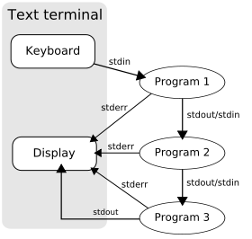

# Pipeline

- [Concept](#concept)
- [xargs](#xargs)
- [See also](#see-also)

## Concept



- 사실 IPC (Inter-process communication)인데 standard stream으로 여러 process가 message를 주고받으면서 process가 chained되는거임.
- Anonymous pipes 라고도 부름. 왜 anonymous pipe냐면 그냥 pipe (named)와는 다르게 이름이 없고 한 프로세스가 읽은 데이터를 os가 버퍼해뒀다가 다 처리하면 pipe 제거해버림.

Usage

```sh
command1 | command2 | command3
```

Example

```sh
ls -l | grep key | less
```

## xargs

- Pipeline할 때 stdin으로 받지 못하는 친구들한테 인자로 넘겨주기 위해.

```sh
find /etc - name "*.txt" | xargs ls -l
```

## See also

- [Pipeline (Unix)](https://en.wikipedia.org/wiki/Pipeline_(Unix))
- [When to use xargs when piping? (stackoverflow)](https://stackoverflow.com/questions/35589179/when-to-use-xargs-when-piping)