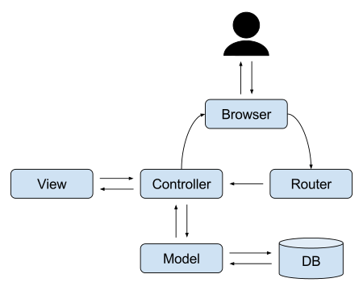

# UI Architecture patterns

## Goal

Separate viewer and business logic & make it to flexible!

eg.

```text
single input -> apply to multiple view
multiple input -> apply to single view
multiple input -> apply to multiple view
```

## Model View Controller

### Origin


It's been misunderstood. Everyone say their own opinions. According to [original paper](https://heim.ifi.uio.no/~trygver/2007/MVC_Originals.pdf), real is

- Model : Models represent knowledge. A model could be a single object (rather uninteresting), or it could be some structure of objects.
- View : A view is a (visual) representation of its model. It would ordinarily highlight certain attributes of the model and suppress others. It is thus acting as a presentation filter.
- Controller : A controller is the link between a user and the system. It provides the user with input by arranging for relevant views to present themselves in appropriate places on the screen. It provides means for user output by presenting the user with menus or other means of giving commands and data. The controller receives such user output, translates it into the appropriate messages and passes these messages on to one or more of the views.

According to Martin Fowler, the primary benefit of this original version of the MVC pattern is **Separated Presentation** which he defines like this:

```text
Ensure that any code that manipulates presentation only manipulates presentation, pushing all domain and data source logic into clearly separated areas of the program

or more easily

Make a clear division between domain objects that model our perception of the real world, and presentation objects that are the GUI elements we see on the screen
```

MVC was originally used in GUI. In GUI, MVC means

- Model : A particular piece of data represented by an application. For example, weather station temperature reading.
- View : One representation of data from the model. The same model might have multiple views associated with it. For example, a temperature reading might be represented by both a label and a bar chart. The views are associated with a particular model through the Observer relationship.
- Controller : Collects user input and modifies the model. For example, the controller might collect mouse clicks and keystrokes and update the Model

Note that in the original one, controller never directly interact with view.

### 201x



- Model : Business logic plus one or more data sources such as a relational database.
- View : The user interface that displays information about the model to the user.
- Controller : The flow-control mechanism means by which the user interacts with the application.

Here, controller directly interact with view. This is **necessary evil**. Since in the web, view cannot be updated without http response which is processed by application (mostly by controller in application).

### See also

- [evolution of mvc](https://stephenwalther.com/archive/2008/08/24/the-evolution-of-mvc)
- [MVC vs Flux](https://code.i-harness.com/ko-kr/q/1fe5f1e)

## Flux

### Concept


- View : Viewer including action creator. Receipt user input and process it into action
- Action : Holds action type and payload having real data
- Dispatcher : Receive action and dispatches to related stores
- Store : Receive any action and make an event to update view

Facebook insists data is bidirectional in mvc. But in flux, data is unidirectional. I think it is just a loosely coupled reactive version of original mvc pattern.

### See also

- [flux official docs](https://haruair.github.io/flux/docs/overview.html#content)