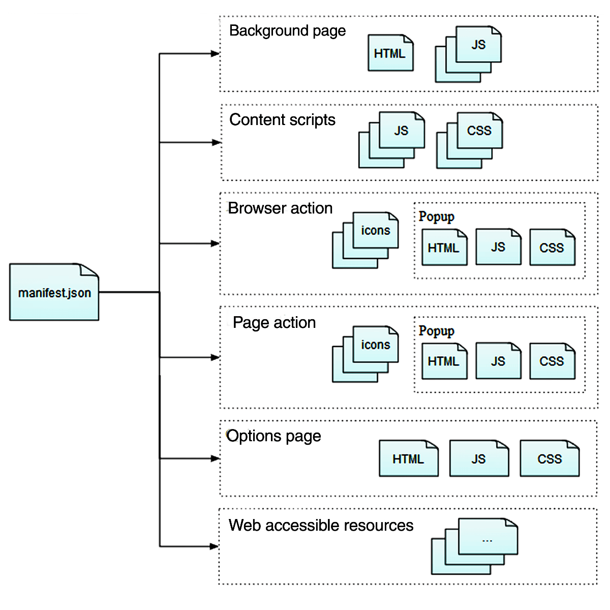

# Browser Extension Core

## manifest.json

The only file that must be present in every extension.

See also

- [mainfest.json](https://developer.mozilla.org/en-US/docs/Mozilla/Add-ons/WebExtensions/manifest.json)
  - chrome_settings_overrides : browser setting

## Background scripts

- Long-term state or perform long-term operations independently of the lifetime of any particular web page or browser window.
- Loaded as soon as the extension is loaded and stay loaded until the extension is disabled or uninstalled.

See also

- [Anatomy_of_a_WebExtension#background_scripts](https://developer.mozilla.org/en-US/docs/Mozilla/Add-ons/WebExtensions/Anatomy_of_a_WebExtension#background_scripts)
- [Communicating with background scripts](https://developer.mozilla.org/en-US/docs/Mozilla/Add-ons/WebExtensions/Content_scripts#communicating_with_background_scripts)

## Icons

icons

## Sidebars, popups, and options pages

- Sidebar : A pane that is displayed at the left-hand side of the browser window.
- Popup : A dialog that you can display when the user clicks on a toolbar button or address bar button.
- Options : A page that's shown when the user accesses your add-on's preferences in the browser's native add-ons manager. 

## Extension pages

- Don't have an entry in manifest.json.
- Have access to all the same privileged WebExtension APIs as your background script.
- Typically load a page like this using windows.create() or tabs.create().

## Content scripts

- JavaScript included with your extension, that you will inject into web pages.
- differs from normal page scripts (eg. loaded by `<script> elements`.)
- Unlike normal page scripts, content scripts can
  - Make cross-domain XHR requests.
  - Use a small subset of the WebExtension APIs.
  - Exchange messages with their background scripts and can in this way indirectly access all the WebExtension APIs.
- Cannot directly access normal page scripts but can exchange messages using the `window.postMessage()`.

## Web-accessible resources

- Resources that you include in the extension.
- Accessable by URI scheme.

## References

- [What are extensions](https://developer.mozilla.org/en-US/docs/Mozilla/Add-ons/WebExtensions/What_are_WebExtensions)
- [Anatomy_of_a_WebExtension](https://developer.mozilla.org/en-US/docs/Mozilla/Add-ons/WebExtensions/Anatomy_of_a_WebExtension)
- [user_interface](https://developer.mozilla.org/en-US/docs/Mozilla/Add-ons/WebExtensions/user_interface)
- [Example extensions](https://developer.mozilla.org/en-US/docs/Mozilla/Add-ons/WebExtensions/Examples)
